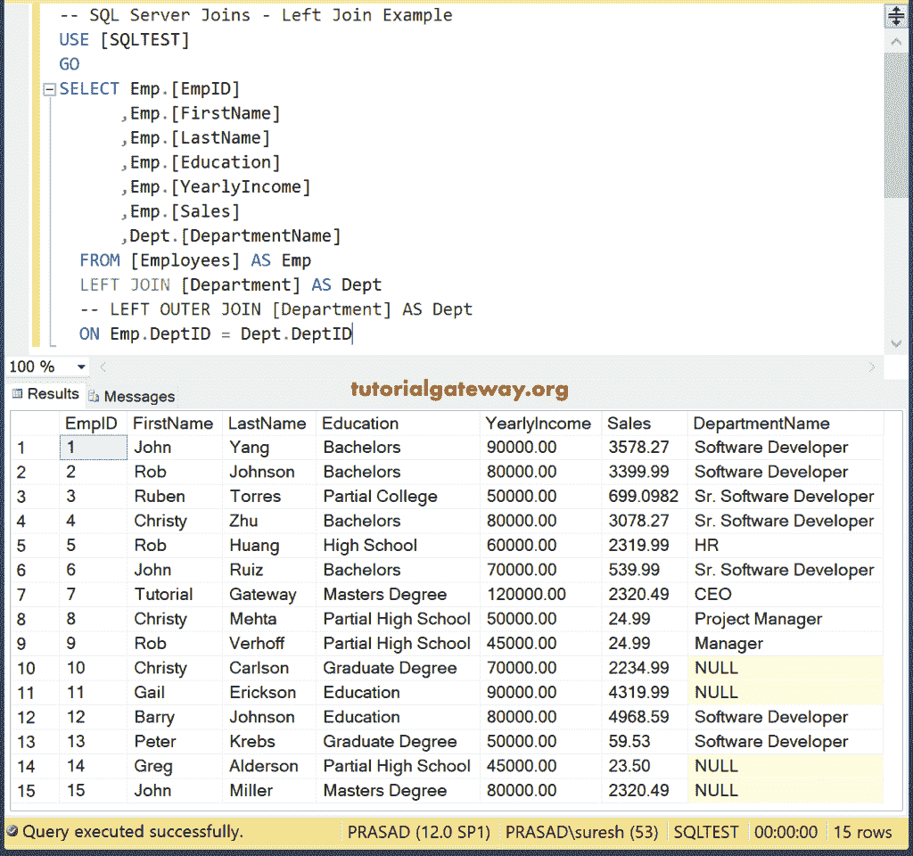
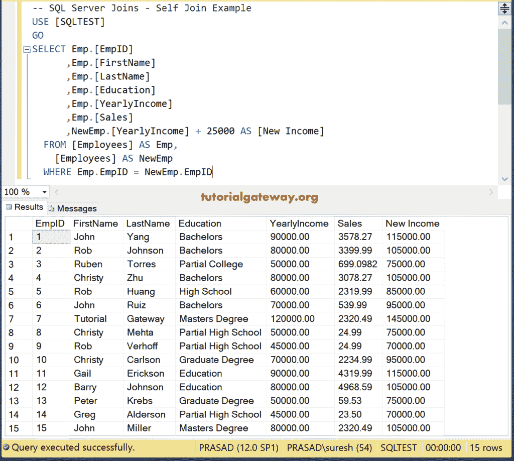
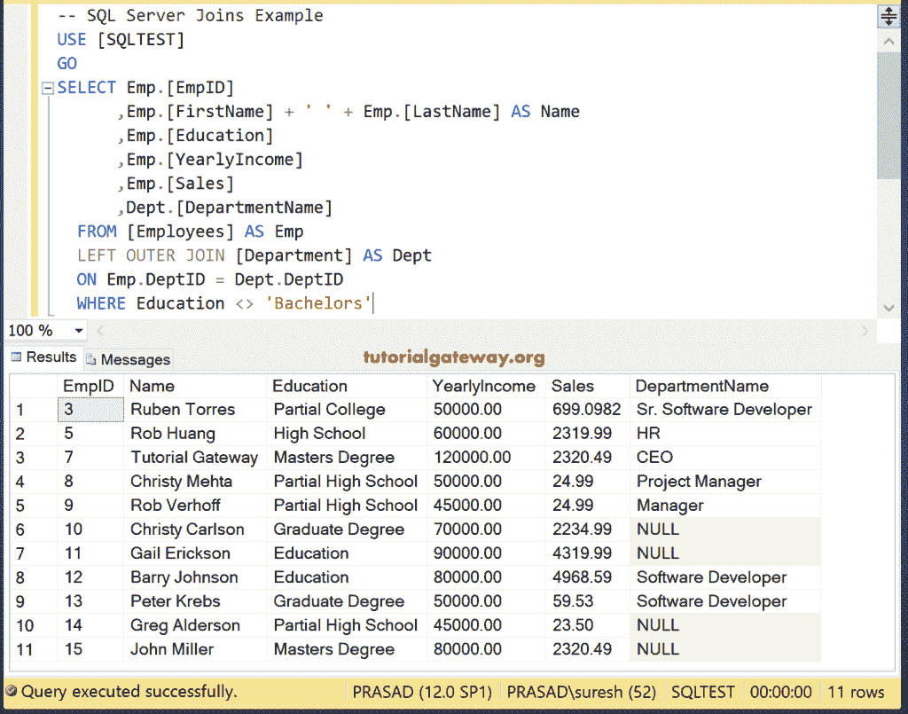

# SQL 连接

> 原文：<https://www.tutorialgateway.org/sql-joins/>

SQL Server 最重要也是最强大的功能是连接，它可以帮助您组合两个或多个表来执行各种操作。没有 SQL Joins，就没有数据规范化的概念，因为我们必须将整个数据存储在一个表中。

## SQL 连接示例

本节通过一个示例说明如何使用 SQL 连接编写一个 SQL 查询来连接两个或多个表。以下是一些常见问题。

### SQL 中有多少个连接？

有六种类型。

*   内部或简单连接是实时中最常用的默认类型。
*   全外或全内。
*   左外侧或左侧。
*   右外侧或右侧。
*   十字架

### 为什么连接用于？

它们有助于合并或选择多个表中的列数据，因为数据库使用外键将我们的数据存储在不同的表中。因此，对于任何简单的查询结果，我们必须从至少两个表中选择数据，即使您选择的是客户记录。

SQL Server 内连接、完全外连接、左外连接、右外连接、自身连接和交叉连接的可视化表示为


对于这个 SQL Joins 语句示例，我们使用两个表【员工和部门】


部门


### 什么是带例子的 SQL 内连接？

内部也称为连接。仅当匹配时，它才返回左表和右表中的行。否则，它将返回零条记录。

这个例子展示了如何编写一个内部。

```
SELECT Emp.[EmpID]
      ,Emp.[FirstName]
      ,Emp.[LastName]
      ,Emp.[Education]
      ,Emp.[YearlyIncome]
      ,Emp.[Sales]
      ,Dept.[DepartmentName]
  FROM [Employees] AS Emp
  INNER JOIN [Department] AS Dept
  ON Emp.DeptID = Dept.DeptID
```


### 什么是 SQL 左连接？

左或左外连接返回左表中的所有行和右表中的匹配行(如果有)。这个例子展示了如何写左外或左返回结果集。所以，参考 [SQL](https://www.tutorialgateway.org/sql/) 中的[左](https://www.tutorialgateway.org/sql-left-join/)篇。

```
SELECT Emp.[EmpID]
      ,Emp.[FirstName]
      ,Emp.[LastName]
      ,Emp.[Education]
      ,Emp.[YearlyIncome]
      ,Emp.[Sales]
      ,Dept.[DepartmentName]
  FROM [Employees] AS Emp
  LEFT JOIN [Department] AS Dept
  ON Emp.DeptID = Dept.DeptID
```



### 什么是 SQL 右连接？

右外连接或右连接返回左表中匹配的行(如果有)以及右表中的所有行。

让我们看看如何写一个右外或右有条件。我们已经解释了[右外](https://www.tutorialgateway.org/sql-right-join/)是如何工作的。

```
SELECT Emp.[EmpID]
      ,Emp.[FirstName]
      ,Emp.[LastName]
      ,Emp.[Education]
      ,Emp.[YearlyIncome]
      ,Emp.[Sales]
      ,Dept.[DepartmentName]
  FROM [Employees] AS Emp
  RIGHT JOIN [Department] AS Dept
  ON Emp.DeptID = Dept.DeptID
```


### 什么是 SQL Server 中的全连接？

完全外部也称为全连接。它从左表和右表中的所有行中检索数据。这个例子将告诉你如何写一个完整的外部或[完整的](https://www.tutorialgateway.org/sql-full-join/)。

```
SELECT Emp.[EmpID]
      ,Emp.[FirstName]
      ,Emp.[LastName]
      ,Emp.[Education]
      ,Emp.[YearlyIncome]
      ,Emp.[Sales]
      ,Dept.[DepartmentName]
  FROM [Employees] AS Emp
  FULL JOIN [Department] AS Dept
  ON Emp.DeptID = Dept.DeptID
```


### 什么是 SQL Server 中的自加入？

SQL Self 用于将表与自身相结合。我们可以使用这种技术来计算运行总数等。在这个例子中，我们展示了如何编写一个 SQL Server [Self](https://www.tutorialgateway.org/sql-self-join/) 。

```
SELECT Emp.[EmpID]
      ,Emp.[FirstName]
      ,Emp.[LastName]
      ,Emp.[Education]
      ,Emp.[YearlyIncome]
      ,Emp.[Sales]
      ,NewEmp.[YearlyIncome] + 25000 AS [New Income]
  FROM [Employees] AS Emp,
	[Employees] AS NewEmp
  WHERE Emp.EmpID = NewEmp.EmpID
```



### 什么是交叉连接？

十字用于返回两个表的笛卡尔乘积。意思是，员工的行数乘以部门的行数。这个例子展示了如何使用[十字](https://www.tutorialgateway.org/sql-cross-join/)找到笛卡尔乘积。

```
SELECT Emp.[EmpID]
      ,Emp.[FirstName]
      ,Emp.[LastName]
      ,Emp.[Education]
      ,Emp.[YearlyIncome]
      ,Emp.[Sales]
      ,Dept.[DepartmentName]
  FROM [Employees] AS Emp
  CROSS JOIN [Department] AS Dept
```


### 我们能做多重连接吗？

是的。一个查询可以有多个相同类型或不同类型的查询。例如，我们可以在三张桌子上使用两个左边的外套或者两个里面的外套。这完全取决于我们需要的数据。

数据呈现在登录


在这个例子中，我们在一个 [`SELECT`语句](https://www.tutorialgateway.org/sql-select-statement/)中使用了 SQL 多重连接。我们使用上面记录中的“内部”和“左侧”。

```
SELECT Emp.[EmpID]
      ,Emp.[FirstName]
      ,Emp.[LastName]
      ,Emp.[Education]
      ,Emp.[YearlyIncome]
      ,Emp.[Sales]
	  ,logg.USERNAME
	  ,Dept.[DepartmentName]
  FROM [Employees] AS Emp
  INNER JOIN [Department] AS Dept
  ON Emp.DeptID = Dept.DeptID
  LEFT JOIN [LogInTable] AS logg
  ON Emp.EmpID = logg.LogID
```


## SQL 连接`WHERE`子句

您也可以将 [`WHERE`子句](https://www.tutorialgateway.org/sql-where-clause/)与此一起使用。我们使用`WHERE`子句来显示年收入大于或等于 60000 的员工。为此，我们使用[内部](https://www.tutorialgateway.org/sql-inner-join/)连接员工&部门。接下来，我们使用带条件的`WHERE`子句

```
SELECT Emp.[EmpID]
      ,Emp.[FirstName] + ' ' + Emp.[LastName] AS Name
      ,Emp.[Education]
      ,Emp.[YearlyIncome]
      ,Emp.[Sales]
      ,Dept.[DepartmentName]
  FROM [Employees] AS Emp
  INNER JOIN [Department] AS Dept
  ON Emp.DeptID = Dept.DeptID
  WHERE YearlyIncome >= 60000
```


这是另一个展示`WHERE`子句的例子。在这里，我们使用左侧来连接 Emp 和 Department 表。接下来，我们使用 Where 条件显示学历不是学士的员工

```
SELECT Emp.[EmpID]
      ,Emp.[FirstName] + ' ' + Emp.[LastName] AS Name
      ,Emp.[Education]
      ,Emp.[YearlyIncome]
      ,Emp.[Sales]
      ,Dept.[DepartmentName]
  FROM [Employees] AS Emp
  LEFT OUTER JOIN [Department] AS Dept
  ON Emp.DeptID = Dept.DeptID
  WHERE Education <> 'Bachelors'
```



### SQL 连接`WHERE`子句和不为空示例

我们使用“权利”来合并员工和部门。接下来，在`WHERE`子句中，我们使用“不为空”来显示标识不为空的记录。

```
SELECT Emp.[EmpID]
      ,Emp.[FirstName] + ' ' + Emp.[LastName] AS Name
      ,Emp.[Education]
      ,Emp.[YearlyIncome]
      ,Emp.[Sales]
      ,Dept.[DepartmentName]
  FROM [Employees] AS Emp
  RIGHT OUTER JOIN [Department] AS Dept
  ON Emp.DeptID = Dept.DeptID
  WHERE EmpID IS NOT NULL
```


使用“完整”组合表格。接下来，在`WHERE`子句中

*   我们使用[不为空](https://www.tutorialgateway.org/sql-is-not-null/)来显示标识不为空的记录
*   [和运算符](https://www.tutorialgateway.org/sql-and-or-operators/)添加另一个条件
*   销售额> 1000 显示销售额大于 1000 的员工

```
SELECT Emp.[EmpID]
      ,Emp.[FirstName] + ' ' + Emp.[LastName] AS Name
      ,Emp.[Education]
      ,Emp.[YearlyIncome]
      ,Emp.[Sales]
      ,Dept.[DepartmentName]
  FROM [Employees] AS Emp
  FULL OUTER JOIN [Department] AS Dept
  ON Emp.DeptID = Dept.DeptID
  WHERE EmpID IS NOT NULL AND Sales > 1000
```


我们使用了 Cross 和`WHERE`子句来附加多个表和条件。

```
SELECT Emp.[EmpID]
      ,Emp.[FirstName] + ' ' + Emp.[LastName] AS Name
      ,Emp.[Education]
      ,Emp.[YearlyIncome]
      ,Emp.[Sales]
      ,Dept.[DepartmentName]
  FROM [Employees] AS Emp
  CROSS JOIN [Department] AS Dept
  WHERE EmpID IS NOT NULL AND Sales > 3000
```


## SQL 连接`ORDER BY`和顶级子句

您也可以将此与[顶条款](https://www.tutorialgateway.org/sql-top-clause/)和[订单依据](https://www.tutorialgateway.org/sql-order-by-clause/)一起使用。在这个例子中，我们使用内连接员工和部门。接下来，我们使用 `ORDER BY`子句使用年收入按降序对记录进行排序。最后，`TOP`子句将从查询结果中选择前 8 条记录。

```
SELECT TOP 8 Emp.[EmpID]
      ,Emp.[FirstName] + ' ' + Emp.[LastName] AS Name
      ,Emp.[Education]
      ,Emp.[YearlyIncome]
      ,Emp.[Sales]
      ,Dept.[DepartmentName]
  FROM [Employees] AS Emp
  INNER JOIN [Department] AS Dept
  ON Emp.DeptID = Dept.DeptID
  ORDER BY YearlyIncome DESC
```


这是另一个 Sql Server 连接示例，通过组合来自多个表的数据来体验顶部和顺序。

```
SELECT TOP 10 Emp.[EmpID]
      ,Emp.[FirstName] + ' ' + Emp.[LastName] AS Name
      ,Emp.[Education]
      ,Emp.[YearlyIncome]
      ,Emp.[Sales]
      ,Dept.[DepartmentName]
  FROM [Employees] AS Emp
  CROSS JOIN [Department] AS Dept
  ORDER BY DepartmentName DESC
```

