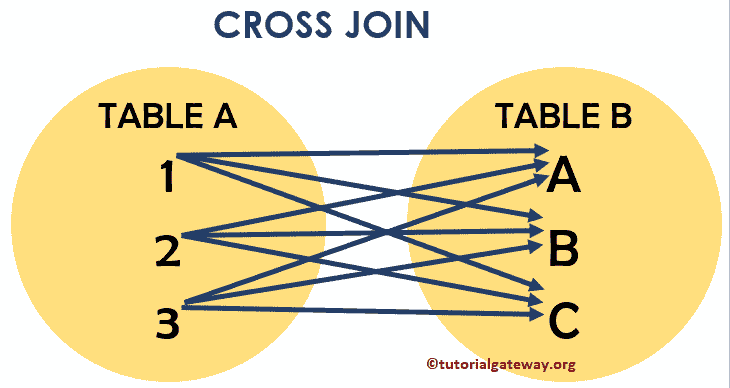
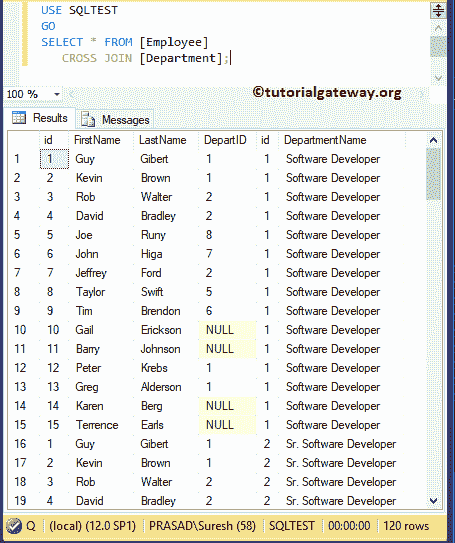
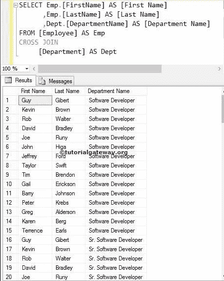

# SQL 交叉连接

> 原文：<https://www.tutorialgateway.org/sql-cross-join/>

SQL 交叉连接返回两个表的笛卡尔乘积。笛卡尔乘积表示表 1 中的行数乘以表 2 中的行数。SQL Server 交叉连接不需要任何公共列来连接两个表。让我们看看卡地亚连接的视觉表现，以便更好地理解。



从上面的截图中，您可以很容易地理解，SQL 交叉连接显示了两个表的笛卡尔乘积。这意味着，表 A 中的每条记录都与表 B 中的每条记录相结合

## SQL 交叉连接语法

SQL Server 中交叉连接的语法是

```
SELECT Table1.Column(s), Table2.Column(s),
FROM Table1
 CROSS JOIN
     Table2 

--OR We can Simply Write it as
SELECT Table1\. Column(s), Table2\. Column(s),
FROM Table1, Table2 
```

对于这个 SQL Server 交叉连接示例，我们使用了两个表(员工表和部门表)。员工中存在的数据


[SQL Server](https://www.tutorialgateway.org/sql/) 部门存在的数据为:


## SQL 交叉连接选择*示例

以下 SQL 笛卡尔连接查询将显示员工和部门表中的所有现有列

```
SELECT * FROM [Employee]
   CROSS JOIN [Department];
```

如果观察下面[加入](https://www.tutorialgateway.org/sql-joins/)截图，显示的是 120 条记录。这意味着“员工”中的 15 行乘以“部门”表中的 8 行



注意:我建议您选择单独的列名。请避免交叉连接中的 SELECT *语句，以避免不需要的列，如 id、DeptID、id 等。

### SQL 交叉连接选择几列示例

如前所述，请在 [`SELECT`语句](https://www.tutorialgateway.org/sql-select-statement/)后选择需要的列，以避免不需要的列。以下查询将显示“员工”和“部门”表中列的笛卡尔乘积。

```
SELECT [FirstName]
      ,[LastName]
      ,[DepartmentName]
FROM [Employee]
   CROSS JOIN [Department]
```


### SQL 交叉连接不明确的列

如果两个表(员工表和部门表)中的列名与上面的不同，上面的 Transact 查询将完美地工作。如果两个表中的列名相同，会发生什么情况？好吧，用上面指定的方法，你会得到一个错误。

让我给你看一个实际的例子。我们将部门表中的 id 作为附加列添加到上述查询中。

```
SELECT [FirstName]
      ,[LastName]
      ,id
      ,[DepartmentName]
FROM [Employee]
   CROSS JOIN [Department]
```

如您所见，它抛出了一个错误:不明确的列名 id。这是因为员工和部门表中都有 id 列。而且 SQL Server 不知道您要求它检索哪一列。


要解决这类问题，您必须始终在列名之前使用表名。下面的查询是在列名之前使用[别名](https://www.tutorialgateway.org/sql-alias/)表名。通过这种方法，我们可以通知服务器我们正在寻找属于部门表的 id 列。

我们可以将上面的查询写成:

```
SELECT Emp.[FirstName]
      ,Emp.[LastName]
      ,Dept.id
      ,Dept.[DepartmentName]
FROM [Employee] AS Emp
CROSS JOIN
     [Department] AS Dept
```


您也可以避免使用 CROSS JOIN 关键字来获得结果。

```
SELECT Emp.[FirstName] AS [First Name]
      ,Emp.[LastName] AS [Last Name]
      ,Dept.[DepartmentName] AS [Department Name]
FROM [Employee] AS Emp,
CROSS JOIN
     [Department] AS Dept

--OR We Can simply Write it as
SELECT Emp.[FirstName] AS [First Name]
      ,Emp.[LastName] AS [Last Name]
      ,Dept.[DepartmentName] AS [Department Name]
FROM [Employee] AS Emp,
     [Department] AS Dept
```



### SQL 交叉连接`WHERE`子句

我们可以同时使用 [`WHERE`子句](https://www.tutorialgateway.org/sql-where-clause/)来限制交叉连接返回的行数。这里，我们同时使用`WHERE`子句。

```
SELECT Emp.[FirstName] AS [First Name]
      ,Emp.[LastName] AS [Last Name]
      ,Dept.[DepartmentName] AS [Department Name]
FROM [Employee] AS Emp,
     [Department] AS Dept
WHERE Dept.[DepartmentName] = 'Software Developer'
```


### 按条款排序示例

交叉连接允许我们使用 [`ORDER BY`子句](https://www.tutorialgateway.org/sql-order-by-clause/)来重新排列记录的顺序。

```
SELECT Emp.[FirstName] AS [First Name]
      ,Emp.[LastName] AS [Last Name]
      ,Dept.[DepartmentName] AS [Department Name]
FROM [Employee] AS Emp,
     [Department] AS Dept
WHERE Dept.[DepartmentName] = 'Software Developer'
```

