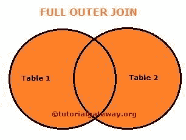

# SQL 全连接

> 原文：<https://www.tutorialgateway.org/sql-full-join/>

用于返回左表和右表中的所有记录(或行)的 SQL 全连接类型。所有不匹配的行都用空值填充。

SQL 全连接也可以称为完全外连接。所以使用外部关键字是可选的。为了更好的理解，让我们看看这个的视觉表现。



从上图中，您可以很容易地理解完整连接显示了表 1 和表 2 中的所有记录。SQL Server 中全连接的语法如下所示:

```sql
SELECT Table1.Column(s), Table2.Column(s),
FROM Table1
 FULL OUTER JOIN
     Table2 ON
   Table1.Common_Column = Table2.Common_Column

--OR We can Simply Write it as
SELECT Table1\. Column(s), Table2\. Column(s),
FROM Table1
 FULL JOIN
     Table2 ON
   Table1.Common_Column = Table2.Common_Column
```

在这个 SQL 全连接演示中，我们将使用数据库中的两个表(雇员和部门)。员工中存在的数据为:


[SQL Server](https://www.tutorialgateway.org/sql/) 部门存在的数据为:


## SQL 全连接选择所有列

以下 Sql 完全外连接选择所有列查询将显示员工和部门中存在的所有列和行。

```sql
SELECT *
FROM [Employee]
 FULL OUTER JOIN
     [Department] ON
 [Employee].[DepartID] = [Department].[id]
```


*   如果您观察上面的截图，虽然我们在员工中有 15 条记录，但是 SQL 完全外连接组合起来显示了 17 条记录。因为部门有两个记录，即部门标识 3、4(模块领导和团队领导)，所以 15 + 2 =总共 17 个记录。
*   对于部门标识 3 和 4(模块领导和团队领导)，员工中没有匹配的记录，因此 NULLS 会替换它们。
*   身份证号码 10，11，14 和 15 的[部门]，身份证，[部门名称]，它正在显示空值。这是因为雇员表中他们的部门标识是 NULLS，所以在正确的表中没有匹配的记录。

### 没有外部关键字

如前所述，在这个[连接类型](https://www.tutorialgateway.org/sql-joins/)中可以选择使用一个 Outer 关键字。让我删除外部关键字，并将工作 SQL 全连接

```sql
SELECT *
FROM [Employee]
 FULL JOIN
     [Department] ON
 [Employee].[DepartID] = [Department].[id]
```


注意:【部门 ID】一栏重复两次，用户很烦。通过选择单独的列名，我们可以避免不需要的列名，因此，请避免使用 SELECT *语句。

## SQL 全连接选择几列

请将必填字段放在 [`SELECT`语句](https://www.tutorialgateway.org/sql-select-statement/)之后，以避免不需要的列。

```sql
SELECT [FirstName]
      ,[LastName]
      ,[DepartmentName]
FROM [Employee]
  FULL JOIN
     [Department] ON
  [Employee].[DepartID] = [Department].[id]

```


只要两个表(雇员表和部门表)的列名像上面一样不同，上面的 SQL 全连接查询就可以完美地工作。

如果两个表中的列名相同，会发生什么情况？好吧，你会陷入困境。让我们看看如何解决这个问题。在我们进入解决方案之前，让我给你看一个实际的例子。

如您所见，我们正在使用上面的查询。尽管如此，我们还是从 department 表中添加了 id 作为附加列。

```sql
SELECT [FirstName]
      ,[LastName]
      ,id
      ,[DepartmentName]
FROM [Employee]
FULL OUTER JOIN
     [Department] ON
           [Employee].[DepartID] = [Department].[id]
```

如您所见，连接表引发了一个错误:不明确的列名 id。这是因为员工和部门表中都有该 id。而且 SQL Server 不知道您要求它检索哪一个。


要解决这种问题，您必须始终在列名之前使用表名。下面的代码在列名前使用了[别名](https://www.tutorialgateway.org/sql-alias/)表名。通过这种方法，我们可以通知 SQL Server 我们正在寻找属于部门表的 id。

我们可以将上面的查询写成:

```sql
SELECT Emp.[FirstName] AS [First Name]
      ,Emp.[LastName] AS [Last Name]
	  ,Dept.id 
      ,Dept.[DepartmentName] AS [Department Name]
FROM [Employee] AS Emp
FULL JOIN
     [Department] AS Dept ON
          Emp.[DepartID] = Dept.[id]
```


## SQL Server 全连接`WHERE`子句

它还允许我们使用 [`WHERE`子句](https://www.tutorialgateway.org/sql-where-clause/)来限制由此返回的行数。在这个例子中，我们将使用`WHERE`子句和全连接。

```sql
SELECT Emp.[FirstName] AS [First Name]
      ,Emp.[LastName] AS [Last Name]
      ,Dept.[DepartmentName] AS [Department Name]
FROM [Employee] AS Emp
  FULL OUTER JOIN
     [Department] AS Dept ON
    Emp.[DepartID] = Dept.[id]
WHERE Dept.[DepartmentName] IS NOT NULL
```


## SQL 完全外连接顺序依据子句

这允许我们使用 [`ORDER BY`子句](https://www.tutorialgateway.org/sql-order-by-clause/)来重新排列记录的顺序。

```sql
SELECT Emp.[FirstName] AS [First Name]
      ,Emp.[LastName] AS [Last Name]
      ,Dept.[DepartmentName] AS [Department Name]
FROM [Employee] AS Emp
  FULL OUTER JOIN
     [Department] AS Dept ON
    Emp.[DepartID] = Dept.[id]
ORDER BY [DepartmentName] ASC
```

