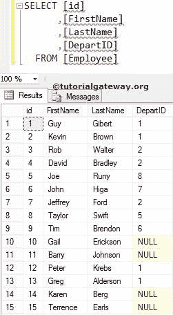

# 内连接

> 原文：<https://www.tutorialgateway.org/sql-inner-join/>

如果列之间至少有一个匹配项，SQL 内连接将返回两个表中存在的记录(或行)。

或者我们可以说，只要开关键字后的条件为真，SQL 内连接就会返回两个表中存在的记录(或行)。SQL 内连接的语法是

```
SELECT Table1.Column(s), Table2.Column(s),
FROM Table1
 INNER JOIN
     Table2 ON
   Table1.Common_Column = Table2.Common_Column

--OR We can Simply Write it as
SELECT Table1\. Column(s), Table2\. Column(s),f
FROM Table1
 JOIN
     Table2 ON
   Table1.Common_Column = Table2.Common_Column
```

SQL Inner 是默认的连接，所以使用 Inner 关键字是可选的。为了更好的理解，让我们看看这个的视觉表现。


从上图中，您可以很容易地理解，Sql 内连接只显示表 1 和表 2 中的匹配记录(就像数学中的交集)。对于本例，我们将在数据库中使用两个表。员工中存在的数据为:



[SQL Server](https://www.tutorialgateway.org/sql/) 部门存在的数据为:


## SQL 内连接选择所有列

以下 SQL 内连接查询将显示雇员和部门表中的所有列

```
SELECT *
FROM [Employee]
   INNER JOIN
     [Department] ON
 [Employee].[DepartID] = [Department].[id]
```


让我避开内部关键字

```
SELECT *
FROM [Employee]
   JOIN
     [Department] ON
 [Employee].[DepartID] = [Department].[id]
```


如果您观察上面的截图，虽然我们在 Employee 中有 15 条记录，而 Inner join 显示了 11 条记录。这是因为“员工”表中其余四条记录(即标识号为 10、11、14 和 15)的部门标识为空。

注意:【部门 ID】一栏重复两次，用户很烦。通过选择单独的列名，我们可以避免不需要的列。所以，请避免选择*语句。

## SQL 内连接选择几列

请将所需的列放在[`SELECT`语句](https://www.tutorialgateway.org/sql-select-statement/)之后，以避免内部[连接](https://www.tutorialgateway.org/sql-joins/)中不需要的列。

```
SELECT [FirstName]
      ,[LastName]
      ,[DepartmentName]
FROM [Employee]
  INNER JOIN
     [Department] ON
  [Employee].[DepartID] = [Department].[id]
```


只要两个表中的列名像上面一样不同，上面的 SQL 内连接查询就可以完美地工作。如果两个表中的列标题相同，会发生什么情况？好吧，你会陷入困境。让我们看看如何解决这个问题。

在我们进入解决方案之前，让我向您展示一个实用的内连接示例。如您所见，我们正在使用上面的查询，但是我们添加了部门表中的 id 作为附加列。

```
-- INNER JOIN Example
SELECT [FirstName]
      ,[LastName]
      ,id
      ,[DepartmentName]
FROM [Employee]
INNER JOIN
     [Department] ON
           [Employee].[DepartID] = [Department].[id]
```

你可以从下面的截图看到。它引发了一个错误:不明确的列名 id。这是因为员工和部门都有身份证。而且 SQL Server 不知道您要求它检索哪一个。


要解决这类问题，总是必须在列名之前使用表名。下面的查询是在列名之前使用[别名](https://www.tutorialgateway.org/sql-alias/)表名。通过这种方法，我们可以通知 SQL Server 我们正在寻找属于部门表的 id。

我们可以将上面的 SQL 内连接查询编写如下

```
SELECT Emp.[FirstName] AS [First Name]
      ,Emp.[LastName] AS [Last Name]
	  ,Dept.id 
      ,Dept.[DepartmentName] AS [Department Name]
FROM [Employee] AS Emp
INNER JOIN
     [Department] AS Dept ON
    Emp.[DepartID] = Dept.[id]
```


## SQL 内连接`WHERE`子句

它还允许我们使用 [`WHERE`子句](https://www.tutorialgateway.org/sql-where-clause/)来限制 I 传递的行数。

```
SELECT Emp.[FirstName] AS [First Name]
      ,Emp.[LastName] AS [Last Name]
      ,Dept.[DepartmentName] AS [Department Name]
FROM [Employee] AS Emp
INNER JOIN
     [Department] AS Dept ON
			Emp.[DepartID] = Dept.[id]
WHERE Dept.[DepartmentName] = 'Software Developer' OR
		Dept.[DepartmentName] = 'Sr. Software Developer'
```


## SQL 内连接顺序依据子句

它允许我们使用 [`ORDER BY`子句](https://www.tutorialgateway.org/sql-order-by-clause/)来重新排列记录的顺序。

```
SELECT Emp.[FirstName] AS [First Name]
      ,Emp.[LastName] AS [Last Name]
      ,Dept.[DepartmentName] AS [Department Name]
FROM [Employee] AS Emp
INNER JOIN
     [Department] AS Dept ON
    Emp.[DepartID] = Dept.[id]
ORDER BY [FirstName] ASC
```

