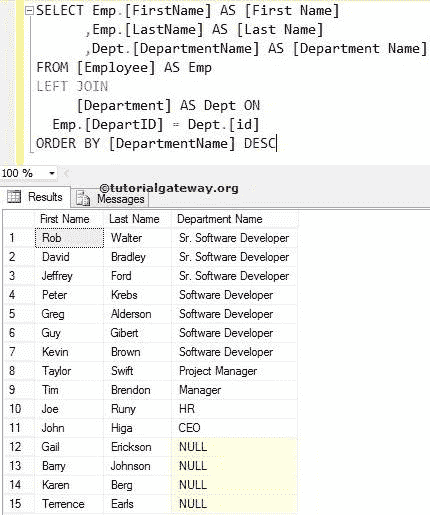

# SQL 左连接

> 原文：<https://www.tutorialgateway.org/sql-left-join/>

左连接返回左表中的所有行或记录以及右表中的匹配行。该连接的可视化表示如下所示


从上图中，Sql 左外连接显示了表 1 中的所有记录和表 2 中的匹配记录。右表中所有不匹配的行都将填充空值。

## 左连接语法

SQL Server 左连接的语法是

```
-- Syntax
SELECT Table1.Column(s), Table2.Column(s),
FROM Table1
 LEFT OUTER JOIN
     Table2 ON
   Table1.Common_Column = Table2.Common_Column

--OR We can Simply Write it as
SELECT Table1\. Column(s), Table2\. Column(s),
FROM Table1
 LEFT JOIN
     Table2 ON
   Table1.Common_Column = Table2.Common_Column
```

SQL Server 中的左外部联接也可以称为左联接。所以使用外部关键字是可选的。对于这个例子，我们使用的员工是:


部门


## 左连接选择所有列

以下左外部联接查询将显示“员工”中的所有列，以及部门表中的匹配记录

```
SELECT *
FROM [Employee]
 LEFT OUTER JOIN
     [Department] ON
 [Employee].[DepartID] = [Department].[id]

```


### 左连接避免外部关键字

让我删除 Outer 关键字，它是可选的，而且效果很好。如您所见，它从结果集中的两个表中返回行。

```
SELECT *
FROM [Employee]
 LEFT JOIN
     [Department] ON
 [Employee].[DepartID] = [Department].[id]
```


如果您观察上面的截图，我们在员工表中有 15 条记录。SQL 左连接显示了 15 条记录，但是对于[部门号]，id，[部门名]，它显示了 ID 号 10，11，14 和 15 的空值。这是因为雇员表中他们的部门标识是 NULLS，所以在正确的表中没有匹配的记录。

【部门 ID】一栏重复两次，用户很烦。通过选择单独的列名，我们可以避免不需要的列名。因此，请避免选择*语句。

## 左连接选择几列

请将所需的列放在[`SELECT`语句](https://www.tutorialgateway.org/sql-select-statement/)之后，以避免在[连接](https://www.tutorialgateway.org/sql-joins/)中出现不需要的[服务器](https://www.tutorialgateway.org/sql/)列

```
-- Select Few Columns Example
SELECT [FirstName]
      ,[LastName]
      ,[DepartmentName]
FROM [Employee]
  LEFT JOIN
     [Department] ON
  [Employee].[DepartID] = [Department].[id]
```


只要两个表中的列名如上所示不同，上述查询就可以工作。如果两个表中的列名相同，左连接将引发错误。例如，我们正在使用上面的查询。但是，我们添加了部门表中的 id 作为附加列。

```
SELECT [FirstName]
      ,[LastName]
      ,id
      ,[DepartmentName]
FROM [Employee]
LEFT OUTER JOIN
     [Department] ON
           [Employee].[DepartID] = [Department].[id]
```

如您所见，它抛出了一个错误:不明确的列名 id。这是因为两个表中都有 id。而且 SQL Server 不理解您请求它检索哪一列。


要解决这类问题，请始终在列名之前使用表名。下面的左外部连接查询在列名之前使用了[别名](https://www.tutorialgateway.org/sql-alias/)表名。通过这种方法，我们可以通知 SQL Server 我们正在寻找与该部门相关的 id。我们可以将上面的查询重写为:

```
SELECT Emp.[FirstName] AS [First Name]
      ,Emp.[LastName] AS [Last Name]
	  ,Dept.id 
      ,Dept.[DepartmentName] AS [Department Name]
FROM [Employee] AS Emp
LEFT JOIN
     [Department] AS Dept ON
          Emp.[DepartID] = Dept.[id]
```


SQL Server 左连接还允许我们使用`WHERE`子句来限制它返回的行数。这里，我们使用`WHERE`子句。

```
SELECT Emp.[FirstName] AS [First Name]
      ,Emp.[LastName] AS [Last Name]
      ,Dept.[DepartmentName] AS [Department Name]
FROM [Employee] AS Emp
LEFT JOIN
     [Department] AS Dept ON
          Emp.[DepartID] = Dept.[id]
WHERE Dept.[DepartmentName] IS NOT NULL
```


左外连接类型允许我们使用 Order By 子句来重新排列记录的顺序。

```
SELECT Emp.[FirstName] AS [First Name]
      ,Emp.[LastName] AS [Last Name]
      ,Dept.[DepartmentName] AS [Department Name]
FROM [Employee] AS Emp
 LEFT JOIN
     [Department] AS Dept ON
    Emp.[DepartID] = Dept.[id]
ORDER BY [DepartmentName] ASC
```

