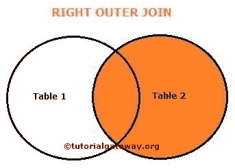
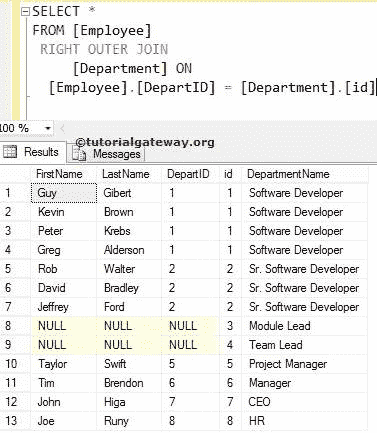
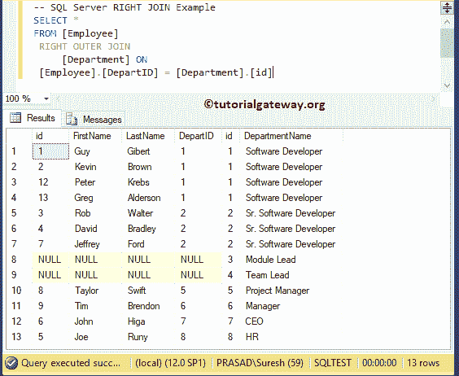
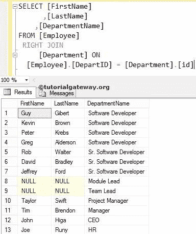
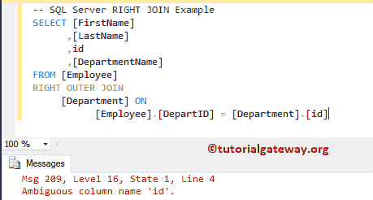
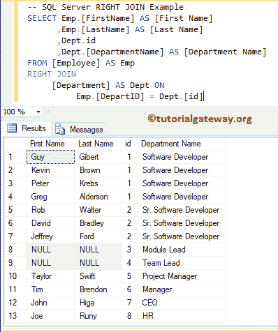
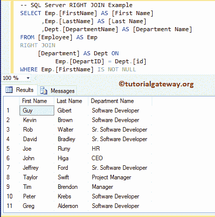
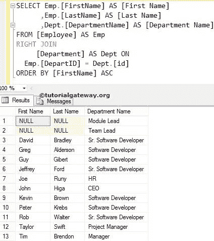

# SQL 右连接

> 原文：<https://www.tutorialgateway.org/sql-right-join/>

SQL 右连接用于返回右表中的所有记录以及左表中的匹配行。

右连接也可以称为右外连接。因此，使用外部关键字是可选的。请记住，左表中所有不匹配的行都将填充空值。

## 右连接语法

右连接的语法如下:

```
SELECT Table1.Column(s), Table2.Column(s),
FROM Table1
 RIGHT OUTER JOIN
     Table2 ON
   Table1.Common_Column = Table2.Common_Column

--OR We can Simply Write it as
SELECT Table1\. Column(s), Table2\. Column(s),
FROM Table1
 RIGHT JOIN
     Table2 ON
   Table1.Common_Column = Table2.Common_Column
```

为了更好地理解，让我们看看 Sql Right 连接的可视化表示。



从上图中，您可以很容易地理解，SQL Server 右外连接显示了表 2 中的所有记录和表 1 中的匹配记录。对于本例，我们将在数据库中使用两个表。员工中存在的数据为:


存在于 [SQL Server](https://www.tutorialgateway.org/sql/) 部门的数据是:


## SQL 右连接选择所有列

以下 SQL 右连接查询将显示“部门”表中的所有列，以及“员工”表中的匹配记录

```
SELECT *
FROM [Employee]
 RIGHT OUTER JOIN
     [Department] ON
 [Employee].[DepartID] = [Department].[id]
```



### 没有外部关键字的 SQL 右连接

如前所述，使用 Outer 关键字是可选的。让我删除外部关键字，工作将右加入

```
SELECT *
FROM [Employee]
 RIGHT OUTER JOIN
     [Department] ON
 [Employee].[DepartID] = [Department].[id]
```



虽然 Employee 表有 15 条记录，但 Right join 显示了 13 条记录。这是因为

*   员工表中第 14 条和第 15 条记录的部门标识为空，因此右表中没有匹配的记录。
*   如果您观察第 8 条和第 9 条记录，它们将显示空值。因为在员工表中，部门表中没有部门标识 3、4(模块领导和团队领导)的匹配记录。所以它们被 NULLS 所取代。

注意:【部门 ID】一栏重复两次，用户很烦。通过选择单独的列名，我们可以避免不需要的列。因此，请避免在右连接中使用 SELECT *语句

## SQL 右连接选择几列

请将所需的列放在 [`SELECT`语句](https://www.tutorialgateway.org/sql-select-statement/)之后，以避免在[Join](https://www.tutorialgateway.org/sql-joins/)T4 中出现不需要的列。

```
SELECT [FirstName]
      ,[LastName]
      ,[DepartmentName]
FROM [Employee]
  RIGHT JOIN
     [Department] ON
  [Employee].[DepartID] = [Department].[id]
```



只要员工表和部门表中的列名与上面不同，上面的 SQL Right Join 查询就能很好地工作。如果它们具有相同的列名，则会出现错误。让我们看看如何解决这个问题。

这里，我们使用了上面的右外部连接查询。但是，我们从 department 表中添加了 id 作为附加列。

```
SELECT [FirstName]
      ,[LastName]
      ,id
      ,[DepartmentName]
FROM [Employee]
RIGHT OUTER JOIN
     [Department] ON
           [Employee].[DepartID] = [Department].[id]
```

如您所见，它抛出了一个错误:不明确的列名 id。这是因为 id 列在“员工”和“部门”表中都可用。并且 SQL Server 无法识别您声明的是哪一列。



要解决这种问题，请在列名之前练习表名。下面的右外连接查询在列名之前使用了[别名](https://www.tutorialgateway.org/sql-alias/)表名。

通过这种方法，我们可以通知服务器我们正在寻找属于部门表的 id 列。

我们可以将早期的 SQL 右连接查询重写为:

```
SELECT Emp.[FirstName] AS [First Name]
      ,Emp.[LastName] AS [Last Name]
	  ,Dept.id 
      ,Dept.[DepartmentName] AS [Department Name]
FROM [Employee] AS Emp
RIGHT JOIN
     [Department] AS Dept ON
          Emp.[DepartID] = Dept.[id]
```



## 右连接`WHERE`子句

它还允许我们使用 [`WHERE`子句](https://www.tutorialgateway.org/sql-where-clause/)来限制返回的记录。在这个例子中，我们使用`WHERE`子句和 SQL 右外连接。

```
SELECT Emp.[FirstName] AS [First Name]
      ,Emp.[LastName] AS [Last Name]
      ,Dept.[DepartmentName] AS [Department Name]
FROM [Employee] AS Emp
RIGHT JOIN
     [Department] AS Dept ON
          Emp.[DepartID] = Dept.[id]
WHERE Emp.[FirstName] IS NOT NULL
```



## SQL 右连接顺序依据子句

它允许我们使用 [`ORDER BY`子句](https://www.tutorialgateway.org/sql-order-by-clause/)来重新排列记录的顺序。

```
SELECT Emp.[FirstName] AS [First Name]
      ,Emp.[LastName] AS [Last Name]
      ,Dept.[DepartmentName] AS [Department Name]
FROM [Employee] AS Emp
 RIGHT JOIN
     [Department] AS Dept ON
    Emp.[DepartID] = Dept.[id]
ORDER BY [FirstName] ASC
```

