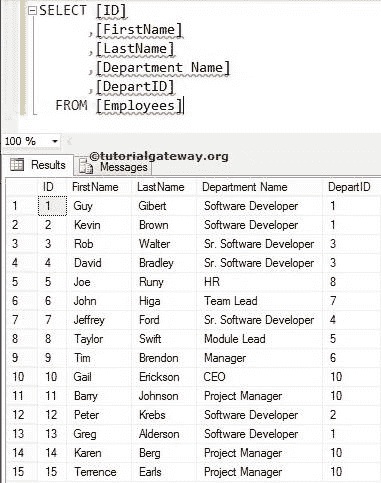
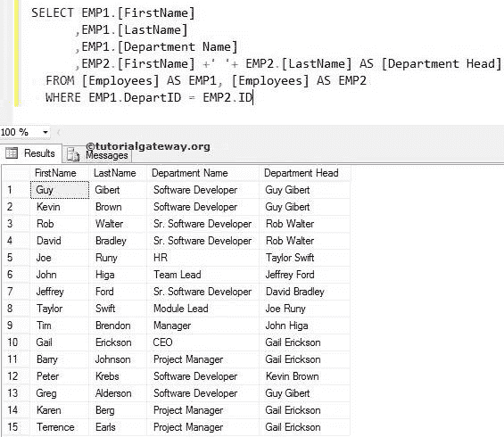

# SQL 自连接

> 原文：<https://www.tutorialgateway.org/sql-self-join/>

SQL 自连接用于将表 1 连接到自身。如果我们在同一个表中有主键和外键，那么我们可以使用这个自连接来连接它们，语法是

```
SELECT Tab1.Column(s), Tab2.Column(s),
FROM Table1 AS Tab1, 
     Table1 AS Tab2
```

在这个 SQL Server 自连接演示中，我们使用了数据库中的雇员表。你可以观察到，它有 15 个不同的记录，每个人都属于部门。我们有外国键列部门。



## SQL 自连接示例

一般来说，每个部门都会有一个负责人，他属于其中一个员工。为了得到部门主管的名字，我们必须使用主键和外键的自连接。例如，以下查询将显示“员工”表中每个人的姓名。

注:[别名](https://www.tutorialgateway.org/sql-alias/)表名是此[加入](https://www.tutorialgateway.org/sql-joins/)的必填项。

```
SELECT EMP1.[FirstName]
      ,EMP1.[LastName]
   ,EMP1.[Department Name]
   ,EMP2.[FirstName] +' '+ EMP2.[LastName] AS [Department Head]
  FROM [Employees] AS EMP1, [Employees] AS EMP2
  WHERE EMP1.DepartID = EMP2.ID
```

从下面的 [SQL Server](https://www.tutorialgateway.org/sql/) 截图来看，Rob Walter 不仅是高级软件开发人员，还是组织中剩余高级软件开发人员的部门主管。当你在一张桌子上有一个[主](https://www.tutorialgateway.org/sql-primary-key/)和[外国](https://www.tutorialgateway.org/sql-foreign-key/)时，使用这个。

