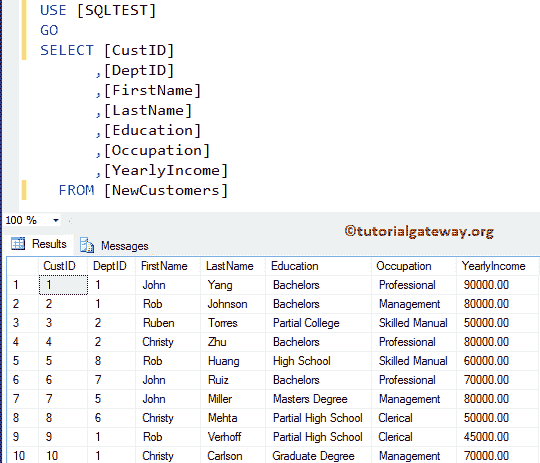
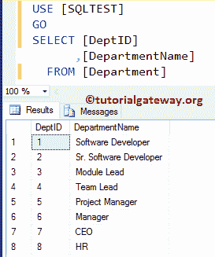
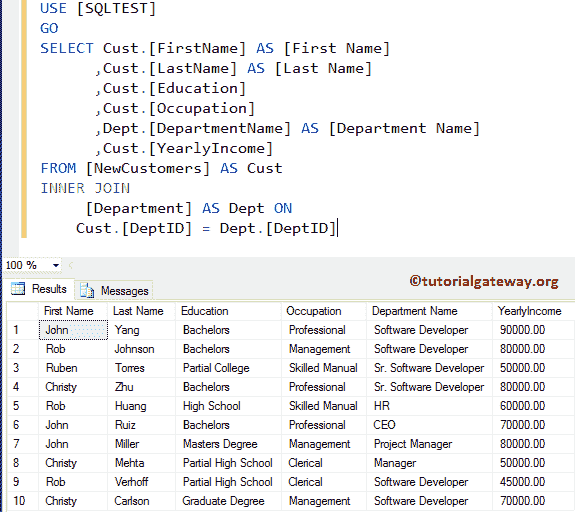
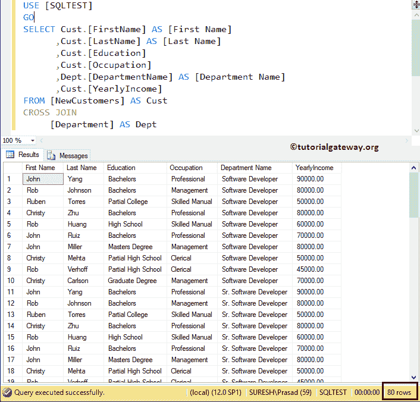

# SQL Server 中的交叉连接与内连接

> 原文：<https://www.tutorialgateway.org/cross-join-vs-inner-join-in-sql-server/>

如何编写一个 SQL 查询来展示 SQL Server 中交叉连接和内连接的区别，或者我们可以用例子来说，SQL Server 中的交叉连接 Vs 内连接。对于这个 SQL 面试问题，我们将使用下面显示的数据。数据出现在我们的 SQL 测试数据库中的新客户表中。



部门表中的数据为:



## SQL Server 中的交叉连接与内连接

SQL Server 交叉连接和内连接背后的定义是:

*   SQL INNER JOIN:如果列之间至少有一个匹配，则返回两个表中存在的记录(或行)。
*   它返回两个 SQL Server 表的笛卡尔乘积。笛卡尔乘积表示表 1 中的行数乘以表 2 中的行数。

### SQL 内连接

以下 [SQL INNER JOIN](https://www.tutorialgateway.org/sql-inner-join/) 查询将显示员工和部门表中的所有列以及匹配的行

```
-- Example for Cross Join Vs Inner Join in SQL Server
USE [SQLTEST]
GO
SELECT Cust.[FirstName] AS [First Name]
      ,Cust.[LastName] AS [Last Name]
      ,Cust.[Education]
      ,Cust.[Occupation]
      ,Dept.[DepartmentName] AS [Department Name]
      ,Cust.[YearlyIncome]
FROM [NewCustomers] AS Cust
INNER JOIN
     [Department] AS Dept ON
      Cust.[DeptID] = Dept.[DeptID]
```



### SQL 交叉连接示例

下面的 [SQL CROSS JOIN](https://www.tutorialgateway.org/sql-cross-join/) 查询将显示雇员和部门表中存在的列的笛卡尔乘积。是 [SQL Server 常见问题之一](https://www.tutorialgateway.org/sql-interview-questions/)。

```
-- Example for Cross Join Vs Inner Join in SQL Server
USE [SQLTEST]
GO
SELECT Cust.[FirstName] AS [First Name]
      ,Cust.[LastName] AS [Last Name]
      ,Cust.[Education]
      ,Cust.[Occupation]
      ,Dept.[DepartmentName] AS [Department Name]
      ,Cust.[YearlyIncome]
FROM [NewCustomers] AS Cust
CROSS JOIN
     [Department] AS Dept
```



如果观察上面的 [SQL Server](https://www.tutorialgateway.org/sql/) 截图，显示的是 80 条记录。这意味着新客户中的 10 行乘以部门表中的 8 行