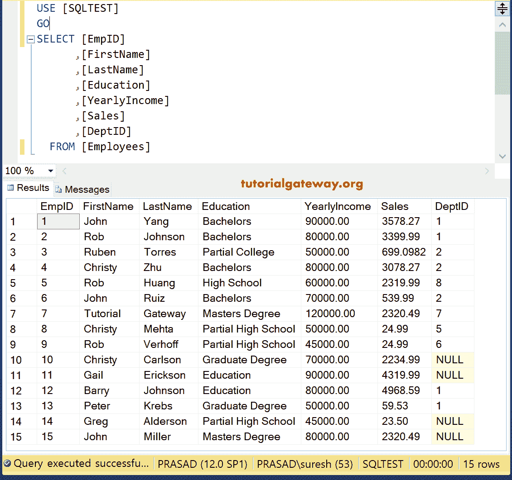
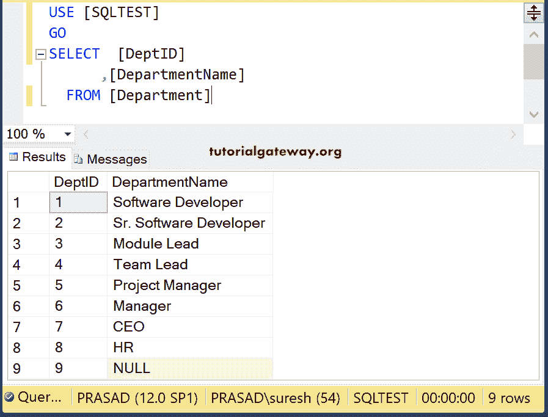
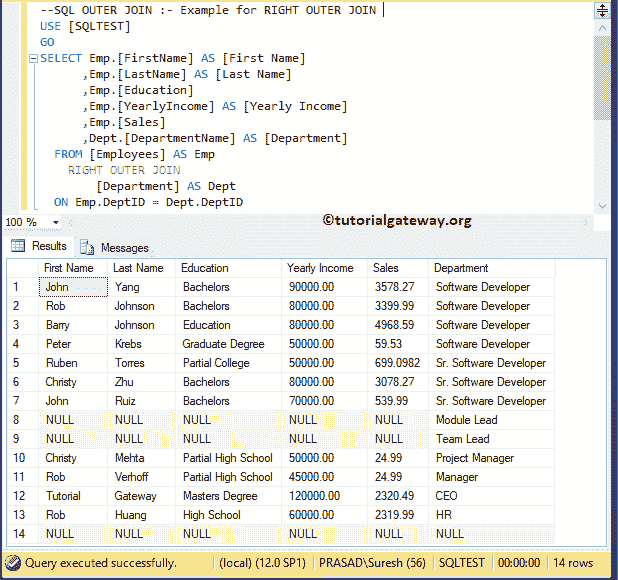
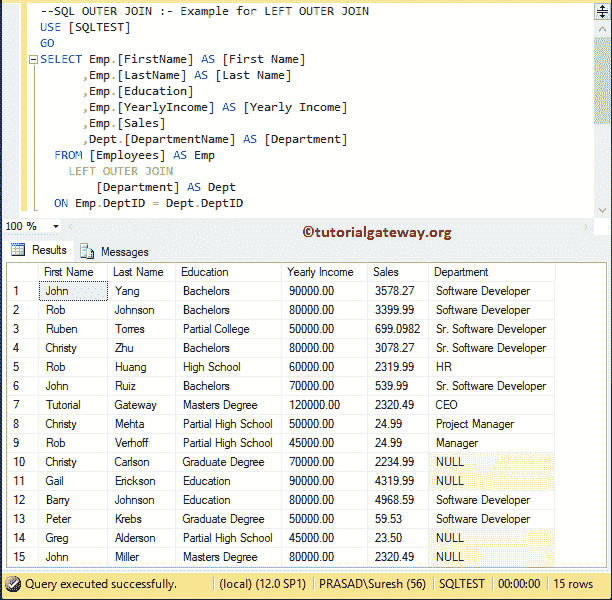
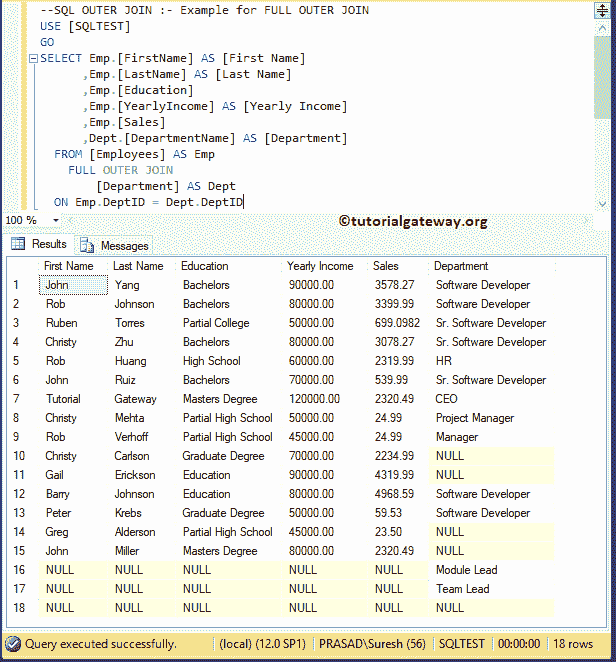

# SQL 外部联接

> 原文：<https://www.tutorialgateway.org/sql-outer-joins/>

在本文中，我们将通过一个例子向您展示如何使用 SQL 外部联接编写一个查询来联接两个或多个表。

## SQL Server 中外部联接的类型？

有三种类型的 SQL 外部联接，它们是:

*   右外部也称为右连接。它返回左表中匹配的行(如果有)，以及右表中的所有行。
*   左外部或称为左连接。它返回左表中的所有行和右表中的匹配行(如果有)。
*   完整:它返回左表和右表中的所有行。

对于这个 [SQL Server](https://www.tutorialgateway.org/sql/) 的例子，我们将使用下面显示的数据



部门表中的数据为:



## SQL 外部连接示例

以下是可用的列表。以下示例用粒子示例演示了其中的每一个。

在这个例子中，我们将向您展示如何编写右外。为了这个。演示，我们将使用上面显示的表格。我们在之前的文章中已经解释了[对](https://www.tutorialgateway.org/sql-right-join/)。

```
SELECT Emp.[EmpID]
      ,Emp.[FirstName]
      ,Emp.[LastName]
      ,Emp.[Education]
      ,Emp.[YearlyIncome]
      ,Emp.[Sales]
      ,Dept.[DepartmentName]
  FROM [Employees] AS Emp
  RIGHT JOIN [Department] AS Dept
  ON Emp.DeptID = Dept.DeptID
```



这个 SQL 示例向您展示了如何编写左外连接。我们在上一篇文章中已经解释了[左侧](https://www.tutorialgateway.org/sql-left-join/)。

```
SELECT Emp.[FirstName] AS [First Name]
      ,Emp.[LastName] AS [Last Name]
      ,Emp.[Education]
      ,Emp.[YearlyIncome] AS [Yearly Income]
      ,Emp.[Sales]
      ,Dept.[DepartmentName] AS [Department]
  FROM [Employees] AS Emp
	LEFT OUTER JOIN 
		[Department] AS Dept
  ON Emp.DeptID = Dept.DeptID
```



在这个 SQL 示例中，我们将展示如何编写完整的外部联接。我们在之前的文章中已经解释了 [Full](https://www.tutorialgateway.org/sql-full-join/) 。

```
SELECT Emp.[FirstName] AS [First Name]
      ,Emp.[LastName] AS [Last Name]
      ,Emp.[Education]
      ,Emp.[YearlyIncome] AS [Yearly Income]
      ,Emp.[Sales]
      ,Dept.[DepartmentName] AS [Department]
  FROM [Employees] AS Emp
	FULL OUTER JOIN 
		[Department] AS Dept
  ON Emp.DeptID = Dept.DeptID
```

