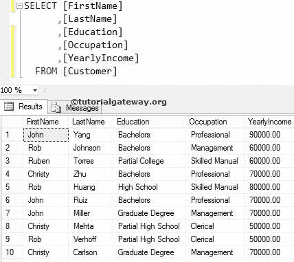
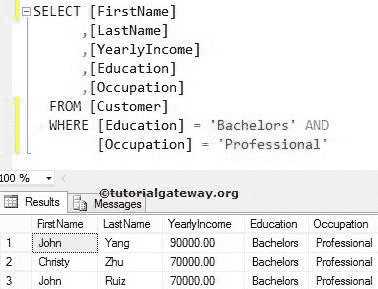
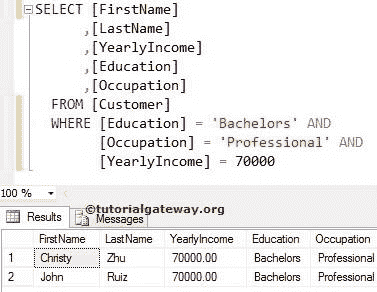
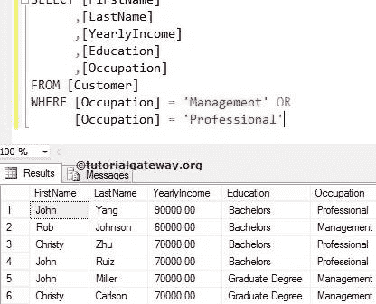
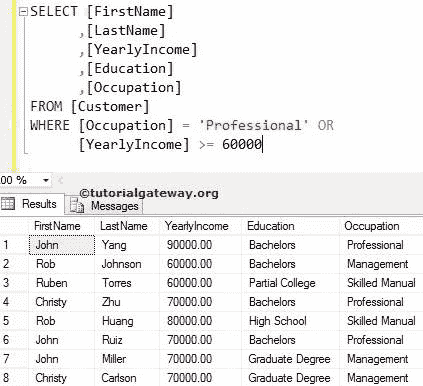
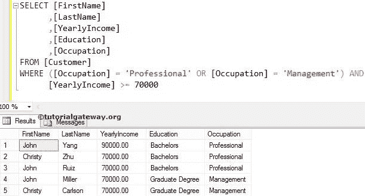
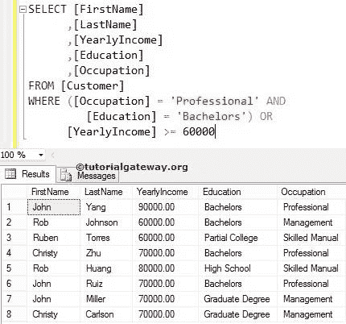

# SQL AND & OR 运算符

> 原文：<https://www.tutorialgateway.org/sql-and-or-operators/>

在 SQL Server 中，逻辑运算符(如 AND & OR 运算符)将在`WHERE`子句中使用，以便对`SELECT`语句返回的记录应用更多的过滤器。

SQL AND，OR 运算符示例:我们想在亚马逊网站上订购鞋子。当我们在搜索栏中键入鞋子时，它会显示成千上万双鞋子。然而，要挑选鞋子，我们必须使用各种过滤器，例如价格范围在 2000 到 2500 之间，品牌=耐克或阿迪达斯，尺寸= 9。

如果我们使用上述过滤器，它会显示符合上述要求的鞋子，以便我们轻松选择。让我们看看内部发生了什么(查询亚马逊数据库)。SQL 逻辑“与”、“或”运算符查询将如下所示:

```
SELECT [Product Name], [Size], [Brand], [Price], [Discount]
FROM [Products_table]
WHERE ([Product Name] = 'Shoes') AND 
      (Brand = 'Nike' OR 'Adidas') AND
      ([Size] = 9) AND 
      ([Price] BETWEEN 2000 AND 2500)
```

从上面的查询中，观察到我们在 SQL 逻辑与或运算符的帮助下使用了多个过滤器

让我们看看如何在使用`SELECT`语句提取数据之前，使用 [`WHERE`子句](https://www.tutorialgateway.org/sql-where-clause/)中的 SQL 逻辑 AND & OR)来过滤数据。我们将使用下面显示的数据来举例解释 SQL Server 中的 AND、OR 运算符。



## SQL AND & OR 运算符示例

以下是逻辑“与”和“或”的例子

### SQL AND 运算符

SQL Server AND 运算符用于测试`WHERE`子句中的多个条件。如果所有条件都为真，那么只有[`SELECT`语句](https://www.tutorialgateway.org/sql-select-statement/)会显示记录。

```
SELECT [FirstName]
      ,[LastName]
      ,[YearlyIncome]
      ,[Education]
      ,[Occupation]
 FROM [Customer]
 WHERE [Education] = 'Bachelors' AND 
       [Occupation] = 'Professional'
```

上述陈述将检索客户表中的所有可用客户，客户表中的学历完全等于学士，职业完全等于专业。



让我们使用 SQL AND 运算符应用三个条件

```
SELECT [FirstName]
      ,[LastName]
      ,[YearlyIncome]
      ,[Education]
      ,[Occupation]
 FROM [Customer]
 WHERE [Education] = 'Bachelors' AND 
       [Occupation] = 'Professional' AND
       [YearlyIncome] = 70000
```

上面的陈述选择了客户表中的所有客户记录，客户表中的学历完全等于学士学位，职业完全等于专业。还有，他的年收入正好等于 7 万。



### SQL 或运算符

SQL Server OR 运算符用于测试`WHERE`子句中的多个条件。如果任何给定条件为真，则显示记录。

让我们使用或运算符对单列(即职业)应用过滤器

```
SELECT [FirstName]
      ,[LastName]
      ,[YearlyIncome]
      ,[Education]
      ,[Occupation]
FROM [Customer]
WHERE [Occupation] = 'Management' OR
      [Occupation] = 'Professional'
```

前面的语句获取“客户”表中所有职业等于“管理”或“专业”的客户。



让我们使用或运算符对多列应用过滤器

```
SELECT [FirstName]
      ,[LastName]
      ,[YearlyIncome]
      ,[Education]
      ,[Occupation]
FROM [Customer]
WHERE [Occupation] = 'Professional' OR
      [YearlyIncome] >= 60000
```

如果客户的职业等于专业，前面的语句将从客户表中检索所有客户。或者年收入大于等于 60000



从上面的截图可以观察到，虽然我们要求“专业”，但它显示的是管理和技术手册客户，因为年收入大于或等于 60000

### 结合 SQL 和或运算符

通常，我们可以结合 AND 运算符和 OR 运算符来应用复杂的过滤器。但是，您必须使用括号。

注:如果我们忘记了圆括号，那么我们将得到错误的结果。请小心

```
SELECT [FirstName]
      ,[LastName]
      ,[YearlyIncome]
      ,[Education]
      ,[Occupation]
FROM [Customer]
WHERE ([Occupation] = 'Professional' OR 
         [Occupation] = 'Management') AND
      [YearlyIncome] >= 70000
```

上述语句将检索客户表中所有职业等于管理或专业的客户。而且，他的年收入大于等于 7 万。



让我们更改 AND 和 Or 运算符在查询中的位置

```
SELECT [FirstName]
      ,[LastName]
      ,[YearlyIncome]
      ,[Education]
      ,[Occupation]
FROM [Customer]
WHERE ([Occupation] = 'Professional' AND 
           [Education] = 'Bachelors') OR
      [YearlyIncome] >= 60000
```

