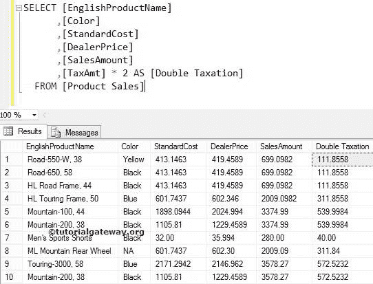

# SQL 算术运算符

> 原文：<https://www.tutorialgateway.org/sql-arithmetic-operators/>

SQL 算术运算符用于对给定数据执行 SQL Server 算术运算，如加法、减法、乘法和除法。

## SQL 算术运算符示例

在我们进入示例之前，下表显示了 SQL Server 中可用算术运算符的列表。

| SQL 算术运算符 | 操作 | 例子 |
| + | 添加 | DECLARE @A INT，@ B INT
SET @ A = 10
SET @ B = 2
SELECT @ A+@ B AS Total = 12 |
| – | 减法 | 选择@ A –@ B 作为总数(10–2 = 8) |
| * | 增加 | 选择@A * @B 作为总数(10 * 2 = 20) |
| / | 分开 | 选择@A / @B 作为总计(10 / 2 = 5) |
| % | 模数–它返回除法后的余数 | 选择@A % @B 作为总计=0，因为 10%2 = 0(此处余数为零)。如果是 10 % 3，那么就是 1。 |

对于这个 SQL Server 算术运算符演示，我们将使用下面显示的数据


## SQL +运算符(加法)

SQL 加法运算符在许多方面都很有用。如果我们对数值数据使用加法 SQL 算术运算符，那么它将把这些值相加，并提供整数输出。如果我们在两个字符串之间使用+号，那么它将组合它们并提供字符串输出。

例如，以下 SQL 算术运算符查询将组合[英语产品名称]和[颜色]列

```
SELECT [EnglishProductName] + ' - ' + [Color] AS [Product Name]
      ,[StandardCost]
      ,[DealerPrice]
      ,[SalesAmount]
      ,[TaxAmt]
  FROM [Product Sales]
```

注:'-'加在产品名称和颜色之间


让我们看看，如何在 Sql Server 中对数值数据执行加法。例如，我们想要增加每个产品的标准成本，那么我们可以使用这个加法来增加常量值。

```
SELECT [EnglishProductName]
      ,[Color]
      ,[StandardCost] + 2.25 AS [New Standard Cost]
      ,[DealerPrice]
      ,[SalesAmount]
      ,[TaxAmt]
  FROM [Product Sales]
```

上面的 SQL 加法运算符查询是将产品销售表


中每种产品的标准成本加 2.25

## 减法

SQL 减法运算符用于从一个值中减去另一个值。例如，以下查询将通过从经销商价格中减去标准成本来计算利润率。

```
SELECT [EnglishProductName]
      ,[Color]
      ,[StandardCost] 
      ,[DealerPrice]
      ,[DealerPrice] - [StandardCost] AS [Product Margin]
      ,[SalesAmount] 
      ,[TaxAmt]
  FROM [Product Sales]
```


## 增加

SQL 乘法运算符用于将一个值与另一个值相乘。例如，在下面的查询中将计算延迟付款的税。

```
SELECT [EnglishProductName]
      ,[Color]
      ,[StandardCost] 
      ,[DealerPrice]
      ,[SalesAmount] 
      ,[TaxAmt] * 2 AS [Double Taxation]
  FROM [Product Sales]
```

在这个 [SQL Server](https://www.tutorialgateway.org/sql/) 示例中，我们将原始税额乘以 2。



## 分开

SQL 除法用于将一个值除以另一个值。例如，下面的 SQL 算术运算符查询将计算我们为每种产品支付的税的百分比。

```
SELECT [EnglishProductName]
      ,[Color]
      ,[StandardCost] 
      ,[DealerPrice]
      ,[SalesAmount] 
      ,[TaxAmt]
      ,[SalesAmount] / [TaxAmt] AS [Tax Percent]
  FROM [Product Sales]
```

