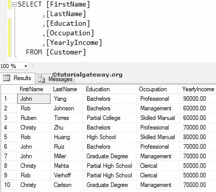

# SQL `BETWEEN`运算符

> 原文：<https://www.tutorialgateway.org/sql-between-operator/>

“SQL `BETWEEN`运算符”显示其值介于给定值之间的记录(或行)。SQL Server 中“之间”运算符的语法是

```
--  Syntax
SELECT [Column Names]
FROM [Source]
WHERE [Column Name] BETWEEN Value1 AND Value2

--We can also write the above statement
SELECT [Column Names]
FROM [Source]
WHERE [Column Name] >= Value1 AND
      [Column Name] <= Value2
```

例如，如果您想查找 2015 年 5 月 18 日至 2015 年 6 月 19 日的销售额。或者，如果你想让亚马逊网站显示价格在 1000 到 2500 之间的产品，那么在内部，我们必须使用这个 SQL Server Between 运算符。对于这个例子，我们将使用下面显示的数据



## 数值数据上运算符之间的 SQL 示例

以下运算符之间的 SQL 查询查找[年收入]在 50000 到 70000 之间的客户表中的所有客户

```
SELECT [FirstName]
      ,[LastName]
      ,[YearlyIncome]
      ,[Education]
      ,[Occupation]
FROM [Customer]
WHERE [YearlyIncome] BETWEEN 50000 AND 70000
```


以下查询将在“客户”表中查找姓氏位于卡尔森和鲁伊斯中间的所有现有客户

```
SELECT [FirstName]
      ,[LastName]
      ,[YearlyIncome]
      ,[Education]
      ,[Occupation]
FROM [Customer]
WHERE [LastName] BETWEEN 'Carlson' AND 'Ruiz'
ORDER BY [LastName]
```

提示:在 [SQL Server](https://www.tutorialgateway.org/sql/) 中，我们也可以用单个字符代替写完整的名字。


## SQL 不在示例之间

我们也可以使用非关键字和这个运算符。例如，以下“非间隔”查询将查找表中所有[年收入]不在 50000 到 70000 之间的客户

```
SELECT [FirstName]
      ,[LastName]
      ,[YearlyIncome]
      ,[Education]
      ,[Occupation]
FROM [Customer]
WHERE [YearlyIncome] NOT BETWEEN 50000 AND 70000
```

