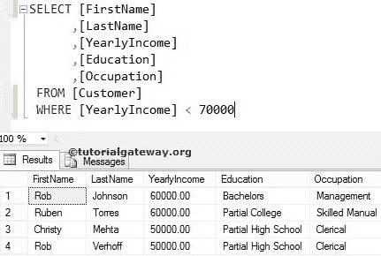

# SQL 比较运算符

> 原文：<https://www.tutorialgateway.org/sql-comparison-operators/>

SQL 比较运算符对于将列值与有效表达式进行比较非常有用。下表显示了 SQL Server 中可用比较运算符的列表。

| SQL 比较运算符 | 描述 |
| = | 等于 |
| > | 大于 |
| < | 不到 |
| >= | 大于或等于 |
| <= | 小于或等于 |
| <> | 不等于 |
| ！= | 不等于 |
| ！> | 不大于 |
| ！< | 不少于 |

对于这个 SQL 比较运算符，我们将使用下面显示的数据


## SQL 比较运算符示例

以下是 SQL 比较运算符的列表，每个运算符都有一个示例。

### SQL 等于=

SQL 等于运算符是最常用的比较项。它将显示列值完全等于给定表达式的记录。

例如，以下 SQL 比较运算符查询将查找“客户”表中所有“职业”完全等于“管理”的客户

```
SELECT [FirstName]
      ,[LastName]
      ,[YearlyIncome]
      ,[Education]
      ,[Occupation]
 FROM [Customer]
 WHERE [Occupation] = 'Management'
```


### 大于的 SQL >

大于运算符将显示列值大于给定表达式的记录。例如，下面的 [SQL Server](https://www.tutorialgateway.org/sql/) 大于将查找客户表中所有[年收入]大于 60000 的客户

```
SELECT [FirstName]
      ,[LastName]
      ,[YearlyIncome]
      ,[Education]
      ,[Occupation]
 FROM [Customer]
 WHERE [YearlyIncome] > 60000
```


### SQL 小于<

小于运算符将显示列值小于给定表达式的记录。以下 SQL 比较运算符查询将查找“客户”表中[年收入]小于 70000 的所有客户

```
SELECT [FirstName]
      ,[LastName]
      ,[YearlyIncome]
      ,[Education]
      ,[Occupation]
 FROM [Customer]
 WHERE [YearlyIncome] < 70000
```



### 大于或等于> =

大于或等于的 SQL 将显示列值大于或等于给定表达式的记录。例如，sql 查询中的以下“大于或等于”比较运算符将查找“客户”表中[年收入]大于或等于 60000 的所有客户

```
SELECT [FirstName]
      ,[LastName]
      ,[YearlyIncome]
      ,[Education]
      ,[Occupation]
 FROM [Customer]
 WHERE [YearlyIncome] >= 60000
```


### 小于或等于< =

小于或等于将显示列值小于或等于给定表达式的记录。

例如，以下查询将在[年收入]小于或等于 70000 的客户表中找到所有可用的客户

```
SELECT [FirstName]
      ,[LastName]
      ,[YearlyIncome]
      ,[Education]
      ,[Occupation]
 FROM [Customer]
 WHERE [YearlyIncome] <= 70000
```


### SQL 不等于<>

“不等于”将显示列值不等于给定表达式的记录。

例如，以下查询将在[年收入]不等于 60000 的客户表中找到所有可用的客户。这意味着，它将显示除[年收入]等于 60000 以外的所有记录

```
-- SQL Server Comparison Operators Example
SELECT [FirstName]
      ,[LastName]
      ,[YearlyIncome]
      ,[Education]
      ,[Occupation]
 FROM [Customer]
 WHERE [YearlyIncome] <> 60000
```


### SQL 不等于！=

SQL 不等于运算符与<>相同。例如，下面的“不等于”运算符查询将在“客户”表中找到[年收入]不等于 60000 的客户。

```
SELECT [FirstName]
      ,[LastName]
      ,[YearlyIncome]
      ,[Education]
      ,[Occupation]
 FROM [Customer]
 WHERE [YearlyIncome] != 60000
```


### 不小于！<

“不小于”将显示列值大于或等于给定表达式的记录。

“不低于”运算符查询在“客户”表中找到[年收入]不低于 70000 的客户。这意味着，它将显示所有[年收入]大于或等于 70000 的记录

```
SELECT [FirstName]
      ,[LastName]
      ,[YearlyIncome]
      ,[Education]
      ,[Occupation]
 FROM [Customer]
 WHERE [YearlyIncome] !< 70000

```


### 不大于运算符！>

“不大于”运算符将显示列值小于或等于给定表达式的记录。

该 SQL 不大于运算符查询将查找[年收入]不大于 70000 的客户。这意味着，它将显示所有[年收入]小于或等于 70000 的记录

```
SELECT [FirstName]
      ,[LastName]
      ,[YearlyIncome]
      ,[Education]
      ,[Occupation]
 FROM [Customer]
 WHERE [YearlyIncome] !> 70000
```

