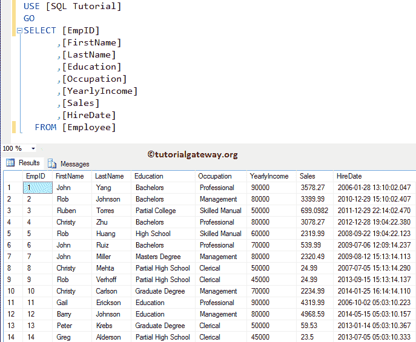
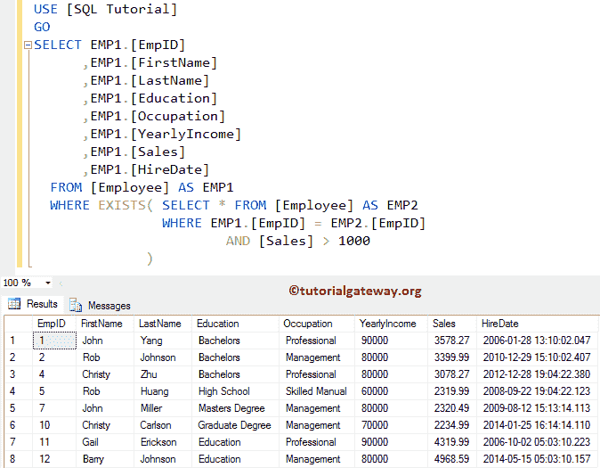
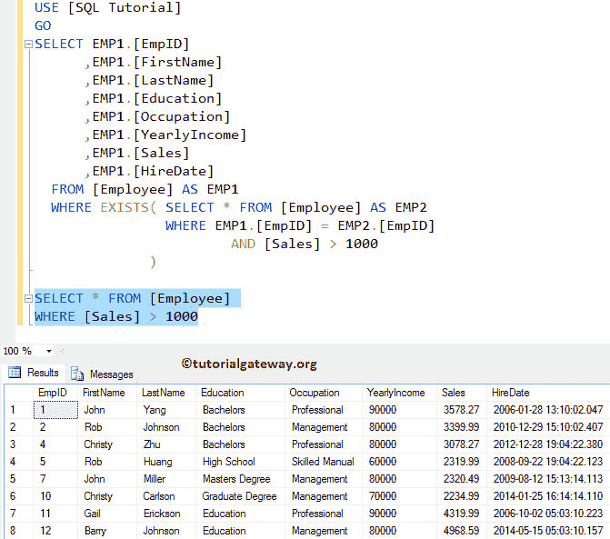
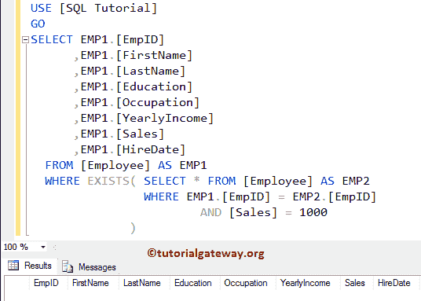
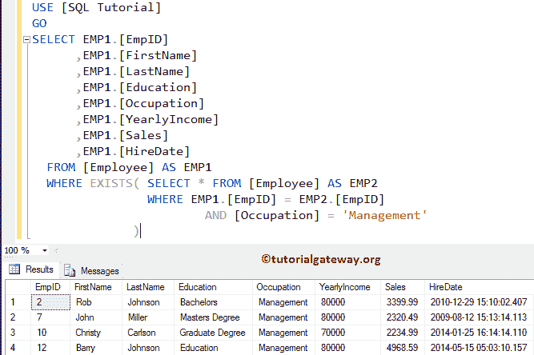
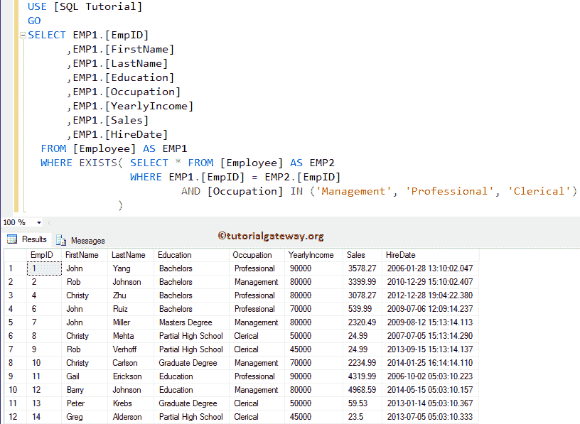
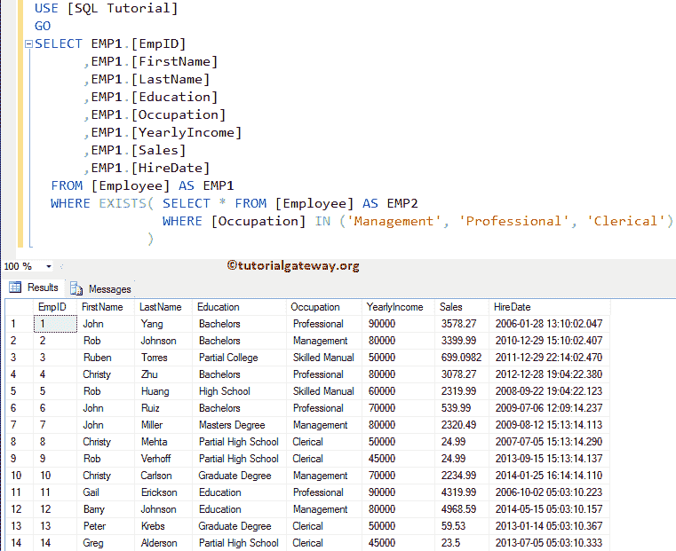

# SQL EXISTS 运算符

> 原文:[https://www.tutorialgateway.org/sql-exists-operator/](https://www.tutorialgateway.org/sql-exists-operator/)

SQL EXISTS 运算符用于限制 SELECT 语句返回的行数。SQL 中的 EXISTS 运算符检查子查询中的行是否存在，如果存在，则返回真，否则返回假。

## SQL EXISTS 运算符语法

Sql Server EXISTS 运算符的基本语法可以写成:

```
SELECT [Column Names]
FROM [Source]
WHERE EXISTS (Write Subquery to Check)
```

*   列:允许我们从表中选择列数。它可能是一个或多个。
*   来源:数据库中存在一个或多个表。 [JOINS](https://www.tutorialgateway.org/sql-inner-join/) 用于连接多个表。
*   子查询:这里我们必须提供子查询。如果子查询返回真，则返回记录，否则 [SQL Server](https://www.tutorialgateway.org/sql/) 不返回任何记录。

对于这个 EXISTS 操作员演示，我们将使用下面显示的数据



## SQL EXISTS 运算符示例

以下 SQL Server Exists 运算符查询将查找表中[销售额]大于 1000 的所有员工。

提示:在进入这个 Exists 运算符示例之前，我建议您参考[子查询](https://www.tutorialgateway.org/sql-subquery/)一文来了解子查询设计和查询解析。

```
SELECT EMP1.[EmpID]
      ,EMP1.[FirstName]
      ,EMP1.[LastName]
      ,EMP1.[Education]
      ,EMP1.[Occupation]
      ,EMP1.[YearlyIncome]
      ,EMP1.[Sales]
      ,EMP1.[HireDate]
  FROM [Employee] AS EMP1
  WHERE EXISTS( SELECT * FROM [Employee] AS EMP2 
		WHERE EMP1.[EmpID] = EMP2.[EmpID] 
			AND [Sales] > 1000
		)
```



让我向您展示子查询的结果



让我将条件更改为 Sales = 1000，这是一个错误的条件

```
SELECT EMP1.[EmpID]
      ,EMP1.[FirstName]
      ,EMP1.[LastName]
      ,EMP1.[Education]
      ,EMP1.[Occupation]
      ,EMP1.[YearlyIncome]
      ,EMP1.[Sales]
      ,EMP1.[HireDate]
  FROM [Employee] AS EMP1
  WHERE EXISTS( SELECT * FROM [Employee] AS EMP2 
		WHERE EMP1.[EmpID] = EMP2.[EmpID] 
			AND [Sales] = 1000
		)
```

如您所见，查询返回空记录，因为子查询返回假。为了更好地理解，让我们再向您展示一个 SQL Exists 运算符示例。



以下 SQL exists 查询将查找表中[职业]等于“管理”的所有员工

```
SELECT EMP1.[EmpID]
      ,EMP1.[FirstName]
      ,EMP1.[LastName]
      ,EMP1.[Education]
      ,EMP1.[Occupation]
      ,EMP1.[YearlyIncome]
      ,EMP1.[Sales]
      ,EMP1.[HireDate]
  FROM [Employee] AS EMP1
  WHERE EXISTS( SELECT * FROM [Employee] AS EMP2 
		WHERE EMP1.[EmpID] = EMP2.[EmpID] 
			AND [Occupation] = 'Management'
		)
```



以下 SQL exists 运算符查询将查找表中所有职业为管理或专业或文员的人员。这里我们将在子查询中使用 [SQL IN 运算符](https://www.tutorialgateway.org/sql-in-operator/)

```
SELECT EMP1.[EmpID]
      ,EMP1.[FirstName]
      ,EMP1.[LastName]
      ,EMP1.[Education]
      ,EMP1.[Occupation]
      ,EMP1.[YearlyIncome]
      ,EMP1.[Sales]
      ,EMP1.[HireDate]
  FROM [Employee] AS EMP1
  WHERE EXISTS( SELECT * FROM [Employee] AS EMP2 
		WHERE EMP1.[EmpID] = EMP2.[EmpID] 
		  AND [Occupation] IN ('Management', 'Professional', 'Clerical')
		)
```



## SQL EXISTS 运算符示例 4

你可能会想，为什么我要用 EMP1。[EmpID] = EMP2。子查询中的[EmpID]。让我去掉那条线，看看

```
SELECT EMP1.[EmpID]
      ,EMP1.[FirstName]
      ,EMP1.[LastName]
      ,EMP1.[Education]
      ,EMP1.[Occupation]
      ,EMP1.[YearlyIncome]
      ,EMP1.[Sales]
      ,EMP1.[HireDate]
  FROM [Employee] AS EMP1
  WHERE EXISTS( SELECT * FROM [Employee] AS EMP2 
		WHERE [Occupation] IN ('Management', 'Professional', 'Clerical')
		)
```

从下面的截图中可以看到，这个 SQL exists 正在返回所选表中的所有记录。因为，子查询返回真

