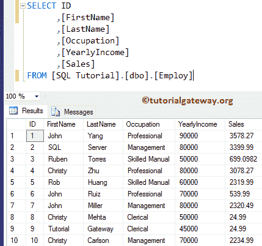

# SQL `EXCEPT`

> 原文：<https://www.tutorialgateway.org/sql-except/>

“除”是由服务器提供的集合运算符之一。除此之外，此 SQL Server 用于从左侧查询返回右侧查询未输出的不同行。

或者，我们可以说，SQL except 将返回左侧表中的所有记录，即不在右侧的记录。下图将帮助您理解除。


## 除语法外的 SQL

除 SQL Server 之外的语法如下所示:

```
SELECT Column_Name1, Column_Name2 ......., Column_NameN FROM Table1
EXCEPT
SELECT Column_Name1, Column_Name2 ......., Column_NameN FROM Table2
```

以下是 SQL Server 中除运算符之外的一组规则:

1.  两个查询中的总列数必须相同。
2.  列数据类型必须相互兼容。
3.  在所有查询中，列的顺序必须相同。


对于这个 Sql Server 除运算符之外的演示，我们将使用数据库中的两个表(2016 年雇佣表和员工表)。从下面的截图可以观察到【雇佣】表有十条记录



而【员工 2016】表有四条记录。在这个 [SQL Server](https://www.tutorialgateway.org/sql/) 表中，只有一条截然不同的记录(9，Rob，Verhoff)，其余记录都是相同的。


## 除了示例

以下查询将返回“雇员 2016”表中不存在的“雇员”的记录总数，并显示结果

```
SELECT [ID]
      ,[FirstName]
      ,[LastName]
      ,[Occupation]
      ,[YearlyIncome]
      ,[Sales]
  FROM [Employ]
 EXCEPT
  SELECT [ID]
      ,[FirstName]
      ,[LastName]
      ,[Occupation]
      ,[YearlyIncome]
      ,[Sales]
  FROM [Employees 2016]
```


让我们改变桌子的位置。这意味着此查询将返回 Employees2016 表中不存在的记录总数

```
SELECT [ID]
      ,[FirstName]
      ,[LastName]
      ,[Occupation]
      ,[YearlyIncome]
      ,[Sales]
  FROM [Employees 2016]
  EXCEPT
  SELECT [ID]
      ,[FirstName]
      ,[LastName]
      ,[Occupation]
      ,[YearlyIncome]
      ,[Sales]
  FROM [Employ]

```


## 除`WHERE`子句外的 SQL 示例

如何在 [`WHERE`子句](https://www.tutorialgateway.org/sql-where-clause/)中使用该运算符。在本例中，我们将两个语句连接在一起:

*   第一个结果集选择“雇佣”中年收入大于或等于 70000 的所有记录
*   第二个结果集从“员工 2016”中挑选记录。
*   此运算符从第一个结果集中选择第二个结果集中不存在的现有记录。

```
SELECT [ID]
      ,[FirstName]
      ,[LastName]
      ,[Occupation]
      ,[YearlyIncome]
      ,[Sales]
FROM [Employ]
WHERE [YearlyIncome] >= 70000
 EXCEPT
SELECT [ID]
      ,[FirstName]
      ,[LastName]
      ,[Occupation]
      ,[YearlyIncome]
      ,[Sales]
FROM [Employees 2016]
```


## 除错误之外的 SQL

下面的查询将显示我们在编写 except 查询时遇到的常见错误列表。为此，我们将使用[SQL 教程]数据库中的两个表(雇员和雇员)。我们的[员工]表有 7 列 14 行。


让我们看看当我们执行 Sql Server 时会发生什么，除了对不等长的列执行操作。

```
SELECT [FirstName]
      ,[LastName]
      ,[Education]
      ,[Occupation]
      ,[YearlyIncome]
      ,[Sales]
      ,[HireDate]
  FROM [Employee]
  EXCEPT
SELECT [ID]
      ,[FirstName]
      ,[LastName]
      ,[Occupation]
      ,[YearlyIncome]
      ,[Sales]
FROM [Employ]
```

```
Messages
--------
Msg 205, Level 16, State 1, Line 2
All queries combined using a UNION, INTERSECT or EXCEPToperator 
must have an equal number of expressions in their target lists.
```

现在，让我们修改查询以选择相等数量的列

```
 SELECT [FirstName]
      ,[LastName]
      ,[Occupation]
      ,[YearlyIncome]
      ,[Sales]
  FROM [Employee]
  EXCEPT
SELECT [FirstName]
      ,[LastName]
      ,[Occupation]
      ,[YearlyIncome]
      ,[Sales]
FROM [Employ]
```


从上图中，可以看到它返回了七行，因为除了 2、7、9、11 到 14 条记录之外，Employee 表中的其余十条记录也在那里。我们的运算符只从员工中选择不同的记录。