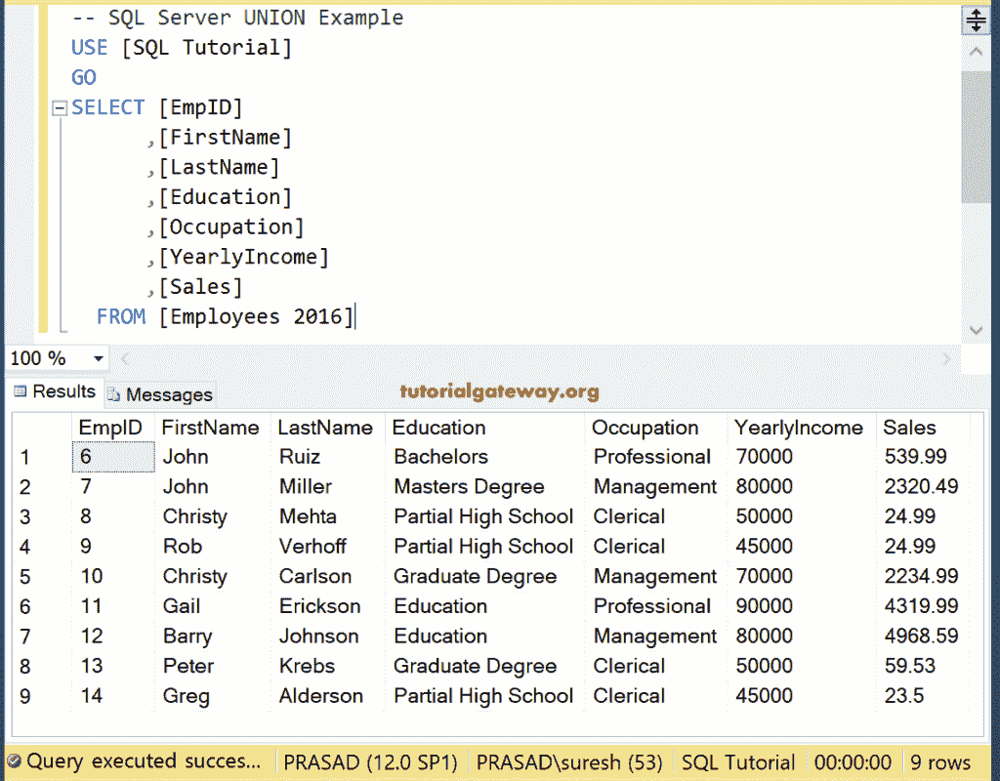

# SQL `INTERSECT`

> 原文：<https://www.tutorialgateway.org/sql-intersect/>

SQL INTERSECT 是由 SQL Server 提供的集合运算符之一。该 SQL Server Intersect 用于返回左侧查询(左表)和右侧查询(右表)中常见的所有记录。在实际示例之前，下图将帮助您理解 SQL Server Intersect。


## SQL INTERSECT 语法

SQL Server Intersect 背后的语法是

```
SELECT Column_Name1, Column_Name2 ......., Column_NameN FROM Table1
INTERSECT
SELECT Column_Name1, Column_Name2 ......., Column_NameN FROM Table2
```

以下是在 SQL Server 中相交的一组规则:

1.  所有查询中的列数必须相同。
2.  列数据类型应该相互兼容。
3.  在所有查询中，列的顺序必须相同。


在这个演示中，我们将使用数据库中的两个表。从下图可以观察到，【雇佣】表有十条记录


而[Employees 2016]表有四行。在这里，只有一个截然不同的记录(9，罗布，维尔霍夫)，其余三个是相同的。



## SQL 相交示例

以下查询返回在 Employ 和 Employees 2016 表中常见的所有记录，并显示结果集。

```
SELECT [ID]
      ,[FirstName]
      ,[LastName]
      ,[Occupation]
      ,[YearlyIncome]
      ,[Sales]
FROM [Employ]
  INTERSECT
SELECT [ID]
      ,[FirstName]
      ,[LastName]
      ,[Occupation]
      ,[YearlyIncome]
      ,[Sales]
FROM [Employees 2016]
```


### SQL 交集`WHERE`子句示例

下面的查询显示了如何使用这个运算符以及 [`WHERE`子句](https://www.tutorialgateway.org/sql-where-clause/)。在本例中，我们将两种说法结合起来:

*   第一个 [SQL Server](https://www.tutorialgateway.org/sql/) 结果集从 Employ 中选择年收入大于等于 70000 的记录
*   第二个结果集从[Employees 2016]表中选择所有记录。
*   该运算符选择第一个结果集和第二个结果集中的所有公共记录。

```
SELECT [ID]
      ,[FirstName]
      ,[LastName]
      ,[Occupation]
      ,[YearlyIncome]
      ,[Sales]
FROM [Employ]
WHERE [YearlyIncome] >= 70000
 INTERSECT
SELECT [ID]
      ,[FirstName]
      ,[LastName]
      ,[Occupation]
      ,[YearlyIncome]
      ,[Sales]
FROM [Employees 2016]
```


## SQL 相交错误

下面的查询将显示我们在使用该查询时遇到的常见错误。为此，我们将使用我们的[SQL 教程]数据库中的两个表(雇员表和[雇员 2016])。从下面的截图可以看到【员工】表有 7 列 14 行。


让我们看看当我们选择两个表中的所有列时会出现什么问题。这意味着对不等长的列执行 SQL Server 交集操作。

```
SELECT [FirstName]
      ,[LastName]
      ,[Education]
      ,[Occupation]
      ,[YearlyIncome]
      ,[Sales]
      ,[HireDate]
  FROM [Employee]
  INTERSECT
SELECT * FROM [Employees 2016]
```

```
Messages
--------
Msg 205, Level 16, State 1, Line 2
All queries combined using a UNION, INTERSECTor EXCEPT operator 
must have an equal number of expressions in their target lists.
```

我想，你可以看看留言。现在，让我们稍微更改一下查询，选择相等数量的列

```
SELECT [FirstName]
      ,[LastName]
      ,[Occupation]
      ,[YearlyIncome]
      ,[Sales]
FROM [Employee]
 INTERSECT
SELECT [FirstName]
      ,[LastName]
      ,[Occupation]
      ,[YearlyIncome]
      ,[Sales]
FROM [Employees 2016]
```

从下面的截图中，可以看到它正在返回 3 条记录。因为只有一条不同的记录(Rob，Verhoff)，而[Employees 2016]中的其余三条记录也出现在 Employee 表中。我们的运算符只从两个表中选择公共记录。

