# SQL `IN`运算符

> 原文：<https://www.tutorialgateway.org/sql-in-operator/>

运算符中的 SQL 用于限制`SELECT`语句返回的行数(或记录数)。SQL Server `IN`运算符根据输入中的值检查给定的表达式或列名。如果至少有一个匹配，那么`SELECT`语句将返回记录

## 运算符语法中的 SQL

SQL `IN`运算符的语法是

```
SELECT [Column Names]
FROM [Source]
WHERE [Column Name] IN (Value1, Value2, ...., ValueN)

--We can also use OR operator to write the above statement
SELECT [Column Names]
FROM [Source]
WHERE [Column Name] = Value1 OR
      [Column Name] = Value2 OR
       .... OR
      [Column Name] = Value
```

*   列:它允许我们从表中选择列数。它可能是一个或多个。
*   来源:如果数据库中有一个或多个表，使用[连接](https://www.tutorialgateway.org/sql-joins/)连接多个 [SQL Server](https://www.tutorialgateway.org/sql/) 表。
*   值:在这里，我们必须提供值或表达式，我们想检查在一个`IN`运算符内的列名。如果列名与任何值匹配，则仅显示记录。

如果要根据多个值检查表达式，请使用 Sql `IN`运算符。对于这个 Sql `IN`运算符示例，我们将使用下面显示的数据

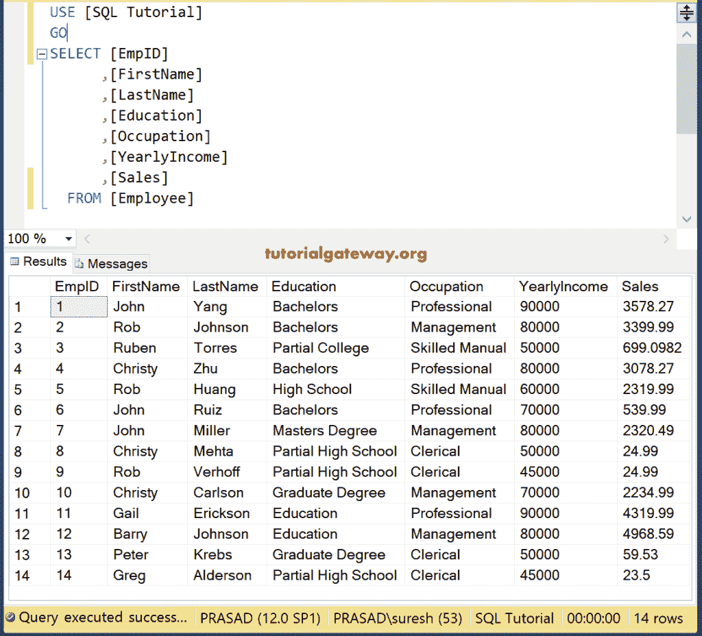

## 运算符示例中的 SQL

运算符查询中的以下 Sql Server 将查找雇员表中[年收入]为 70000 或 80000 的所有雇员

```
SELECT [EmpID]
      ,[FirstName]
      ,[LastName]
      ,[Education]
      ,[Occupation]
      ,[YearlyIncome]
      ,[Sales]
  FROM [Employee]
  WHERE YearlyIncome IN (70000, 80000)
```

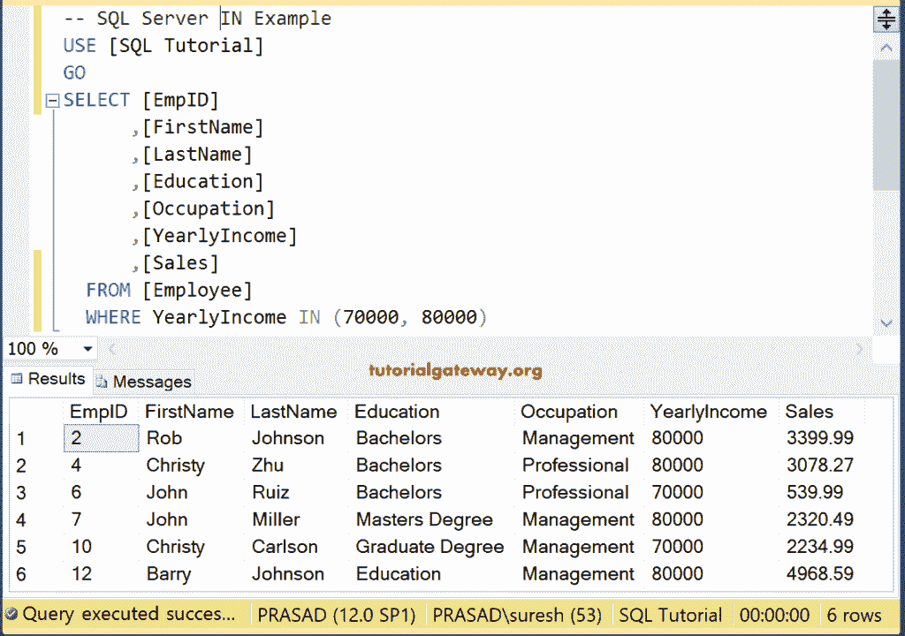

为了更好地理解，让我们在运算符示例中再向您展示一个 SQL。

以下查询返回年收入为 70000、80000 或 90000 的员工

```
SELECT [EmpID]
      ,[FirstName]
      ,[LastName]
      ,[Education]
      ,[Occupation]
      ,[YearlyIncome]
      ,[Sales]
  FROM [Employee]
  WHERE YearlyIncome IN (70000, 80000, 90000)
```

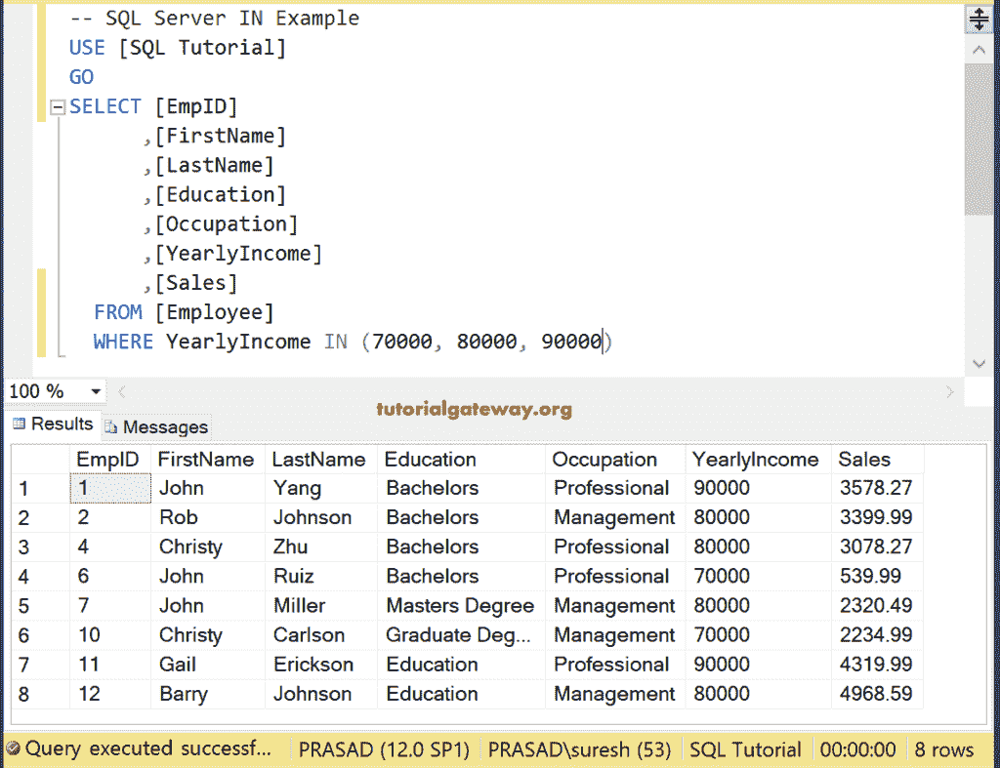

### 字符串中的 SQL 位置示例

您可以在该关键字内使用任何[数据类型](https://www.tutorialgateway.org/sql-data-types/)列。此`IN`运算符查询查找“雇员”表中所有职业为“管理”或“文员”的雇员

```
SELECT [EmpID]
      ,[FirstName]
      ,[LastName]
      ,[Education]
      ,[Occupation]
      ,[YearlyIncome]
      ,[Sales]
  FROM [Employee]
  WHERE [Occupation] IN ('Management', 'Clerical')
```

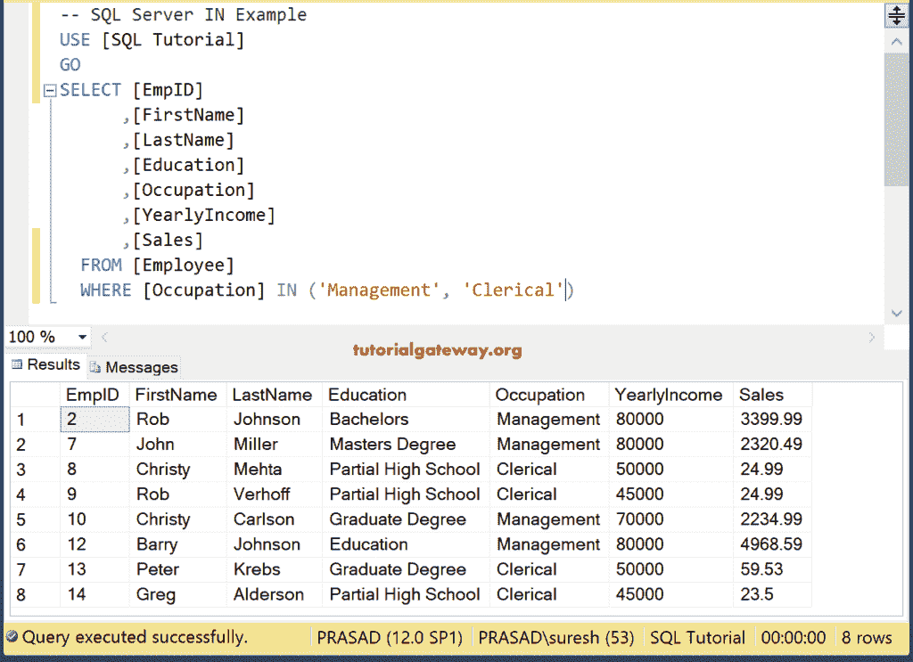

下面的 Where in 字符串查询返回职业为管理、专业或文书的员工

```
SELECT [EmpID]
      ,[FirstName]
      ,[LastName]
      ,[Education]
      ,[Occupation]
      ,[YearlyIncome]
      ,[Sales]
  FROM [Employee]
  WHERE [Occupation] IN ('Management', 
 'Professional', 'Clerical')
```

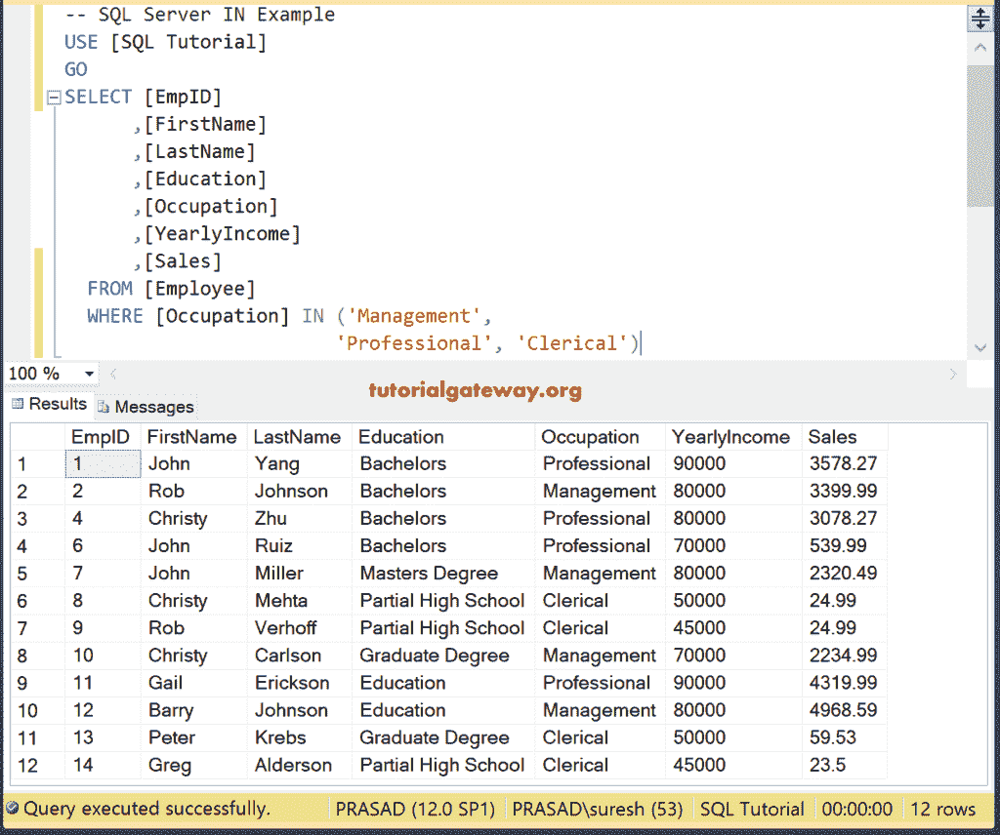

## 多条件`IN`运算符

我们也可以在单个 [`WHERE`子句](https://www.tutorialgateway.org/sql-where-clause/)中使用多个运算符。在本例中，我们将在一条语句中使用 SQL Server `IN`运算符(算术)和[或](https://www.tutorialgateway.org/sql-and-or-operators/)(逻辑)。以下查询返回职业为“管理”或“专业”或年收入应等于 50000 的员工

```
SELECT [EmpID]
      ,[FirstName]
      ,[LastName]
      ,[Education]
      ,[Occupation]
      ,[YearlyIncome]
      ,[Sales]
  FROM [Employee]
  WHERE [Occupation] IN ('Management', 'Clerical')
  OR YearlyIncome = 50000
```

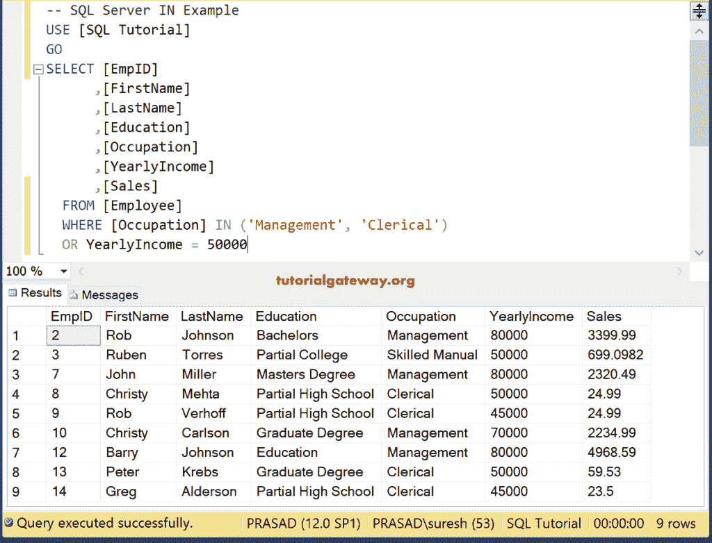

## 带`ORDER BY`子句的 SQL IN

与[订单条款](https://www.tutorialgateway.org/sql-order-by-clause/)一起使用。这里，按 Desc 排序将根据年收入列对查询结果进行降序排序。

```
SELECT [EmpID]
      ,[FirstName]
      ,[LastName]
      ,[Education]
      ,[Occupation]
      ,[YearlyIncome]
      ,[Sales]
  FROM [Employee]
  WHERE [Occupation] IN ('Management', 'Clerical')
  OR YearlyIncome = 50000
  ORDER BY YearlyIncome DESC
```

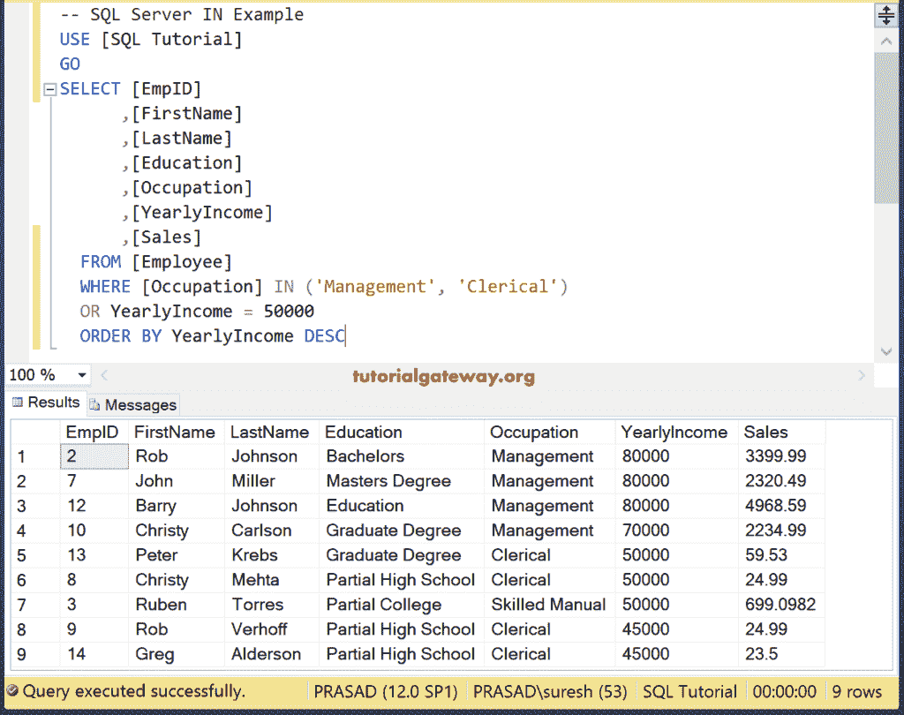

## 运算符中的 SQL 子查询

它允许你在 [`WHERE`子句](https://www.tutorialgateway.org/sql-where-clause/)的[子查询](https://www.tutorialgateway.org/sql-subquery/)中使用。在我们开始这个例子之前，让我给你看另一个我们在这里使用的表格

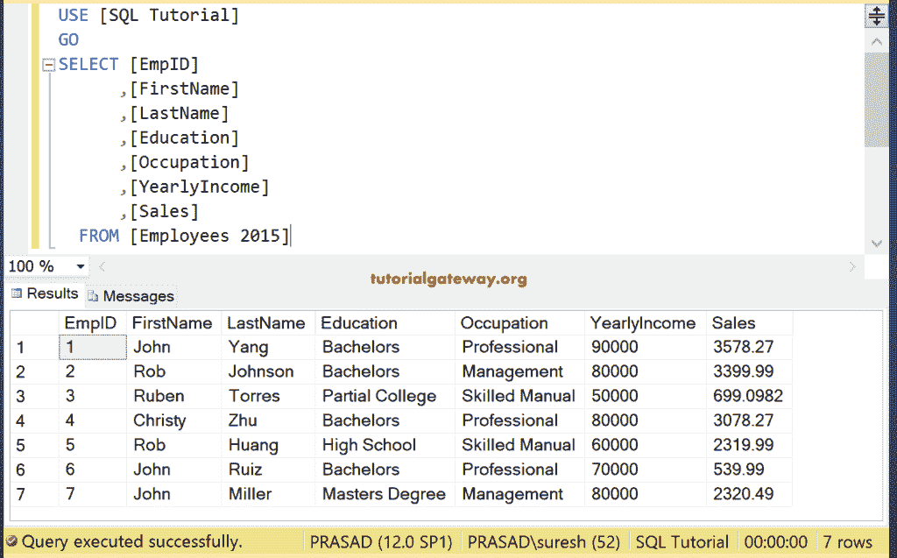

例如，以下查询将返回其职业出现在“2015 年员工”表中的所有员工。

```
SELECT [EmpID]
      ,[FirstName]
      ,[LastName]
      ,[Education]
      ,[Occupation]
      ,[YearlyIncome]
      ,[Sales]
  FROM [Employee]
  WHERE [Occupation] IN (SELECT [Occupation] 
 FROM [Employees 2015])
```

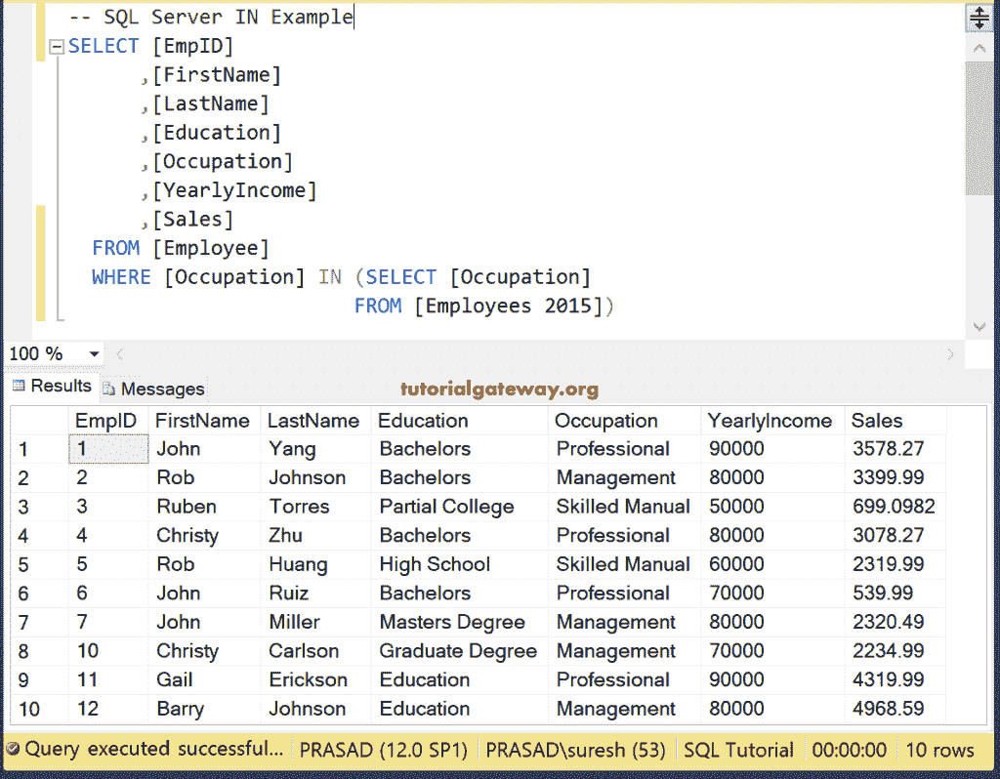

## SQL 不在示例中

我们也可以将[而不是](https://www.tutorialgateway.org/sql-not-in-operator/)关键字与 `IN`运算符一起使用。例如，以下查询在“职业”不是“管理”和“专业”的员工表中查找所有可用的员工

```
SELECT [EmpID]
      ,[FirstName]
      ,[LastName]
      ,[Education]
      ,[Occupation]
      ,[YearlyIncome]
      ,[Sales]
  FROM [Employee]
  WHERE [Occupation] 
 NOT IN ('Management', 'Professional')
```

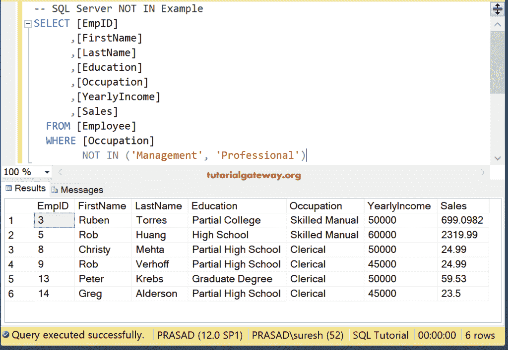

您也可以在数值列中使用这个。下面的查询显示年收入不是 50000 或 80000 的员工

```
SELECT [EmpID]
      ,[FirstName]
      ,[LastName]
      ,[Education]
      ,[Occupation]
      ,[YearlyIncome]
      ,[Sales]
  FROM [Employee]
  WHERE [YearlyIncome] NOT IN (50000, 80000)
```

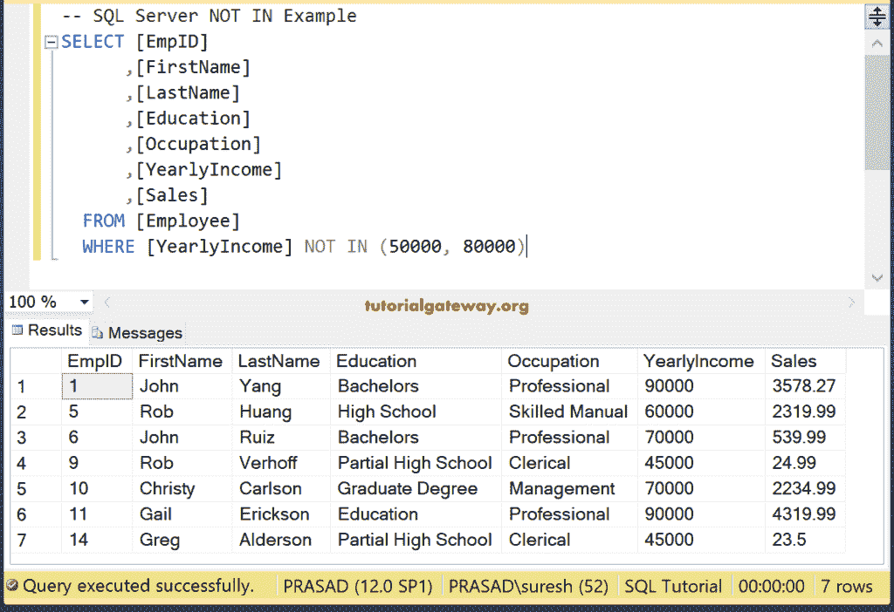

我们也可以在非输入中写一个[子查询](https://www.tutorialgateway.org/sql-subquery/)。

```
SELECT [EmpID]
      ,[FirstName]
      ,[LastName]
      ,[Education]
      ,[Occupation]
      ,[YearlyIncome]
      ,[Sales]
  FROM [Employee]
  WHERE [Occupation] NOT IN (SELECT [Occupation] 
 FROM [Employees 2015])
```

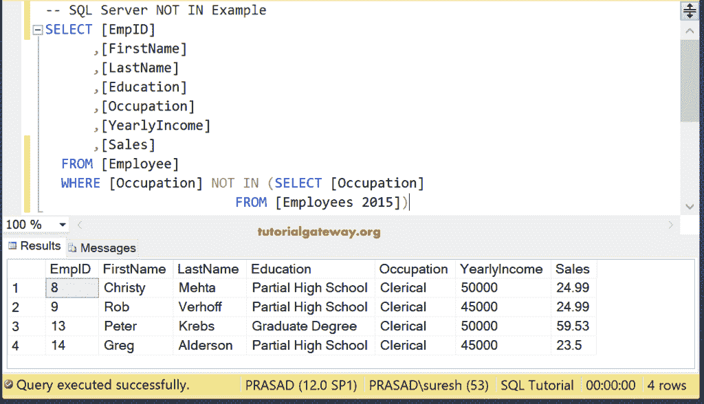