# SQL LIKE

> 原文:[https://www.tutorialgateway.org/sql-like/](https://www.tutorialgateway.org/sql-like/)

SQL LIKE 运算符提取值与指定模式匹配的记录。SQL 通配符应该与 LIKE 运算符一起使用。例如，如果您忘记了公司或产品的拼写，则可以使用运算符和通配符来检索所需的信息。

这里通配符将有助于替换丢失的单词。SQL Server 支持以下 SQL 通配符

| SQL 通配符 | 描述 |
| % | 它代表零个或多个字符 |
| _ | 它只代表一个字符 |
| [字符列表或范围] | 选择与方括号中的字符或字符范围完全匹配的记录 |
| [^Char 列表或范围] | 选择与方括号中的字符或字符范围不匹配的记录 |

让我们看看如何使用通配符和 SQL LIKE，并举例说明。对于这个演示，我们使用如下所示的数据

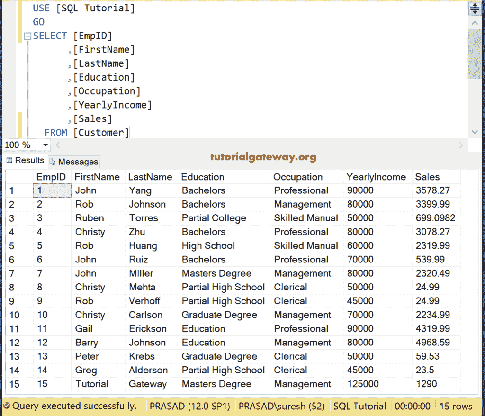

## SQL 通配符%百分比符号

SQL 通配符百分比符号(%)表示零个或多个字符。例如，以下%查询返回名字以字母 j 开头的所有客户

```
SELECT [EmpID]
      ,[FirstName]
      ,[LastName]
      ,[Education]
      ,[Occupation]
      ,[YearlyIncome]
      ,[Sales]
  FROM [Customer]
  WHERE [FirstName] LIKE N'J%'
```

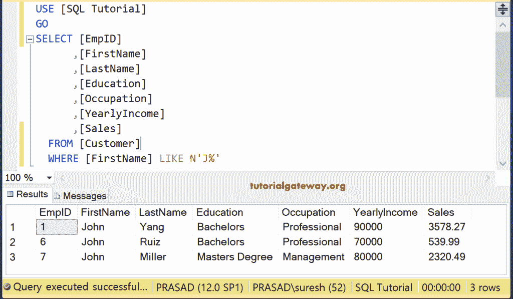

此通配符示例显示了职业以字母 l 结尾的客户

```
SELECT [EmpID]
      ,[FirstName]
      ,[LastName]
      ,[Education]
      ,[Occupation]
      ,[YearlyIncome]
      ,[Sales]
  FROM [Customer]
  WHERE [Occupation] LIKE N'%l'
```

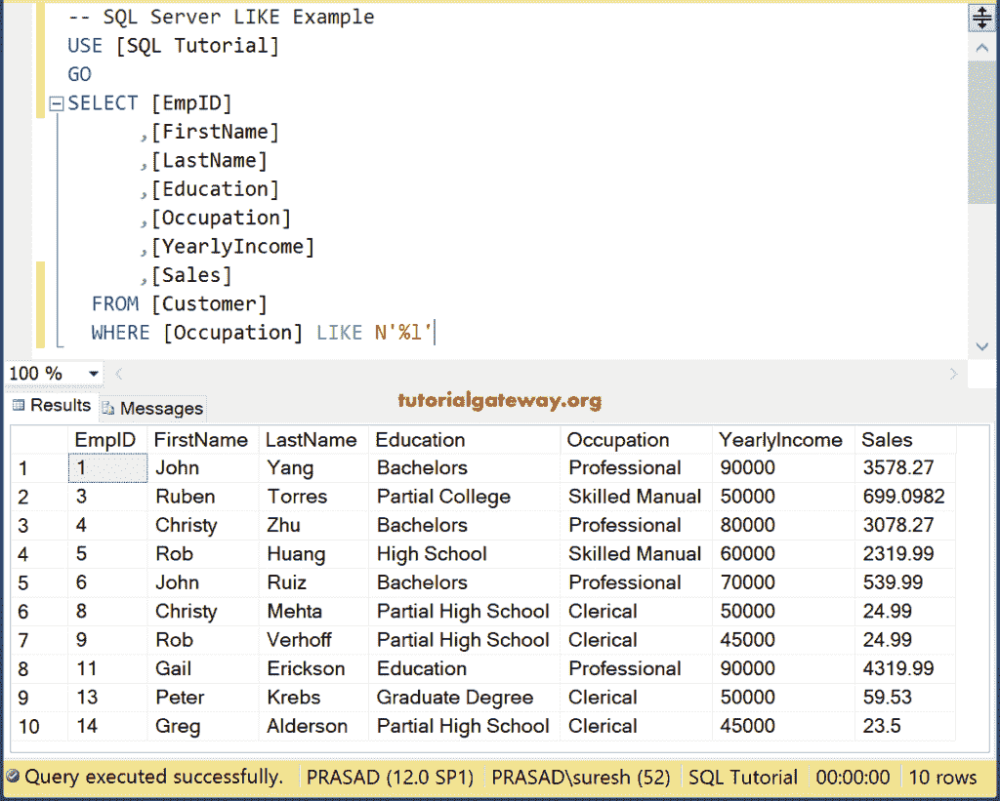

以下 Sql Server 通配符查询选择职业以字母 M 开头、以 t 结尾的客户

```
SELECT [EmpID]
      ,[FirstName]
      ,[LastName]
      ,[Education]
      ,[Occupation]
      ,[YearlyIncome]
      ,[Sales]
  FROM [Customer]
  WHERE [Occupation] LIKE N'M%t'
```

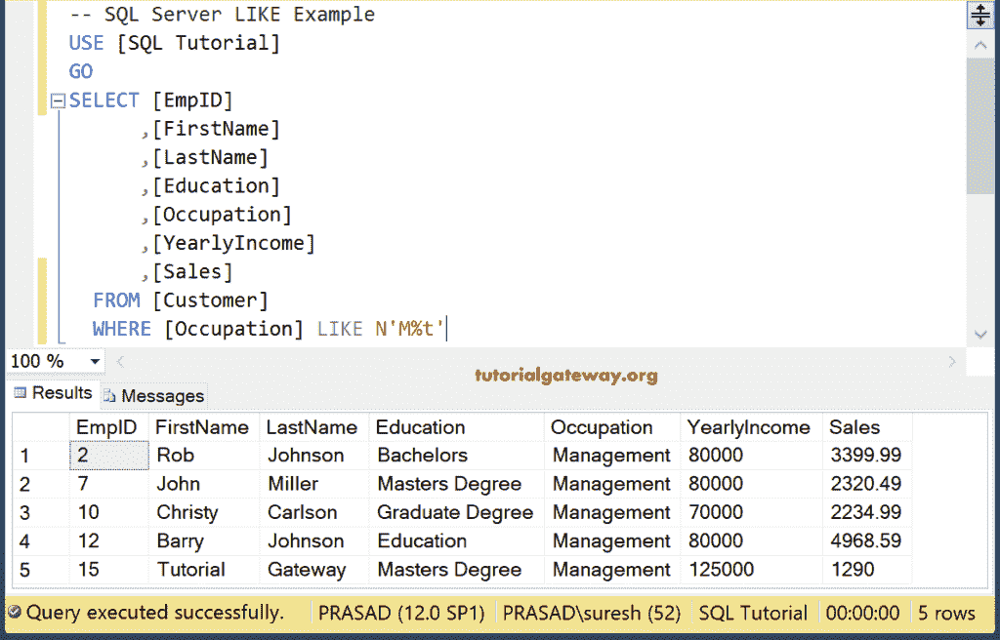

下面的 [SQL Server](https://www.tutorialgateway.org/sql/) 查询返回其职业包含任意位置的马的客户。

```
SELECT [EmpID]
      ,[FirstName]
      ,[LastName]
      ,[Education]
      ,[Occupation]
      ,[YearlyIncome]
      ,[Sales]
  FROM [Customer]
  WHERE [Occupation] LIKE N'%Ma%'
```

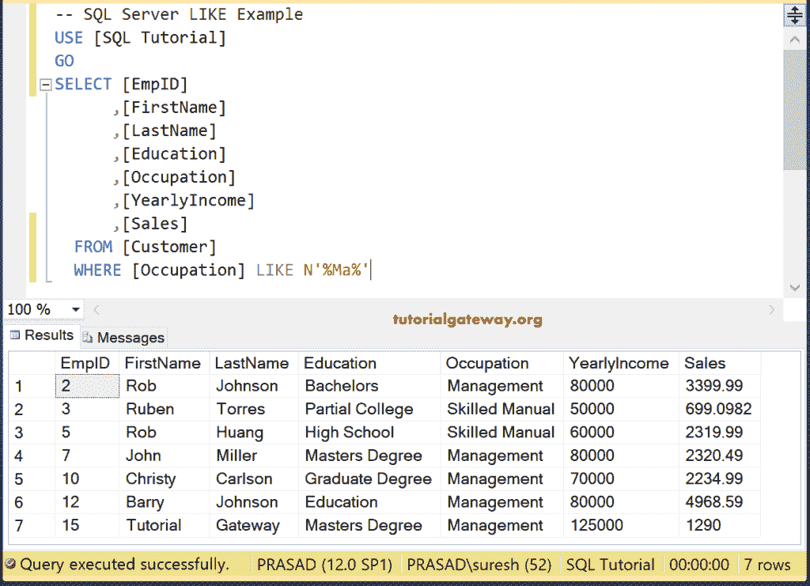

## _ SQL LIKE 运算符中的通配符(下划线符号)

下划线(_)表示单个字符。下面的通配符查询选择名字第二个字母为 0 的所有客户

```
SELECT [EmpID]
      ,[FirstName]
      ,[LastName]
      ,[Education]
      ,[Occupation]
      ,[YearlyIncome]
      ,[Sales]
  FROM [Customer]
  WHERE [FirstName] LIKE N'_o%'
```

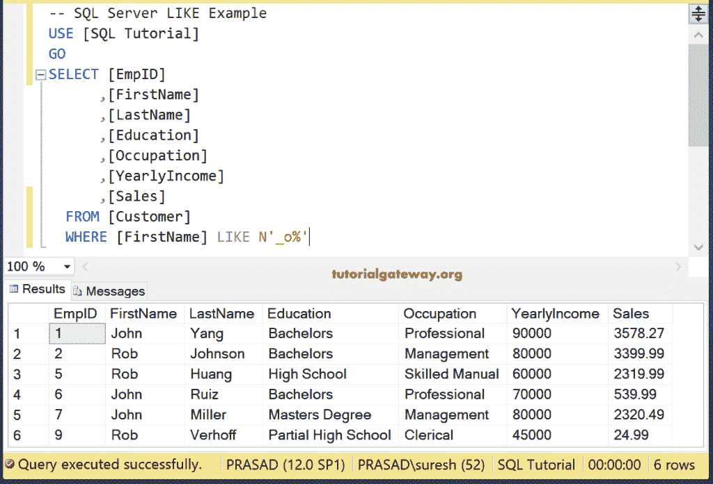

这个 SQL 通配符查询在第二和第三个位置显示年收入包含 00 的客户。

```
SELECT [EmpID]
      ,[FirstName]
      ,[LastName]
      ,[Education]
      ,[Occupation]
      ,[YearlyIncome]
      ,[Sales]
  FROM [Customer]
  WHERE [YearlyIncome] LIKE N'_00%'
```

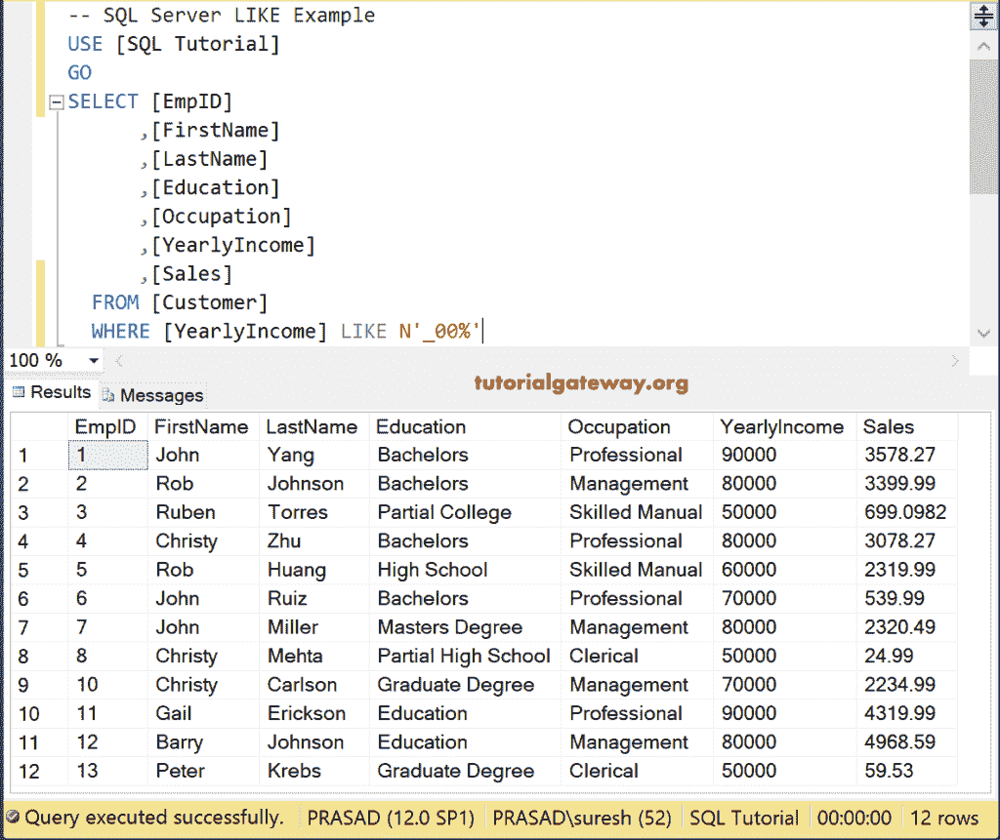

此通配符查询显示名字至少包含四个字符的客户。

```
SELECT [EmpID]
      ,[FirstName]
      ,[LastName]
      ,[Education]
      ,[Occupation]
      ,[YearlyIncome]
      ,[Sales]
  FROM [Customer]
  WHERE [FirstName] LIKE N'_%_%_%_%'
```

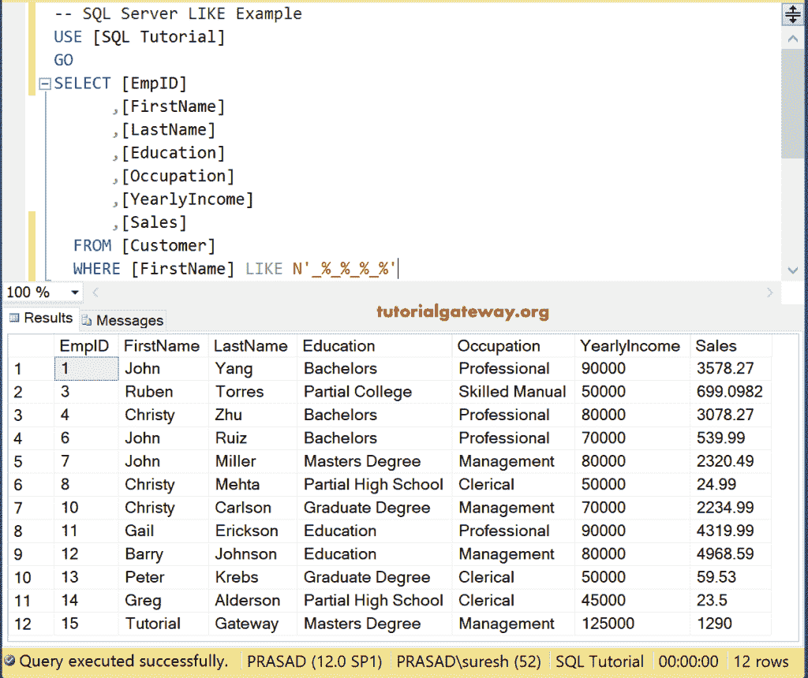

下面的查询返回年收入从 8 开始到 0 结束的客户。这里，我们使用了三个符号的意思，它将接受 8 到 0 之间的三个数字或单词。

```
SELECT [EmpID]
      ,[FirstName]
      ,[LastName]
      ,[Education]
      ,[Occupation]
      ,[YearlyIncome]
      ,[Sales]
  FROM [Customer]
  WHERE [YearlyIncome] LIKE N'8___0'
```

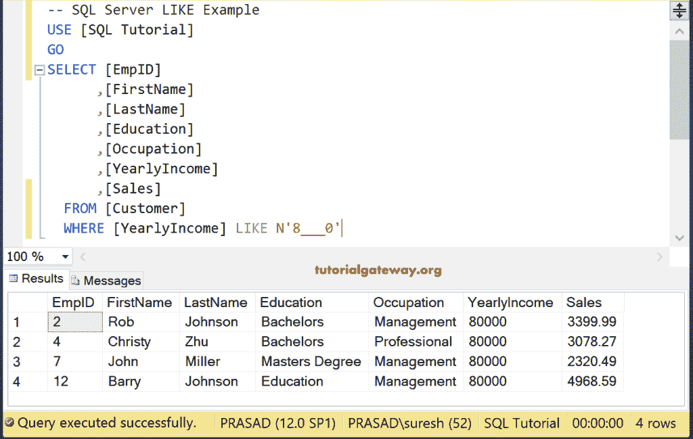

## 使用[]字符列表

使用[](字符列表)搜索多个项目。它返回客户表中名字以字母 C 或 j 开头的所有客户

```
SELECT [EmpID]
      ,[FirstName]
      ,[LastName]
      ,[Education]
      ,[Occupation]
      ,[YearlyIncome]
      ,[Sales]
  FROM [Customer]
  WHERE [FirstName] LIKE N'[CJ]'
```

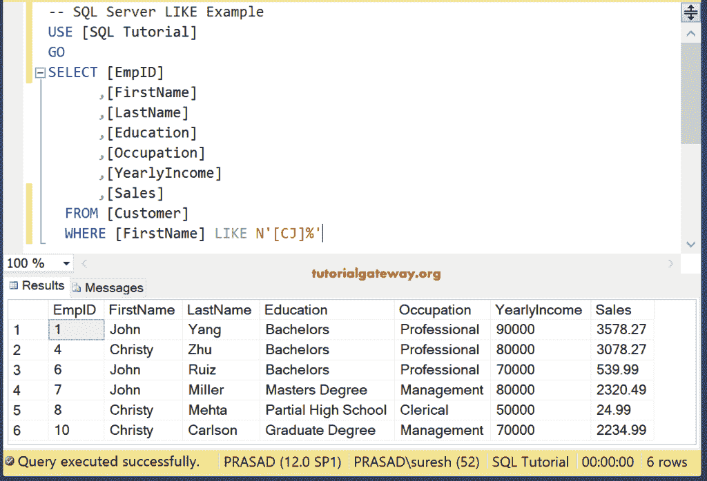

该查询返回名字不以 C 或 j 开头的客户

```
SELECT [EmpID]
      ,[FirstName]
      ,[LastName]
      ,[Education]
      ,[Occupation]
      ,[YearlyIncome]
      ,[Sales]
  FROM [Customer]
  WHERE [FirstName] LIKE N'[^CJ]%'
```

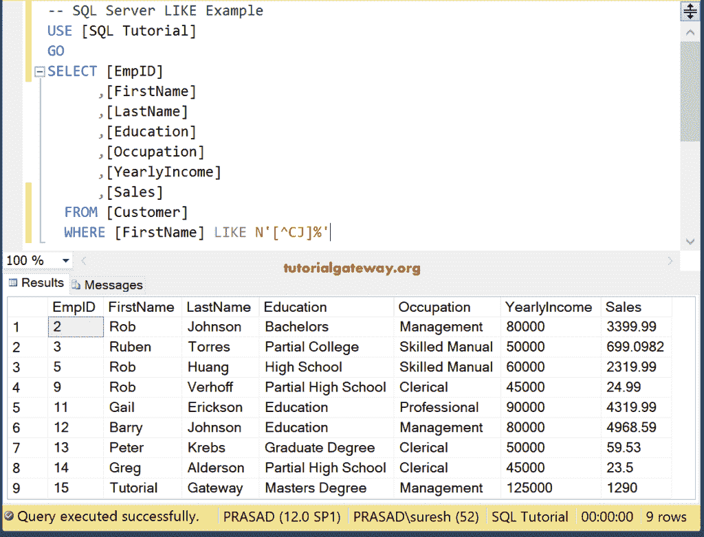

## 使用字符列表范围的 SQL 通配符示例

在 Sql 中使用这个字符范围通配符来搜索一系列字母等。此查询返回“客户”表中姓氏以 M 和 y 之间的任何字母开头的所有客户

```
SELECT [EmpID]
      ,[FirstName]
      ,[LastName]
      ,[Education]
      ,[Occupation]
      ,[YearlyIncome]
      ,[Sales]
  FROM [Customer]
  WHERE [LastName] LIKE N'[M-Y]%'
```

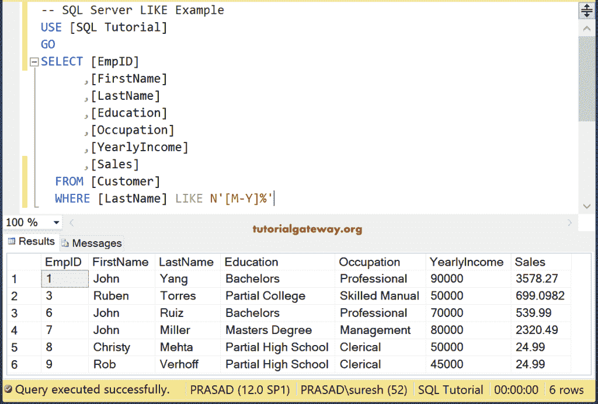

## SQL 通配符[^]示例

它充当 NOTLIKE 运算符。以下查询显示姓氏不以 M 和 y 之间的任何字母开头的客户

```
SELECT [EmpID]
      ,[FirstName]
      ,[LastName]
      ,[Education]
      ,[Occupation]
      ,[YearlyIncome]
      ,[Sales]
  FROM [Customer]
  WHERE [LastName] LIKE N'[^M-Y]%'
```

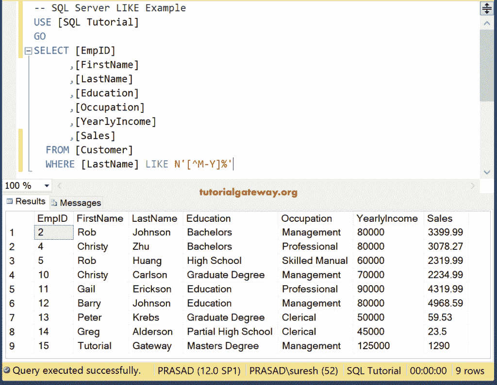

## SQL 不像运算符示例

这个操作符也允许我们使用非关键字。例如，下面的查询显示了名字不以 j 开头的客户

```
SELECT [EmpID]
      ,[FirstName]
      ,[LastName]
      ,[Education]
      ,[Occupation]
      ,[YearlyIncome]
      ,[Sales]
  FROM [Customer]
  WHERE [FirstName] NOT LIKE N'J%'
```

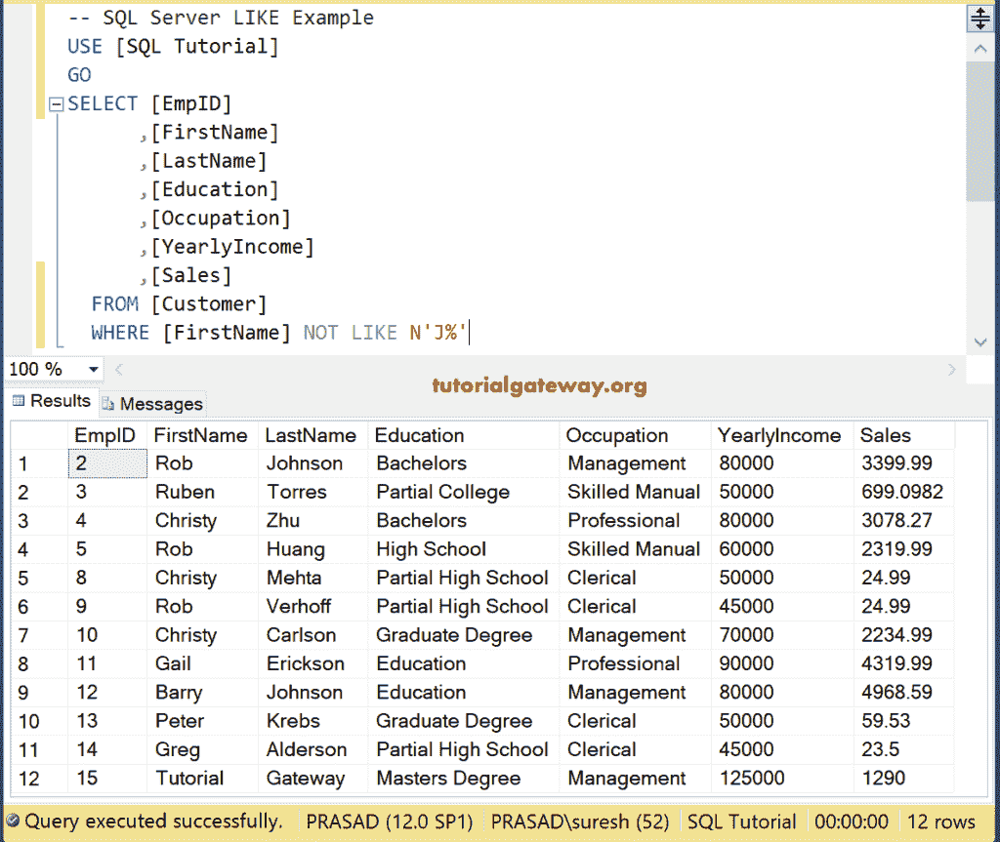

您也可以使用[^Character 列表]通配符编写上述语句。该语句显示名字不以字母 C 或 j 开头的客户

```
SELECT [EmpID]
      ,[FirstName]
      ,[LastName]
      ,[Education]
      ,[Occupation]
      ,[YearlyIncome]
      ,[Sales]
  FROM [Customer]
  WHERE [FirstName] NOT LIKE N'[CJ]%'
```

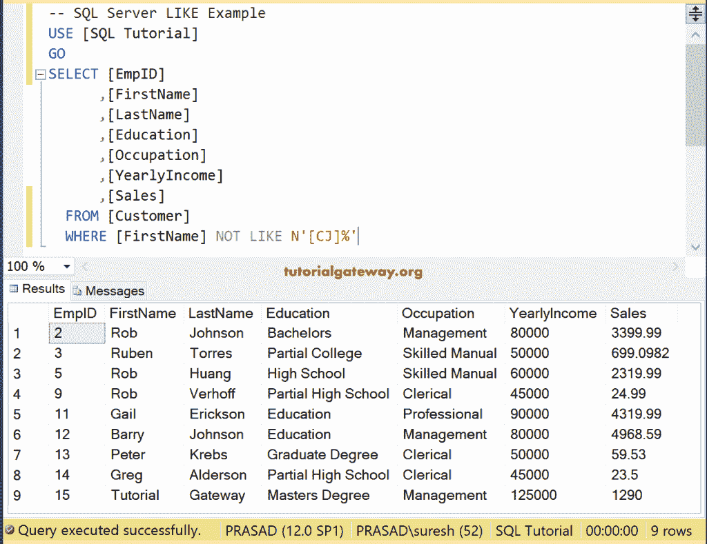

以下查询返回姓氏不以 M 或 z 之间的字母开头的客户表记录

```
SELECT [EmpID]
      ,[FirstName]
      ,[LastName]
      ,[Education]
      ,[Occupation]
      ,[YearlyIncome]
      ,[Sales]
  FROM [Customer]
  WHERE [LastName] NOT LIKE N'[M-Z]%'
```

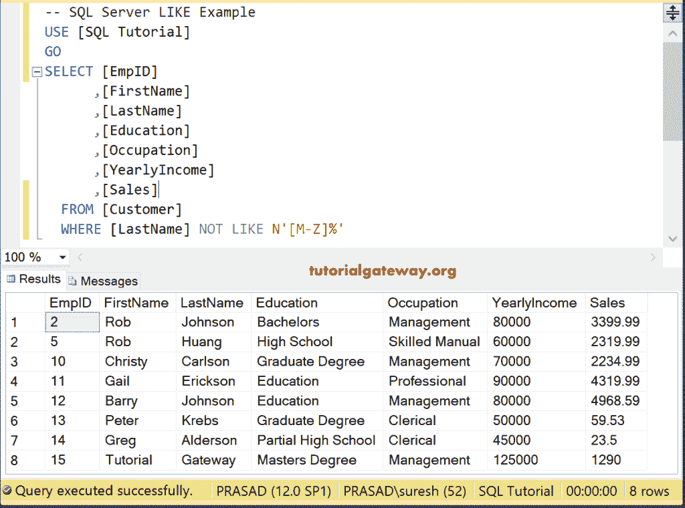

这个 Sql Server 不喜欢语句从客户表中选择第二个名字没有 o 的客户。

```
SELECT [EmpID]
      ,[FirstName]
      ,[LastName]
      ,[Education]
      ,[Occupation]
      ,[YearlyIncome]
      ,[Sales]
  FROM [Customer]
  WHERE [FirstName] NOT LIKE N'_o%'
```

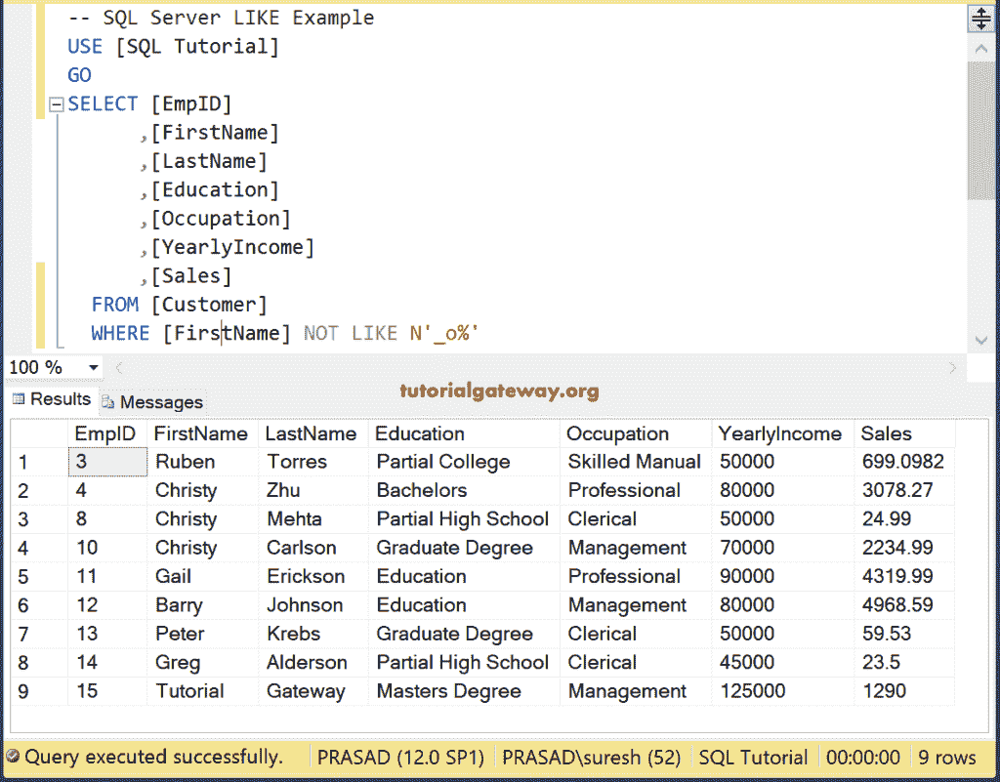

您也可以使用通配符%，_ 作为文字字符。然而，你必须做一些额外的工作来实现这一点。下表将向您展示一些示例。

| 标志 | 输出 |
| ’10[%]’ | 10% |
| [_]n | _n |
| [-abcd]' | -，a，b，c，d |
| '[[]' | [ |
| ']' | ] |
| abc[_]d% ' | abc_d 或 abc_def 等 |