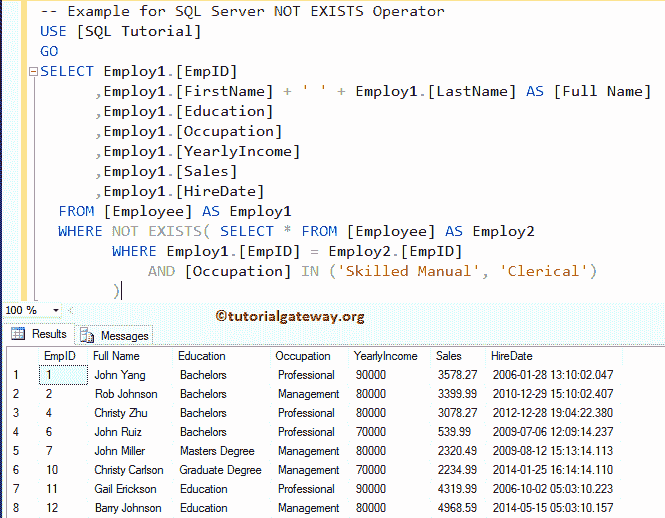

# SQL `NOT EXISTS`运算符

> 原文：<https://www.tutorialgateway.org/sql-not-exists-operator/>

`NOT EXISTS`运算符的作用与“存在”运算符完全相反。它用于限制`SELECT`语句返回的行数。

“不存在于 SQL Server 中”将检查子查询中是否存在行，如果没有行，它将返回“真”，否则返回“假”。或者我们可以简单地说，SQL Server Not Exists 运算符返回的结果将与子查询返回的结果完全相反。

在进入这个示例之前，我建议您参考 [SQL 子查询](https://www.tutorialgateway.org/sql-subquery/)一文来了解子查询设计和查询解析。

## SQL 不存在语法

在 [SQL Server](https://www.tutorialgateway.org/sql/) 中不存在的基本语法可以写成:

```
SELECT [Column Names]
FROM [Source]
WHERE NOT EXISTS (Write Subquery to Check)

```

*   列:它允许我们从表中选择列数。它可能是一个或多个。
*   来源:数据库中存在一个或多个表。 [SQL JOINS](https://www.tutorialgateway.org/sql-inner-join/) 用于连接多个表。
*   子查询:这里我们必须提供子查询。如果子查询返回 true，则它将返回记录，否则它不返回任何记录。

在本文中，我们将通过示例向您展示如何使用 SQL Server NOT EXISTS 运算符。为此，我们将使用下图所示的数据


## SQL 不存在示例 1

以下查询将查找“雇员”表中[销售额]小于 1000 的所有雇员

```
-- SQL Server NOT EXISTS Example
USE [SQL Tutorial]
GO
SELECT Employ1.[EmpID]
      ,Employ1.[FirstName] + ' ' + Employ1.[LastName] AS [Full Name]
      ,Employ1.[Education]
      ,Employ1.[Occupation]
      ,Employ1.[YearlyIncome]
      ,Employ1.[Sales]
      ,Employ1.[HireDate]
  FROM [Employee] AS Employ1
  WHERE NOT EXISTS( SELECT * FROM [Employee] AS Employ2 
		    WHERE Employ1.[EmpID] = Employ2.[EmpID] 
			 AND [Sales] > 1000
		  )
```

输出


让我将“不存在”条件更改为 Sales < 10000，这意味着子查询将返回所有可用的行。NOT EXISTS 将返回零个记录，因为它将返回子查询的完全相反的结果。

```
-- SQL Server NOT EXISTS Example
USE [SQL Tutorial]
GO
SELECT Employ1.[EmpID]
      ,Employ1.[FirstName] + ' ' + Employ1.[LastName] AS [Full Name]
      ,Employ1.[Education]
      ,Employ1.[Occupation]
      ,Employ1.[YearlyIncome]
      ,Employ1.[Sales]
      ,Employ1.[HireDate]
  FROM [Employee] AS Employ1
  WHERE NOT EXISTS( SELECT * FROM [Employee] AS Employ2 
		    WHERE Employ1.[EmpID] = Employ2.[EmpID] 
			 AND [Sales] < 10000
		  )
```

输出


如您所见，查询返回空记录，因为子查询返回真，不存在将返回假。为了更好地理解，让我们再给你看一个例子。

让我把条件改成 Sales > 10000，这是个假条件。因此，SQL NOT EXISTS 运算符将返回所有记录。

```
-- SQL Server NOT EXISTS Example
USE [SQL Tutorial]
GO
SELECT Employ1.[EmpID]
      ,Employ1.[FirstName] + ' ' + Employ1.[LastName] AS [Full Name]
      ,Employ1.[Education]
      ,Employ1.[Occupation]
      ,Employ1.[YearlyIncome]
      ,Employ1.[Sales]
      ,Employ1.[HireDate]
  FROM [Employee] AS Employ1
  WHERE NOT EXISTS( SELECT * FROM [Employee] AS Employ2 
		    WHERE Employ1.[EmpID] = Employ2.[EmpID] 
			 AND [Sales] > 10000
		  )
```

输出


从上面的截图可以看出，它正在返回所有的行。因为子查询返回假，这意味着不存在的 Sql Server 将返回真

## SQL 不存在示例 2

下面的“不存在的 SQL Server”查询将找到其职业既不是熟练手工也不是文员的员工。这里我们将使用[子查询](https://www.tutorialgateway.org/sql-subquery/)中的 [SQL `IN`运算符](https://www.tutorialgateway.org/sql-in-operator/)

```
-- Example for SQL Server NOT EXISTS Operator
USE [SQL Tutorial]
GO
SELECT Employ1.[EmpID]
      ,Employ1.[FirstName] + ' ' + Employ1.[LastName] AS [Full Name]
      ,Employ1.[Education]
      ,Employ1.[Occupation]
      ,Employ1.[YearlyIncome]
      ,Employ1.[Sales]
      ,Employ1.[HireDate]
  FROM [Employee] AS Employ1
  WHERE NOT EXISTS( SELECT * FROM [Employee] AS Employ2 
		    WHERE Employ1.[EmpID] = Employ2.[EmpID] 
			AND [Occupation] IN ('Skilled Manual', 'Clerical')
		   )
```

输出



感谢您访问我们的博客