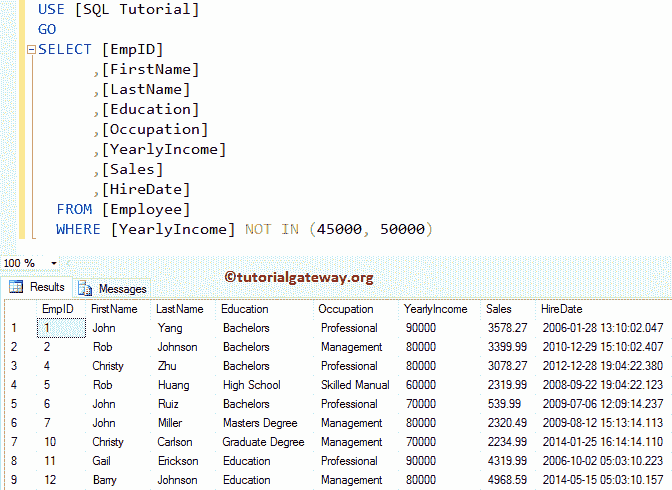
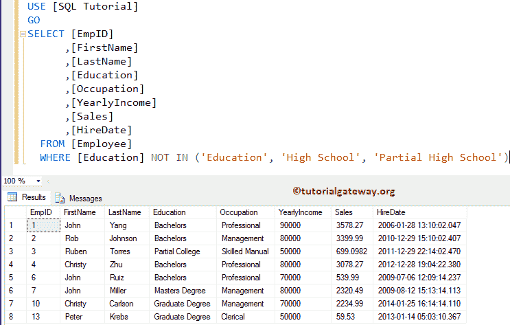
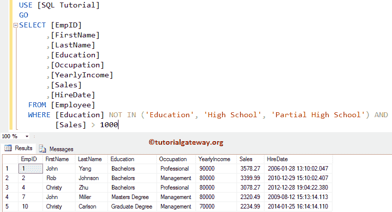

# 不在运算符中的 SQL

> 原文：<https://www.tutorialgateway.org/sql-not-in-operator/>

“不输入”运算符的作用与“输入”相反。NOT IN 运算符用于限制`SELECT`语句返回的记录(或行)数量。

SQL Server 中的非输入运算符根据值检查给定的表达式或列名。如果匹配，`SELECT`语句将不返回该记录

## 不在运算符语法中的 SQL

“服务器不在”运算符的基本语法是:

```
SELECT [Column Names]
FROM [Source]
WHERE [Column Name] NOT IN (Value1, Value2, ...., ValueN)
```

值:在这里，我们必须提供要对照列名进行检查的值或表达式。如果列名与任何值匹配，则不会显示该记录。在 SQL Server 演示中，我们将使用下面显示的数据


## 不在运算符示例中的 SQL

下面的“不在”查询将查找“雇员”表中所有[年收入]既不是 45000 也不是 50000 的雇员

```
SELECT [EmpID]
      ,[FirstName]
      ,[LastName]
      ,[Education]
      ,[Occupation]
      ,[YearlyIncome]
      ,[Sales]
      ,[HireDate]
  FROM [Employee]
  WHERE [YearlyIncome] NOT IN (45000, 50000)
```

提示:如果要根据多个值检查表达式，请在查询时使用[。](https://www.tutorialgateway.org/sql-in-operator/)

[](https://www.tutorialgateway.org/sql-in-operator/)

## 操作员示例 2 中没有

为了更好的理解，让我们再给你看一个 [SQL Server](https://www.tutorialgateway.org/sql/) 的例子。以下 SQL NOT IN 查询将在“员工”表中找到所有教育程度不等于“教育程度”、“高中”或“部分高中”的员工。

```
SELECT [EmpID]
      ,[FirstName]
      ,[LastName]
      ,[Education]
      ,[Occupation]
      ,[YearlyIncome]
      ,[Sales]
      ,[HireDate]
  FROM [Employee]
  WHERE [Education] NOT IN ('Education', 'High School', 'Partial High School')
```



## 不在运算符中的 SQL 示例 3

也可以在单个 [WHERE 子句](https://www.tutorialgateway.org/sql-where-clause/)中使用多个运算符。在本例中，我们将在单个 [`SELECT`语句](https://www.tutorialgateway.org/sql-select-statement/)中使用 NOT IN 和[以及](https://www.tutorialgateway.org/sql-and-or-operators/)(逻辑)。

以下查询查找教育程度不等于教育程度、高中或部分高中的员工，他们的[销售额]应该大于 1000

```
SELECT [EmpID]
      ,[FirstName]
      ,[LastName]
      ,[Education]
      ,[Occupation]
      ,[YearlyIncome]
      ,[Sales]
      ,[HireDate]
  FROM [Employee]
  WHERE [Education] NOT IN ('Education', 'High School', 'Partial High School') AND
	[Sales] > 1000
```

