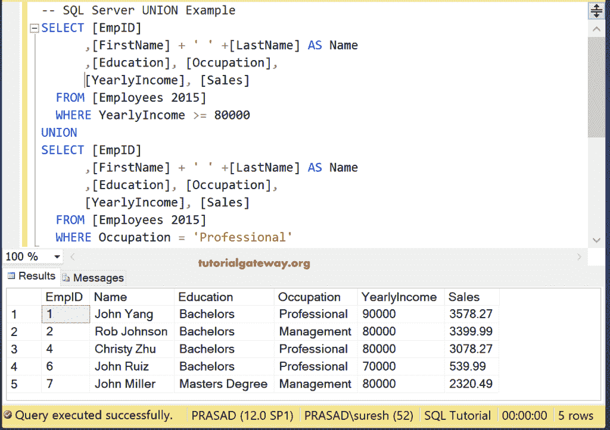

# SQL UNION 查询

> 原文：<https://www.tutorialgateway.org/sql-union-query/>

SQL Union 运算符用于将两个或多个`SELECT`语句的结果集组合成一个结果集。SQL Server 中的 Union 运算符将通过删除重复的行来从所有查询中选择所有不同的记录。以下是 SQL Server 联合运算符的基本规则:

1.  所有查询中的列数必须相同。
2.  列数据类型应该相互兼容。
3.  所有查询中的列顺序必须相同。

## SQL 联合语法

SQL Server 联合运算符背后的语法是

```
SELECT Column_Name1, Column_Name2 ......., Column_NameN FROM Table1
UNION
SELECT Column_Name1, Column_Name2 ......., Column_NameN FROM Table2
```

对于这个 SQL Union 查询示例，我们使用了 SQL Server 数据库中的两个表(雇员 2015 和雇员 2016)。


[Employees 2016]表的最终结果集有四条记录。请记住，所有这些记录都是不同的


## SQL 联合单列示例

如何使用联合从不同的表中选择(或组合)列。以下 SQL 联合查询将结合来自员工 2015 和员工 2016 的 EmpID 的结果集，并显示结果

```
SELECT [EmpID] FROM [Employees 2015]
UNION
SELECT [EmpID] FROM [Employees 2016]
```


### 组合不同的表格示例

在这个联合运算符示例中，我们合并了这两个表中的教育列。

```
SELECT [Education] FROM [Employees 2015]
UNION
SELECT [Education] FROM [Employees 2016]
```


## SQL 联合多列示例

在本例中，我们使用这个 SQL Server 联合来组合多个列。以下 [SQL Server](https://www.tutorialgateway.org/sql/) 查询将员工 2015 的结果集、员工 2016 的结果集进行合并，并显示结果

```
SELECT [EmpID], [FirstName], [LastName]
      ,[Education], [Occupation]
      ,[YearlyIncome], [Sales]
  FROM [Employees 2015]
UNION
SELECT [EmpID], [FirstName], [LastName]
      ,[Education], [Occupation]
      ,[YearlyIncome], [Sales]
  FROM [Employees 2016]
```


## SQL 联合排序依据子句示例

在 SQL Server 中，您可以将 Order By 子句与此 UNION 运算符一起使用。这里， [Order By 子句](https://www.tutorialgateway.org/sql-order-by-clause/)将根据年收入对这些查询结果进行降序排序。

```
SELECT [EmpID], [FirstName], [LastName]
      ,[Education], [Occupation]
      ,[YearlyIncome], [Sales]
  FROM [Employees 2015]
UNION
SELECT [EmpID], [FirstName], [LastName]
      ,[Education], [Occupation]
      ,[YearlyIncome], [Sales]
  FROM [Employees 2016]
  ORDER BY YearlyIncome DESC
```


## SQL 联合 Where 子句示例

如何将 SQL Server UNION 运算符与 [where 子句](https://www.tutorialgateway.org/sql-where-clause/)一起使用？在本例中，我们将两种说法结合起来:

*   第一个结果集选择年收入大于或等于 70000 的“员工 2015”中的所有行
*   第二个结果集[从年收入低于 7 万的员工 2016 中选择](https://www.tutorialgateway.org/sql-select-statement/)条记录

```
SELECT [EmpID]
      ,[FirstName] + ' ' +[LastName] AS Name
	  ,[Education], [Occupation]
      ,[YearlyIncome], [Sales]
  FROM [Employees 2015]
  WHERE YearlyIncome >= 70000
UNION
SELECT [EmpID]
      ,[FirstName] + ' ' +[LastName] AS Name
	  ,[Education], [Occupation]
      ,[YearlyIncome], [Sales]
  FROM [Employees 2016]
  WHERE YearlyIncome < 70000
  ORDER BY YearlyIncome DESC
```


该查询返回 2015 年表中职业为专业或管理的所有记录。此外，还会返回 2016 年从事文员工作的记录

```
SELECT [EmpID]
      ,[FirstName] + ' ' +[LastName] AS Name
	  ,[Education], [Occupation]
      ,[YearlyIncome], [Sales]
  FROM [Employees 2015]
  WHERE Occupation = 'Professional' OR
		Occupation = 'Management'
UNION
SELECT [EmpID]
      ,[FirstName] + ' ' +[LastName] AS Name
	  ,[Education], [Occupation]
      ,[YearlyIncome], [Sales]
  FROM [Employees 2016]
  WHERE Occupation = 'Clerical'
  ORDER BY Occupation DESC
```


### SQL 联合 Where 第 3 条

您也可以在 Where 子句中使用不同的列。这里，第一个查询返回年收入大于或等于 70000 的记录。第二个查询返回职业为专业或管理的员工。

```
SELECT [EmpID]
      ,[FirstName] + ' ' +[LastName] AS Name
	  ,[Education], [Occupation]
      ,[YearlyIncome], [Sales]
  FROM [Employees 2015]
  WHERE YearlyIncome >= 70000
UNION
SELECT [EmpID]
      ,[FirstName] + ' ' +[LastName] AS Name
	  ,[Education], [Occupation]
      ,[YearlyIncome], [Sales]
  FROM [Employees 2016]
  WHERE Occupation = 'Professional' OR
		Occupation = 'Management'
  ORDER BY Occupation DESC
```


## 不同的列

SQL Server 还允许您使用不同表中的不同列名。只要它们是相同的数据类型，就不会有问题。请记住，结果将采用第一个查询列名。但是，您可以在这两个语句中使用 [ALIAS 列](https://www.tutorialgateway.org/sql-alias/)来添加您的列名。

下面的 SQL 查询将结合 2015 年的教育结果和 2016 年的职业列。

```
SELECT [EmpID]
      ,[FirstName] + ' ' +[LastName] AS Name
	  ,[Education], [YearlyIncome], [Sales]
  FROM [Employees 2015]
UNION
SELECT [EmpID]
      ,[FirstName] + ' ' +[LastName] AS Name
	  ,[Occupation], [YearlyIncome], [Sales]
  FROM [Employees 2016]
```


## 具有相同表的 SQL 联合

您始终可以使用 Union 运算符自联接或自组合表。在下面的查询中

*   第一个查询返回所有收入大于或等于 80000 的员工
*   第二个查询选择职业是专业的员工

```
SELECT [EmpID]
      ,[FirstName] + ' ' +[LastName] AS Name
	  ,[Education], [Occupation],
	  [YearlyIncome], [Sales]
  FROM [Employees 2015]
  WHERE YearlyIncome >= 80000
UNION
SELECT [EmpID]
      ,[FirstName] + ' ' +[LastName] AS Name
	  ,[Education], [Occupation], 
	  [YearlyIncome], [Sales]
  FROM [Employees 2015]
  WHERE Occupation = 'Professional'
```



## 不同列数的 SQL 联合

此示例演示了编写此运算符时遇到的常见错误。让我们看看当我们对不等长的列执行这个操作时会发生什么。

在这里，我们从“2016 年员工”表中选择“职业”作为额外列

```
SELECT [EmpID]
      ,[FirstName] + ' ' +[LastName] AS Name
	  ,[Education], 
	  [YearlyIncome], [Sales]
  FROM [Employees 2015]
UNION
SELECT [EmpID]
      ,[FirstName] + ' ' +[LastName] AS Name
	  ,[Education], [Occupation], -- Extra
	  [YearlyIncome], [Sales]
  FROM [Employees 2016]
```

```
Messages
--------
Msg 205, Level 16, State 1, Line 2
All queries combined using aUNION, INTERSECT or EXCEPT operator 
must have an equal number of expressions in their target lists.
```

希望你能看懂留言。现在，让我们将查询更改为选择相等数量的列


从上面的截图来看，它正在返回 14 条记录，因为在 Employees 2016 中有重复的记录。我们的操作员只选择不同的记录。

## SQL 联合选择进入语句

您也可以在[选择进入语句](https://www.tutorialgateway.org/sql-select-into-statement/)中使用它。以下查询选择结果并将其插入到重复 Emp 表中。

```
SELECT [EmpID]
      ,[FirstName] + ' ' +[LastName] AS Name
	  ,[Education], 
	  [YearlyIncome], [Sales]
  INTO [SQL Tutorial].[dbo].[DuplicateEmp]
  FROM [Employees 2015]
UNION
SELECT [EmpID]
      ,[FirstName] + ' ' +[LastName] AS Name
	  ,[Education], 
	  [YearlyIncome], [Sales]
  FROM [Employees 2016]
  WHERE Occupation = 'Professional'
```

```
Messages
--------
(14 row(s) affected)
```

让我向您展示我们插入到复制 Emp 表


中的数据