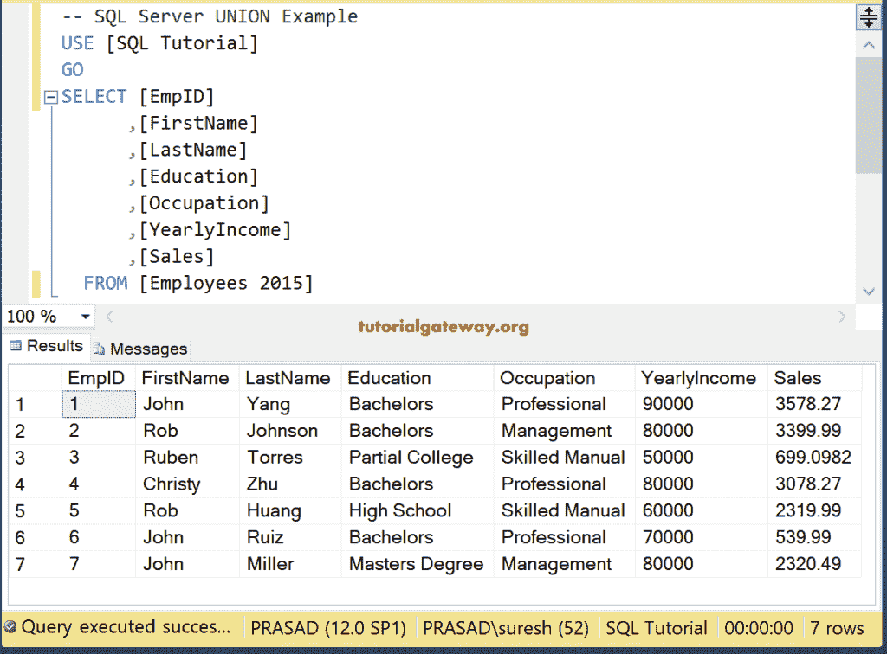

# SQL 联合所有

> 原文:[https://www.tutorialgateway.org/sql-union-all/](https://www.tutorialgateway.org/sql-union-all/)

SQL UNION ALL 用于组合两个或多个 SELECT 语句，并返回一个结果集。Sql Server 中的联合所有将从所有查询中选择所有记录(包括重复记录)。SQL Server 中联合所有背后的语法是

```
SELECT Column1, Column2 ......., ColumnN FROM Table1
UNION ALL
SELECT Column1, Column2 ......., ColumnN FROM Table2
```

在 SQL Server 中使用此联合所有的基本规则是:

1.  所有查询中的列数及其顺序必须相同。
2.  列数据类型应该相互兼容。

在这个 SQL 联合所有运算符查询演示中，我们使用了我们的[SQL 教程]数据库中的两个表(雇佣和员工 2015)。《用人表》有十条记录


而【员工 2015】表有六条记录。请注意，只有两个不同的记录((2，SQL，Server)和(2，Rob，Johnson))，其余的记录是相同的。



## SQL 联合所有示例

以下 SQL 查询将返回“雇员”表、“雇员 2015”表中的所有记录(包括重复记录)，并显示结果

```
SELECT [ID]
      ,[FirstName]
      ,[LastName]
      ,[Occupation]
      ,[YearlyIncome]
      ,[Sales]
FROM [Employ]
UNION ALL
SELECT [ID]
      ,[FirstName]
      ,[LastName]
      ,[Occupation]
      ,[YearlyIncome]
      ,[Sales]
FROM [Employees 2015]
```


## 《一直在哪里》中的 SQL 联合

如何将联合所有运算符与 [where 子句](https://www.tutorialgateway.org/sql-where-clause/)和 [ORDER BY 子句](https://www.tutorialgateway.org/sql-order-by-clause/)一起使用？。在这个例子中，我们结合了两个[选择](https://www.tutorialgateway.org/sql-select-statement/)语句:

*   第一个 [SQL Server](https://www.tutorialgateway.org/sql/) 结果集–它将从 Employ 中选择销售额大于 500 的所有记录
*   第二个结果集–它将选择年收入大于或等于 70000 英镑的 2015 年员工记录
*   该操作符将从第一个结果集和第二个结果集中选择所有记录(包括重复记录)。

```
SELECT [ID]
      ,[FirstName]
      ,[LastName]
      ,[Occupation]
      ,[YearlyIncome]
      ,[Sales]
FROM [Employ]
WHERE [Sales] > 500
  UNION ALL
SELECT [ID]
      ,[FirstName]
      ,[LastName]
      ,[Occupation]
      ,[YearlyIncome]
      ,[Sales]
FROM [Employees 2015]
WHERE [YearlyIncome] >= 70000
ORDER BY [ID]
```


## SQL 联合所有错误

下面的查询将显示我们在使用 SQL Union All 运算符时遇到的常见错误。为此，我们使用了我们的[SQL 教程]数据库中提供的两个表(雇员和雇员 2015)。从下面的截图中，可以观察到[Employee]表有 7 列 14 行。


让我们看看当我们对不等长的列使用 Sql Server UnionAll 运算符时会发生什么。

```
SELECT [FirstName]
      ,[LastName]
      ,[Education]
      ,[Occupation]
      ,[YearlyIncome]
      ,[Sales]
      ,[HireDate]
  FROM [Employee]
UNION 
SELECT [FirstName]
      ,[LastName]
      ,[Occupation]
      ,[YearlyIncome]
      ,[Sales]
  FROM [Employees 2015]
```


希望你能看懂上面的留言。使用这些运算符组合的所有查询在其目标列表中必须具有相同数量的表达式。现在，让我们更改查询以选择相等数量的列

```
SELECT [FirstName]
      ,[LastName]
      ,[Occupation]
      ,[YearlyIncome], [Sales]
FROM [Employee]
  UNION ALL
SELECT [FirstName]
      ,[LastName]
      ,[Occupation]
      ,[YearlyIncome], [Sales]
FROM [Employees 2015]
ORDER BY [YearlyIncome] DESC
```

Union all 查询正在返回 20 条记录，即雇员表中的 14 条记录+雇员 2015 表中的 6 条记录。

