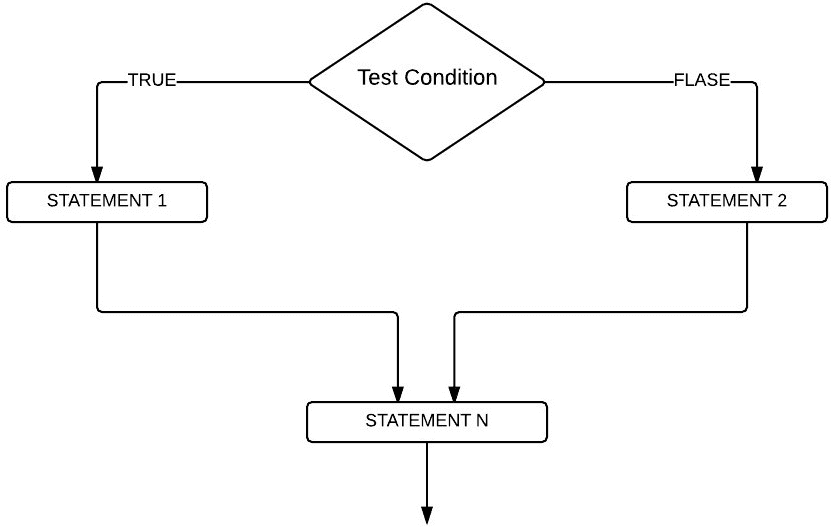

# SQL `IF ELSE`

> 原文：<https://www.tutorialgateway.org/sql-if-else/>

SQL `if-else`语句是最有用的决策查询之一。如果语句将首先测试条件，根据结果，它将执行语句。

如果`if`语句中的测试条件为真，将执行 If 块中的查询。否则，将执行 Else 块中的行。让我们看看 SQL Server If Else 条件的语法:

## 如果是，SQL 语句语法

SQL Server 中“如果没有”的语法是

```
IF (Test condition or Expression)
BEGIN
  -- If the condition is TRUE then these swill be executed
  True statements;
END

ELSE
BEGIN
   -- If the condition is FALSE then these will be executed
   False statements;
END
```

此 Sql Server `if-else`语句接受任何测试条件作为参数。如果上述结构中的测试条件或表达式为真，则执行真语句。如果条件为假，则将运行假语句。

### SQL If Else 流程图

让我们看看 SQL Server `if-else`语句的流程图，以便更好地理解。



如果测试条件为真，则 STATEMENT1 将运行，然后是 STATEMENTN。如果条件为假，则 STATEMENT2 将运行，后面跟着 STATEMENTN。因为它超出了 SQL if else 条件，与 [SQL Server](https://www.tutorialgateway.org/sql/) 条件结果无关。

## SQL If Else 示例 1

在这个 SQL Server `if-else`语句示例中，我们将放置四个不同的打印行。如果条件为真，我们将显示两条不同的消息。如果条件为假，我们将打印另外两条消息。

```
--Declaring Number and Total Variables
DECLARE @Marks INT = 72 ;

IF @marks > = 50
BEGIN
   PRINT ' Congratulations ';
   PRINT ' You pass the Examination ';
END
ELSE
BEGIN
   PRINT ' You Failed ';
   PRINT ' Better Luck Next Time ';
END
```

输出 1:此处标记= 72。这里，条件 72 >= 50 为真。这就是为什么在 SQL `if`语句显示中打印消息输出


输出 2:在这里，我们将标记变量改为 42，条件为假。这就是为什么 Else 块中的消息显示为消息输出

```
 You Failed 
 Better Luck Next Time 
```

## SQL `if-else`语句示例 2

在本程序中，我们将使用`if-else`语句检查员工销售额是否大于或等于 2000。

*   如果 SQL if 子句中的条件为真，我们将显示销售额大于或等于 2000 的员工记录
*   如果条件为假，查询将返回销售额小于 2000 的员工记录

在我们开始编写查询之前，让我们看看这个演示要使用的数据是


让我们看看这个`if-else`语句示例背后的代码

```
--Declaring Number and Total Variables
DECLARE @Sales INT = 2500 ;

IF @Sales > = 2000
BEGIN
  SELECT [FirstName],[LastName]
      ,[Education],[Occupation]
      ,[YearlyIncome],[Sales],[HireDate]
  FROM [Employee]
  WHERE [Sales] >= 2000
  ORDER BY [Sales] ASC
END

ELSE
BEGIN
SELECT [FirstName],[LastName]
      ,[Education],[Occupation]
      ,[YearlyIncome],[Sales],[HireDate]
  FROM [Employee]
  WHERE [Sales] < 2000
  ORDER BY [Sales] ASC
END
```

输出 1:在这里，我们将销售额指定为 500。该语句中的表达式为 500 >= 2000，为假。这就是为什么 Output 显示 14 条记录中有 6 条的销售额低于 2000 英镑


在这里，我们将销售变量更改为 2500。表达式 2500 >= 2000 为真。这就是为什么 Output 显示 14 条记录中有 8 条记录的销售额大于或等于 2000

