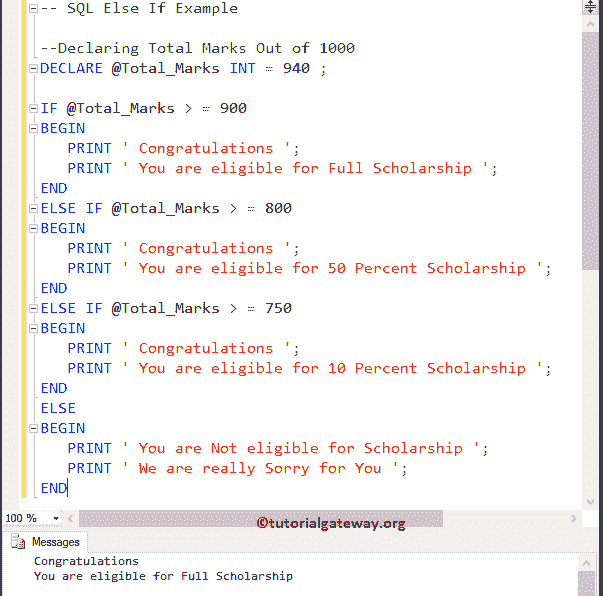
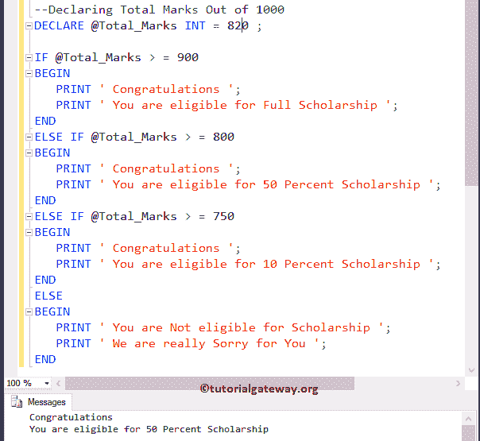
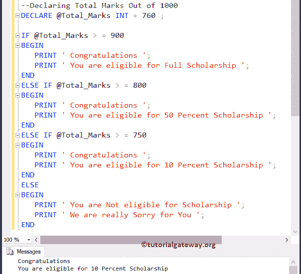
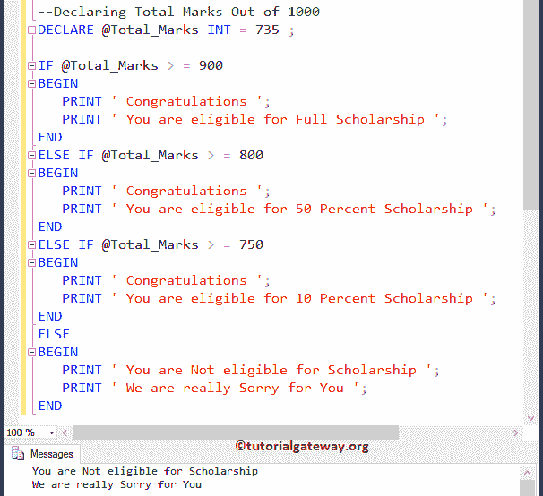

# SQL 否则如果

> 原文：<https://www.tutorialgateway.org/sql-else-if/>

SQL`else if`语句对于同时检查多个条件非常有用。SQL`else if`语句是 If then Else(我们在前面的文章中讨论过)的扩展。

`if-else`语句仅在给定条件为真或假时执行语句。但是在现实世界中，我们可能要检查两个以上的条件。在这些情况下，我们可以使用 SQL`else if`语句。让我们看看 SQL Server`else if`语句的语法:

## 如果语法

在 SQL Server 中，否则如果的语法是

```
IF (Expression 1)
BEGIN
   Statement 1;
END

ELSE IF (Expression 2)
BEGIN
   Statement 2;
END
..........
ELSE 
BEGIN
   Default Statement;
END
```

SQL Server`else if`语句通过顺序执行多个语句来有效地处理它们。它将检查第一个条件。如果条件为真，那么它将执行该块中的语句。如果条件为假，那么它将检查下一个(否则如果条件)等等。

在 Sql Server Else If 示例中，会有一些条件 1、条件 2 为真的情况，例如:

x = 30，y = 15

条件 1: x > y —真

条件二:x！= y —真

在这些情况下，条件 1 下的语句被执行。因为否则如果条件只有在前一个 if 或`else if`语句失败时才会执行。

### 如果流程图

让我们看看 SQL server`else if`语句的流程图，以便更好地理解。


## 如果示例

在这个程序中，我们将使用 SQL`else if`语句来计算他是否有资格获得奖学金

```
-- SQL Else If Example

--Declaring Total Marks Out of 1000
DECLARE @Total_Marks INT = 940 ;

IF @Total_Marks > = 900
BEGIN
   PRINT ' Congratulations ';
   PRINT ' You are eligible for Full Scholarship ';
END
ELSE IF @Total_Marks > = 800
BEGIN
   PRINT ' Congratulations ';
   PRINT ' You are eligible for 50 Percent Scholarship ';
END
ELSE IF @Total_Marks > = 750
BEGIN
   PRINT ' Congratulations ';
   PRINT ' You are eligible for 10 Percent Scholarship ';
END
ELSE
BEGIN
   PRINT ' You are Not eligible for Scholarship ';
   PRINT ' We are really Sorry for You ';
END
```

输出 1:在这个 SQL Server Else If 演示中，Total_Marks = 940。这意味着第一个 If 条件为真，这就是为什么`if`语句中的语句显示为浏览器输出



输出 2:让我们将 Total_Marks 从 940 更改为 820，以显示 SQL`else if`语句示例。这里，第一个 IF 条件失败，它将检查其他 if (@Total_Marks >= 800)，这是真的。所以它将显示这个块中的语句。虽然如果(@Total_Marks >= 750)条件为真，但它不会检查该条件。



输出 3:让我们将总标记从 820 更改为 760，这意味着第一个 IF 条件和否则 IF(@总标记> = 800)失败。因此，它将检查 else if (@Total_Marks >= 750)，这是真的，因此它将打印该块内的语句。



输出 4:我们将把总分改为 735 分。这意味着所有的如果和否则如果条件失败。因此，它将在 else 块中打印语句。



我建议您参考 [SQL Server](https://www.tutorialgateway.org/sql/) 中的 [If then Else](https://www.tutorialgateway.org/sql-if-else/) 一文