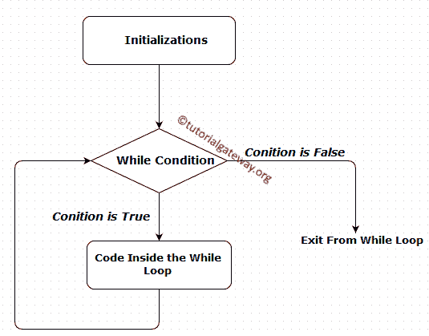
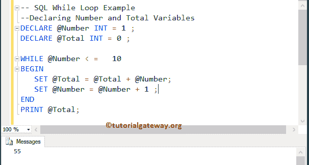

# SQL`while`循环

> 原文：<https://www.tutorialgateway.org/sql-while-loop/>

“SQL`while`循环”用于将一个语句块重复给定的次数，直到给定的条件为假。SQL Server`while`循环从条件开始，如果条件结果为真，那么 BEGIN 中的语句..将执行结束块。否则，它不会执行。它建议 SQL Server`while`循环可以执行零次或更多次

## SQL`while`循环语法

SQL Server 中的`while`循环语法如下:

```
While Expression
  BEGIN
       statement 1
        statement 2
    ………….
  END
-- This is the statement Outside the While Loop
```

首先，测试了 SQL Server`while`循环内部的条件。如果条件为真，则开始中的 SQL 语句或查询..将执行结束块。如果条件为假，它将跳过 BEGIN..END 阻塞并执行它之外的其他语句。

### SQL 边循环边流程图

下面的流程图将向您直观而完美地解释 SQL Server`while`循环



SQL Server 中的`while`循环将在循环开始时检查条件。

1.  如果条件为真，则在 BEGIN 中执行代码..END 语句。
2.  在`while`循环中，我们必须使用 [SQL 算术运算符](https://www.tutorialgateway.org/sql-arithmetic-operators/)来增加和减少值。
3.  值增加后，再次 [SQL Server](https://www.tutorialgateway.org/sql/) 检查条件。只要条件为真，它就继续这个过程。
4.  如果条件为假，从开始退出..结束区块。

为了更好地理解，让我们看看`while`循环的例子

## SQL`while`循环示例

在这个例子中，我们声明了两个整数值。接下来，我们使用`while`循环将 1 到 10 的数字相加。

```
--Declaring Number and Total Variables
DECLARE @Number INT = 1 ;
DECLARE @Total INT = 0 ;

WHILE @Number < =   10
BEGIN
   SET @Total = @Total + @Number;
   SET @Number = @Number + 1 ;
END
PRINT @Total;
```

总计= 1+2+3+4+5+6+7+8+9+10 = 55



在这个 Sql`while`循环查询中，首先，我们创建了两个名为 Number，Total 的变量，并使用以下语句将它们初始化为 1，0

```
DECLARE @Number INT = 1 ;
DECLARE @Total INT = 0 ;
```

在下一行中，我们使用了 while 条件。如果条件结果为真，则将数字加到总数中，否则它将退出迭代。我们还将数字值设置为递增(@Number = @Number + 1)。递增后，将重复该过程，直到条件结果为假(即@Number = 11)。

```
WHILE @Number < =   10
BEGIN
   SET @Total = @Total + @Number;
   SET @Number = @Number + 1 ;
END
```

在下一行中，我们在 SQL`while`循环之外使用了 print 语句。当 while 条件为真或假时，将执行此语句

```
PRINT @Total;
```

## SQL Server 中的无限循环

如果忘记递增(SET @Number = @Number + 1)或递减该值，SQL`while`循环将执行无数次，也称为无限循环。例如:

```
-- Infinite While Loop Example
--Declaring Number and Total Variables
DECLARE @Number INT = 1 ;

WHILE @Number < =   10
BEGIN
   PRINT @Number;
   -- SET @Number = @Number + 1 ;
END
```

输出

```
Messages
-------
1
1
1
1
1
1
1
.
.
.
```

这里的 Number 一直是 1，而且总是小于 10。所以`while`循环中的 PRINT 语句将继续执行无数次。现在，让我们从下面的语句中删除注释

```
-- SET @Number = @Number + 1 ;
```

现在，当它达到 10 时，条件将失效。让我们看看输出

```
1
2
3
4
5
6
7
8
9
10
```

提示:请参考[嵌套](https://www.tutorialgateway.org/nested-sql-while-loop/)文章，了解嵌套循环的功能。