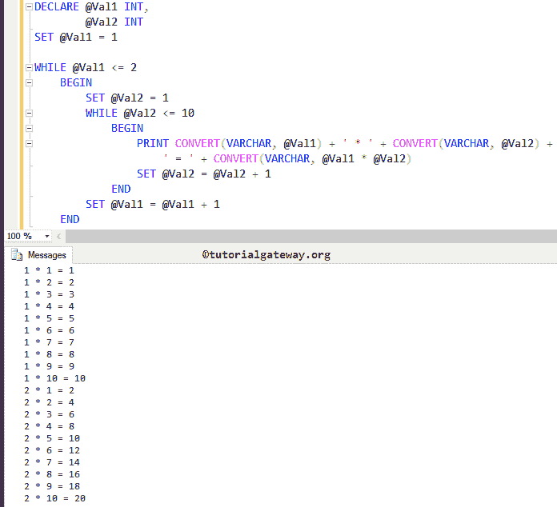

# 嵌套的 SQL`while`循环

> 原文：<https://www.tutorialgateway.org/nested-sql-while-loop/>

嵌套的 SQL`while`循环只不过是将`while`循环放在另一个`while`循环中。当您处理多层数据时，嵌套循环非常有用。因为当我们想要选择分层数据时，我们必须使用这个 SQL 嵌套`while`循环来提取分层数据。但是使用时请小心。

## 嵌套的 SQL`while`循环语法

SQL Server 中嵌套`while`循环的语法是

```
WHILE Expression
	BEGIN
		WHILE @Val2 <= 10
			BEGIN
				-- Second While Loop Statements
				Statement 1
				Statement 2
				...........
				Statement N
			END
		-- Below Statements are Outside the Second While Loop
		-- First While Loop Statements
		Statement 1
		Statement 2
		...........
		Statement N
	END
-- This Statement is Outside the First While Loop
```

如果您观察上面的嵌套 SQL`while`循环语法，我们将`while`循环放在另一个`while`循环中。我们在上一篇文章中已经解释了`while`循环语法。所以，请参考 [SQL While Loop](https://www.tutorialgateway.org/sql-while-loop/) 一文。

第一步:首先，它检查第一个`while`循环中的条件。

*   如果表达式结果为真，将执行`while`循环中的开始和结束代码块。接下来，它将开始第二个`while`循环。转到步骤 2
*   如果结果为假，它将从`while`循环中退出

步骤 2:它将验证嵌套的 SQL`while`循环(第二个`while`循环)中的条件。

*   如果结果为真，将执行第二个`while`循环中的代码开始…结束。这意味着 SQL Server 运行从语句 1 到语句 n 的语句
*   如果为假，则从第二个“同时循环”退出

步骤 3:一旦退出第二个`while`循环，它将检查第一个`while`循环内的条件(重复步骤 1)

## 嵌套的 SQL`while`循环示例

这个 SQL 嵌套`while`循环程序将打印 1 和 2 到 10 的乘法表。

为此，我们将在另一个`while`循环中嵌套一个`while`循环，也称为嵌套 SQL`while`循环。

```
--Nested SQL While Loop Example

DECLARE @Val1 INT,
	@Val2 INT
SET @Val1 = 1

WHILE @Val1 <= 2
	BEGIN
		SET @Val2 = 1
		WHILE @Val2 <= 10
			BEGIN
				PRINT CONVERT(VARCHAR, @Val1) + ' * ' + CONVERT(VARCHAR, @Val2) + 
					' = ' + CONVERT(VARCHAR, @Val1 * @Val2)
				SET @Val2 = @Val2 + 1
			END
		SET @Val1 = @Val1 + 1
	END

```



在这个 SQL 嵌套`while`循环示例中，首先，我们创建了两个名为 Val1、Val2 的变量，然后使用以下语句将@Val1 初始化为 1

```
DECLARE @Val1 INT,
	@Val2 INT
SET @Val1 = 1
```

在下一行中，我们使用了带有表达式的 [SQL Server](https://www.tutorialgateway.org/sql/)`while`循环。如果表达式结果为真，则它将进入嵌套`while`循环。

```
WHILE @Val1 <= 2
BEGIN
	SET @Val2 = 1
	WHILE @Val2 <= 10
		BEGIN
			PRINT CONVERT(VARCHAR, @Val1) + ' * ' + CONVERT(VARCHAR, @Val2) + 
				' = ' + CONVERT(VARCHAR, @Val1 * @Val2)
			SET @Val2 = @Val2 + 1
		END
	SET @Val1 = @Val1 + 1
END
```

从上面的截图可以看出，这个嵌套的 SQL`while`循环查询打印了 1 和 2 的乘法表。

先循环后迭代

在第一个`while`循环中，@Val1 被初始化为 1，然后它将检查@Val1 是否小于或等于 2。该条件(1 <= 2)为真，因此它将进入第二个`while`循环

嵌套的边循环边 SQL 或边循环边第一次迭代

在第二个`while`循环中，@Val2 初始化为 1，并检查@Val2 是否小于或等于 10。这个条件是真的。因此，将执行第二个`while`循环中的语句

```
PRINT CONVERT(VARCHAR, @Val1) + ' * ' + CONVERT(VARCHAR, @Val2) + 
      ' = ' + CONVERT(VARCHAR, @Val1 * @Val2)
```

@Val1 * @Val2 ==> 1 * 1 = 1

接下来，@Val2 值将增加 1 (SET @Val2 = @Val2 + 1)。请参考[算术运算符](https://www.tutorialgateway.org/sql-arithmetic-operators/)一文了解+符号。

第二次循环第二次迭代

这里，@Val2 加 1，所以，@Val2 =2。它将检查@Val2 是否小于或等于 10。该条件(2 <= 10)为真，因此它将在第二个`while`循环中执行语句

@Val1 * @Val2 ==> 1 * 2 = 2
接下来，@Val2 值将增加 1

这个过程将重复进行，直到@Val2 达到 11。一旦 SQL 嵌套`while`循环内的条件失败，编译器将从第二个`while`循环退出，并且@Val1 值将增加 1 (SET @Val1 = @Val1 + 1)。

第一次循环第二次迭代

@Val1 = 2。检查@Val1 是否小于或等于 2。该条件(2 <= 2)为真，因此它进入第二个`while`循环

第二次循环第一次迭代

在第二个`while`循环中，@Val2 被初始化为值 1，并检查@Val2 是否小于或等于 10。这个条件为真，所以它在第二个`while`循环中执行语句

@Val1 * @Val2 ==> 2 * 1 = 2

接下来，@Val2 值将增加 1 (SET @Val2 = @Val2 + 1)。

第二次循环第二次迭代

这里，@Val2 加 1，所以，@Val2 = 2。接下来，它将检查@Val2 是否小于或等于 10。条件(2 <= 10) is True so, it will start executing the statements inside the second While loop
@Val1 * @Val2 == > 2 * 2 = 4
接下来，@Val2 值将增加 1 (SET @Val2 = @Val2 + 1)

这个过程将重复进行，直到@Val2 达到 11。一旦达到 11，第二个`while`循环中的条件(11 <= 10)就会失败。因此，它将退出嵌套的`while`循环，并且@Val1 的值将增加 1 (SET @Val1 = @Val1 + 1)。

第一次循环第三次迭代:

这里，i = 3 表示表达式(@Val1 <= 2)将为 False。所以，当循环终止时。记住，不需要检查第二个循环。