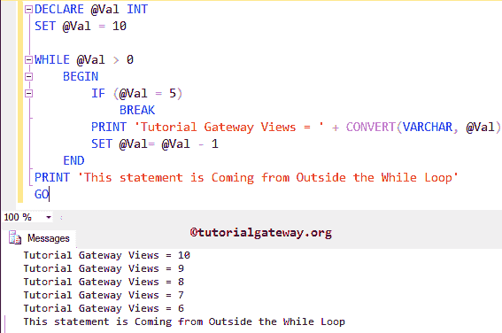

# SQL`break`语句

> 原文：<https://www.tutorialgateway.org/sql-break-statement/>

SQL`break`语句对于退出 SQL`while`循环非常有用。在执行循环时，如果它在`while`循环中找到 SQL Server`break`语句，它将停止运行查询并立即退出循环。

例如，我们在`while`循环中有 100 行，当某个条件为 True 时，我们希望退出循环；否则，它必须执行所有这些命令。在这种情况下，我们可以使用 SQL IF ELSE 或 SQL ELSE IF 来检查条件，并将 SQL`break`语句放在 IF 块中。如果条件为真，它将运行`break`语句，并且 break 将从循环中完全退出控制器。否则，它将执行所有的行。

## SQL 中断语法

SQL Server 中`break`语句的基本语法如下:

```
BREAK;
```

### SQL `break`语句示例

在这个查询中，我们将使用`while`循环中的 SQL`break`语句退出循环迭代。

```
DECLARE @Val INT
SET @Val = 10

WHILE @Val > 0
	BEGIN
		IF (@Val = 5)
			BREAK
		PRINT 'Tutorial Gateway Views = ' + CONVERT(VARCHAR, @Val)
		SET @Val= @Val - 1
	END
PRINT 'This statement is Coming from Outside the While Loop'
GO
```



在这个 SQL`break`语句示例中，首先，我们创建了一个名为@Val 的变量，并使用以下声明将其初始化为 10

```
DECLARE @Val INT
SET @Val = 10
```

在`while`循环中，我们检查@Val 是否大于 0。建议大家参考 [SQL While](https://www.tutorialgateway.org/sql-while-loop/) 文章了解迭代过程。

```
WHILE @Val > 0
```

在`while`循环中，我们放置 [SQL IF ELSE](https://www.tutorialgateway.org/sql-if-else/) 来测试@Val 是否等于 5 (IF (@Val = 5))。如果条件为假，它将跳过`break`语句，并输出以下消息(在我们的例子中是 10、9、8、7、6)。如果也有，请试试[其他。](https://www.tutorialgateway.org/sql-else-if/)

```
PRINT 'Tutorial Gateway Views = ' + CONVERT(VARCHAR, @Val)
```

如果该条件为真，则执行 SQL`break`语句，`while`循环迭代将在该数字(即 5)处停止。以下打印在`while`循环之外，与 While 中的表达式无关。这意味着，无论条件结果如何，该消息都将执行。

下面的 [SQL Server](https://www.tutorialgateway.org/sql/) 语句在`while`循环之外，与`while`循环中的表达式无关。这意味着，无论条件结果如何，该打印消息都将执行。

```
PRINT 'This statement is Coming from Outside the While Loop'
```