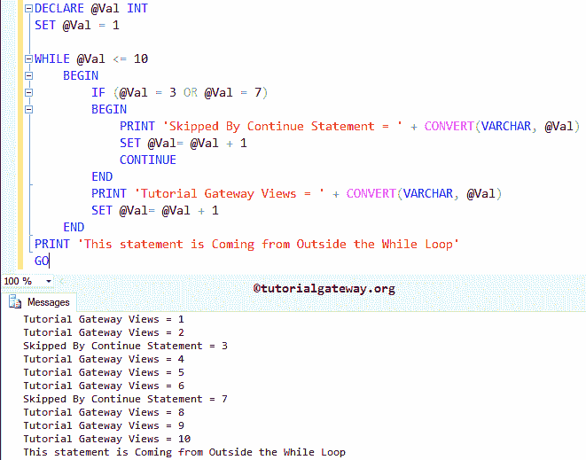

# SQL `continue`语句

> 原文：<https://www.tutorialgateway.org/sql-continue-statement/>

SQL`continue`语句对于控制 SQL`while`循环的流程非常有用。通常，我们在`while`循环中使用这个`continue`语句。如果执行在`while`循环中找到 SQL`continue`语句，它将停止执行当前循环迭代，并从头开始新的迭代。

例如，如果循环中有 15 条语句。当特定条件为真时，我们希望跳过执行少数语句(语句 2-语句 6 和语句 11-语句 14)。否则，它必须运行循环中的所有 15 个语句。在这种情况下，我们可以放置 SQL IF ELSE 或 SQL ELSE IF 来检查条件，并在 IF 块中放置 SQL Server 中的`continue`语句。如果条件为真，将停止执行语句 2 至 6 和 11 至 14；否则，它将运行从 1 到 15 的语句。

## SQL 继续语法

SQL Server `continue`语句的语法是

```
CONTINUE;
```

### SQL`continue`语句示例

在这个查询中，我们将在`while`循环中使用 SQL`continue`语句来控制循环迭代。

```
-- SQL CONTINUE Statement Example
DECLARE @Val INT
SET @Val = 1

WHILE @Val <= 10
	BEGIN
		IF (@Val = 3 OR @Val = 7)
		BEGIN
			PRINT 'Skipped By Continue Statement = ' + CONVERT(VARCHAR, @Val)
			SET @Val= @Val + 1
			CONTINUE
		END
		PRINT 'Tutorial Gateway Views = ' + CONVERT(VARCHAR, @Val)
		SET @Val= @Val + 1
	END
PRINT 'This statement is Coming from Outside the While Loop'
GO
```



在这个 SQL`continue`语句示例中，首先，我们创建了一个名为@Val 的变量，并使用以下语句将其初始化为 10

```
DECLARE @Val INT
SET @Val = 1
```

在`while`循环中，我们检查@Val 是否小于 10。建议大家参考 [SQL While Loop](https://www.tutorialgateway.org/sql-while-loop/) 文章了解迭代过程。

```
WHILE @Val <= 10
```

在`while`循环中，我们放置 [SQL IF ELSE](https://www.tutorialgateway.org/sql-if-else/) 来测试@Val 是否等于 3 或 7 (IF (@Val = 3 或@Val = 7))。如果条件为假，它将跳过 SQL`continue`语句，并返回以下语句作为输出(在我们的例子中是 1、2、4、5、6、8、9、10)。更多条件也可以试试 [SQL ELSE IF](https://www.tutorialgateway.org/sql-else-if/) 。

```
PRINT 'Tutorial Gateway Views = ' + CONVERT(VARCHAR, @Val)
```

如果此条件为真，将执行 SQL`continue`语句。接下来，`while`循环迭代将在该数字(即 3 和 7)处停止，而不打印其他语句。为了更好地理解，我们将下面的 [SQL Server](https://www.tutorialgateway.org/sql/) 语句放在 If 块中。因此，每当迭代中断时，这个值将从这个语句中打印出来。

```
PRINT 'Skipped By Continue Statement = ' + CONVERT(VARCHAR, @Val)
```

以下语句在`while`循环之外，与`while`循环中的表达式无关。这意味着，无论条件结果如何，该语句都将执行。

```
PRINT 'This statement is Coming from Outside the While Loop'
```