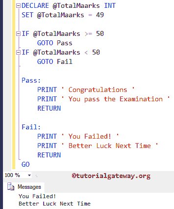
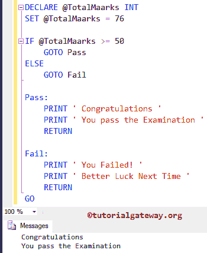

# SQL GOTO 语句

> 原文:[https://www.tutorialgateway.org/sql-goto-statement/](https://www.tutorialgateway.org/sql-goto-statement/)

SQL GOTO 语句用于改变程序的流程。当执行到达 GOTO 语句时，它将无条件地跳转到其中指定的标签。

## SQL 转到语句语法

该语句的语法是

```
GOTO label
........
........

label:
  statements
```

goto 语句后指定的标签是我们放置要执行的代码的位置。

## SQL 转到语句示例

这个程序将使用 Goto 语句检查这个人是通过还是失败。

提示:与[中断](https://www.tutorialgateway.org/sql-break-statement/ "Break Statement in C")和[继续](https://www.tutorialgateway.org/sql-continue-statement/ "Continue Statement in C")不同，Sql Server GOTO 语句不需要任何 [If 条件](https://www.tutorialgateway.org/sql-if-else/ "If Statement in C")来执行。

```
DECLARE @TotalMaarks INT
SET @TotalMaarks = 49

IF @TotalMaarks >= 50
	GOTO Pass
IF @TotalMaarks < 50
	GOTO Fail

Pass:
	PRINT ' Congratulations '
	PRINT ' You pass the Examination '
	RETURN

Fail:
	PRINT ' You Failed! '
	PRINT ' Better Luck Next Time '
	RETURN
GO
```



让我们将@TotalMarks 值替换为 76，并将第二个 If 条件替换为 ELSE 块

```
IF @TotalMaarks >= 50
	GOTO Pass
ELSE
	GOTO Fail

```



在上面的 [SQL Server](https://www.tutorialgateway.org/sql/) 代码中，通过和失败是我们使用的标签。首先，我们声明了整数变量@Totalmarks，并为其赋值 49

```
DECLARE @TotalMaarks INT
SET @TotalMaarks = 49
```

下一行，我们用 [SQL IF ELSE](https://www.tutorialgateway.org/sql-if-else/) 检查@Totalmarks 是否大于等于 50。

```
IF @TotalMaarks >= 50
```

如果上述条件为真，那么 If 块中的 Sql Server Goto 语句将执行到 Pass 标签，并执行 Pass 标签中的打印消息

```
PRINT ' Congratulations '
PRINT ' You pass the Examination '<br>
```

当条件为假时(否则执行块)。这意味着，否则块将执行失败标签，并执行失败标签内的消息

```
PRINT ' You Failed! '
PRINT ' Better Luck Next Time '
```

注意:虽然它支持 GOTO，但是避免使用它或者至少尽量减少使用总是一个好的做法。