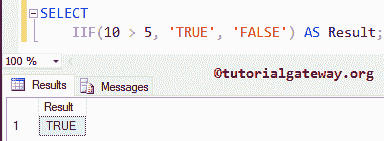
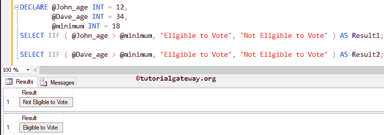
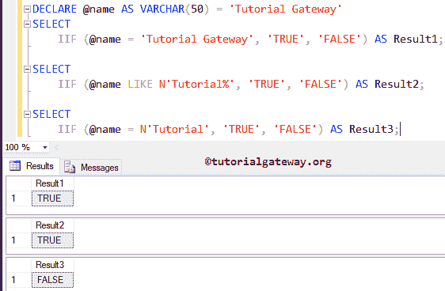
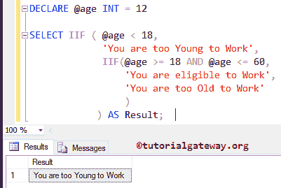
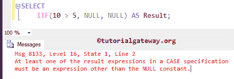
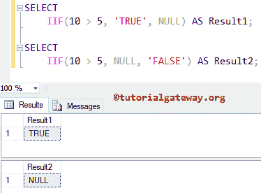

# `IIF()`函数

> 原文：<https://www.tutorialgateway.org/sql-iif-function/>

SQL `IIF()`函数是在 SQL Server 2012 中引入的新的内置逻辑函数。我们可以把 SQL Server IIF 作为写 IF Else 和 CASE 语句的简写方式。

SQL Server `IIF()`函数将接受三个参数。第一个参数是布尔表达式，它返回真或假。如果 IIF 表达式的结果为真，那么结果将返回第二个参数。否则，第三个参数将作为输出返回。让我们看看 SQL Server `IIF()`函数的语法:

## IIF 逻辑函数语法:

SQL Server 中 IIF 的语法如下:

```
IIF(Boolean_Expression, True_Value, Flase_Value)
```

如果给定的布尔表达式(或测试条件)为真，那么它将返回真值。如果为假，则返回假值。

## SQL IIF 比较两个整数

此示例将向您展示 SQL Server 中`IIF()`函数的工作功能

```
SELECT 
	IIF(10 > 5, 'TRUE', 'FALSE') AS Result;
```

从下面的截图中，您可以观察到内部条件(即 10 > 5)为真。因此，第一个语句(或第二个参数)作为输出返回，这就是真



### SQL IIF 比较两个整数变量

在这个例子中，我们将使用`IIF()`函数来确定这个人是否有资格投票。

```
DECLARE @John_age INT = 12,
	@Dave_age INT = 34, 
	@minimum INT = 18  
SELECT IIF( @John_age > @minimum, 'Eligible to Vote', 'Not Eligible to Vote' ) AS Result1;  

SELECT IIF( @Dave_age > @minimum, 'Eligible to Vote', 'Not Eligible to Vote' ) AS Result2;
```

从下面的截图可以观察到，

*   在第一个`SELECT`语句中，其中的条件(即 12 > 18)为假。因此，第二个语句(或第三个参数)作为输出返回
*   在第二个`SELECT`语句中，其中的条件(即 34 > 18)为真。因此，第一条语句(或第二个参数)作为输出返回



## SQL IIF 比较两个字符串

在本例中，我们将使用 SQL Server `IIF()`函数来比较字符串数据。这里，我们在第二个`SELECT`语句中使用了“%”通配符。所以，建议大家参考 [SQL Server](https://www.tutorialgateway.org/sql/) 中 [SQL LIKE](https://www.tutorialgateway.org/sql-like/) 的文章进一步参考。

```
DECLARE @name AS VARCHAR(50) = 'Tutorial Gateway'
SELECT 
	IIF(@name = 'Tutorial Gateway', 'TRUE', 'FALSE') AS Result1;

SELECT 
	IIF(@name LIKE N'Tutorial%', 'TRUE', 'FALSE') AS Result2;

SELECT 
	IIF (@name = N'Tutorial', 'TRUE', 'FALSE') AS Result3;
```



## SQL 嵌套 IIF 示例

在本例中，我们将使用 Sql Server 嵌套`IIF()`函数来查找该人员是否有资格工作。

```
DECLARE @age INT = 12

SELECT IIF( @age < 18, 
	     'You are too Young to Work', 
	      IIF(@age >= 18 AND @age <= 60, 
		  'You are eligible to Work', 
		  'You are too Old to Work'
		  )
	    ) AS Result;
```

1.  首先，我们声明了一个名为@age 的整数变量，并分配了一些值。
2.  在函数中，第一个条件验证年龄是否小于 18 岁。如果该条件为真，那么它将返回逗号后的第一个语句(或第二个参数)，即“你太年轻，不能工作”
3.  当第一个条件失败时，它返回第二个语句(或第三个参数)。通过使用 SQL Server 嵌套 IIF，我们在这里又检查了一个条件(@年龄> = 18 并且@年龄< = 60)。如果该条件为真，则返回逗号后的第一个值，即“您有资格工作”
4.  如果嵌套条件失败，它将执行第三个参数的值，即“你太老了，不能工作”。

输出 1:年龄= 12



年龄= 32 岁

```
Result
-----
You are eligible to Work
```

年龄= 65 岁

```
Result
-----
You are too Old to Work
```

## SQL IIF 使用空值

最好是在处理其中的空值时小心谨慎。下面的一系列例子将帮助你理解后果。

```
SELECT 
	IIF(10 > 5, NULL, NULL) AS Result;
```



从上面的截图中，可以观察到它抛出了一个错误。说明至少一个结果表达式(即布尔表达式之后的第二个或第三个参数)必须是空常量以外的表达式。让我们相应地改变它们，看看

```
SELECT 
	IIF(10 > 5, 'TRUE', NULL) AS Result1;

SELECT 
	IIF(10 > 5, NULL, 'FALSE') AS Result2;
```



### SQL IIF 空值选项 2

我们可以使用参数来克服空常数所产生的错误。

```
DECLARE @a INT = NULL,
        @b INT = NULL

SELECT IIF ( 10 > 5, @a, @b ) AS Result1;
```

```
Result1
-------
NULL
```

## 具有最高优先级的 SQL IIF 数据类型

`IIF()`函数将返回具有最高优先级的数据类型。从下面的示例中，结果将是整数类型的第三个参数(即 100)，但结果显示为 100.00。因为它将返回优先级最高的数据类型。

```
SELECT 
	IIF ( 15 > 50, 12.45, 100 ) AS Result;
```

```
Result
------
100.00
```

请参考 [IF Else](https://www.tutorialgateway.org/sql-if-else/) 和 [CASE Statement](https://www.tutorialgateway.org/sql-case-statement/) 文章。