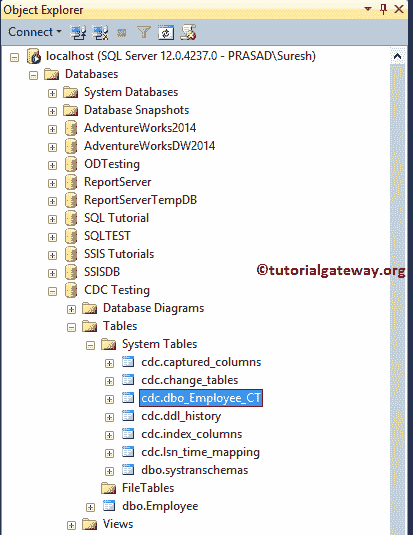
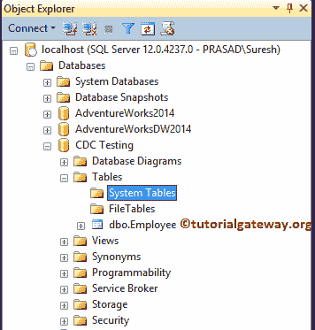

# SQL Server 更改数据捕获

> 原文：<https://www.tutorialgateway.org/sql-server-change-data-capture/>

SQL Server 更改数据捕获，简称为 CDC，用于捕获对 SQL 表所做的更改。例如，如果您想要存储有关更新、插入、删除操作的审计信息，请在该表上启用 SQL CDC。

在本章中，我们将通过示例向您解释如何在单个列上启用 SQL Server CDC、禁用 CDC 和启用 CDC。在这个 SQL Server 变更数据捕获演示中，我们将使用疾控中心测试数据。从下面的截图可以看到，它只有一个表，即 Employee。


下面的截图将向您展示雇员表中的数据。


## 执行 SQL Server 更改数据捕获

实现 SQL Server CDC 或变更数据捕获是一个两步走的方法。首先，您必须在数据库上启用 CDC，然后在表中启用它。

### 在数据库上实现 SQL Server CDC

下面的代码片段将在数据库级别启用 SQL CDC。

```sql
USE [CDC Testing]
GO
EXEC sys.sp_cdc_enable_db
```

```sql
Messages
--------
Command(s) completed successfully.
```

如果您观察下面的截图，启用 SQL 变更数据捕获会在系统表中自动创建六个表。


以及一些在 Sql Server 中实现变更数据捕获的系统存储过程


### 在表上实现 SQL Server CDC

下面的代码片段将在表级别启用 SQL 更改数据捕获。这是雇员表。

```sql
EXEC sys.sp_cdc_enable_table
@source_schema = N'dbo', -- Schema Name. Example, HR, Sales etc
@source_name = N'Employee', -- Table Name
@role_name = NULL -- Any specified roles
GO
```

```sql
Messages
-------
Job 'cdc.CDC Testing_capture' started successfully.
Job 'cdc.CDC Testing_cleanup' started successfully.
```

从上面的 SQL Server 截图中，可以看到我们在 Employee 表上成功实现了 CDC。现在，如果你去数据库。在系统表下，您将找到新表 cdc.dbo.Employee_CT(在您的情况下，Employee 将替换为表名)。

是存储审核信息的表(或捕获表的变化)



让我使用 [`INSERT`语句](https://www.tutorialgateway.org/sql-insert-statement/)在表格中插入一个新行。

```sql
INSERT INTO [dbo].[Employee] (
	[FirstName], [LastName], [Occupation], [YearlyIncome])
VALUES ('Tutorial', 'Gateway', 'Admin', 10000)
```

```sql
Messages
-------
(1 row(s) affected)
```

如果检查 dbo_Employee_CT 表，可以看到工序号为 2(插入)的记录。


接下来，我们将使用[`UPDATE`语句](https://www.tutorialgateway.org/sql-update-statement/)执行更新

```sql
UPDATE [dbo].[Employee]
    SET [FirstName] = 'Dave'
    WHERE [EmpID] = 3
```

```sql
Messages
-------
(1 row(s) affected)
```

让我给你看员工表


如果检查 dbo_Employee_CT 表，可以看到工序号为 3 的旧记录(更新前的值)和工序号为 4 的新记录(已更新)。


最后，我们将使用[`DELETE`语句](https://www.tutorialgateway.org/sql-delete-statement/)执行删除操作

```sql
DELETE FROM [dbo].[Employee]
	WHERE [EmpID] = 4
```

```sql
Messages
-------
(1 row(s) affected)
```

你可以从下面的截图中看到，没有记录用 Emp Id 4


如果检查 dbo_Employee_CT 表，可以看到工序号为 1(已删除)的已删除记录。


## 禁用 SQL Server 更改数据捕获

您必须遵循相同的步骤来禁用 SQL Server 中的 CDC。

### 对表禁用 SQL Server CDC

如果您知道捕获实例(Schema.table_name)，请跳过这一步并应用下一个代码。下面的存储过程将提供关于 SQL 变更数据捕获的信息。

```sql
EXEC sys.sp_cdc_help_change_data_capture 
GO
```


下面的代码片段将在数据库级别禁用 SQL 变更数据捕获。我们需要 capture_instance 来禁用它。

```sql
EXEC sys.sp_cdc_disable_table
@source_schema = N'dbo',
@source_name = N'Employee',
@capture_instance = dbo_Employee
GO
```

```sql
Messages
-------
Command(s) completed successfully.
```

### 在数据库上禁用 SQL Server CDC

在表级别禁用 CDC 后，必须在数据库级别禁用 SQL 更改数据捕获。下面的代码也会这样做。

```sql
EXEC sys.sp_cdc_disable_db
```

```sql
Messages
-------
Command(s) completed successfully.
```

现在可以看到，所有系统生成的(CDC 生成的系统表)都不见了。



## 在多列上启用 SQL Server CDC

[SQL Server](https://www.tutorialgateway.org/sql/) 允许您在单个列上启用 CDC，而不是在整个表上启用变更数据捕获。在本例中，我们将在 Emp ID 和名字列上启用 CDC

```sql
EXEC sys.sp_cdc_enable_table
@source_schema = N'dbo',
@source_name = N'Employee',
@role_name = NULL,
@captured_column_list = '[EmpID], [FirstName]'
GO
```

```sql
Messages
-------
Job 'cdc.CDC Testing_capture' started successfully.
Job 'cdc.CDC Testing_cleanup' started successfully.
```

让我在雇员表中插入一条新记录。

```sql
INSERT INTO [dbo].[Employee] (
	[FirstName], [LastName], [Occupation], [YearlyIncome])
VALUES ('SQL', 'Server', 'Tutorial', 20000)
```

```sql
Messages
--------
(1 row(s) affected)
```

从下面的截图中可以看到，我们为名字、姓氏、职业和年收入插入了一个新记录。但是，它只捕获关于 Emp Id 和名字的信息。


在我们结束这篇 SQL Server 变更数据捕获文章之前，让我向您展示捕获列中的数据。如您所见，它存储了 SQL Server 变更数据捕获所捕获的所有列。

