# SQL Server 中的表分区

> 原文：<https://www.tutorialgateway.org/table-partitioning-in-sql-server/>

在 SQL Server 中，有两种类型的表分区:水平和垂直。在本文中，我们将向您展示什么是 SQL Server 中的水平表分区，以及如何通过示例来创建它。

SQL 水平表分区:将表划分为多个表称为水平表分区。组织数据以便快速访问很有帮助。对于 SQL 表分区示例，将销售划分为每月分区或每季度分区将有助于最终用户快速选择记录。

请记住，所有分区表都包含相同数量的列。在我们开始在 SQL Server 中创建表分区之前，让我向您展示在我们的本地文件系统中可用的数据库列表。

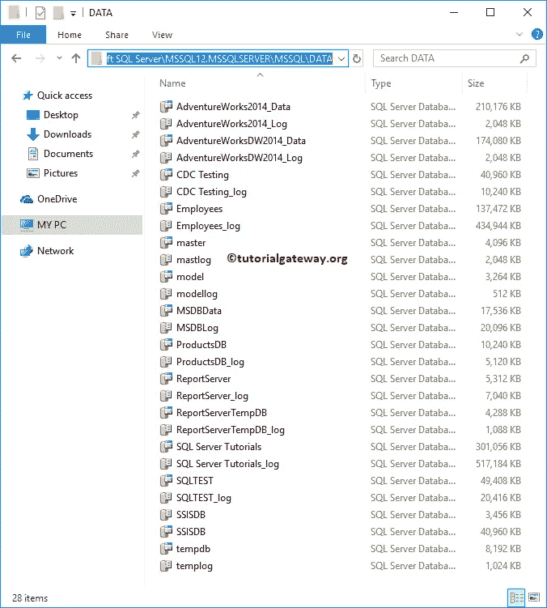

查看我们服务器中的可用数据库。对于这个 [SQL](https://www.tutorialgateway.org/sql/) 演示，我们[创建了一个名为 PartSample 的新数据库](https://www.tutorialgateway.org/how-to-create-database-in-sql-server/)

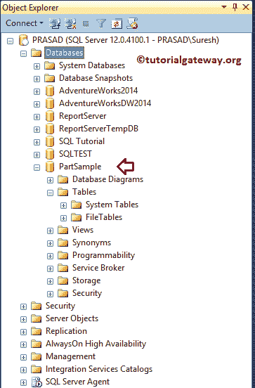

现在，您可以在我们的文件系统中看到我们新创建的数据库部分示例

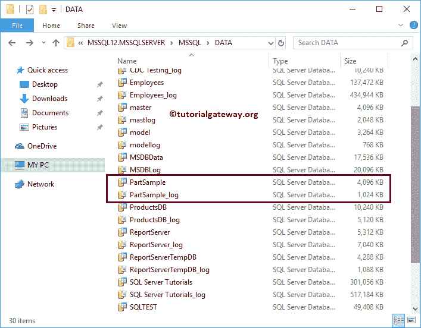

## 如何在 SQL Server 中创建表分区？

在本例中，我们将在 SQL Server 中创建一个表分区，以按月存储数据。我的意思是，每个月的订单或销售额将存储在单独的文件组(带有 ndf 扩展名的文件)中。

为了达到同样的效果，我们必须在 1 月到 12 月的 12 个月内创建 12 个单独的文件组。要创建文件组，我们必须使用[改变数据库](https://www.tutorialgateway.org/how-to-create-database-in-sql-server/)命令

```
ALTER DATABASE PartSample
ADD FILEGROUP January
GO
ALTER DATABASE PartSample
ADD FILEGROUP February
GO
ALTER DATABASE PartSample
ADD FILEGROUP March
GO
ALTER DATABASE PartSample
ADD FILEGROUP April
GO
ALTER DATABASE PartSample
ADD FILEGROUP May
GO
ALTER DATABASE PartSample
ADD FILEGROUP June
GO
ALTER DATABASE PartSample
ADD FILEGROUP July
GO
ALTER DATABASE PartSample
ADD FILEGROUP August
GO
ALTER DATABASE PartSample
ADD FILEGROUP September
GO
ALTER DATABASE PartSample
ADD FILEGROUP October
GO
ALTER DATABASE PartSample
ADD FILEGROUP November
GO
ALTER DATABASE PartSample
ADD FILEGROUP December
GO
```

```
Messages
--------
Command(s) completed successfully.
```

### 获取文件组–SQL Server 中的表分区

使用以下查询检查或查看此数据库中可用的文件组列表

```
USE PartSample
GO
SELECT * FROM Sys.filegroups
```

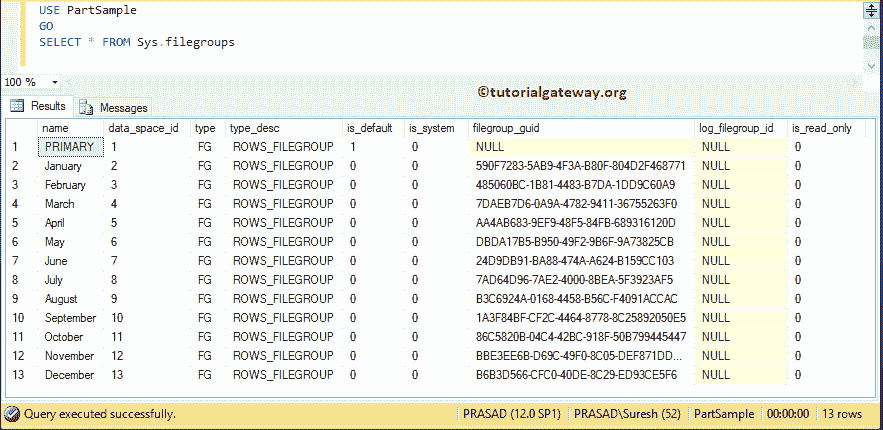

下面的 SQL 表分区查询返回文件组名称

```
USE PartSample
GO
SELECT name AS [File Group Name] 
FROM Sys.filegroups
WHERE type = 'FG'
```

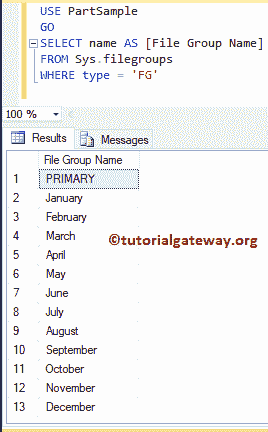

### 将 ndf 文件添加到文件组–Sql Server 中的表分区

创建文件组后，必须添加或分配或创建 ndf 文件。下面的查询将把 ndf 文件添加到一月文件组

```
ALTER DATABASE [PartSample]
    ADD FILE 
    (
    NAME = [PartJan],
    FILENAME = 'C:\Program Files\Microsoft SQL Server\MSSQL12.MSSQLSERVER\MSSQL\DATA\PartJan.ndf',
        SIZE = 5080 KB, 
        MAXSIZE = UNLIMITED, 
        FILEGROWTH = 2040 KB
    ) TO FILEGROUP [January]
```

执行 SQL 表分区查询

```
Messages
--------
Command(s) completed successfully.
```

使用以下查询添加剩余 11 个月的 ndf 文件。请记住，这是每月数据要存储的物理位置。

```
-- Adding ndf for February File Group
ALTER DATABASE [PartSample]
    ADD FILE 
    (
    NAME = [PartFeb],
    FILENAME = 'C:\Program Files\Microsoft SQL Server\MSSQL12.MSSQLSERVER\MSSQL\DATA\PartFeb.ndf',
        SIZE = 5080 KB, 
        MAXSIZE = UNLIMITED, 
        FILEGROWTH = 2040 KB
    ) TO FILEGROUP [February]

-- Adding ndf for March File Group
ALTER DATABASE [PartSample]
    ADD FILE 
    (
    NAME = [PartMarch],
    FILENAME = 'C:\Program Files\Microsoft SQL Server\MSSQL12.MSSQLSERVER\MSSQL\DATA\PartMarch.ndf',
        SIZE = 5080 KB, 
        MAXSIZE = UNLIMITED, 
        FILEGROWTH = 2040 KB
    ) TO FILEGROUP [March]

-- Adding ndf for April File Group
ALTER DATABASE [PartSample]
    ADD FILE 
    (
    NAME = [PartApril],
    FILENAME = 'C:\Program Files\Microsoft SQL Server\MSSQL12.MSSQLSERVER\MSSQL\DATA\PartApril.ndf',
        SIZE = 5080 KB, 
        MAXSIZE = UNLIMITED, 
        FILEGROWTH = 2040 KB
    ) TO FILEGROUP [April]

/-- Adding ndf for May File Group
ALTER DATABASE [PartSample]
    ADD FILE 
    (
    NAME = [PartMay],
    FILENAME = 'C:\Program Files\Microsoft SQL Server\MSSQL12.MSSQLSERVER\MSSQL\DATA\PartMay.ndf',
        SIZE = 5080 KB, 
        MAXSIZE = UNLIMITED, 
        FILEGROWTH = 2040 KB
    ) TO FILEGROUP [May]

-- Adding ndf for June File Group
ALTER DATABASE [PartSample]
    ADD FILE 
    (
    NAME = [PartJune],
    FILENAME = 'C:\Program Files\Microsoft SQL Server\MSSQL12.MSSQLSERVER\MSSQL\DATA\PartJune.ndf',
        SIZE = 5080 KB, 
        MAXSIZE = UNLIMITED, 
        FILEGROWTH = 2040 KB
    ) TO FILEGROUP [June]

-- Adding ndf for July File Group
ALTER DATABASE [PartSample]
    ADD FILE 
    (
    NAME = [PartJuly],
    FILENAME = 'C:\Program Files\Microsoft SQL Server\MSSQL12.MSSQLSERVER\MSSQL\DATA\PartJuly.ndf',
        SIZE = 5080 KB, 
        MAXSIZE = UNLIMITED, 
        FILEGROWTH = 2040 KB
    ) TO FILEGROUP [July]

-- Adding ndf for August File Group
ALTER DATABASE [PartSample]
    ADD FILE 
    (
    NAME = [PartAug],
    FILENAME = 'C:\Program Files\Microsoft SQL Server\MSSQL12.MSSQLSERVER\MSSQL\DATA\PartAug.ndf',
        SIZE = 5080 KB, 
        MAXSIZE = UNLIMITED, 
        FILEGROWTH = 2040 KB
    ) TO FILEGROUP [August]

-- Adding ndf for September File Group
ALTER DATABASE [PartSample]
    ADD FILE 
    (
    NAME = [PartSept],
    FILENAME = 'C:\Program Files\Microsoft SQL Server\MSSQL12.MSSQLSERVER\MSSQL\DATA\PartSept.ndf',
        SIZE = 5080 KB, 
        MAXSIZE = UNLIMITED, 
        FILEGROWTH = 2040 KB
    ) TO FILEGROUP [September]

-- Adding ndf for October File Group
ALTER DATABASE [PartSample]
    ADD FILE 
    (
    NAME = [PartOct],
    FILENAME = 'C:\Program Files\Microsoft SQL Server\MSSQL12.MSSQLSERVER\MSSQL\DATA\PartOct.ndf',
        SIZE = 5080 KB, 
        MAXSIZE = UNLIMITED, 
        FILEGROWTH = 2040 KB
    ) TO FILEGROUP [October]

-- Adding ndf for November File Group
ALTER DATABASE [PartSample]
    ADD FILE 
    (
    NAME = [PartNov],
    FILENAME = 'C:\Program Files\Microsoft SQL Server\MSSQL12.MSSQLSERVER\MSSQL\DATA\PartNov.ndf',
        SIZE = 5080 KB, 
        MAXSIZE = UNLIMITED, 
        FILEGROWTH = 2040 KB
    ) TO FILEGROUP [November]

-- File Group for December
ALTER DATABASE [PartSample]
    ADD FILE 
    (
    NAME = [PartDec],
    FILENAME = 'C:\Program Files\Microsoft SQL Server\MSSQL12.MSSQLSERVER\MSSQL\DATA\PartDec.ndf',
        SIZE = 5080 KB, 
        MAXSIZE = UNLIMITED, 
        FILEGROWTH = 2040 KB
    ) TO FILEGROUP [December]
```

一旦执行查询，消息将是

```
Messages
--------
Command(s) completed successfully.
```

从下面的截图可以看到，ndf 文件已经为每个文件组

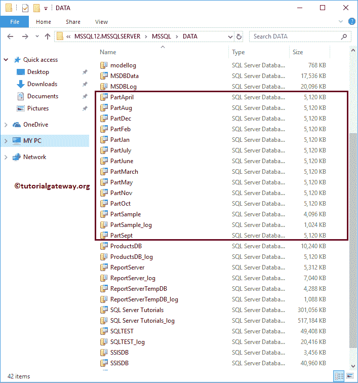

创建了

### 查看文件组和各自的 ndf 文件–SQL 表分区

使用 sys.database_files 获取有关文件组及其物理位置的信息。

```
USE PartSample
GO

SELECT * FROM sys.database_files
```

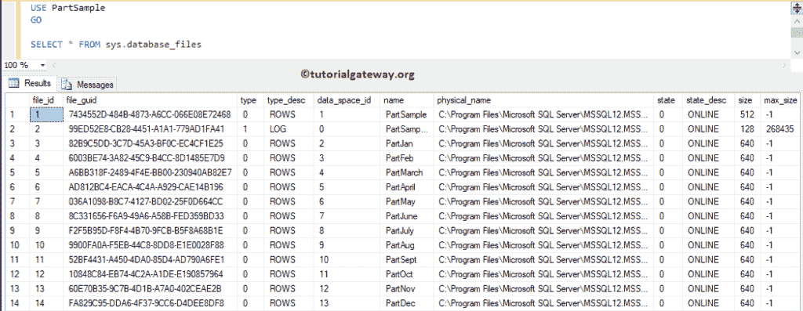

您也可以在 select 语句中使用更具体的列

```
USE PartSample
GO

SELECT name AS [Partition Name],
		physical_name AS [File Path]
FROM sys.database_files 
-- WHERE type_desc = 'ROWS'
```

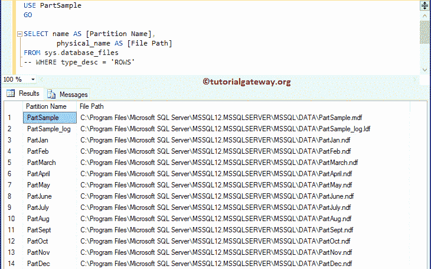

### 在 Sql Server 中为表分区创建分区函数

该函数将原始表中的行映射到分区表中。为此，SQL 分区函数将使用一列来标识文件组。

下面的函数将根据每个月将原始表映射到文件组。该函数比较插入日期值，并根据我们在括号()中指定的值映射到其中一个分区。

```
USE PartSample
GO

CREATE PARTITION FUNCTION [MonthlyPartition] (datetime)
AS RANGE RIGHT FOR VALUES ('20180201', '20180301', '20180401',
               '20180501', '20180601', '20180701', '20180801', 
               '20180901', '20181001', '20181101', '20181201');
```

执行上面的查询

```
Messages
--------
Command(s) completed successfully.
```

### 创建分区方案–在 Sql Server 中进行表分区

这将把分区表映射到文件组。以下方案将 20180201 映射到二月等

```
USE PartSample
GO

CREATE PARTITION SCHEME MonthWisePartition
AS PARTITION MonthlyPartition
		TO (January, February, March, April, May, June, July, 
			August, September, October, November, December
			);
```

执行上面的查询。

```
Messages
--------
Command(s) completed successfully.
```

### 使用表分区创建表

让我使用新创建的 SQL Server 表分区模式创建一个表。建议大家参考[创建表](https://www.tutorialgateway.org/sql-create-table/)、[身份栏](https://www.tutorialgateway.org/sql-identity_insert/)了解下面的代码。

```
USE [PartSample]
GO

CREATE TABLE [dbo].[SQL Insert](
	[EmpID] [int] IDENTITY(1,1) NOT NULL,
	[FirstName] [nvarchar](255) NULL,
	[LastName] [nvarchar](255) NULL,
	[Occupation] [nvarchar](255) NULL,
	[YearlyIncome] [float] NULL,
	[Sales] [float] NULL,
	[InsertDate] [datetime] NULL
) ON MonthWisePartition (InsertDate);
```

```
Messages
--------
Command(s) completed successfully.
```

让我在新创建的表中插入几条记录。请参考[插入声明](https://www.tutorialgateway.org/sql-insert-statement/)一文了解插入操作

```
USE [PartSample]
GO

INSERT INTO [dbo].[SQL Insert] 
VALUES ('Imran', 'Khan', 'Skilled Professional', 15900, 100, GETDATE())
      ,('Doe', 'Lara', 'Management', 15000, 60, GETDATE())
      ,('Ramesh', 'Kumar', 'Professional', 65000, 630, DATEADD(month, 1, GETDATE()))
```

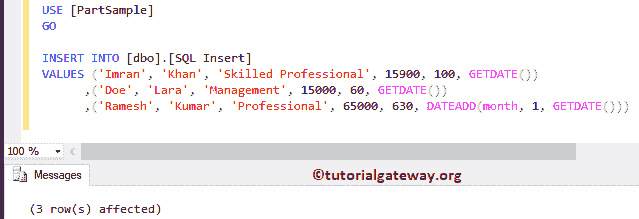

从下面，你可以看到那些记录

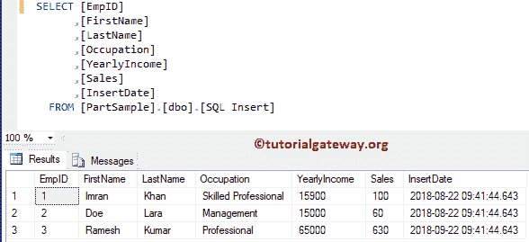

接下来，我们又插入了几条不同日期的记录。注意，我们使用了 [DATEADD 功能](https://www.tutorialgateway.org/sql-dateadd/)从当前日期开始添加或删除月份。

```
USE [PartSample]
GO

INSERT INTO [dbo].[SQL Insert] 
VALUES ('Tutorial', 'Gateway', 'Masters', 14500, 200, DATEADD(month, 4, GETDATE()))
      ,('Joe', 'Root', 'Management', 10000, 160, DATEADD(month, 3, GETDATE()))
	  ,('SQL', 'Tutorial', 'Management', 15000, 120, DATEADD(month, 2, GETDATE()))
	  ,('Jhon', 'Wick', 'Software Sales', 21000, 1160, DATEADD(month, -7, GETDATE()))
	  ,('Steve', 'Smith', 'App Sale', 13000, 2160, DATEADD(month, -6, GETDATE()))
	  ,('Kishore', 'Kumar', 'Admin', 120500, 310, DATEADD(month, -5, GETDATE()))
	  ,('Demi', 'Lovato', 'Professional', 193000, 1260, DATEADD(month, -4, GETDATE()))
	  ,('Madison', 'De', 'Management', 90000, 1090, DATEADD(month, -3, GETDATE()))
	  ,('Wang', 'Chung', 'Software Sale', 15000, 1560, DATEADD(month, -2, GETDATE()))
      ,('Dave', 'Jhones', 'Professional', 55000, 630, DATEADD(month, -1, GETDATE()))
```

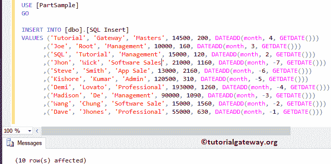

从下面的截图你可以看到所有的记录。如果观察插入日期，每个月有一条记录，八月有两条记录

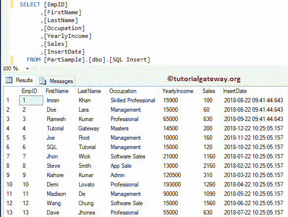

### 在 SQL 表分区中查看记录

使用下面的查询查看每个文件组或分区的总行数

```
SELECT partition_id AS ID, 
       partition_number AS [Partition Number], 
	   rows AS [Number of Rows]
FROM sys.partitions AS part
WHERE OBJECT_NAME(OBJECT_ID) = 'SQl Insert'
```

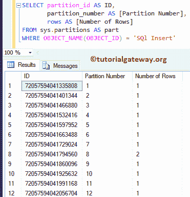

您可以使用下面的查询来查看文件组名称以及 SQL 表分区中的总行数。

```
USE PartSample
SELECT part.partition_number AS [Partition Number],
		fle.name AS [Partition Name],
		part.rows AS [Number of Rows]
FROM sys.partitions AS part
JOIN SYS.destination_data_spaces AS dest ON
part.partition_number = dest.destination_id
JOIN sys.filegroups AS fle ON
dest.data_space_id = fle.data_space_id
WHERE OBJECT_NAME(OBJECT_ID) = 'SQL Insert'
```

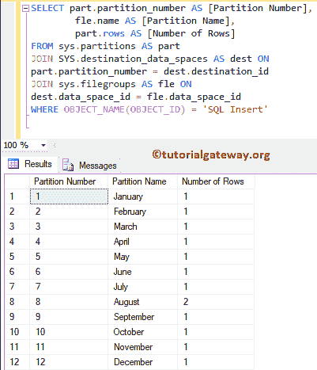

提示:请参考[创建分区](https://www.tutorialgateway.org/sql-table-partitioning-using-ssms/)一文，了解使用[管理工作室](https://www.tutorialgateway.org/sql-server-management-studio/)创建分区的要诀。