# 使用 SSMS 的 SQL 表分区

> 原文：<https://www.tutorialgateway.org/sql-table-partitioning-using-ssms/>

在本文中，我们将向您展示如何使用 SSMS 或 SSMS 创建 SQL 表分区。对于这个 SQL 表分区演示，我们将使用下面显示的表。该表是从冒险工程数据仓库数据库中创建的。您可以使用下面的 SQL 查询来获取相同的数据。

```sql
-- SQL Server Table Partitioning using SSMS
USE [AdventureWorksDW2014]
GO
SELECT CUST.[FirstName]
      ,CUST.[LastName]
      ,CUST.[EnglishEducation] AS Education
      ,CUST.[EnglishOccupation] AS Occupation
      ,CUST.[YearlyIncome] AS Income
      ,GEO.[City]
      ,GEO.[StateProvinceName] AS State
      ,GEO.[EnglishCountryRegionName] AS Country
      ,GEO.[PostalCode]
	  ,FACT.[OrderQuantity]
      ,FACT.[TotalProductCost] AS TotalCost
      ,FACT.[SalesAmount]
      ,FACT.[TaxAmt]
	  ,FACT.OrderDate
  FROM [DimGeography] AS GEO
  INNER JOIN [DimCustomer] AS CUST
  ON  GEO.[GeographyKey] = CUST.[GeographyKey]
  INNER JOIN [FactInternetSales] AS FACT
  ON CUST.CustomerKey = FACT.CustomerKey
```

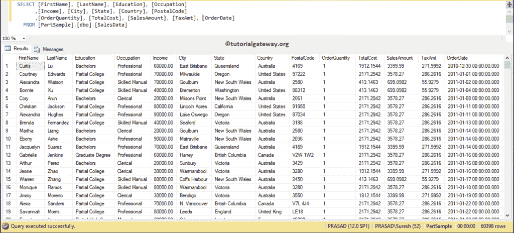

## 使用 SSMS 的 SQL 表分区

要在 [SSMS](https://www.tutorialgateway.org/sql-server-management-studio/) 创建一个 SQL 表分区，请导航到要创建分区的表。接下来，右键单击它，并从上下文菜单中选择存储，然后选择创建分区选项。

提示:请参考[创建表分区](https://www.tutorialgateway.org/table-partitioning-in-sql-server/)一文，了解使用 T-SQL Query 创建表分区涉及的步骤。

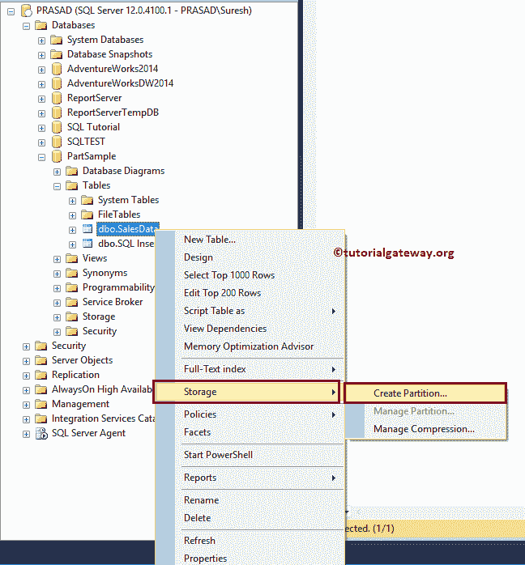

选择创建分区选项将打开一个向导。第一页是欢迎页面

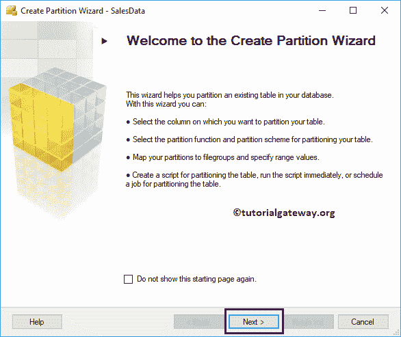

### Sql 表分区–选择分区列

在这个 [SQL](https://www.tutorialgateway.org/sql/) 页面上，你必须选择你想要用作分区列的列。在本例中，我们使用的是

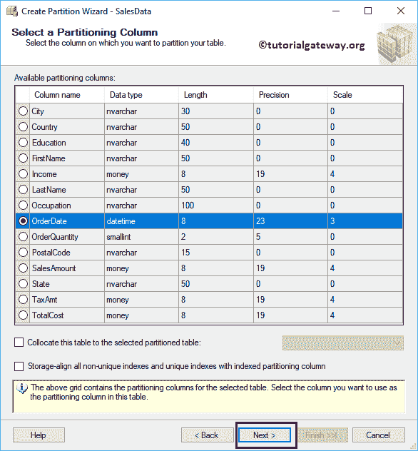

订单日期列

### 选择一个分区函数–SQL 表分区

使用此页面选择现有的分区函数，或创建新的分区函数。让我通过指定一个名为每月销售函数的名称来创建一个新的。

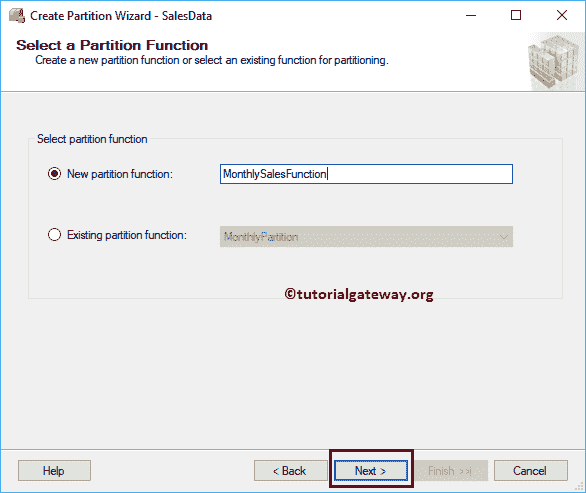

### SQL 表分区–选择分区方案

在此页面上，您可以选择现有的分区方案或创建新方案。如果您正在为新功能创建主题，则现有的分区方案选择将灰显。让我通过指定一个名为每月销售计划的名称来创建一个新的。

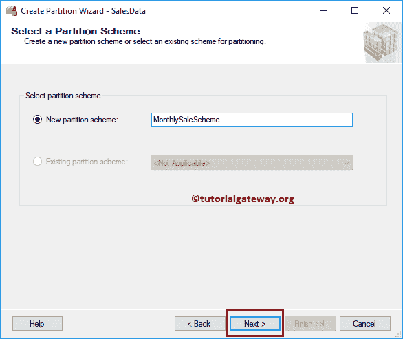

让我告诉你，如果你选择名为每月分区的现有分区函数会发生什么。这个[分区](https://www.tutorialgateway.org/table-partitioning-in-sql-server/)之前是使用查询创建的。

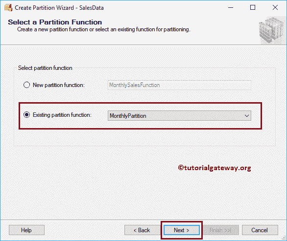

现在你可以看到，它允许你选择现有的方案。或者你可以创建一个新的方案。

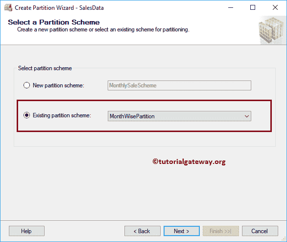

让我撤消这两个步骤，并选择新功能和新方案

### SQL 表分区–映射分区

您可以使用左边界或右边界

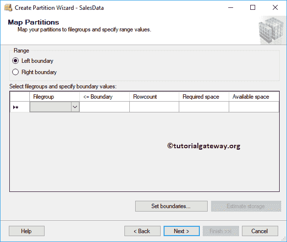

使用下拉框选择月份名称。请使用“设置边界”按钮选择开始日期和结束日期，并使用“估计存储空间”来估计所需的磁盘空间。

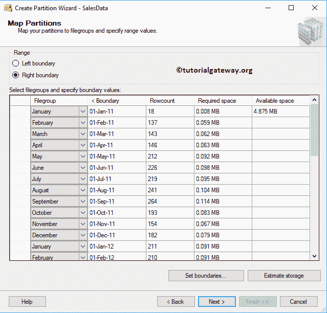

不要忘记选择主文件组(默认文件组)。否则，它会抛出一个错误

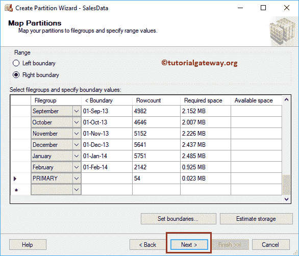

### SQL 表分区–选择输出选项

要么你可以

*   创建一个脚本，稍后运行。
*   立即运行-这将立即运行该表分区脚本
*   计划:您可以使用此脚本运行。

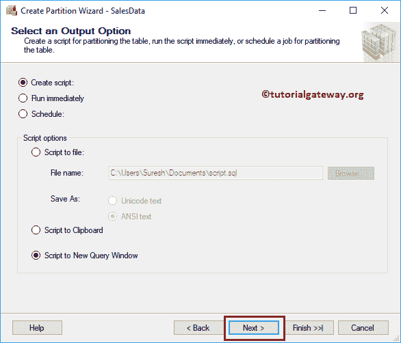

选择立即运行选项

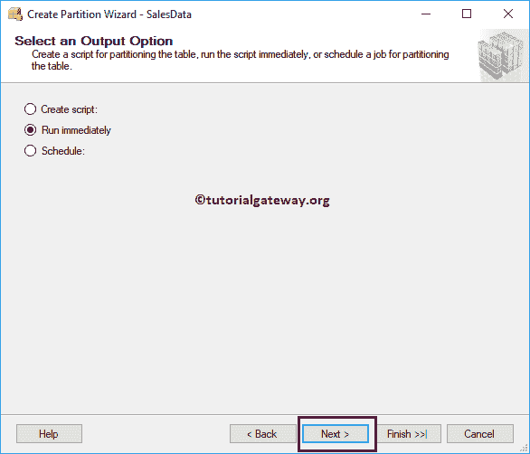

单击“完成”按钮创建分区

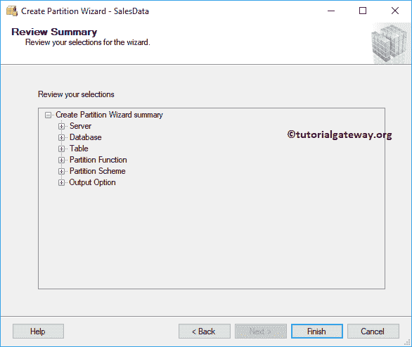

我们已经使用向导

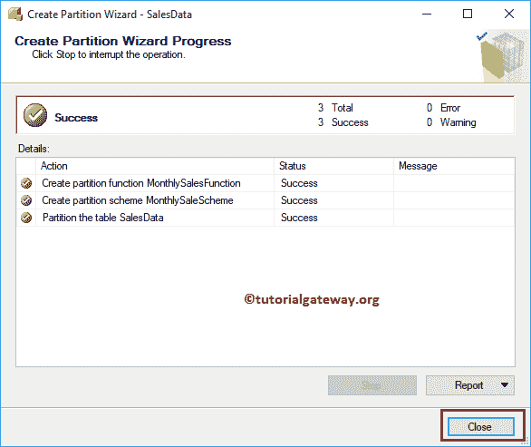

成功创建了一个表分区