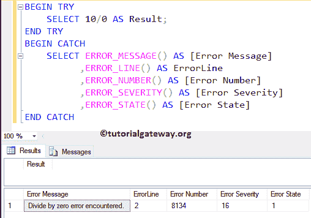
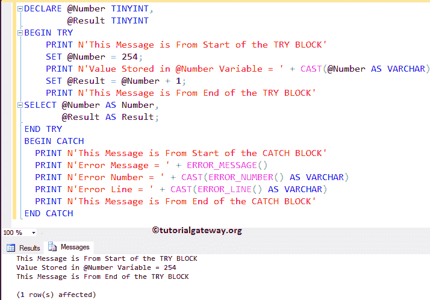
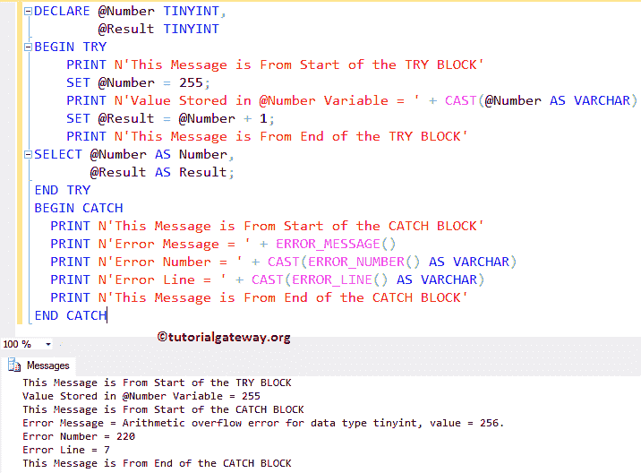

# SQL TRY CATCH

> 原文:[https://www.tutorialgateway.org/sql-try-catch/](https://www.tutorialgateway.org/sql-try-catch/)

SQL Try Catch 帮助您有效地处理查询中的错误。类似于 Java 或 C#中的异常处理，SQL 为我们提供了 TRY CATCH 构造。

例如，我们在 TRY 块中编写一系列语句。如果 SQL Server 发现一个错误，那么它从 TRY 块退出并进入 CATCH 块，它执行 CATCH 块内的语句。最后，它将返回相应的错误描述。

以下是开始使用 SQL Try catch 之前要记住的事项列表

*   CATCH 块必须紧跟在每个 TRY 块之后。不允许在 END TRY 和 BEGIN CATCH 之间包含任何语句
*   如果 TRY 块中没有错误，控件将不会进入 CATCH 块。这意味着控制器将在结束捕获后执行语句。
*   如果 Try 块中有错误，它会立即退出 TRY 块并进入 Catch 块。
*   SQL TRY CATCH 将捕获严重性高于 10 且低于 20 的所有错误。
*   SQL 允许您使用嵌套的 TRY 块(在另一个块中尝试捕获)。
*   然而，CATCH 块不能处理像语法错误这样的编译错误

## SQL TRY CATCH 语法

SQL Server 尝试捕获的语法是

```
BEGIN TRY
	-- SQL Statements;
END TRY
BEGIN CATCH
        --SQL Statements;
END CATCH
```

在 SQL Catch 块中，使用以下系统函数获取关于错误的信息。

*   [ERROR_MESSAGE()](https://www.tutorialgateway.org/sql-error-message/) :返回错误的完整描述。例如，算术溢出等。
*   [ERROR_LINE()](https://www.tutorialgateway.org/sql-error-line/) :返回出错的线路。
*   [ERROR_NUMBER()](https://www.tutorialgateway.org/sql-error-number/) :返回错误号。
*   [ERROR_SEVERITY()](https://www.tutorialgateway.org/sql-error-severity/) :显示错误的严重程度。
*   ERROR_PROCEDURE():返回发生错误的[触发器](https://www.tutorialgateway.org/triggers-in-sql-server/)或[存储过程](https://www.tutorialgateway.org/stored-procedures-in-sql/)的名称。
*   [ERROR_STATE()](https://www.tutorialgateway.org/sql-error-state/) :返回一个 [SQL Server](https://www.tutorialgateway.org/sql/) 错误的状态号。

## SQL TRY CATCH 示例 1

在这个 Try Catch 示例中，我们将找到 10/0 的结果。

```
BEGIN TRY
	SELECT 10/0 AS Result;
END TRY
BEGIN CATCH
	SELECT ERROR_MESSAGE() AS [Error Message]
	      ,ERROR_LINE() AS ErrorLine
	      ,ERROR_NUMBER() AS [Error Number]  
              ,ERROR_SEVERITY() AS [Error Severity]  
              ,ERROR_STATE() AS [Error State]  
END CATCH
```



在 SQL TRY 块中，我们找到了 10/0 的结果。众所周知，任何除以零的东西都是错误的。一旦遇到错误，它将进入 CATCH 块。

```
SELECT 10/0 AS Result;
```

这个 SQL try catch 查询将返回状态、严重性、错误号、发生了哪一行错误以及解释错误的消息。

```
SELECT ERROR_MESSAGE() AS [Error Message]
      ,ERROR_LINE() AS ErrorLine
      ,ERROR_NUMBER() AS [Error Number]  
      ,ERROR_SEVERITY() AS [Error Severity]  
      ,ERROR_STATE() AS [Error State]
```

## TRY CATCH 示例 2

在这个 SQL Try catch 示例中，我们展示了 Try catch 将如何实际工作。这里，我们使用不同的打印语句来显示 SQL TRY 和 Catch 块的开始和结束。

```
DECLARE @Number TINYINT,
	@Result TINYINT
BEGIN TRY
    PRINT N'This Message is From Start of the TRY BLOCK'
    SET @Number = 254;
    PRINT N'Value Stored in @Number Variable = ' + CAST(@Number AS VARCHAR)
    SET @Result = @Number + 1;
    PRINT N'This Message is From End of the TRY BLOCK'
SELECT @Number AS Number, 
       @Result AS Result;
END TRY
BEGIN CATCH
    PRINT N'This Message is From Start of the CATCH BLOCK'
    PRINT N'Error Message = ' + ERROR_MESSAGE()
    PRINT N'Error Number = ' + CAST(ERROR_NUMBER() AS VARCHAR)
    PRINT N'Error Line = ' + CAST(ERROR_LINE() AS VARCHAR)
    PRINT N'This Message is From End of the CATCH BLOCK'
END CATCH
```

结果选项卡

```
Number | Result
---------------
254    | 255
```

让我检查消息标签



从上面的截图中，可以看到它只打印了来自 SQL TRY 块的语句。

## SQL TRY CATCH 示例 3

如何使用 try catch 处理错误？它与上一个示例的代码相同，但是我们将@Number 从 254 更改为 255

```
DECLARE @Number TINYINT,
	@Result TINYINT
BEGIN TRY
    PRINT N'This Message is From Start of the TRY BLOCK'
    SET @Number = 255;
    PRINT N'Value Stored in @Number Variable = ' + CAST(@Number AS VARCHAR)
    SET @Result = @Number + 1;
    PRINT N'This Message is From End of the TRY BLOCK'
SELECT @Number AS Number, 
       @Result AS Result;
END TRY
BEGIN CATCH
    PRINT N'This Message is From Start of the CATCH BLOCK'
    PRINT N'Error Message = ' + ERROR_MESSAGE()
    PRINT N'Error Number = ' + CAST(ERROR_NUMBER() AS VARCHAR)
    PRINT N'Error Line = ' + CAST(ERROR_LINE() AS VARCHAR)
    PRINT N'This Message is From End of the CATCH BLOCK'
END CATCH
```

分析

在这个 SQL try catch 示例中，首先，我们声明了两个 tinyint 变量

```
DECLARE @Number TINYINT,
	@Result TINYINT
```

接下来，在 TRY 块中，我们为 Number 变量分配了 255，并对结果变量执行加法。

```
PRINT N'This Message is From Start of the TRY BLOCK'
    SET @Number = 255;
    PRINT N'Value Stored in @Number Variable = ' + CAST(@Number AS VARCHAR)
    SET @Result = @Number + 1;
    PRINT N'This Message is From End of the TRY BLOCK'
```

众所周知，微小的整数最多可以容纳 255 个意味着溢出。因此，它将从 TRY 块中退出，并执行我们的 CATCH 块中的语句，即:

```
    PRINT N'This Message is From Start of the CATCH BLOCK'
    PRINT N'Error Message = ' + ERROR_MESSAGE()
    PRINT N'Error Number = ' + CAST(ERROR_NUMBER() AS VARCHAR)
    PRINT N'Error Line = ' + CAST(ERROR_LINE() AS VARCHAR)
    PRINT N'This Message is From End of the CATCH BLOCK'
```



如果您观察上面的 SQL Try catch 示例截图，虽然我们在 Try 块的末尾有 print 语句，但是控制器跳过了该语句。因为一旦进入 SET @ Result = @ Number+1；控件将退出 TRY 块，并立即进入 Catch 块。