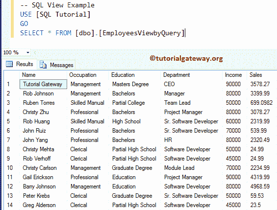
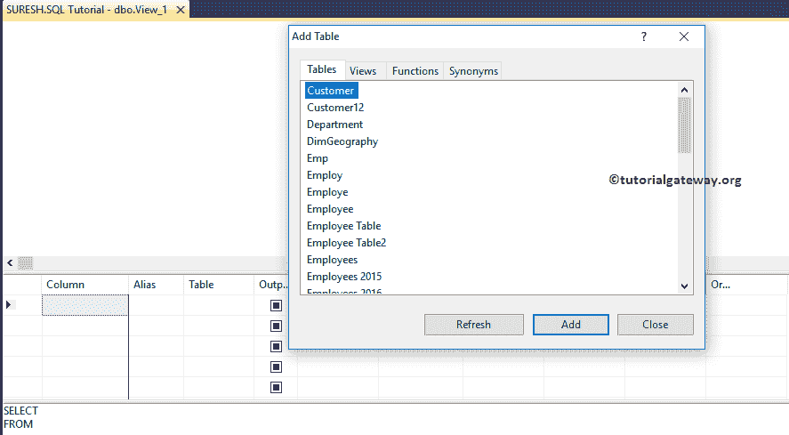
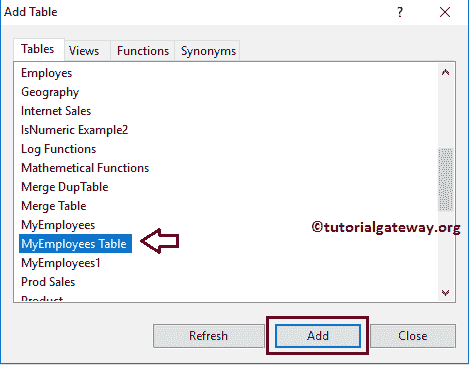
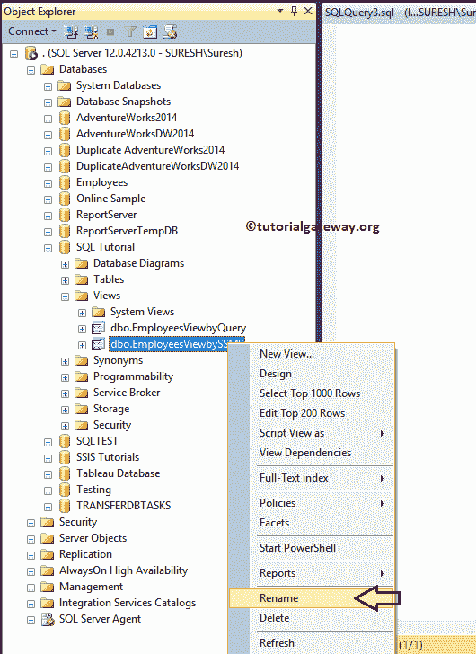
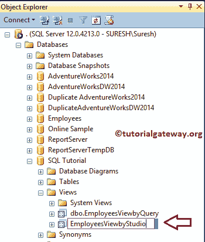

# SQL Server 中的视图

> 原文：<https://www.tutorialgateway.org/views-in-sql-server/>

在本研究中，我们将向您解释如何在 SQL 中创建视图，如何在 SQL Server 中修改、重命名和删除视图。SQL 视图是虚拟表，由引用表中的列和行组成。

除非我们定义了索引，否则 SQL Server 中的视图不会在数据库中存储一组值。当您对 SQL 视图使用`SELECT`语句时，记录将来自我们在创建视图时引用的表。

## 在 SQL Server 中创建视图

您可以使用 Transact-SQL 查询或 Management Studio 来创建或替换视图。在我们进入这个例子之前，您可以将一个 Sql Server 视图用于以下目的:

*   根据用户需求简化数据。
*   限制用户不访问整个数据库。

### 创建视图语句

此示例显示如何使用创建语句在 SQL Server 中创建视图

```
CREATE VIEW EmployeesViewbyQuery
AS
SELECT  [FirstName] + ' ' + [LastName] AS Name
	,[Occupation]
	,[Education]
	,dept.DepartmentName AS Department
	,[YearlyIncome] AS Income
	,[Sales]
FROM [MyEmployees Table]
   INNER JOIN 
 	 Department AS dept ON
	    Dept.[id] = [MyEmployees Table].DeptID
GO
```

让我们看看行和列结果集

```
SELECT * FROM [dbo].[EmployeesViewbyQuery]
```



### 在 SQL Server 管理工作室中创建视图

此示例显示了使用管理工作室在 SQL Server 中创建视图所涉及的步骤。创建时要记住的限制是

*   只能在当前数据库中创建
*   它允许我们最多有 1024 列

要查看现有的 Sql Server 视图，请选择包含该视图的数据库。如你所见，我们的数据库没有。

右键单击[管理工作室](https://www.tutorialgateway.org/sql-server-management-studio/)中的文件夹，将打开上下文菜单。要创建它，请从中选择显示的选项。


单击该选项后，查询设计器将在一个单独的窗口中打开，并弹出一个窗口来添加所需的表。



在这里，您可以添加函数、表或视图。从下面，您可以看到我们选择了“我的员工”表和“部门”表。



一旦选择了所需的表，它将显示[查询设计器](https://www.tutorialgateway.org/sql-query-builder/)。请通过在图表窗格中选中标记列名来选择所需的列。


在这个 [SQL Server](https://www.tutorialgateway.org/sql/) 示例中，我们从两个表中选择了名字、姓氏、学历、职业、部门、年收入、销售额、雇佣日期。请记住，您可以通过将一个列拖到另一个列上来[连接两个表。](https://www.tutorialgateway.org/sql-joins/)


排序类型属性用于申请[按](https://www.tutorialgateway.org/sql-order-by-clause/)排序功能。在网格窗格中，请将排序类型更改为升序或降序。在这个 SQL Server 视图示例中，我们按照降序对年收入进行排序。


一旦你选择了下降操作，它会显示给你排序表示


最终[选择](https://www.tutorialgateway.org/sql-select-statement/)查询我们设计的


让我们执行这个使用管理工作室设计的 Sql 视图查询，并查看结果

```
SELECT  TOP (100) PERCENT dbo.[MyEmployees Table].FirstName, 
        dbo.[MyEmployees Table].LastName, 
        dbo.[MyEmployees Table].Education, 
        dbo.[MyEmployees Table].Occupation, 
        dbo.Department.DepartmentName, 
        dbo.[MyEmployees Table].YearlyIncome, 
        dbo.[MyEmployees Table].Sales, 
        dbo.[MyEmployees Table].HireDate
FROM dbo.Department
 INNER JOIN
     dbo.[MyEmployees Table] ON 
         dbo.Department.id = dbo.[MyEmployees Table].DeptID
ORDER BY dbo.[MyEmployees Table].YearlyIncome DESC
```


接下来，转到文件菜单并选择保存选项以保存设计的查询。


它将打开名为“选择名称”的弹出窗口来更改默认名称。


展开文件夹，查看我们创建的文件夹，然后展开它以查看列名。


注意:有些客户端只允许访问视图，它们不允许您访问它们的主数据库。

## 在 SQL Server 中重命名视图

SQL Server 允许您使用内置存储过程 sp_rename 或管理工作室来重命名 SQL Server 中的视图。

### 在 SQL 管理工作室中重命名

这个例子用 SSMS 给它们重新命名。要对其进行重命名，请导航到要修改的名称。并右击名称，选择【重命名】选项



一旦你点击重命名选项，SSMS 允许我们重命名它们。



### 使用 SP_RENAME 重命名 SQL 视图

我们可以使用 sp_rename 存储过程来重命名视图。sp_rename 语法是:

```
SP_RENAME View_Old_Name, View_New_Name
```

使用 sp_rename 存储过程，可以重命名现有的。为此，请单击新建查询并返回以下查询。

```
SP_RENAME EmployeesViewbyStudio, EmployeesViewbySQLSMS
```

## 修改 SQL Server 中的视图

以下示例有助于您理解修改 SQL 视图所涉及的步骤。首先，让我们看看要遵循的限制或约束:

*   依赖对象如[触发器](https://www.tutorialgateway.org/triggers-in-sql-server/)或[存储过程](https://www.tutorialgateway.org/stored-procedures-in-sql/)不会受到修改的影响。
*   您可以在索引索引上使用 ALTER VIEW 语句，因为它将无条件地删除所有索引。

### 在 SSMS 修改

要在管理工作室中进行修改，请导航到要更改的工作室。接下来，右击它，选择设计选项


它会打开一个新的设计查询窗口，其中包含现有的表以及关系。

这里，我们使用过滤器( [`WHERE`子句](https://www.tutorialgateway.org/sql-where-clause/))来限制职业=专业的员工，并且我们使用 [ORDER BY 子句](https://www.tutorialgateway.org/sql-order-by-clause/)


中的两列

让我从 EmployeeViewbySQLSMS 中选择所有记录来显示修改后的记录。

```
SELECT [FirstName]
      ,[LastName]
      ,[Education]
      ,[Occupation]
      ,[DepartmentName]
      ,[YearlyIncome]
      ,[Sales]
      ,[HireDate]
  FROM [dbo].[EmployeesViewbySQLSMS]
```


### 更改视图以进行修改

SQL Server ALTER VIEW 语句是修改现有语句的理想方法。为此，请单击新查询并编写后续查询。

```
ALTER VIEW [dbo].[EmployeesViewbySQLSMS]
AS
SELECT TOP 10 emp.FirstName, 
          emp.LastName, 
   emp.Education, 
   emp.Occupation, 
   Dept.DepartmentName, 
          emp.YearlyIncome, 
   emp.Sales
FROM  dbo.Department AS Dept
   INNER JOIN
      dbo.[MyEmployees Table] AS emp ON 
        Dept.id = emp.DeptID
ORDER BY emp.YearlyIncome DESC, 
         emp.Sales DESC
```

让我们看看输出

```
SELECT [FirstName]
      ,[LastName]
      ,[Education]
      ,[Occupation]
      ,[DepartmentName]
      ,[YearlyIncome]
      ,[Sales]
  FROM [EmployeesViewbySQLSMS]
```


### 如何找到视图的定义？

如何使用 sp_helptext 存储过程获取定义？

```
SP_HELPTEXT [EmployeesViewbyQuery]
```


## 删除 SQL Server 中的视图

以下示例显示了如何删除它。

*   删除或删除表不会删除相关视图。您必须显式地使用 SQL Server DROP VIEW 语句来删除它们。
*   当您删除它时，所有信息(包括定义)都将从系统目录中删除。

### 管理工作室

要使用管理工作室进行删除，请右键单击该名称，然后单击删除选项。对于这个演示，我们想删除


员工视图

选择删除选项将打开删除对象窗口。单击显示依赖项按钮检查依赖项，然后单击确定删除。


### 删除或删除视图

让我用 DROP 语句删除。

```
DROP VIEW [dbo].[EmployeesViewbyQuery]
GO
```

提示:如果对象标识不为空，最好检查它是否存在于数据库中