# SQL 中的用户定义函数

> 原文：<https://www.tutorialgateway.org/user-defined-functions-in-sql/>

SQL Server 中的用户定义函数类似于任何其他编程语言中的函数，它接受参数、执行复杂的计算并返回结果值。

## SQL Server 中函数的类型

在 SQL Server 中有两种类型的函数:

1.  服务器支持的所有内置函数都称为系统函数。我们不必担心它们内部的逻辑，因为它们不能被修改。比如[数学](https://www.tutorialgateway.org/sql-mathematical-functions/)、[排名](https://www.tutorialgateway.org/ranking-functions-in-sql-server/)、[弦](https://www.tutorialgateway.org/sql-string-functions/)等。
2.  用户定义的:SQL Server 允许我们在 SQL Server 中创建称为用户定义函数的方法。例如，如果我们想要执行一些复杂的计算，那么我们可以将它们放在一个单独的方法中，并将其存储在数据库中。每当我们需要计算时，我们可以称之为。有两种类型的 SQL 用户定义函数:
    *   标量:它返回一个值。通常，我们必须在 BEGIN … END 块之间定义主体，但是对于内联标量函数，您可以省略它们。除了文本、图像、ntext、光标和时间戳之外，我们可以使用任何 [SQL 数据类型](https://www.tutorialgateway.org/sql-data-types/)作为返回类型。

*   表值:它是 SQL Server 中返回表的用户定义函数。
    *   内联表值:它基于单个 [`SELECT`语句](https://www.tutorialgateway.org/sql-select-statement/)返回一个表数据类型

### 用户定义函数在 SQL Server 中的优势

1.  SQL Server 中的用户定义函数阻止我们多次编写相同的逻辑。
2.  在数据库中，您可以创建一次方法，并调用 n 次。
3.  SQL 用户定义函数通过捕获执行计划并重用它们来减少查询的编译时间。
4.  这个 UDF 可以帮助我们将复杂的计算从常规查询中分离出来，这样我们就可以更快更好地理解和调试查询。
5.  由于其缓存计划，它减少了网络流量
6.  在`WHERE`子句中也使用了 SQL `Server()`函数。通过这种方式，我们可以限制发送给客户端的行数。

### SQL Server 中用户定义函数的语法

SQL Server 用户定义函数或 UDF 的语法是

```
CREATE FUNCTION Function_Name(@Parameter_Name Data_type, 
                                 .... @Parameter_Name Data_type
                             )
RETURNS Data_Type
AS
   BEGIN
      -- Function_Body

      RETURN Data 
   END
```

*   返回类型:
    1.  数据类型:请指定返回值的数据类型。例如，VARCHAR、INT、FLOAT 等。
    2.  数据:请指定返回值，它应该与数据类型匹配。它可以是单个值或表
*   函数名:除了系统保留的关键字之外，您可以指定您希望给出的任何名称。请尽量使用有意义的名字，这样你可以很容易地识别它们。
*   @Parameter_Name:每个方法接受零个或多个参数；这完全取决于用户需求。在声明参数时，不要忘记适当的[数据类型](https://www.tutorialgateway.org/sql-data-types/)。例如(@name VARCHAR(50)，@number INT)
*   Function_Body:要在此特定方法中实现的任何查询或任何复杂的数学计算。

让我们通过示例来看看如何在 SQL Server 中创建或编写不同类型的用户定义函数。

在这个 SQL UDF 演示中，我们将使用[SQL 教程]数据库中的[我的雇员表]和[部门]表。

提示:请参考[更改 SQL Server](https://www.tutorialgateway.org/alter-user-defined-functions-in-sql/) 中的 UDF 文章，了解如何重命名、修改或删除[SQL Server](https://www.tutorialgateway.org/sql/)UDF。

从下图可以观察到【MyEmployee 表】表中有十四条记录

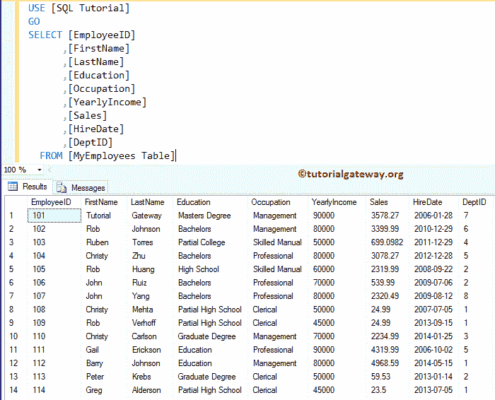

而【部门】表有八条记录。


## 创建 SQL 标量函数示例

当您想要返回单个值作为结果时，SQL Server 中的标量用户定义函数非常有用。例如，总销售额或总投资、总损失或总支出等。

### 创建不带参数的 SQL 标量函数示例

在这个简单的 SQL 示例中，我们将向您展示如何创建不带任何参数的标量函数。

从下面的查询中，您可以看到我们正在对 MyEmployee 表的年收入进行求和。

```
-- Scalar example
CREATE FUNCTION NoParameters ()
  RETURNS INT
  AS
    BEGIN 
       RETURN (SELECT SUM([YearlyIncome]) FROM [MyEmployees Table])
    END
```

```
Messages
-------
Command(s) completed successfully.
```

让我来告诉你，它在 SQL 管理工作室是什么样子的

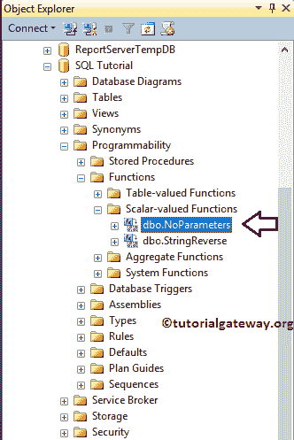

让我们看看 SQL 标量函数的输出

```
SELECT [EmployeeID]
      ,[FirstName]
      ,[LastName]
      ,[Education]
      ,[Occupation]
      ,[YearlyIncome]
      ,dbo.NoParameters() AS [Average Income]
      ,[Sales]
      ,[HireDate]
  FROM [MyEmployees Table]
```

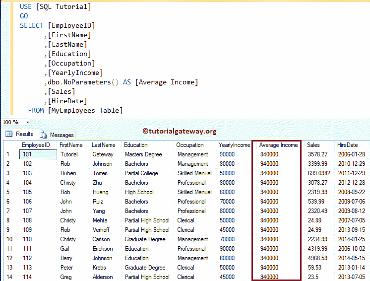

### 创建带参数的 SQL 标量函数示例

在这个例子中，我们将向您展示，如何创建带有参数的 SQL 标量函数。从下面的查询中，您可以观察到，我们正在连接名字和姓氏。

注意:我们使用[空格](https://www.tutorialgateway.org/sql-space-function/)来提供名和姓之间的空格。

```
-- Scalar example
CREATE FUNCTION fullName (@firstName VARCHAR(50), @lastName VARCHAR(50))
  RETURNS VARCHAR(200)
  AS
    BEGIN 
       RETURN (SELECT  @firstName + SPACE(2) + @lastName )
    END
```

让我们使用下面的查询来查看输出

```
SELECT [EmployeeID]
       -- Passing Parameters to fullname Function
      ,dbo.fullname([FirstName], [lastName]) AS [Name]
      ,[Education]
      ,[Occupation]
      ,[YearlyIncome]
      ,[Sales]
      ,[HireDate]
  FROM [MyEmployees Table]
```

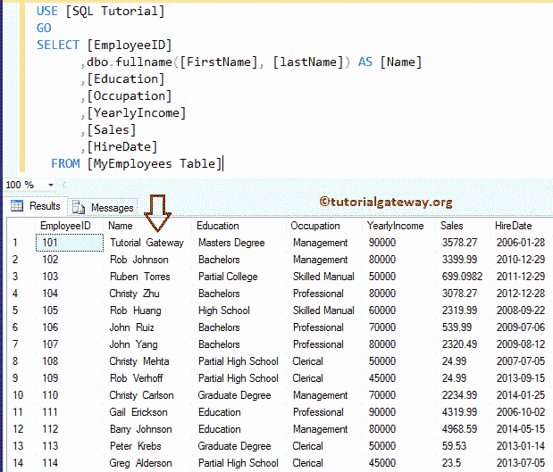

### 创建 SQL 标量函数`WHERE`子句示例

下面的 SQL 标量函数`WHERE`子句示例将接受 varchar 作为参数。它找到销售金额的总和，其占用等于我们传递的参数。

```
-- Scalar example
CREATE FUNCTION average (@Occupation VARCHAR(50))
  RETURNS FLOAT
  AS
    BEGIN 
       RETURN (SELECT  SUM([Sales]) FROM [MyEmployees Table]
	        WHERE [Occupation] = @Occupation)
    END
```

让我们看看输出

```
SELECT [Occupation]
      ,SUM([YearlyIncome]) as [Total Income]
      ,SUM([Sales]) AS [Total Sale]
      ,dbo.average([Occupation]) AS [Total Sale from Function]
  FROM [MyEmployees Table]
  group by [Occupation]
```

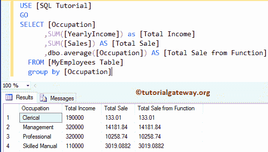

### 在`WHERE`子句示例中使用 SQL 标量函数

在这个例子中，我们展示了如何在 [`WHERE`子句](https://www.tutorialgateway.org/sql-where-clause/)中使用 SQL 标量函数

```
CREATE FUNCTION AverageSale ()
  RETURNS FLOAT
  AS
    BEGIN 
       RETURN (SELECT  AVG([Sales]) FROM [MyEmployees Table])
    END
```

让我们看看输出

```
SELECT [EmployeeID]
      ,[FirstName]
      ,[LastName]
      ,[Education]
      ,[Occupation]
      ,[YearlyIncome]
      ,[Sales]
      ,[HireDate]
  FROM [MyEmployees Table]
  WHERE [Sales] >= dbo.AverageSale()
```

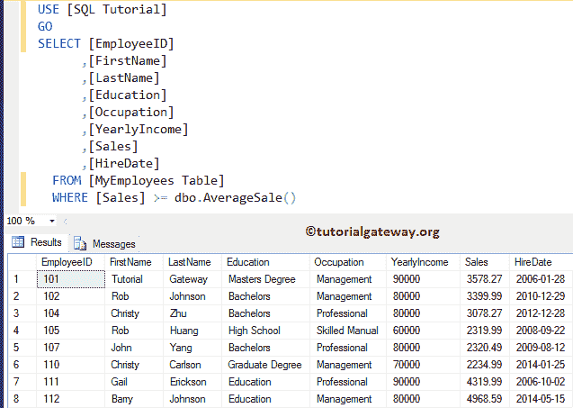

## 创建 SQL Server 内联表值函数示例

SQL Server `Inline()`函数基于单个 [`SELECT`语句](https://www.tutorialgateway.org/sql-select-statement/)返回一个表数据类型作为返回值

### 创建不带参数的 SQL 内联函数示例

在这个简单的例子中，我们将向您展示如何创建一个没有任何参数的 SQL Inline 表值函数。从下面的查询中，您可以看到我们从 MyEmployee 表中选择了前 10 条记录。

```
-- Inline example

CREATE FUNCTION TopTenCustomers ()
  RETURNS TABLE
  AS
       RETURN (
		   SELECT TOP 10 [FirstName]
		  ,[LastName]
		  ,[Education]
		  ,[Occupation]
		  ,[YearlyIncome]
		  ,[Sales]
		  ,[HireDate]
		  FROM [MyEmployees Table]
               )
```

让我们看看输出

```
SELECT * FROM [dbo].[TopTenCustomers] ()
GO
```

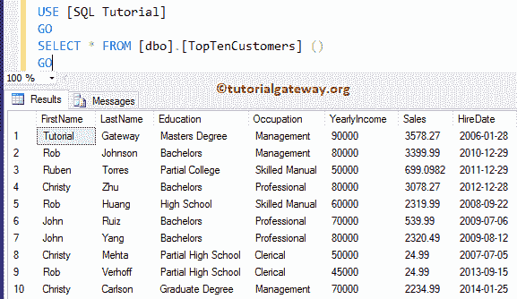

### 带参数的 SQL 内联函数示例

这个 SQL Server 示例显示了如何创建带有参数的 SQL 内联表值函数。

从下面的查询中，您可以看到我们正在使用 [INNER JOIN](https://www.tutorialgateway.org/sql-inner-join/) 从两个表中选择记录，其占用等于我们传递的参数。

```
-- Inline example

CREATE FUNCTION CustomerbyDepartment (@profession VARCHAR(50))
  RETURNS TABLE
  AS
     RETURN (
		SELECT  [FirstName]
                ,[LastName]
		,[Occupation]
		,[Education]
		,dept.DepartmentName AS Department
		,[YearlyIncome] AS Income
		,[Sales]
		FROM [MyEmployees Table]
		INNER JOIN 
		Department AS dept ON
		  Dept.[id] = [MyEmployees Table].DeptID
		WHERE [Occupation] = @profession
		)
```

让我们看看 SQL 内联表值函数的输出

```
SELECT * FROM [dbo].[CustomerbyDepartment] ('Management')
GO
```

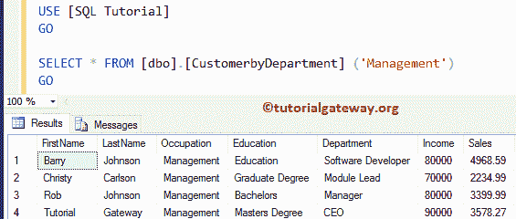

## Sql Server 示例中的多选表值函数

SQL Server 多选表值函数返回表格结果集。但是，与内联表值不同，我们可以在函数体中使用多个`SELECT`语句。

在这个 SQL Server 多选表值示例中，将向您展示如何在一个 UDF 中使用多个语句。

```
-- Table Valued example

CREATE FUNCTION CustomerDepartment()
  RETURNS @customers TABLE
  (
  	[EmployeeID] [smallint] NOT NULL,
	[FirstName] [nvarchar](30) NULL,
	[LastName] [nvarchar](40)  NULL,
	[Education] [nvarchar](255) NULL,
	[Occupation] [nvarchar](255) NULL,
	[YearlyIncome] [float] NULL,
	[Sales] [float] NULL,
	[HireDate] [date] NULL,
	[DepartmentName] [VARCHAR](50) NULL
  )
  AS BEGIN
   INSERT INTO @customers
   SELECT  [EmployeeID]
	  ,[FirstName]
          ,[LastName]
	  ,[Education]
	  ,[Occupation]
	  ,[YearlyIncome]
	  ,[Sales]
	  ,[HireDate]
	  ,dept.DepartmentName
	FROM [MyEmployees Table]
	INNER JOIN 
	     Department AS dept ON
		Dept.[id] = [MyEmployees Table].DeptID

   -- Updating the Records
   UPDATE @customers SET [YearlyIncome] = [YearlyIncome] + 35200
	WHERE [Sales] > (SELECT AVG(Sales) FROM [MyEmployees Table])
  RETURN
 END
```

在这个用户定义函数的例子中，首先，我们使用下面的语句创建一个名为@customers 的表变量

```
@customers TABLE
```

接下来，我们将[MyEmployee 表]和[Department]表中的记录插入@customers 表变量。

```
INSERT INTO @customers
   SELECT
```

接下来，我们将更新@customers 表变量中所有客户的年收入，这些客户的年收入大于平均销售额。

```
UPDATE @customers SET [YearlyIncome] = [YearlyIncome] + 35200
WHERE [Sales] > (SELECT AVG(Sales) FROM [MyEmployees Table])
```

让我们看看输出

```
SELECT * FROM [dbo].[CustomerDepartment] ()
GO

```

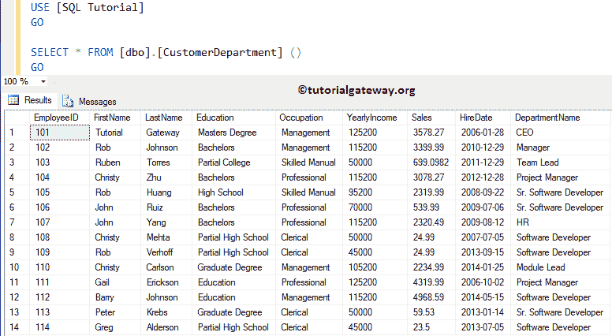

## SQL Server 中的多个用户定义函数

如何在一个 [`SELECT`语句](https://www.tutorialgateway.org/sql-select-statement/)中使用多个用户自定义函数。

```
SELECT [EmployeeID]
      ,dbo.fullName([FirstName], [LastName]) AS Name --  First UDF
      ,[Education]
      ,[Occupation]
      ,[YearlyIncome]
      ,[Sales]
      ,[HireDate]
  FROM [MyEmployees Table]
  WHERE [Sales] >= dbo.AverageSale() -- Second UDF
```

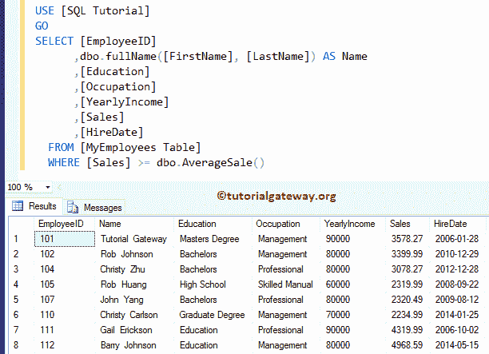

## 一个 UDF 在另一个 UDF 在 SQL Server 中

在这个简单的 Sql server UDF 示例中，我们将向您展示如何将一个用户定义的函数嵌套或插入到另一个函数中。

```
CREATE FUNCTION CustDepartment (@education VARCHAR(50))
  RETURNS TABLE
  AS
   RETURN (
	SELECT  dbo.fullName([FirstName],[LastName]) AS NAME
	,[Occupation]
	,[Education]
	,dept.DepartmentName AS Department
	,[YearlyIncome] AS Income
	,[Sales]
	FROM [MyEmployees Table]
	INNER JOIN 
	Department AS dept ON
	  Dept.[id] = [MyEmployees Table].DeptID
	WHERE [Education] = @education
)
```

让我们看看 Sql Server 中嵌套用户定义函数的输出

```
SELECT * FROM [dbo].[CustDepartment] ('Bachelors')
```

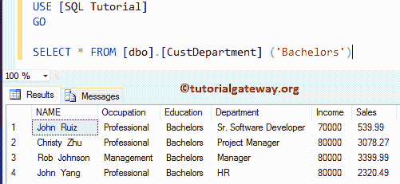

## SQL Server 中用户定义函数的局限性

以下是 SQL Server 用户定义函数的限制列表

1.  我们不能使用用户定义的函数(在 SQL Server 中简称为 UDF)来修改数据库状态。
2.  SQL UDF 不能返回多个结果集。
3.  SQL UDF 不支持错误处理，例如 TRY..缓存、RAISEERROR 或@ERROR
4.  我们不能从 SQL UDF 调用存储过程，但是我们可以调用扩展存储过程
5.  SQL 用户定义函数不支持临时表，但它允许表变量。
6.  SQL UDFs 中不允许使用 SET 语句
7.  函数内部不允许使用 [FOR XML 子句](https://www.tutorialgateway.org/sql-for-xml-raw/)