# 改变用户定义的函数

> 原文：<https://www.tutorialgateway.org/alter-user-defined-functions-in-sql/>

在前一篇文章中，我们向您解释了如何创建用户定义函数。让我们来看看如何改变 SQL Server 中的用户定义函数，例如重命名、修改和删除现有的用户定义函数。

## 如何在 SQL 中看到用户定义函数？

要查看 SQL Server 中的现有函数，请选择具有 UDF 的数据库。从下面的截图中，您可以观察到我们的【SQL 教程】数据库拥有我们在[用户定义函数](https://www.tutorialgateway.org/user-defined-functions-in-sql/)文章中创建的所有函数。

要执行现有函数，请选择要执行的函数(平均水平)。接下来，右击它，选择脚本函数为->选择到->新查询窗口编辑器

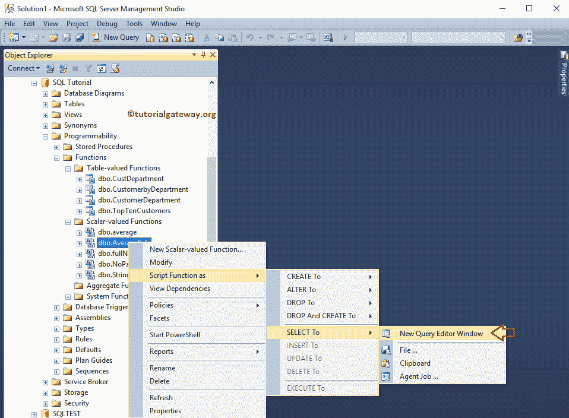

一旦选择了新建查询窗口编辑器选项，从函数中选择查询将由 SSMS

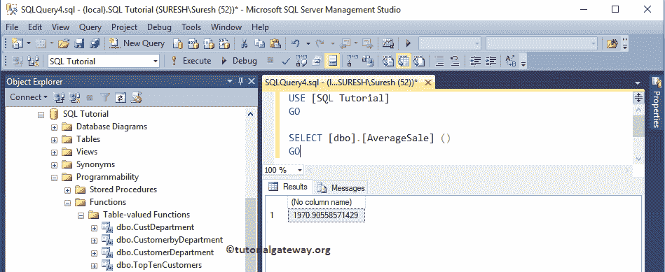

自动返回

### 使用 SSMS 的 SQL 用户定义函数的属性

首先，右击所需的函数名，选择 [SQL Server](https://www.tutorialgateway.org/sql/) 属性选项。

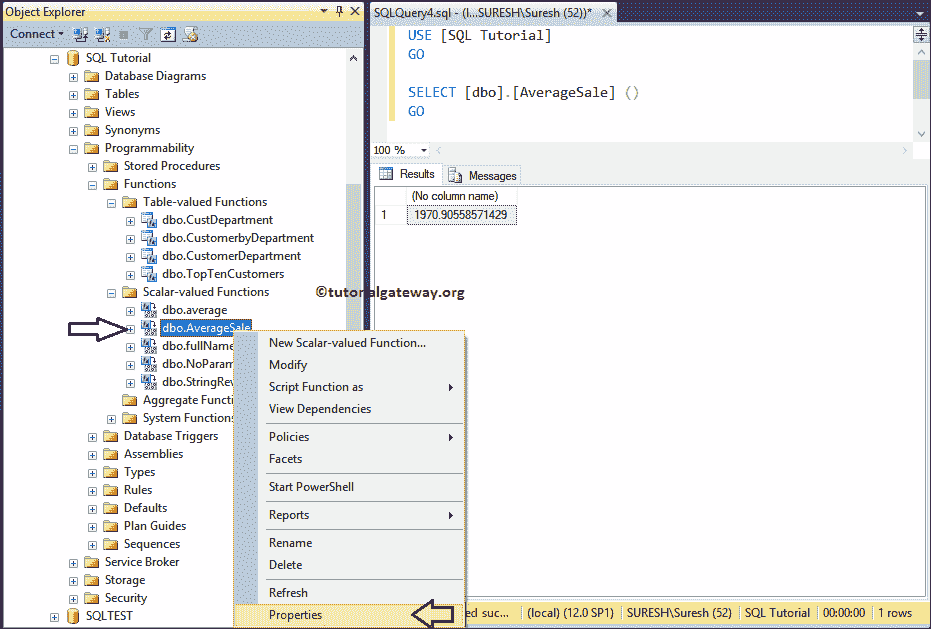

单击属性选项后，将打开一个名为函数属性的新窗口。以下是 SQL `Server()`函数属性的列表，它们是:

*   数据库:它显示包含指定函数的数据库的名称。这里，它是平均水平
*   服务器:当前 SQL Server 实例的名称。
*   用户:显示当前用户的名称
*   创建日期:显示函数的创建日期。
*   名称:显示当前函数的名称。即平均水平
*   模式:它显示了我们用于这个函数的模式。
*   系统对象:显示布尔值“真”或“假”，表示当前函数是否为系统对象。
*   ANSI 空值:显示布尔值“真”或“假”，指示对象是否是用 ANSI 空值创建的。
*   函数类型:显示函数是[标量](https://www.tutorialgateway.org/user-defined-functions-in-sql/)还是表值函数

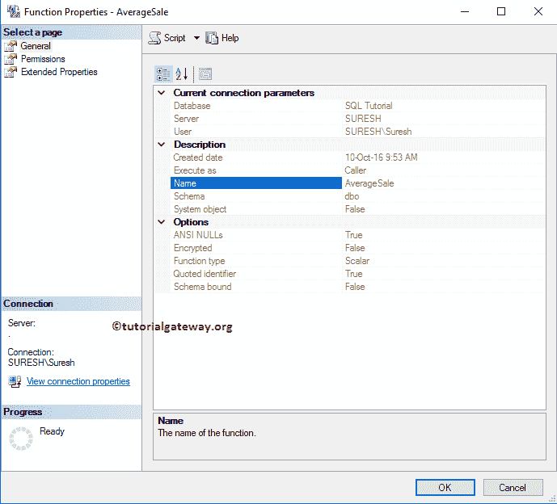

### 使用查询的 SQL 用户定义函数的属性

如何使用对象定义找到一个用户定义函数的定义。

```
-- It Returns the AverageSale function Definition  
SELECT OBJECT_DEFINITION (OBJECT_ID('dbo.AverageSale')) AS ObjectDefinition;  
GO
```

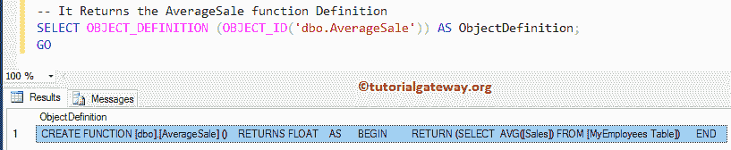

以下查询返回 SQL UDFs 的剩余属性。

```
-- It Returns the AverageSale function Name & it's Properties  
SELECT smo.OBJECT_ID,   
   OBJECT_NAME(smo.OBJECT_ID) AS OBJECT_NAME,   
   Obj.TYPE,   
   Obj.TYPE_DESC,  
   obj.create_date,
   smo.uses_ansi_nulls,  
   smo.uses_quoted_identifier,  
   smo.is_schema_bound,  
   smo.execute_as_principal_id  
FROM sys.sql_modules AS smo  
JOIN sys.objects AS Obj ON smo.OBJECT_ID = Obj.OBJECT_ID  
WHERE smo.OBJECT_ID = OBJECT_ID('dbo.AverageSale')  
ORDER BY Obj.TYPE  
GO
```

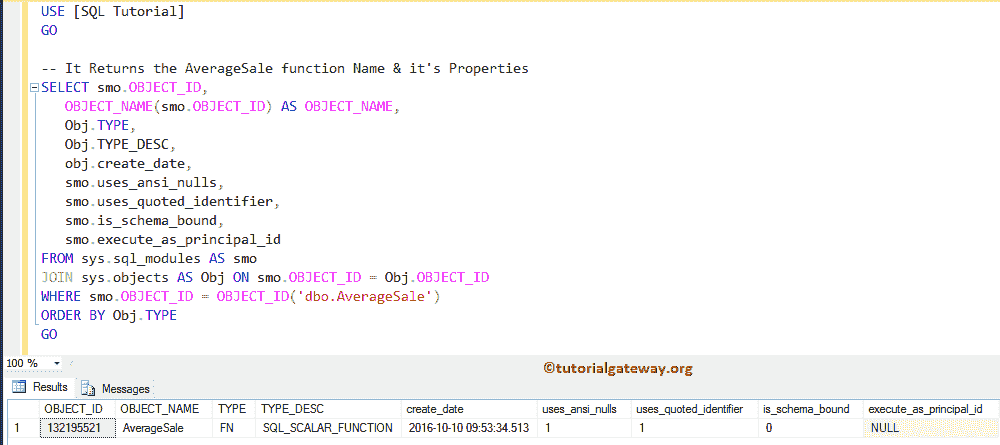

提示:您也可以通过添加:smo 来返回函数定义。`SELECT`语句中的定义。

## 重命名 SQL Server 中的用户定义函数

要使用 Microsoft SSMS 重命名 SQL 用户定义函数，请右键单击要修改的函数(平均值)，然后选择重命名选项

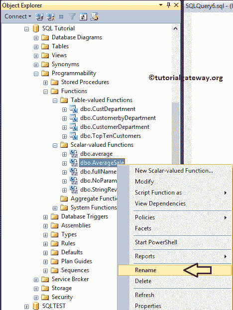

一旦你点击重命名选项，SSMS 允许我们按照我们的要求重命名。

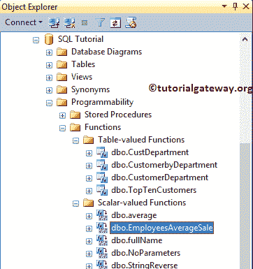

## 修改用户定义的函数

以下示例将帮助您理解使用微软 SSMS(SSMS)和查询修改或变更 SQL 用户定义函数。

### 使用 SSMS 更改用户定义文件

要使用 SSMS 修改 UDF，请右键单击要更改的函数(CustomerbyDepartmnet)，然后选择修改选项

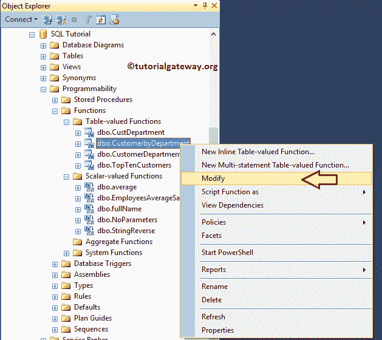

选择修改选项后，将打开一个包含以下查询的新查询窗口。你可以根据自己的要求进行编辑。

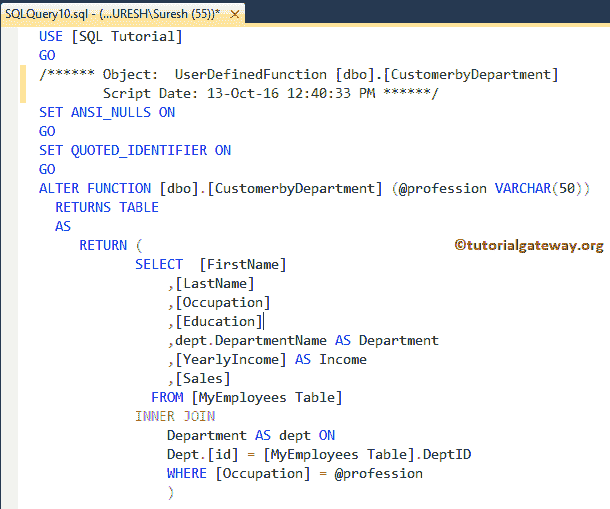

### 使用查询更改 SQL 用户定义函数

让我使用 ALTER FUNCTION 来修改现有的函数。出于演示目的，我们将[将](https://www.tutorialgateway.org/sql-concat-function/)的名和姓连接为名

```
ALTER FUNCTION [dbo].[CustomerbyDepartment] (@profession VARCHAR(50))
  RETURNS TABLE
  AS
     RETURN (
 SELECT  [FirstName] + ' ' + [LastName] AS Name
 ,[Occupation]
 ,[Education]
 ,dept.DepartmentName AS Department
 ,[YearlyIncome] AS Income
 ,[Sales]
   FROM [MyEmployees Table]
 INNER JOIN 
 Department AS dept ON
 Dept.[id] = [MyEmployees Table].DeptID
 WHERE [Occupation] = @profession
 )
```

让我们看看输出

```
SELECT * FROM [dbo].[CustomerbyDepartment] ('Management')
GO
```

从下面的截图中，你可以看到这个函数返回的是名字，而不是名字和姓氏。

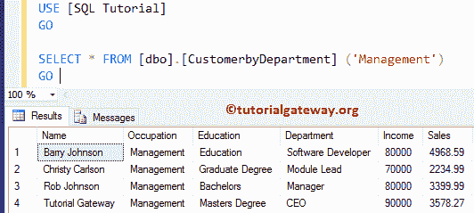

## 删除 SQL Server 中的用户定义函数

如何使用微软 SSMS(SSMS)和 T-SQL 查询删除 SQL 用户定义函数。在我们进入示例之前，请记住这些限制:

*   如果函数中有任何引用，或者[视图](https://www.tutorialgateway.org/views-in-sql-server/)对该函数有引用，SQL Server 将不允许您删除该函数。
*   如果计算列中有任何引用，我们不能删除[检查](https://www.tutorialgateway.org/sql-check-constraint/)或[默认](https://www.tutorialgateway.org/sql-default-constraint/)对该函数的反向引用。

为了演示删除操作，我们添加了两个标量函数。我们的任务是删除“员工”和“销售员工”功能。

### 使用 SSMS 删除用户定义文件

要使用 SSMS 删除 UDF，请右键单击函数名，然后单击删除选项。在这里，我们要删除

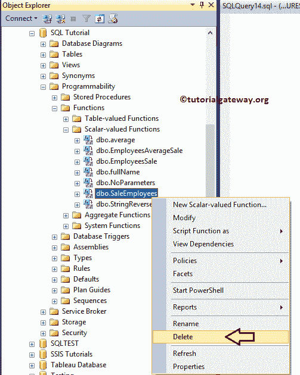

的 SaleEmployees(标量)函数

选择删除选项将打开“删除对象”窗口。单击显示依赖项按钮检查依赖项，然后单击确定删除该功能。

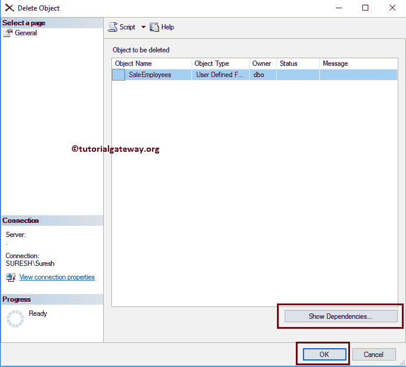

### 使用 SQL 查询删除函数

如何使用 SQL Server 删除函数删除用户定义的函数

```
DROP FUNCTION [dbo].[EmployeesSale]
GO
```

提示:最好使用 IF OBJECT_ID (N'EmployeeSale，N'IF ')不为空来检查该函数是否存在于数据库中

让我们看看当我们调用删除的函数时会发生什么。

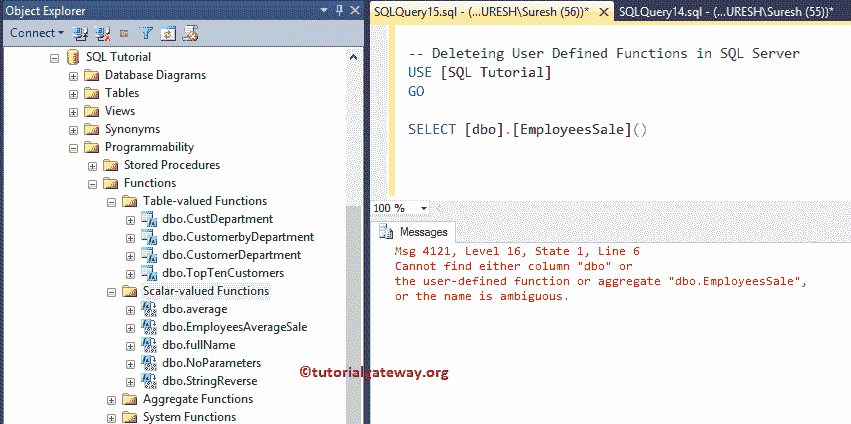

从上面的截图中，我们看到在我们的对象资源管理器中没有`EmployeeSale()`函数，对该函数的查询抛出了一个错误。