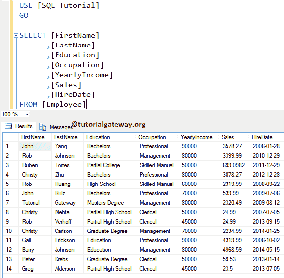

# SQL Server 中的存储过程简介

> 原文：<https://www.tutorialgateway.org/stored-procedures-in-sql/>

SQL Server 存储过程保存保存在 SQL Server 中的一个或一组语句的集合。在这里，我们通过示例向您解释如何在 SQL Server 中创建、重命名、修改和删除存储过程。以下是使用 SQL Server 存储过程的好处

*   所有的 SQL Server 存储过程都是预编译的，并且它们的执行计划是缓存的。因此，当您再次执行相同的命令时，它将使用缓存。
*   它将帮助您封装业务规则和策略。例如，数据库管理员将创建一个过程，多个用户将从 [JAVA](https://www.tutorialgateway.org/java-tutorial/) 、 [C# ](https://www.tutorialgateway.org/csharp-tutorial/) 、 [Python](https://www.tutorialgateway.org/python-tutorial/) 、 [R](https://www.tutorialgateway.org/r-programming/) 等访问该过程。
*   与其发送数百行代码，不如使用存储过程。因此，我们可以调用单个语句(它的名称)，而不是编写复杂的语句或通过网络发送它。
*   SQL server 存储过程帮助您以更安全和统一的方式访问数据库对象
*   网络带宽节约(保护免受伤害或延迟)

我建议您参考以下示例来详细了解 SQL Server 存储过程:

*   [选择](https://www.tutorialgateway.org/select-stored-procedure-in-sql-server/)了解一下，里面的`SELECT`语句怎么写
*   [插入](https://www.tutorialgateway.org/insert-stored-procedure-in-sql-server/)文章，遵循在其中编写`INSERT`语句所涉及的步骤。
*   [更新](https://www.tutorialgateway.org/update-stored-procedure-in-sql-server/)在里面写`UPDATE`语句。
*   [输入参数](https://www.tutorialgateway.org/input-parameters-in-sql-stored-procedure/)以声明和使用输入参数和
*   [输出参数](https://www.tutorialgateway.org/output-parameters-in-sql-stored-procedure/)输出值
*   [返回值](https://www.tutorialgateway.org/return-values-in-sql-stored-procedure/)

在我们进入实际例子之前，让我们看看语法。

## SQL 存储过程语法

[SQL Server](https://www.tutorialgateway.org/sql/) 存储过程的基本语法如下所示:

```
CREATE [OR ALTER] PROCEDURE [Schema_Name].Procedure_Name
                @Parameter_Name Data_type, 
                .... 
                @Parameter_Name Data_type
AS
   BEGIN
      -- Query
      -- SELECT, Insert, Update, Or Delete Statements
      -- You can Use CTE also 
   END
```

让我解释一下语法:

*   架构名称:请指定架构名称。例如 dbo，或者 Humanresource 等等。
*   过程名称:您可以指定除系统保留关键字以外的任何名称。请尝试使用有意义的名称，以便您可以快速识别它们。
*   @Parameter_Name:每个存储过程接受零个或多个参数，完全取决于用户需求。在声明参数时，不要忘记适当的数据类型。例如(@FullName VARCHAR(50)，@Age INT)

## 在 SQL Server 中创建存储过程

忘了提，我们可以用两种方式创建它们，而我们用于这个演示的数据



### 使用 SSMS创建 SQL 存储过程

在我们开始创建任何数据库之前，让我们看看我们的数据库是否有任何现有的数据库。要查看现有的，请选择数据库->可编程性->存储过程。从下面的截图中，你可以观察到我们的数据库没有。

右键单击存储过程文件夹将打开上下文菜单。请选择新建->存储过程..从中选择。


单击“新建”选项后，将打开带有默认模板的新查询窗口


在这里，您可以添加名称、参数(如果需要)以及要使用的过程或事务处理查询。

### 使用查询创建 SQL 存储过程

在本例中，我们展示了如何使用创建过程语句创建服务点

```
CREATE PROCEDURE SelectingAllRecordsInEmployee 
AS
BEGIN

 SET NOCOUNT ON;
 SELECT [FirstName]
              ,[LastName]
              ,[Education]
              ,[Occupation]
              ,[YearlyIncome]
              ,[Sales]
              ,[HireDate]
 FROM [Employee]
END
GO
```

SQL 消息输出

```
Messages
--------
Command(s) completed successfully.
```

可以看到，该命令已经成功完成。下面的屏幕截图显示了我们之前创建的存储过程。


## 在 SQL Server 中执行存储过程

我们可以通过两种方式执行它们:

### 使用 SSMS 执行 SQL 存储过程

要使用Management Studio(SSMS)执行 SQL Server 存储过程，请导航到可编程性->存储过程。接下来，选择要执行的命令(选择所有记录员工)，右键单击它将打开上下文菜单。请选择执行选项


选择“执行”选项后，将打开“执行过程”窗口。如果过程有任何参数，我们必须分配/传递这些值，然后单击确定执行。这里，我们的 sp 没有任何参数，因此，单击“确定”执行该过程


单击“确定”按钮后，将打开一个新的查询窗口，其中包含以下自动生成的代码

```
DECLARE @return_value int

EXEC @return_value = [dbo].[SelectingAllRecordsInEmployee]

SELECT 'Return Value' = @return_value

GO
```


### 执行

使用执行命令(执行命令)执行 SQL Server 存储过程

```
EXEC  [dbo].[SelectingAllRecordsInEmployee]
```


## 在 SQL Server 中重命名存储过程

没有所谓的重命名存储过程。因为重命名它不会改变它在 sys.sql_modules 中对应的对象名。因此，如果您想要重命名任何现有的 sp，请删除并使用新名称重新创建它。

```
-- Renaming SP
-- Check whether there is a SP with the Following Name
IF OBJECT_ID ( 'SelectingAllRecordsInEmployee', 'P' ) IS NOT NULL   
    -- If so, Drop that Procedure
     DROP PROCEDURE SelectingAllRecordsInEmployee;  
GO  

-- Creating  SP with New name
CREATE PROCEDURE SelectingEmployeeRecords 
AS
BEGIN

 SET NOCOUNT ON;
 SELECT [FirstName]
          ,[LastName]
          ,[Education]
          ,[Occupation]
          ,[YearlyIncome]
          ,[Sales]
          ,[HireDate]
 FROM [Employee]
END
GO
```

输出

```
Messages
-------
Command(s) completed successfully.
```

从下面的截图中，看到我们成功删除了旧的，并创建了全新的。


## 修改 SQL Server 中的存储过程

以下示例帮助您学习使用[Management Studio](https://www.tutorialgateway.org/sql-server-management-studio/) (SSMS)和查询来修改它们的步骤。

### 使用 SSMS 修改 SQL Server 中的存储过程

要使用Management Studio进行修改，右键单击要修改的名称(选择员工记录)，并选择修改选项


选择“修改”选项后，将打开一个新的查询窗口，其中包含自动生成的 ALTER PROCEDURE 代码。你可以根据你的要求改变。


### 使用更改修改 SQL Server 中的存储过程

这个例子将向您展示使用 ALTER PROJECt 语句修改现有过程所涉及的步骤。为此，请单击新建查询并返回以下查询。

```
ALTER PROCEDURE [dbo].[SelectingEmployeeRecords] 
AS
BEGIN
 SET NOCOUNT ON;
 SELECT [FirstName]
              ,[LastName]
              ,[Education]
              ,[Occupation] AS Profession
              ,[YearlyIncome]
             ,[Sales]
 FROM [Employee]
END
```

运行上面的 alter 查询

```
Messages
--------
Command(s) completed successfully.
```

让我们执行上面的操作来检查我们是否成功修改。

```
EXEC [dbo].[SelectingEmployeeRecords]
GO
```


## 删除 SQL Server 中的存储过程

以下示例将向您展示如何使用 Transact SQL 查询和 Microsoft SSMS(SSMS)删除或删除 SQL 存储过程。

### 使用 SSMS删除 SQL 存储过程

在本例中，我们将展示如何使用 SSMS (SSMS)删除 SQL 存储过程。为此，请导航到要删除的文件。接下来，右键单击过程名称以打开上下文菜单。您可以点击删除选项如下所示


在这个 SQL 存储过程演示中，我们将删除选择员工记录。选择删除选项后，将打开“删除对象”窗口，如下所示。单击显示依赖项按钮检查依赖项，然后单击确定将其删除。


### 删除或删除

在本例中，我们向您展示了如何使用查询删除 SQL Server 中的存储过程。

```
IF OBJECT_ID ( 'SelectingEmployeeRecords', 'P' ) IS NOT NULL   
    DROP PROCEDURE SelectingEmployeeRecords;  
GO
```

提示:如果对象标识(存储过程名'，' P ')不为空，最好检查数据库中是否存在该名称或 sp

## SQL 存储过程最佳实践

以下是可能有助于提高 SQL Server 存储过程性能的建议列表。

*   创建或引用任何数据库对象时，请尝试使用模式名。这将减少数据库引擎的处理时间。
*   始终在`SELECT`语句中指定所需的列名。并避免选择*语句
*   使用([创建表格](https://www.tutorialgateway.org/sql-create-table/)或[更改表格](https://www.tutorialgateway.org/sql-alter-table/)创建或更改表格时，使用 DEFAULT 关键字将默认值分配给列。它将阻止空值，并将这些默认值分配给列数据。
*   当您在 sp 内创建[临时表](https://www.tutorialgateway.org/temp-table-in-sql-server/)时，您必须指定列是接受空值，还是不显式接受空值。这可以通过使用空值或非空值来实现
*   与其提取或插入大量数据，不如尝试使用更少的基本数据。它减少了查询处理负载，提高了查询性能。
*   在 SQL server 存储过程中使用 SET NOCOUNT ON 语句。它将关闭由 SQL Server 发送给客户端的消息。它包括更新、删除的行数等。
*   尝试用“`UNION ALL`运算符”替换“联合运算符”或“或运算符”，除非您正在寻找不同的值。
*   如果可能，请避免在返回大量数据的`SELECT`语句中使用标量函数。这是因为标量函数应用于每一行(row basic)，所以会影响查询性能。
*   为了处理错误，SQL 允许我们在 SQL Server 存储过程中使用 [TRY CATCH](https://www.tutorialgateway.org/sql-try-catch/) 功能。因此，尝试使用 TRY CATCH 特性
*   始终使用 BEGIN..在服务点内提交[事务](https://www.tutorialgateway.org/sql-transaction/)。请记住，交易应该尽可能短。否则，死锁或长时间锁定都有危险。

### 创建存储过程的最佳方法

这将是实时创作的理想方式

```
IF OBJECT_ID ( 'SelectingEmployeeRecords', 'P' ) IS NOT NULL   
    DROP PROCEDURE SelectingEmployeeRecords;  
GO
CREATE PROCEDURE SelectingEmployeeRecords 
AS
BEGIN

 SET NOCOUNT ON;
 SELECT [FirstName]
          ,[LastName]
          ,[Education]
          ,[Occupation]
          ,[YearlyIncome]
          ,[Sales]
          ,[HireDate]
 FROM [Employee]
END
GO
```