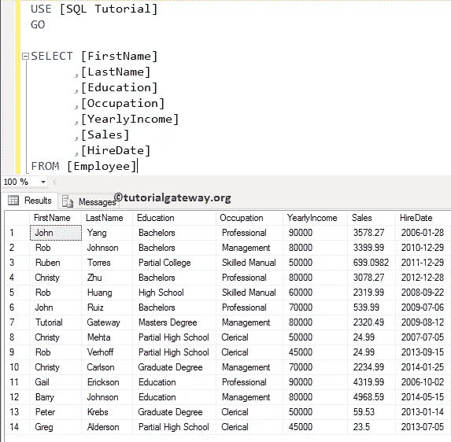
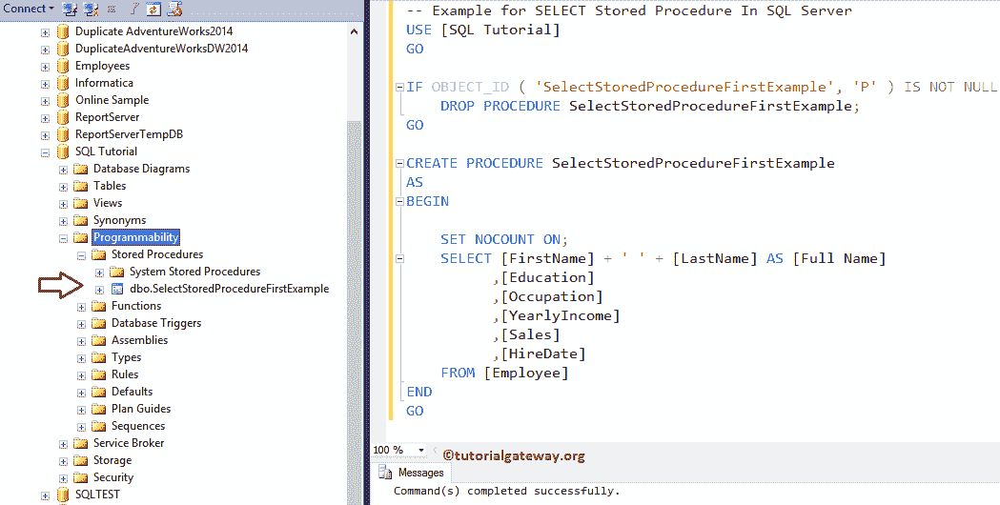
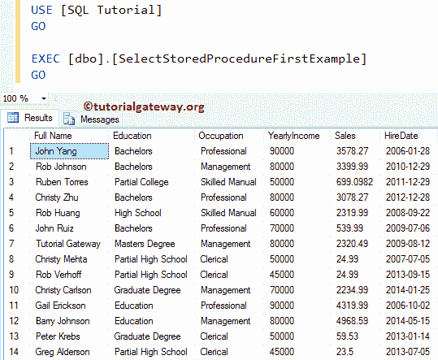
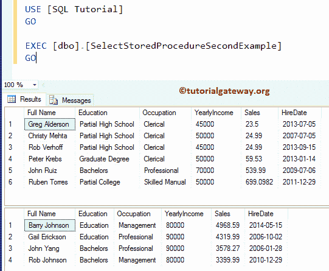
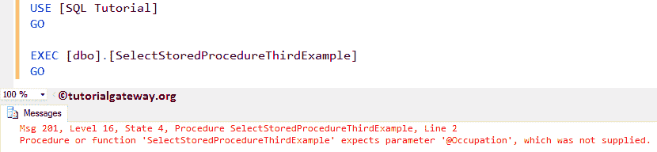
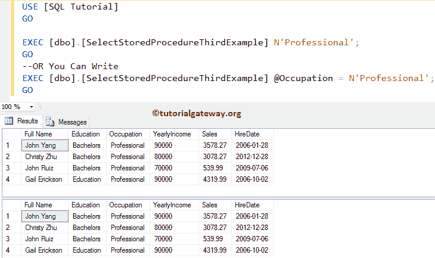
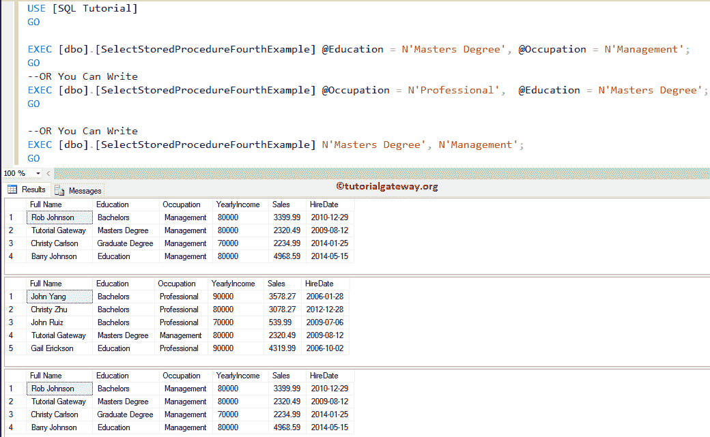

# 在 SQL Server 中选择存储过程

> 原文：<https://www.tutorialgateway.org/select-stored-procedure-in-sql-server/>

如何在 SQL Server 中编写 SELECT 存储过程？。或者用例子说明如何在存储过程中编写 SELECT 语句。在这个 SQL Server SELECT 存储过程演示中，我们使用了下面显示的数据。



## 在 SQL Server 示例中选择存储过程

在这个 [SQL Server](https://www.tutorialgateway.org/sql/) 示例中，我们将向您展示如何在存储过程中使用 [SELECT 语句](https://www.tutorialgateway.org/sql-select-statement/)。我建议你参考[SQL Server 中存储过程介绍](https://www.tutorialgateway.org/stored-procedures-in-sql/)文章来了解基础知识。

```
-- Example for SELECT Statement Inside the SQL Stored Procedure

IF OBJECT_ID ( 'SelectStoredProcedureFirstExample', 'P' ) IS NOT NULL   
    DROP PROCEDURE SelectStoredProcedureFirstExample;  
GO

CREATE PROCEDURE SelectStoredProcedureFirstExample
AS
BEGIN
      SET NOCOUNT ON;
      SELECT [FirstName] + ' ' + [LastName] AS [Full Name]
            ,[Education]
            ,[Occupation]
            ,[YearlyIncome]
            ,[Sales]
            ,[HireDate]
      FROM [Employee]
END
GO
```

从上面的代码片段中，您可以看到我们将名字和第二个名字连接为全名。我们正在使用 [SQL`SPACE()`函数](https://www.tutorialgateway.org/sql-space-function/)来提供名和姓之间的空间



让我使用执行命令(Execute Command)执行存储过程来检查结果

```
EXEC [dbo].[SelectStoredProcedureFirstExample]
GO
```



### SQL 存储过程中的多条选择语句

本示例将向您展示如何在存储过程中使用多个 [SELECT 语句](https://www.tutorialgateway.org/sql-select-statement/)。从下面的代码片段中，您可以看到，

*   首先，我们从员工中选择排名前 6 的记录，按销售额升序排列。
*   接下来，我们从员工中选择排名前 4 的记录，按销售额降序排列。

```
-- Example for SELECT Statement inside the Stored Procedure In SQL Server

IF OBJECT_ID ( 'SelectStoredProcedureSecondExample', 'P' ) IS NOT NULL   
    DROP PROCEDURE SelectStoredProcedureSecondExample;  
GO

CREATE PROCEDURE SelectStoredProcedureSecondExample
AS
BEGIN
	SET NOCOUNT ON;
	SELECT TOP 6 [FirstName] + ' ' + [LastName] AS [Full Name]
          ,[Education]
          ,[Occupation]
          ,[YearlyIncome]
          ,[Sales]
          ,[HireDate]
	FROM [Employee]
	ORDER BY [Sales] ASC

	SELECT TOP 4 [FirstName] + ' ' + [LastName] AS [Full Name]
          ,[Education]
          ,[Occupation]
          ,[YearlyIncome]
          ,[Sales]
          ,[HireDate]
	FROM [Employee]
	ORDER BY [Sales] DESC
END
GO
```

在单个存储过程查询中运行上述多个选择语句

```
Messages
--------
Command(s) completed successfully.
```

让我执行存储过程来检查结果

```
EXEC [dbo].[SelectStoredProcedureSecondExample]
GO
```



### 在存储过程中选择带参数的语句

本示例使用参数创建选择存储过程。

```
-- Example for SELECT Statement within the Stored Procedure In SQL Server

IF OBJECT_ID ( 'SelectStoredProcedureThirdExample', 'P' ) IS NOT NULL   
    DROP PROCEDURE SelectStoredProcedureThirdExample;  
GO
CREATE PROCEDURE SelectStoredProcedureThirdExample
	@Occupation VARCHAR(50)
AS
BEGIN
	SET NOCOUNT ON;
	SELECT [FirstName] + ' ' + [LastName] AS [Full Name]
          ,[Education]
          ,[Occupation]
          ,[YearlyIncome]
          ,[Sales]
          ,[HireDate]
	FROM [Employee]
	WHERE [Occupation] = @Occupation
END
GO
```

```
Messages
--------
Command(s) completed successfully.
```

让我执行选择存储过程

```
EXEC [dbo].[SelectStoredProcedureThirdExample]
GO
```



如您所见，它抛出了一个错误，指出:我们没有传递@占领参数的值。因此，让我们使用以下任何一种方式传递参数值

```
EXEC [dbo].[SelectStoredProcedureThirdExample] N'Professional';
GO
--OR You Can Write
EXEC [dbo].[SelectStoredProcedureThirdExample] @Occupation = N'Professional';
GO
```



### 在存储过程中选择具有多个参数的语句

我们在存储过程中使用多个参数和 Select 语句。

```
-- Example for SELECT Statement with Stored Procedure in SQL Server

IF OBJECT_ID ( 'SelectStoredProcedureFourthExample', 'P' ) IS NOT NULL   
    DROP PROCEDURE SelectStoredProcedureFourthExample;  
GO

CREATE PROCEDURE SelectStoredProcedureFourthExample
	@Education VARCHAR(50),
	@Occupation VARCHAR(50)
AS
BEGIN
	SET NOCOUNT ON;
	SELECT [FirstName] + ' ' + [LastName] AS [Full Name]
          ,[Education]
          ,[Occupation]
          ,[YearlyIncome]
          ,[Sales]
          ,[HireDate]
	FROM [Employee]
	WHERE [Occupation] = @Occupation OR
	[Education] = @Education
END
GO
```

```
Messages
--------
Command(s) completed successfully.
```

以下是执行 select 存储过程的几种方法。让我执行 sp。

```
EXEC [dbo].[SelectStoredProcedureFourthExample] @Education = N'Masters Degree', @Occupation = N'Management';
GO
--OR You Can Write
EXEC [dbo].[SelectStoredProcedureFourthExample] @Occupation = N'Professional',  @Education = N'Masters Degree';
GO

--OR You Can Write
EXEC [dbo].[SelectStoredProcedureFourthExample] N'Masters Degree', N'Management';
GO
```

