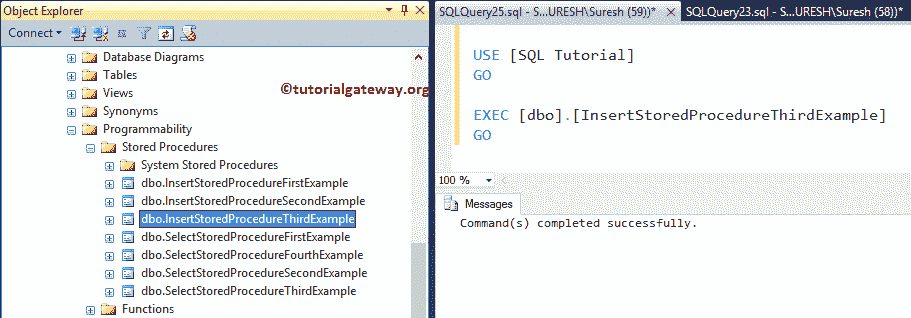

# SQL Server 中的`INSERT`和存储过程

> 原文：<https://www.tutorialgateway.org/insert-stored-procedure-in-sql-server/>

如何在 SQL 存储过程中编写`INSERT`语句？。或者用例子说明如何在 SQL Server 中编写 INSERT 存储过程。对于这个演示，我们将使用下表


和员工表


## 在 SQL Server 中插入存储过程示例

在这个 [SQL Server](https://www.tutorialgateway.org/sql/) 示例中，我们将向您展示如何在存储过程中使用 [`INSERT`语句](https://www.tutorialgateway.org/sql-insert-statement/)。建议大家参考[SP](https://www.tutorialgateway.org/stored-procedures-in-sql/)文章介绍了解基础知识。

```sql
IF OBJECT_ID ( 'InsertStoredProcedureFirstExample', 'P' ) IS NOT NULL   
    DROP PROCEDURE InsertStoredProcedureFirstExample;  
GO

CREATE PROCEDURE InsertStoredProcedureFirstExample

AS
BEGIN
	SET NOCOUNT ON;
	INSERT INTO [EmployeeDup] ([FirstName], [LastName], [Occupation], [YearlyIncome], [Sales])
	VALUES ('Tutorial', 'Gateway', 'Education', 10000, 200)
          ,('Imran', 'Khan', 'Skilled Professional', 15900, 100)
          ,('Doe', 'Lara', 'Management', 15000, 60)
          ,('Ramesh', 'Kumar', 'Professional', 65000, 630)

END
GO
```

从上面的代码片段中，您可以看到我们在空的 EmployeeDup 表中插入了四行。运行上面的 sp。

```sql
Messages
--------
Command(s) completed successfully.
```

让我使用执行命令(Execute Command)执行存储过程来检查结果

```sql
EXEC [dbo].[InsertStoredProcedureFirstExample]
GO
```

执行上面的查询

```sql
Messages
--------
Command(s) completed successfully.
```

现在，让我们看看存储过程的执行是否将新记录插入到我们的 EmployeeDup 表中

```sql
SELECT [ID]
      ,[FirstName]
      ,[LastName]
      ,[Occupation]
      ,[YearlyIncome]
      ,[Sales]
  FROM [EmployeeDup]
```


### 在 SQL Server 中插入存储过程示例 2

此示例说明如何使用；[`SELECT`语句](https://www.tutorialgateway.org/sql-select-statement/)并在存储过程中`INSERT`语句。从下面的代码片段中，您可以看到我们正在使用[`INSERT SELECT`语句](https://www.tutorialgateway.org/sql-insert-into-select-statement/)将员工表中的所有记录插入到员工数据表中

```sql
IF OBJECT_ID ( 'InsertStoredProcedureSecondExample', 'P' ) IS NOT NULL   
    DROP PROCEDURE InsertStoredProcedureSecondExample;  
GO

CREATE PROCEDURE InsertStoredProcedureSecondExample
AS
BEGIN
	SET NOCOUNT ON;
	INSERT INTO [EmployeeDup] ([FirstName], [LastName], [Occupation], [YearlyIncome], [Sales])
	                   SELECT [FirstName], [LastName], [Occupation], [YearlyIncome], [Sales]
					   FROM [Employee]
END
GO
```

运行查询

```sql
Messages
--------
Command(s) completed successfully.
```

让我执行 sp 来加载这些值

```sql
EXEC [dbo].[InsertStoredProcedureSecondExample]
GO
```


接下来，写下下面的查询来检查我们是否插入了记录。

```sql
SELECT [ID]
      ,[FirstName]
      ,[LastName]
      ,[Occupation]
      ,[YearlyIncome]
      ,[Sales]
  FROM [EmployeeDup]
```


### 使用`WHERE`子句插入存储过程

在本例中，我们将向您展示如何在存储过程中使用 [`WHERE`子句](https://www.tutorialgateway.org/sql-where-clause/)以及 [INSERT INTO`SELECT`语句](https://www.tutorialgateway.org/sql-insert-into-select-statement/)。从下面的代码中可以看出，该过程应该插入从员工到销售额大于 3400 的员工的所有记录。

```sql
IF OBJECT_ID ( 'InsertStoredProcedureThirdExample', 'P' ) IS NOT NULL   
    DROP PROCEDURE InsertStoredProcedureThirdExample;  
GO

CREATE PROCEDURE InsertStoredProcedureThirdExample
AS
BEGIN
	SET NOCOUNT ON;
	INSERT INTO [EmployeeDup] ([FirstName], [LastName], [Occupation], [YearlyIncome], [Sales])
	                   SELECT [FirstName], [LastName], [Occupation], [YearlyIncome], [Sales]
			   FROM [Employee]
			   WHERE [Sales] > 3400
END
GO
```

使用`WHERE`子句查询运行上述插入存储过程

```sql
Messages
--------
Command(s) completed successfully.
```

在执行这个存储过程之前，我们[截断了](https://www.tutorialgateway.org/sql-truncate-table/)EmployeDum 表来理解记录。让我们使用 EXEC 命令来执行存储过程

```sql
EXEC [dbo].[InsertStoredProcedureThirdExample]
GO
```



让我们运行以下查询，看看存储过程是否插入了销售额大于 3400 的记录

```sql
SELECT [ID]
      ,[FirstName]
      ,[LastName]
      ,[Occupation]
      ,[YearlyIncome]
      ,[Sales]
  FROM [EmployeeDup]
```


### 在 SQL 存储过程中插入带参数的语句

在本例中，我们向您展示了如何使用参数创建插入存储过程。

```sql
IF OBJECT_ID ( 'InsertStoredProcedureFourthExample', 'P' ) IS NOT NULL   
    DROP PROCEDURE InsertStoredProcedureFourthExample;  
GO

CREATE PROCEDURE InsertStoredProcedureFourthExample
	@Occupation VARCHAR(50)
AS
BEGIN
	SET NOCOUNT ON;
	INSERT INTO [EmployeeDup] ([FirstName], [LastName], [Occupation], [YearlyIncome], [Sales])
	                   SELECT [FirstName], [LastName], [Occupation], [YearlyIncome], [Sales]
			   FROM [Employee]
			   WHERE [Occupation] = @Occupation
END
GO
```

运行上述带有参数的服务点查询

```sql
Messages
--------
Command(s) completed successfully.
```

让我执行存储过程。如您所见，我们有@占领参数。因此，让我们使用以下任何一种方式传递参数值

```sql
EXEC [dbo].[InsertStoredProcedureFourthExample] N'Professional';
GO
--OR You Can Write
EXEC [dbo].[InsertStoredProcedureFourthExample] N'Management';
GO

```


让我们看看插入的数据

```sql
SELECT [ID]
      ,[FirstName]
      ,[LastName]
      ,[Occupation]
      ,[YearlyIncome]
      ,[Sales]
  FROM [EmployeeDup]
```


### 在 SQL 存储过程中插入多参数语句

在本例中，我们将在存储过程中使用多个参数和`INSERT`语句。

```sql
IF OBJECT_ID ( 'InsertStoredProcedureFifthExample', 'P' ) IS NOT NULL   
    DROP PROCEDURE InsertStoredProcedureFifthExample;  
GO

CREATE PROCEDURE InsertStoredProcedureFifthExample
	@Education VARCHAR(50),
	@Occupation VARCHAR(50)
AS
BEGIN
	SET NOCOUNT ON;
	INSERT INTO [EmployeeDup] ([FirstName], [LastName], [Occupation], [YearlyIncome], [Sales])
	                   SELECT [FirstName], [LastName], [Occupation], [YearlyIncome], [Sales]
					   FROM [Employee]
					   WHERE [Education] = @Education OR [Occupation] = @Occupation
END
GO
```

用多个参数运行上面的 sp 查询

```sql
Messages
--------
Command(s) completed successfully.
```

以下是执行存储过程的几种方法。让我执行 sp。

```sql
EXEC [dbo].[InsertStoredProcedureFifthExample] @Education = N'Bachelors', @Occupation = N'Clerical';
GO
--OR You Can Write
EXEC [dbo].[InsertStoredProcedureFifthExample] @Occupation = N'Clerical',  @Education = N'Bachelors';
GO

--OR You Can Write
EXEC [dbo].[InsertStoredProcedureFifthExample] N'Bachelors', N'Clerical';
GO
```


使用下面显示的查询来检查插入的结果。

```sql
SELECT [ID]
      ,[FirstName]
      ,[LastName]
      ,[Occupation]
      ,[YearlyIncome]
      ,[Sales]
  FROM [EmployeeDup]
```

