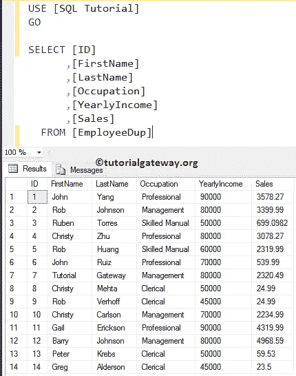
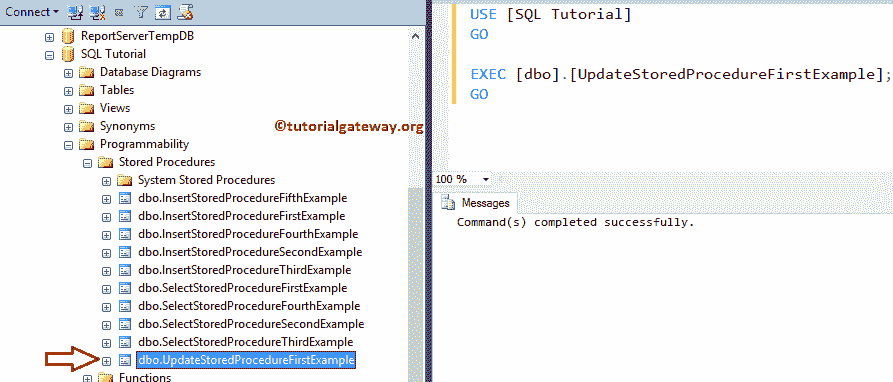
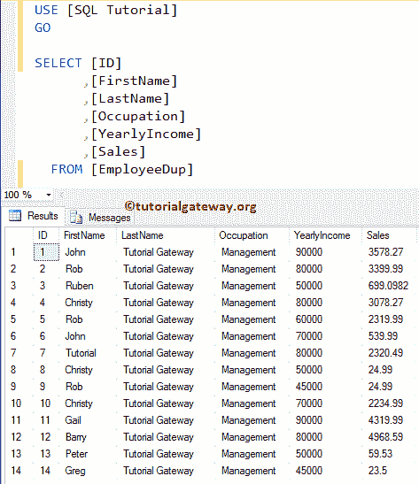
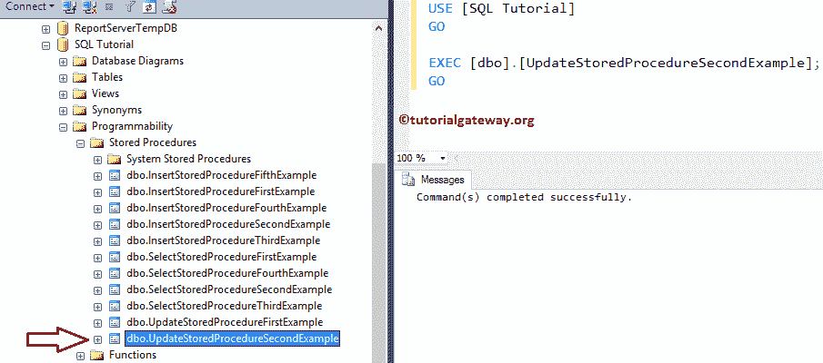
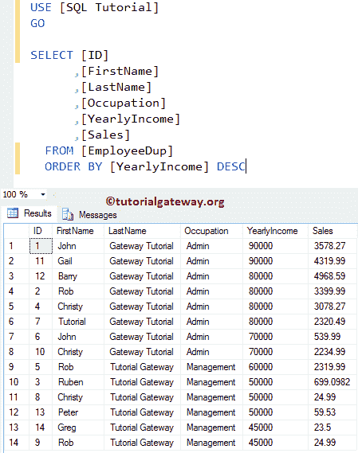
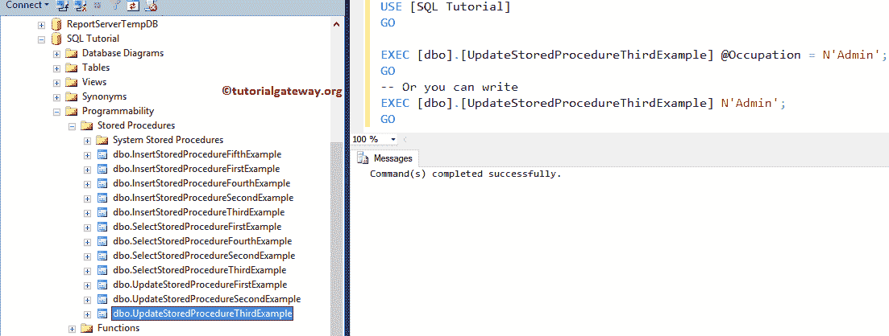
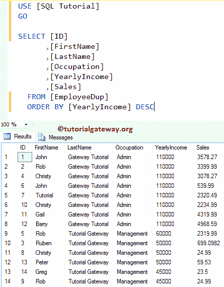
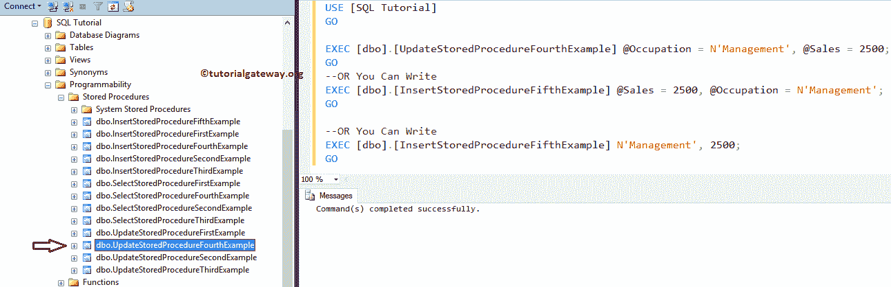
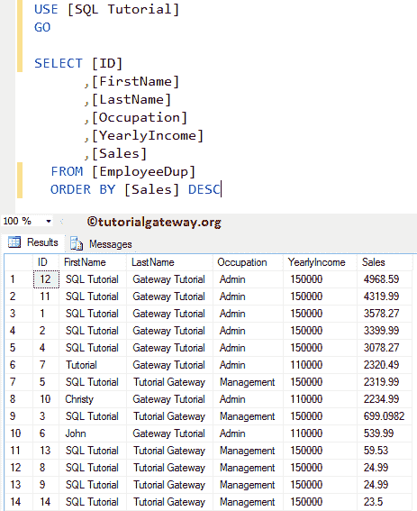

# 在 SQL Server 中更新存储过程

> 原文:[https://www . tutorialgateway . org/update-SQL server 中的存储过程/](https://www.tutorialgateway.org/update-stored-procedure-in-sql-server/)

如何在 SQL 存储过程中编写更新语句？。或者用一个例子说明如何在 SQL Server 中编写 UPDATE 存储过程。

在这个 SQL Server UPDATE 存储过程演示中，我们将使用下表。我建议您参考“存储过程简介”一文来了解基础知识。



## 更新 SQL Server 中的存储过程示例

在这个例子中，我们将展示如何在存储过程中使用 [UPDATE 语句](https://www.tutorialgateway.org/sql-update-statement/)。请参考[存储过程介绍](https://www.tutorialgateway.org/stored-procedures-in-sql/)一文。

```
-- Example for UPDATE Statement within the Stored Procedure in SQL Server

IF OBJECT_ID ( 'UpdateStoredProcedureFirstExample', 'P' ) IS NOT NULL   
    DROP PROCEDURE UpdateStoredProcedureFirstExample;  
GO

CREATE PROCEDURE UpdateStoredProcedureFirstExample

AS
BEGIN
	SET NOCOUNT ON;
	UPDATE [EmployeeDup] SET [LastName] = N'Tutorial Gateway',
	                         [Occupation] = N'Management'

END
GO
```

从上面的代码 [SQL](https://www.tutorialgateway.org/sql/) 片段中，您可以看到，我们正在为 EmployeeDup 表中的所有记录更新姓氏作为教程网关，职业作为管理。运行上面的查询

```
Messages
--------
Command(s) completed successfully.
```

使用执行命令(执行命令)执行存储过程

```
EXEC [dbo].[UpdateStoredProcedureFirstExample];
GO
```



现在，让我们看看存储过程的执行是否更新了我们的 EmployeeDup 表中的姓氏和职业

```
SELECT [ID]
      ,[FirstName]
      ,[LastName]
      ,[Occupation]
      ,[YearlyIncome]
      ,[Sales]
  FROM [EmployeeDup]
```



### 用 WHERE 子句更新 SQL Server 中的存储过程

在本例中，我们将向您展示如何在存储过程中使用 [WHERE 子句](https://www.tutorialgateway.org/sql-where-clause/)以及 [UPDATE 语句](https://www.tutorialgateway.org/sql-update-statement/)。

如您所见，该过程将更新姓氏作为网关教程。以及年收入大于或等于 70000 的“员工”表中所有记录的管理员职业。

```
-- Example for UPDATE Statement within the Stored Procedure in SQL Server
IF OBJECT_ID ( 'UpdateStoredProcedureSecondExample', 'P' ) IS NOT NULL   
    DROP PROCEDURE UpdateStoredProcedureSecondExample;  
GO

CREATE PROCEDURE UpdateStoredProcedureSecondExample

AS
BEGIN
	SET NOCOUNT ON;
	UPDATE [EmployeeDup] SET [LastName] = N'Gateway Tutorial',
	                         [Occupation] = N'Admin'
        WHERE [YearlyIncome] >= 70000

END
GO
```

使用 where 子句查询运行上述更新语句存储过程

```
Messages
--------
Command(s) completed successfully.
```

让我们使用 EXEC 命令来执行存储过程

```
EXEC [dbo].[UpdateStoredProcedureSecondExample]
GO
```



让我们运行以下查询，看看存储过程是否更新了记录

```
SELECT [ID]
      ,[FirstName]
      ,[LastName]
      ,[Occupation]
      ,[YearlyIncome]
      ,[Sales]
  FROM [EmployeeDup]
  ORDER BY [YearlyIncome] DESC
```



### 用参数更新 SQL 存储过程中的语句

此示例说明如何使用参数创建更新存储过程。

```
-- Example for UPDATE Statement within the Stored Procedure

IF OBJECT_ID ( 'UpdateStoredProcedureThirdExample', 'P' ) IS NOT NULL   
    DROP PROCEDURE UpdateStoredProcedureThirdExample;  
GO

CREATE PROCEDURE UpdateStoredProcedureThirdExample
        @Occupation VARCHAR(50)
AS
BEGIN
	SET NOCOUNT ON;
	UPDATE [EmployeeDup] SET [YearlyIncome] = 110000
    WHERE [Occupation] = @Occupation	 
END
GO
```

使用参数查询运行上述更新语句存储过程

```
Messages
--------
Command(s) completed successfully.
```

让我执行存储过程。如您所见，我们有@占领参数。因此，让我们使用以下任何一种方式传递参数值

```
EXEC [dbo].[UpdateStoredProcedureThirdExample] @Occupation = N'Admin';
GO
-- Or you can write
EXEC [dbo].[UpdateStoredProcedureThirdExample] N'Admin';
GO
```



让我们看看插入的数据

```
SELECT [ID]
      ,[FirstName]
      ,[LastName]
      ,[Occupation]
      ,[YearlyIncome]
      ,[Sales]
  FROM [EmployeeDup]
  ORDER BY [YearlyIncome] DESC
```



### 在存储过程中使用多个参数更新语句

在本例中，我们将在存储过程中使用多个参数和 Update 语句。

```
-- Example for UPDATE Statement within the Stored Procedure

IF OBJECT_ID ( 'UpdateStoredProcedureFourthExample', 'P' ) IS NOT NULL   
    DROP PROCEDURE UpdateStoredProcedureFourthExample;  
GO

CREATE PROCEDURE UpdateStoredProcedureFourthExample
        @Occupation VARCHAR(50),
		@Sales FLOAT
AS
BEGIN
	SET NOCOUNT ON;
	UPDATE [EmployeeDup] SET [FirstName] = N'SQL Tutorial',
	                         [YearlyIncome] = 150000
    WHERE [Occupation] = @Occupation OR [Sales] >= @Sales	 
END
GO
```

使用多参数查询运行上述更新语句存储过程

```
Messages
--------
Command(s) completed successfully.
```

可以执行存储过程的方式数。让我执行 sp。

```
EXEC [dbo].[UpdateStoredProcedureFourthExample] @Occupation = N'Management', @Sales = 2500;
GO
--OR You Can Write
EXEC [dbo].[InsertStoredProcedureFifthExample] @Sales = 2500, @Occupation = N'Management';
GO

--OR You Can Write
EXEC [dbo].[InsertStoredProcedureFifthExample] N'Management', 2500;
GO
```



使用下面显示的查询来检查更新存储过程结果。

```
SELECT [ID]
      ,[FirstName]
      ,[LastName]
      ,[Occupation]
      ,[YearlyIncome]
      ,[Sales]
  FROM [EmployeeDup]
  ORDER BY [Sales] DESC
```

