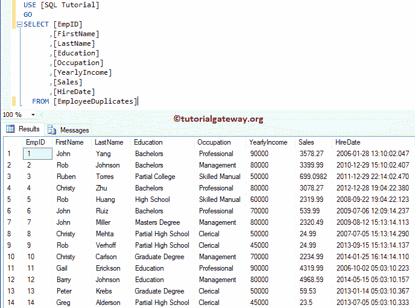
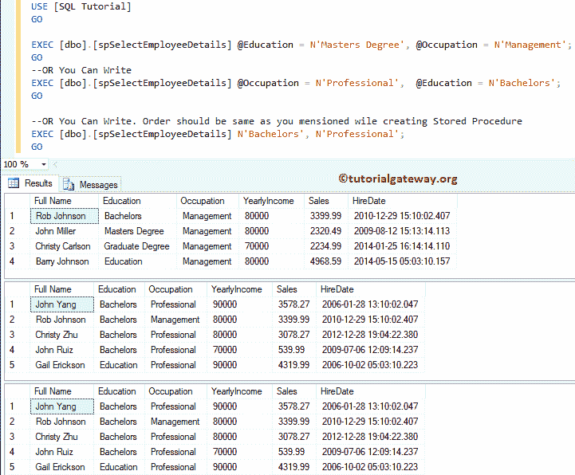

# SQL 存储过程中的输入参数

> 原文：<https://www.tutorialgateway.org/input-parameters-in-sql-stored-procedure/>

如何在 SQL 存储过程中使用输入参数？。或者通过示例说明如何在选择、插入和更新存储过程中使用输入参数。

建议大家参考[存储过程介绍](https://www.tutorialgateway.org/stored-procedures-in-sql/)一文，了解存储过程的基础知识。对于这个 SQL 存储过程输入参数的演示，我们将使用如下所示的 [SQL](https://www.tutorialgateway.org/sql/) 表



## SQL 存储过程选择语句中的输入参数

在本例中，我们将向您展示如何在选择存储过程中使用输入参数。请参考[在 SQL 中选择存储过程](https://www.tutorialgateway.org/select-stored-procedure-in-sql-server/)一文，了解如何在存储过程中编写[选择语句](https://www.tutorialgateway.org/sql-select-statement/)。

```
-- Example for Stored Procedure with Input Parameters

CREATE PROCEDURE spGetEmployeeDetails
	@Occupation VARCHAR(50)
AS
BEGIN
  SET NOCOUNT ON;
    SELECT [FirstName] + ' ' + [LastName] AS [Full Name]
          ,[Education]
          ,[Occupation]
          ,[YearlyIncome]
          ,[Sales]
          ,[HireDate]
    FROM [EmployeeDuplicates]
    WHERE [Occupation] = @Occupation
END
```

```
Messages
--------
Command(s) completed successfully.
```

让我执行存储过程。这里，我们必须传递@占领参数的值。因此，让我使用以下任何一种方式传递参数值

```
-- Example for SQL Stored Procedure with Input Parameters

EXEC [dbo].[spGetEmployeeDetails] N'Management';
GO
--OR You Can Write
EXEC [dbo].[spGetEmployeeDetails] @Occupation = N'Professional';
GO
```


### 选择存储过程示例 2 中的输入参数

在本例中，我们将在存储过程中使用多输入参数和 Select 语句。

```
-- Example for Stored Procedure with Input Parameters

CREATE PROCEDURE spSelectEmployeeDetails
	@Education VARCHAR(50),
	@Occupation VARCHAR(50)
AS
BEGIN
	SET NOCOUNT ON;
	SELECT [FirstName] + ' ' + [LastName] AS [Full Name]
          ,[Education]
          ,[Occupation]
          ,[YearlyIncome]
          ,[Sales]
          ,[HireDate]
	FROM [EmployeeDuplicates]
	WHERE [Education] = @Education OR [Occupation] = @Occupation
END
```

```
Messages
--------
Command(s) completed successfully.
```

以下是执行存储过程的几种方法。让我执行 sp。

```
-- Example for Stored Procedure with Input Parameters

EXEC [dbo].[spSelectEmployeeDetails] @Education = N'Masters Degree', @Occupation = N'Management';
GO
-- OR You Can Write
EXEC [dbo].[spSelectEmployeeDetails] @Occupation = N'Professional',  @Education = N'Bachelors';
GO

-- OR You Can Write. Order should be same as you mentioned while creating Stored Procedure
EXEC [dbo].[spSelectEmployeeDetails] N'Bachelors', N'Professional';
GO
```



## SQL 存储过程插入语句中的输入参数

在这个例子中，我们展示了如何在插入存储过程中使用输入参数。请参考[在 SQL 中插入存储过程](https://www.tutorialgateway.org/insert-stored-procedure-result-into-temporary-table-in-sql/)一文，了解如何在存储过程中编写[插入语句](https://www.tutorialgateway.org/sql-insert-statement/)。

```
-- Example for Stored Procedure with Input Parameters

CREATE PROCEDURE [dbo].[spInsertEmployeeDetails]
	@FirstName varchar(100),
	@LastName nvarchar(100),
	@Education nvarchar(200),
	@Occupation nvarchar(200),
	@YearlyIncome float,
	@Sales float
AS
BEGIN
  BEGIN TRY
    BEGIN TRANSACTION;
	INSERT INTO [EmployeeDuplicates]
	   ([FirstName], [LastName], [Education], [Occupation], [YearlyIncome], [Sales], [HireDate])
	VALUES (@FirstName, @LastName, @Education, @Occupation, @YearlyIncome, @Sales, GETDATE())
	COMMIT TRANSACTION;
  END TRY
  BEGIN CATCH
	IF @@TRANCOUNT > 0
	   ROLLBACK TRANSACTION;
	   THROW;
  END CATCH
END
```

运行存储过程输入参数查询

```
Messages
--------
Command(s) completed successfully.
```

让我执行存储过程。在这里，您可以避免参数名称。但是，您必须按照创建过程时指定的顺序提供参数值。

```
-- Example for Stored Procedure with Input Parameters

EXEC  [dbo].[spInsertEmployeeDetails]
	@FirstName = 'Tutorial',
	@LastName = 'Gateway',
	@Education = 'Masters Degree',
	@Occupation = 'Management',
	@YearlyIncome = 120000,
	@Sales = 4580.987
```


让我给你看看桌子。


## SQL 存储过程更新语句中的输入参数

此示例说明如何在更新存储过程中使用输入参数。请参考[更新 SQL 中的存储过程](https://www.tutorialgateway.org/update-stored-procedure-in-sql-server/)一文，了解如何在存储过程中编写[更新语句](https://www.tutorialgateway.org/sql-update-statement/)。

```
-- Example for Stored Procedure with Input Parameters

CREATE PROCEDURE spUpdateEmployeeDetails
        @Occupation VARCHAR(50),
		@Sales FLOAT
AS
BEGIN
  BEGIN TRY
    BEGIN TRANSACTION;
	SET NOCOUNT ON;
	UPDATE [EmployeeDuplicates] 
	    SET [FirstName] = N'SQL',
		[LastName] = N'Tutorial',
		[YearlyIncome] = 150000
	    WHERE [Occupation] = @Occupation OR 
		  [Sales] >= @Sales	 
	COMMIT TRANSACTION;
  END TRY
  BEGIN CATCH
    IF @@TRANCOUNT > 0
    ROLLBACK TRANSACTION;
	   THROW;
  END CATCH
END
```

在存储过程查询中运行输入参数

```
Messages
--------
Command(s) completed successfully.
```

以下是执行存储过程的几种方法。让我用输入参数执行 sp。

```
-- Example for Stored Procedure with Input Parameters

EXEC [dbo].[spUpdateEmployeeDetails] @Sales = 4580.987, @Occupation = N'Management';
GO
-- OR You Can Write
EXEC [dbo].[spUpdateEmployeeDetails] @Occupation = N'Management',  @Sales = 4580.987;
GO

-- OR You Can Write. Order should be same as you mentioned while creating Stored Procedure
EXEC [dbo].[spUpdateEmployeeDetails] 4580.987, N'Management';
GO
```


让我给你看看桌子。

