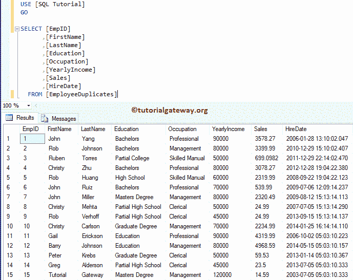
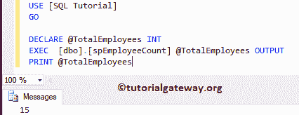
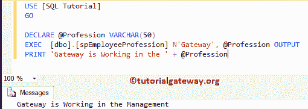
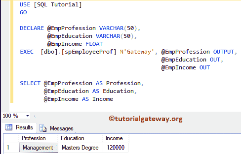
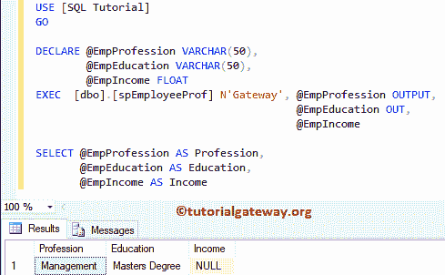

# SQL 存储过程中的输出参数

> 原文：<https://www.tutorialgateway.org/output-parameters-in-sql-stored-procedure/>

如何在 SQL 存储过程中使用输出参数？。或者如何使用输出参数从 SQL 存储过程返回值或消息，并举例说明。

要从 Sql 存储过程输出值，您必须声明一个变量以及 OUT 或 OUT 关键字。在这个 SQL 存储过程输出参数演示中，我们将使用如下所示的 SQL 表



## SQL 存储过程示例 1 中的输出参数

在本例中，我们向您展示了如何在存储过程中使用输出参数。请参阅[选择存储过程](https://www.tutorialgateway.org/select-stored-procedure-in-sql-server/)一文，了解如何在存储过程中编写[选择语句](https://www.tutorialgateway.org/sql-select-statement/)。并参考[存储过程介绍](https://www.tutorialgateway.org/stored-procedures-in-sql/)一文了解 [SQL Server](https://www.tutorialgateway.org/sql/) 存储过程的基础知识。

下面的语句将创建一个名为“实例帐户”的存储过程。我们声明了一个名为整数类型的@EmployeeCount 的变量以及 OUTPUT 关键字。在程序中，我们使用[计数](https://www.tutorialgateway.org/sql-count-function/)来查找员工重复表中的员工数量。然后我们给输出参数赋值。

```
-- Example for SQL Stored Procedure with Output Parameters

CREATE PROCEDURE [dbo].[spEmployeeCount]
	@EmployeeCount INT OUTPUT
AS
BEGIN
	SELECT @EmployeeCount = COUNT(EmpID)FROM [EmployeeDuplicates]
END
```

```
Messages
--------
Command(s) completed successfully.
```

让我执行存储过程。这里，我们必须传递输出参数@EmployeeCount 参数。

```
-- Example for SQL Stored Procedure with Output Parameters

-- Declare a Variable of Type Int. Should match with SP's Output parameter
DECLARE	@TotalEmployees INT 

-- Don't forget OUTPUT keyword
EXEC  [dbo].[spEmployeeCount] @TotalEmployees OUTPUT

-- Printing the Output
PRINT @TotalEmployees
```



## SQL 存储过程示例 2 中的输出参数

在本例中，我们向您解释了如何在单个存储过程中同时使用输入和输出参数。请参考【存储过程中的输入参数】一文了解如何在存储过程中使用输入参数。

在这里，我们声明了一个名为@LastName 的变量作为输入参数，而 Varchar 类型的@ EmployeeProfession 作为输出参数。在该过程中，我们找到了姓氏等于输入参数的员工的职业。接下来，我们给输出参数赋值。

```
-- Example for SQL Stored Procedure with Output Parameters

CREATE PROCEDURE [dbo].[spEmployeeProfession]
	@LastName VARCHAR(50),
	@EmployeeProfession VARCHAR(50) OUTPUT
AS
BEGIN
	SELECT @EmployeeProfession = [Occupation] FROM [EmployeeDuplicates] 
					WHERE [LastName] = @LastName
END
```

```
Messages
--------
Command(s) completed successfully.
```

让我执行存储过程。这里，我们必须将@LastName 的值作为网关传递。

```
-- Example for SQL Stored Procedure with Output Parameters

DECLARE	@Profession VARCHAR(50) 
EXEC  [dbo].[spEmployeeProfession] N'Gateway', @Profession OUTPUT
PRINT 'Gateway is Working in the ' + @Profession
```



## SQL 存储过程示例 3 中的输出参数

让我们看看如何在存储过程中使用输出参数来返回多个输出。这里，我们声明了一个名为@LastName 的变量作为输入参数，以及三个输出参数。在该过程中，我们将查找姓氏等于输入参数的员工的职业、教育和年收入。接下来，我们给输出参数赋值。

```
-- Example for SQL Stored Procedure with Output Parameters

CREATE PROCEDURE [dbo].[spEmployeeProf]
	@LastName VARCHAR(50),
	@Profession VARCHAR(50) OUTPUT,
	@Education VARCHAR(50) OUTPUT,
	@Income FLOAT OUTPUT
AS
BEGIN
	SELECT @Profession = [Occupation],
		@Education = Education,
		@Income = YearlyIncome
	 FROM [EmployeeDuplicates] 
	 WHERE [LastName] = @LastName
END
```

```
Messages
--------
Command(s) completed successfully.
```

让我执行存储过程。

```
-- Example for SQL Stored Procedure with Output Parameters

DECLARE	@EmpProfession VARCHAR(50), 
	@EmpEducation VARCHAR(50),
	@EmpIncome FLOAT
EXEC  [dbo].[spEmployeeProf] N'Gateway', @EmpProfession OUTPUT, 
                                         @EmpEducation OUT,
					 @EmpIncome OUT

SELECT @EmpProfession AS Profession,
       @EmpEducation AS Education, 
       @EmpIncome AS Income
```



让我来告诉你，如果你错过了输出关键字



会发生什么

从上面的截图可以看出，它返回了一个空值。所以，不要忘记 OUTPUT 关键字。