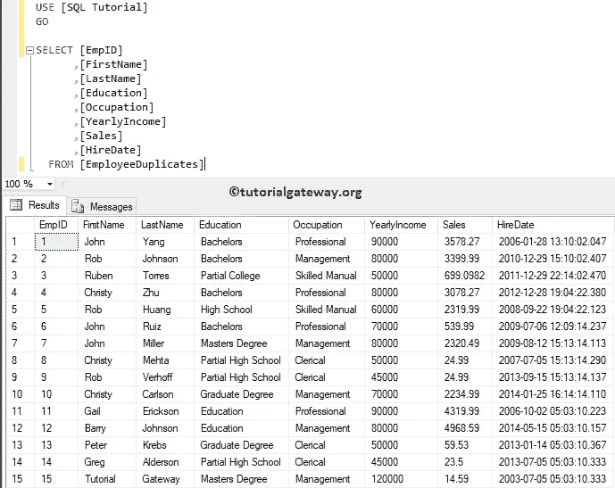
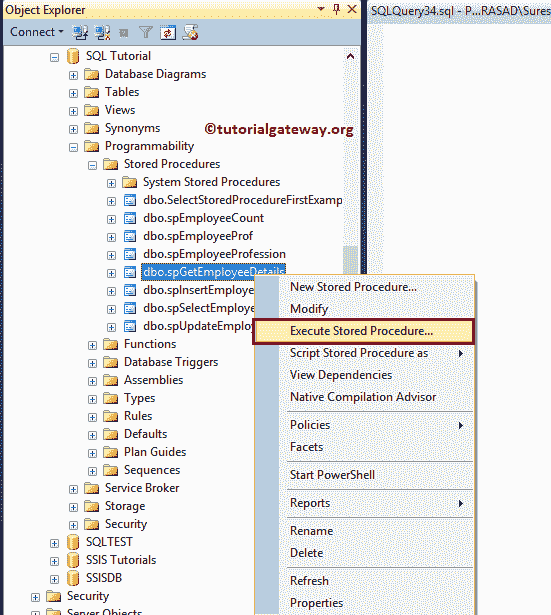
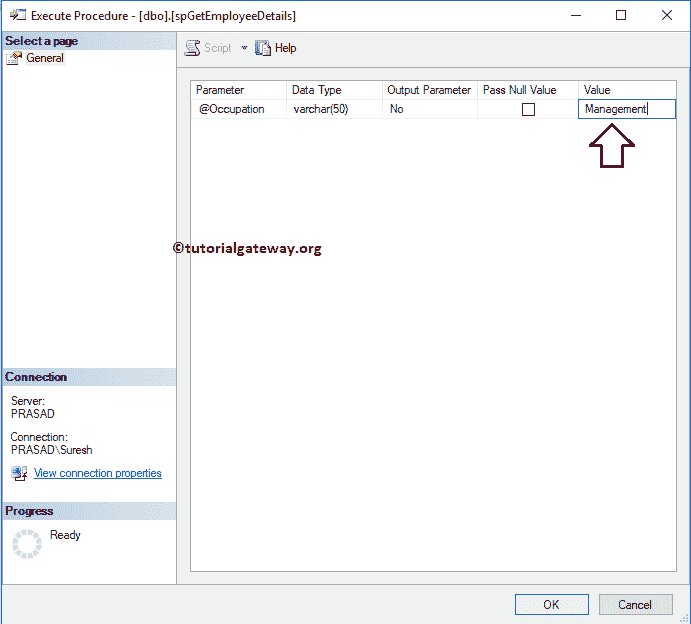
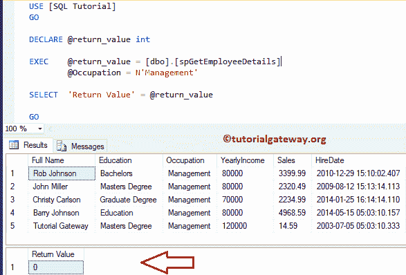
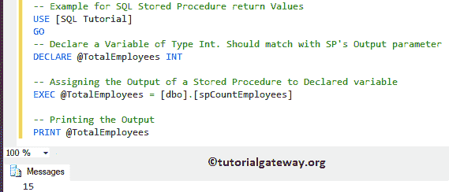
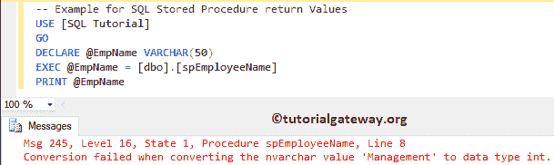

# SQL 存储过程中的返回值

> 原文：<https://www.tutorialgateway.org/return-values-in-sql-stored-procedure/>

如何在 SQL 存储过程中使用返回值或如何使用返回值从存储过程返回消息，并附有示例。

Sql Server 存储过程中的返回值将只返回整数值。默认情况下，如果您成功执行任何存储过程，它将返回 0。对于这个 SQL 存储过程返回输出的演示，我们将使用如下所示的 SQL 表



## SQL 存储过程中的返回值示例 1

在本例中，我们将向您展示由 SQL Server 返回的默认返回值。为了演示相同的内容，让我执行之前创建的存储过程。

我建议您参考 SP 文章的[简介来学习](https://www.tutorialgateway.org/stored-procedures-in-sql/) [SQL Server](https://www.tutorialgateway.org/sql/) 存储过程的基础知识。并参考 SP 文章中的[输入参数来了解该存储过程背后的定义。](https://www.tutorialgateway.org/input-parameters-in-sql-stored-procedure/)

[](https://www.tutorialgateway.org/input-parameters-in-sql-stored-procedure/)

在这里，我们将职业价值指定为管理。



单击“确定”按钮后，将打开一个新的查询窗口，其中包含以下自动生成的代码。如您所见，它返回 0 作为返回值。0 表示成功。

```sql
DECLARE	@return_value int

EXEC	@return_value = [dbo].[spGetEmployeeDetails]
		@Occupation = N'Management'

SELECT	'Return Value' = @return_value

GO
```



## SQL 存储过程中的返回值示例 2

在这个返回值示例中，我们将展示如何在存储过程中使用返回值。请参考 [Select SP](https://www.tutorialgateway.org/select-stored-procedure-in-sql-server/) 文章，在存储过程中编写 [`SELECT`语句](https://www.tutorialgateway.org/sql-select-statement/)。

在这个过程中，我们使用 [COUNT](https://www.tutorialgateway.org/sql-count-function/) 来查找员工重复表中的员工数量，然后返回该值。

```sql
-- Example for Stored Procedure with Output Parameters

CREATE PROCEDURE [dbo].[spCountEmployees]
AS
BEGIN
	RETURN (SELECT COUNT(EmpID)FROM [EmployeeDuplicates])
END

```

```sql
Messages
--------
Command(s) completed successfully.
```

让我执行存储过程。

```sql
-- Declare a Variable of Type Int. Should match with SP's Output parameter
DECLARE	@TotalEmployees INT 

-- Assigning the Output of a Stored Procedure to Declared variable
EXEC @TotalEmployees = [dbo].[spCountEmployees]

-- Printing the Output
PRINT @TotalEmployees
```



## 存储过程返回值示例 3

在本例中，让我向您展示如果我们打印一个字符串(Varchar)数据作为返回值会发生什么。这里，我们选择姓氏等于 Gateway 的员工的职业。(您也可以尝试输入参数，而不是硬编码值)。

```sql
CREATE PROCEDURE [dbo].[spEmployeeName]
AS
BEGIN
 RETURN (SELECT [Occupation] FROM [EmployeeDuplicates]
         WHERE [LastName] = N'Gateway')
END
```

```sql
Messages
--------
Command(s) completed successfully.
```

让我执行存储过程。

```sql
DECLARE	@EmpName VARCHAR(50) 
EXEC @EmpName = [dbo].[spEmployeeName]
PRINT @EmpName
```

从下面的截图可以看出，它抛出了一个错误。因为返回值总是只显示整数。

