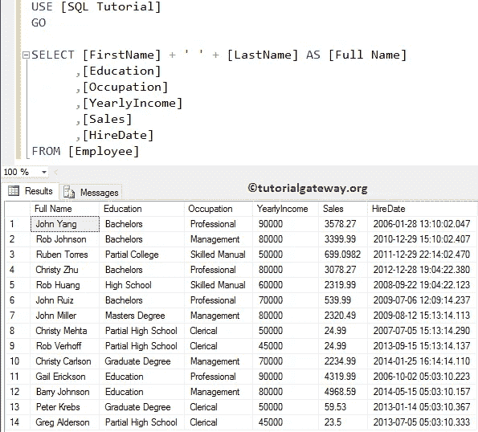
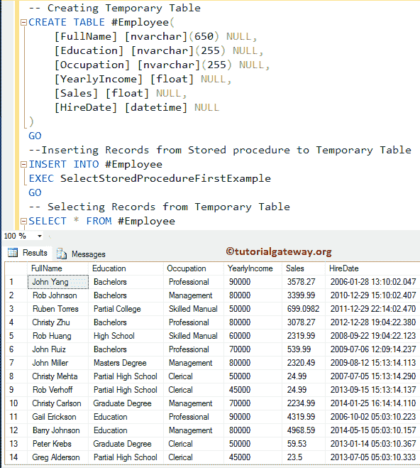
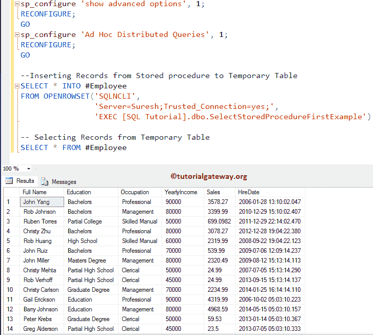

# 在 SQL 中将存储过程结果插入到临时表中

> 原文：<https://www.tutorialgateway.org/insert-stored-procedure-result-into-temporary-table-in-sql/>

如何在 SQL Server 中编写一个将存储过程结果插入临时表的 SQL 查询，并举例说明。对于这个 SQL 面试问题，我们将使用下面显示的数据。数据出现在我们的 SQL 教程数据库的雇员表中。



在这个 SQL Server 示例中，我们将使用下面显示的存储过程，该过程将从 Employee 表中选择所有记录

```
-- Insert Stored Procedure result into Temporary Table Example

IF OBJECT_ID ( 'SelectStoredProcedureFirstExample', 'P' ) IS NOT NULL   
    DROP PROCEDURE SelectStoredProcedureFirstExample;  
GO

CREATE PROCEDURE SelectStoredProcedureFirstExample
AS
BEGIN
      SET NOCOUNT ON;
      SELECT [FirstName] + ' ' + [LastName] AS [Full Name]
            ,[Education]
            ,[Occupation]
            ,[YearlyIncome]
            ,[Sales]
            ,[HireDate]
      FROM [Employee]
END
GO
```

```
Messages
--------
Command(s) completed successfully.
```

建议大家参考[存储过程](https://www.tutorialgateway.org/stored-procedures-in-sql/)和[临时表](https://www.tutorialgateway.org/temp-table-in-sql-server/)两篇文章，了解一下基本思路。并参考[选择声明](https://www.tutorialgateway.org/sql-select-statement/)。

## 在 SQL 示例 1 中将存储过程结果插入临时表

在这个 [SQL Server](https://www.tutorialgateway.org/sql/) 的例子中，我们将创建一个临时表。接下来，我们将使用[`INSERT SELECT`语句](https://www.tutorialgateway.org/sql-insert-into-select-statement/)将存储过程结果插入临时表

```
--  Insert Stored Procedure result into Temporary Table Example
-- Creating Temporary Table
CREATE TABLE # Employee(
	[FullName] [nvarchar](650) NULL,
	[Education] [nvarchar](255) NULL,
	[Occupation] [nvarchar](255) NULL,
	[YearlyIncome] [float] NULL,
	[Sales] [float] NULL,
	[HireDate] [datetime] NULL
)
GO

--Inserting Records from Stored procedure to Temporary Table
INSERT INTO # Employee
EXEC SelectStoredProcedureFirstExample
GO

-- Selecting Records from Temporary Table
SELECT * FROM # Employee
```



## 在 SQL 示例 2 中，将存储过程结果插入临时表

在这个常见问题中，我们使用 [`SELECT INTO`语句](https://www.tutorialgateway.org/sql-select-into-statement/)，和 OPENROWSET 将存储过程结果插入临时表

```
sp_configure 'show advanced options', 1;  
RECONFIGURE;
GO 
sp_configure 'Ad Hoc Distributed Queries', 1;  
RECONFIGURE;  
GO 

--Inserting Records from Stored procedure to Temporary Table
SELECT * INTO # Employee 
FROM OPENROWSET('SQLNCLI', 
		'Server=(local);Trusted_Connection=yes;',
		'EXEC dbo.SelectStoredProcedureFirstExample')

-- Selecting Records from Temporary Table
SELECT * FROM # Employee
```

