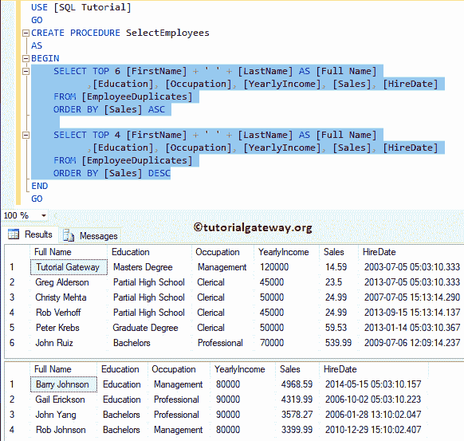
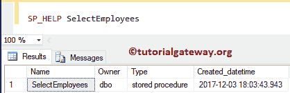
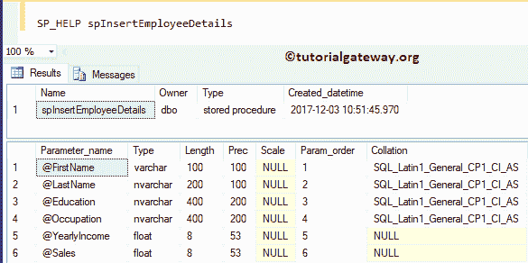
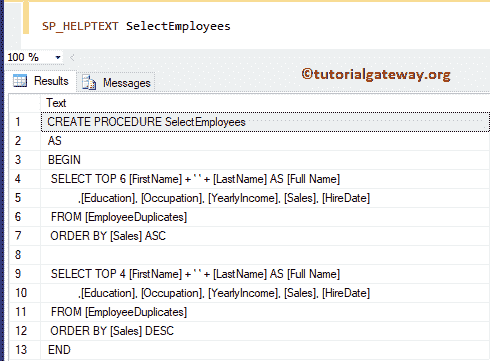
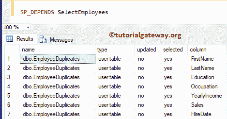

# SQL 中有用的系统存储过程

> 原文：<https://www.tutorialgateway.org/useful-system-stored-procedures-in-sql/>

让我们看看 SQL 中一些有用的系统存储过程。这些过程将帮助您提取现有存储过程的定义和依赖关系。以下三个 Sql Server 系统存储过程对于处理用户定义的过程非常有用:

*   sp_help:此过程将向您显示存储过程名称、模式名称、创建日期和时间。如果有任何参数，则包括参数名称、数据类型、长度、精度、比例、排序规则等。
*   显示存储过程的定义。如果过程是加密的，那么这个 sp_helptext 将不返回任何定义。
*   它将显示所有的依赖关系。检查存储过程依赖于哪个表是有用的。

在这个演示中，我们将使用如下所示的 SQL 表


建议大家参考[存储过程介绍](https://www.tutorialgateway.org/stored-procedures-in-sql/)一文，了解 [SQL](https://www.tutorialgateway.org/sql/) 存储过程的基础知识。

## SQL 示例中有用的系统存储过程

在我们进入系统存储过程之前，让我创建一个简单的存储过程，在存储过程中保存两个 [Select 语句](https://www.tutorialgateway.org/sql-select-statement/)。

```
CREATE PROCEDURE SelectEmployees
AS
BEGIN
	SELECT TOP 6 [FirstName] + ' ' + [LastName] AS [Full Name]
          ,[Education], [Occupation], [YearlyIncome], [Sales], [HireDate]
	FROM [EmployeeDuplicates]
	ORDER BY [Sales] ASC

	SELECT TOP 4 [FirstName] + ' ' + [LastName] AS [Full Name]
          ,[Education], [Occupation], [YearlyIncome], [Sales], [HireDate]
	FROM [EmployeeDuplicates]
	ORDER BY [Sales] DESC
END
GO
```

运行查询

```
Messages
--------
Command(s) completed successfully.
```

让我给你看它返回的数据



### SQL 示例中的存储过程

在本例中，我们将使用 sp_help 存储过程来处理之前创建的过程。

```
SP_HELP SelectEmployees
```



让我使用另一个包含参数的过程。我建议您参考存储过程文章中的[输入参数来理解下面指定的存储过程。](https://www.tutorialgateway.org/input-parameters-in-sql-stored-procedure/)

```
SP_HELP SelectEmployees
```



### SQL 示例中的存储过程

在本例中，我们对先前创建的过程使用 sp_helptext 存储过程。

```
SP_HELPTEXT SelectEmployees
```

从下面的截图中可以看到，SQL sp_helptext 将过程定义显示为文本。



### sp _ depends 示例中的存储过程

在本节中，我们将 sp _ depends 存储过程与之前创建的过程进行比较。

```
SP_DEPENDS SelectEmployees
```

让我们看看 SQL sp _ dependent 的输出。存储过程中使用的所有列都取决于员工重复项。

