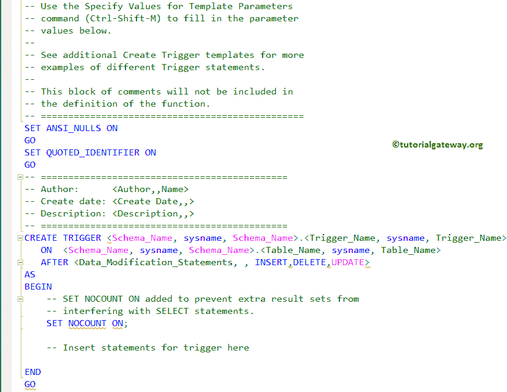
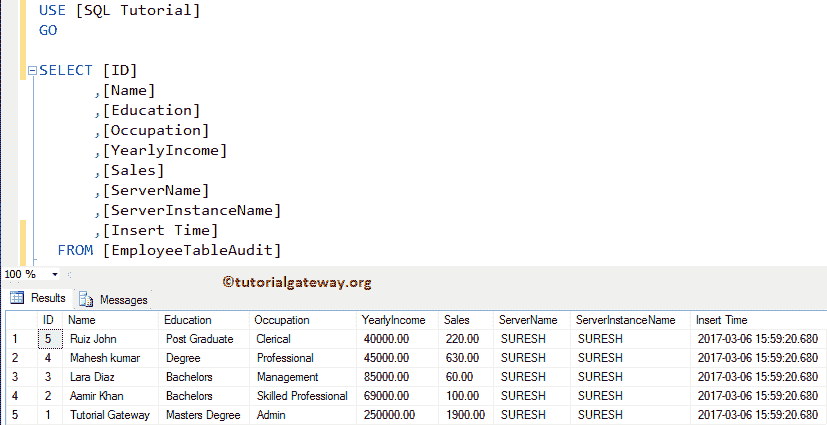

# SQL Server 中的触发器简介

> 原文：<https://www.tutorialgateway.org/triggers-in-sql-server/>

SQL Server 触发器用于在表的插入、删除或更新操作之后或之前执行。您可以在视图或表上使用这些 SQL 触发器来执行上面指定的任何活动。请记住，您只能将触发器与单个表相关联。

## SQL Server 中触发器的类型

在 SQL Server 中有两种类型的触发器，它们是 AFTER 和 INSTEAD OF。

### SQL Server 中的后触发器

SQL 中的 after/for 触发器在表中的 [INSERT](https://www.tutorialgateway.org/sql-insert-statement/) 、 [DELETE](https://www.tutorialgateway.org/sql-delete-statement/) 或 [UPDATE](https://www.tutorialgateway.org/sql-update-statement/) 之后运行。这意味着，在它开始运行之前，所有的操作都应该执行，并且语句也必须在约束[检查](https://www.tutorialgateway.org/sql-check-constraint/)中成功。

[视图](https://www.tutorialgateway.org/views-in-sql-server/)不支持 SQL Server 中的 After 触发器，所以只能在[表](https://www.tutorialgateway.org/sql-create-table/)上使用。它可以进一步分为

1.  [INSERT 后](https://www.tutorialgateway.org/after-insert-triggers-in-sql-server/):在 Employee 表上完成 INSERT 操作后会触发。一旦完成插入雇员表，它将开始插入审计表。比方说，如果它没有插入到雇员中，那么它就不会插入到审计表中。
2.  [更新后](https://www.tutorialgateway.org/after-update-triggers-in-sql-server/):该 SQL Server 触发器将在员工表的更新操作完成后触发。一旦结束更新员工，它将开始在审计表中插入/更新。例如，如果它无法更新雇员表，那么它就不会插入到审计中。
3.  [AFTER DELETE](https://www.tutorialgateway.org/after-delete-triggers-in-sql-server/) :在员工表上完成删除操作后，AFTER DELETE 会触发。一旦完成从员工中删除记录，它将开始从审计表中插入/删除。比方说，如果它未能从员工中删除，那么它就不会插入到审核表中

### 而不是 SQLServer中的触发器

SQL Server 而不是在表开始执行插入、删除或更新之前触发的触发器。

这意味着，在触发器开始运行之前，它不需要任何条件约束检查。因此，即使约束检查失败，该触发器也会执行。它可以进一步分为

*   [代替插入](https://www.tutorialgateway.org/instead-of-insert-triggers-in-sql-server/):该代替插入将在员工表上的插入操作开始之前触发。一旦完成插入员工审计表，它将开始插入员工。如果由于某种原因失败，它不会插入到 Employee 表中。
*   [而不是更新](https://www.tutorialgateway.org/instead-of-update-triggers-in-sql-server/):此更新将在更新员工表中的记录之前触发。一旦完成执行，它将开始更新员工中的记录。如果失败，它不会更新表。
*   [而不是删除](https://www.tutorialgateway.org/instead-of-delete-triggers-in-sql-server/):该删除将在从员工表中删除记录开始之前触发。一旦成功执行，它将开始从“员工”表中删除记录。如果失败，它不会从员工中删除任何记录。

### Sql Server 触发器语法

[SQL Server](https://www.tutorialgateway.org/sql/) 中 After 触发器的语法为

```
CREATE [OR ALTER] TRIGGER [Schema_Name].Trigger_Name
ON Table
AFTER INSERT | UPDATE | DELETE
AS
   BEGIN
      -- Statements
      -- Insert, Update, Or Delete Statements
   END
```

*   架构名称:请指定架构名称。例如，dbo 或人力资源等。
*   触发器名称:您可以指定除系统保留关键字以外的任何名称。请尽量使用有意义的名字，这样你可以很容易地识别它们。

SQL Server 中替代触发器的基本语法如下所示:

```
CREATE [OR ALTER] TRIGGER [Schema_Name].Trigger_Name
ON Table | View
INSTEAD OF INSERT | UPDATE | DELETE
AS
   BEGIN
      -- Trigger Statements
      -- Insert, Update, Or Delete Statements
   END
```

让我们通过一个例子来看看如何在 SQL Server 中创建、修改现有的触发器和删除触发器。

对于 Sql Server 触发器演示，我们正在使用员工和员工审核表。如你所见，它是空的


我们的审计也是空的


## 在 SQL Server 中创建触发器示例

我们可以用两种方式创造它们。在本例中，我们向您展示了使用管理工作室(SSMS)创建触发器的步骤。在我们开始生成之前，让我们看看我们的数据库是否有任何现有的。

要查看现有的，请选择数据库->展开表名(它存在于其上)->转到触发器文件夹并展开它。从下面的截图中，您可以观察到我们数据库下的 Employee 表没有。

右键单击文件夹将打开上下文菜单。请选择新触发器..从中选择。


一旦你点击该选项，它将打开默认模板的新查询窗口，如下图所示



在这里，您可以添加模式名、触发器名、表名、数据修改语句以及要应用的语句。

### 使用事务处理查询创建 SQL 触发器

出于这个 sql 演示的目的，我们在 SQL Server 中创建了一个“插入后触发器”，将记录和审计信息一起插入到员工表审计中

```
CREATE TRIGGER triggers_in_sql 
   ON  EmployeeTable 
   AFTER INSERT
AS 
BEGIN
     -- SET NOCOUNT ON added to prevent extra result sets from
     -- interfering with SELECT statements.
	SET NOCOUNT ON;

     -- Insert statements here
	INSERT INTO [EmployeeTableAudit]( 
       [ID]
      ,[Name]
      ,[Education]
      ,[Occupation]
      ,[YearlyIncome]
      ,[Sales]
      ,[ServerName]
      ,[ServerInstanceName]
      ,[Insert Time])
SELECT  ID,
	Name,
	Education,
	Occupation,
	YearlyIncome,
	Sales,
	CAST( SERVERPROPERTY('MachineName') AS VARCHAR(50)), 
	CAST( SERVERPROPERTY('ServerName') AS VARCHAR(50)), 
	GETDATE()
FROM INSERTED;
PRINT 'We Successfully Fired the AFTER INSERT Triggers in SQL Server.'
END
GO
```

在上一篇文章中，我们已经解释了 SQL 触发器内部的语句。我建议您在此代码下参考 AFTER INSERT 文章。

运行上面的查询

```
Messages
--------
Command(s) completed successfully.
```

让我通过打开对象资源管理器->转到数据库->转到并展开员工->然后展开文件夹，向您展示新创建的对象


出于演示目的，让我在员工中插入 5 条随机记录。这将有助于我们检查后插入是否被激发。

```
INSERT INTO [EmployeeTable] (
		[Name]
	       ,[Education]
	       ,[Occupation]
	       ,[YearlyIncome]
	       ,[Sales]
	     )
VALUES ('Tutorial Gateway', 'Masters Degree', 'Admin', 250000, 1900)
      ,('Aamir Khan', 'Bachelors', 'Skilled Professional', 69000, 100)
      ,('Lara Diaz', 'Bachelors', 'Management', 85000, 60)
      ,('Mahesh kumar', 'Degree', 'Professional', 45000, 630)
      ,('Ruiz John', 'Post Graduate', 'Clerical', 40000, 220)
```


从上面的截图可以看到，我们的触发器已经触发。而且，它正在打印我们放入其中的信息。请使用以下查询检查员工中插入的记录。

```
SELECT [ID]
      ,[Name]
      ,[Education]
      ,[Occupation]
      ,[YearlyIncome]
      ,[Sales]
  FROM [EmployeeTable]

```


接下来，使用以下查询检查审计表中的记录。

```
SELECT [ID]
      ,[Name]
      ,[Education]
      ,[Occupation]
      ,[YearlyIncome]
      ,[Sales]
      ,[ServerName]
      ,[ServerInstanceName]
      ,[Insert Time]
  FROM [EmployeeTableAudit]
```



## 修改 SQL Server 示例中的触发器

以下示例将帮助您理解使用管理工作室修改现有 SQL 触发器和查询所涉及的步骤。

在我们开始修改 SQL 触发器之前，让我向您展示管理工作室向您提供的可用选项列表。如下所示，您可以删除它，删除并重新创建它，更改它，并创建它。


要使用管理工作室修改它，请导航到保存它们的表。接下来，选择您想要修改的(触发器 _in_sql)，右键单击它将打开上下文菜单。在此，选择修改选项


选择“修改”选项后，将打开一个新的查询窗口，其中包含自动生成的 ALTER TRIGGER 代码。你可以根据你的要求修改它。


### 使用 SQL Server 更改触发器修改示例

使用 ALTER 语句修改现有语句的步骤。为此，请单击新建查询并返回以下查询。

```
ALTER TRIGGER [dbo].[triggers_in_sql] 
   ON  [dbo].[EmployeeTable] 
   AFTER INSERT
AS 
BEGIN
 -- Modify as per Your requirement
END
```

## 删除 SQL Server 示例中的触发器

以下示例将向您展示如何使用查询和管理工作室(SSMS)删除它们。在这里，我们向您展示如何使用 SSMS 删除它们。要在使用 SSMS 时删除，右键单击要删除的名称将打开上下文菜单。您可以单击删除选项


在这里，我们将向您展示如何使用 SQL Drop Trigger 语句删除它。

```
DROP TRIGGER [dbo].[triggers_in_sql]
```