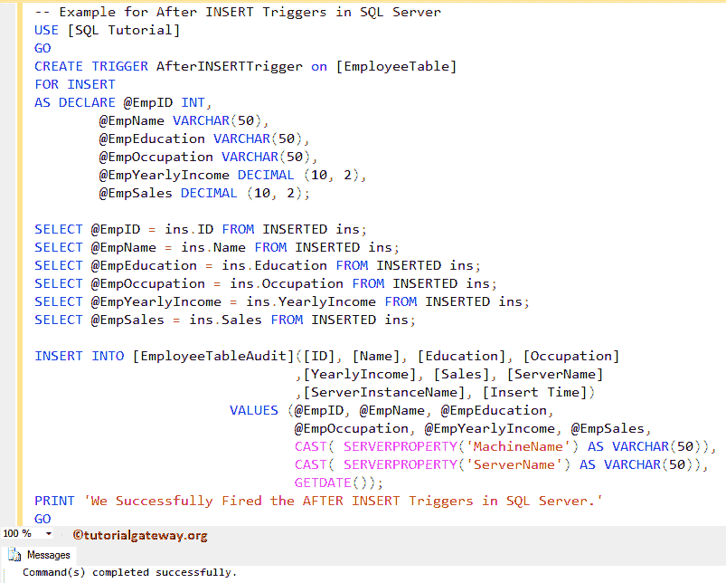
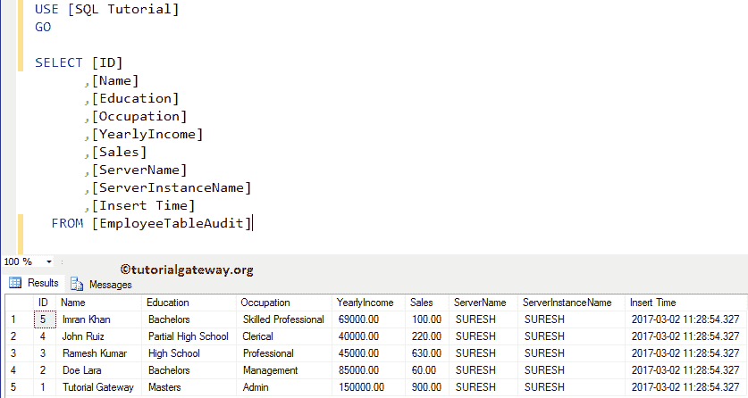

# 在 SQL Server 中`AFTER INSERT`触发器

> 原文：<https://www.tutorialgateway.org/after-insert-triggers-in-sql-server/>

插入操作完成后，将触发插入后的 SQL Server 触发器。视图不支持`AFTER INSERT`触发器的 SQL。对于这个插入后的 SQL Server 触发器演示，我们使用下面显示的表格。

如您所见，我们的员工表是空的。我们的任务是在这个雇员表上创建`AFTER INSERT`触发器的 SQL。并且通过使用这个 SQL Server After Insert 触发器，我们希望将记录和审计信息


一起插入到员工表审计中

我们的员工表审核也是空的


## 在 SQL Server 示例中`AFTER INSERT`触发器

在本例中，我们将使用 CREATE TRIGGER 语句在雇员表上创建一个 SQL Server 中的`AFTER INSERT`触发器。

请记住，在员工表上完成插入操作后，插入后[触发器](https://www.tutorialgateway.org/triggers-in-sql-server/)将触发。一旦完成插入员工表，它将开始插入员工审计表。如果它未能插入到“雇员”表中，则它不会插入到“审计”表中。

提示:您可以参考 [SQL Server](https://www.tutorialgateway.org/sql/) 中【更新触发器】后的、[触发器](https://www.tutorialgateway.org/triggers-in-sql-server/)和【删除触发器】后的[文章。](https://www.tutorialgateway.org/after-delete-triggers-in-sql-server/)

```
-- Example for After INSERT Triggers in SQL Server

CREATE TRIGGER AfterINSERTTrigger on [EmployeeTable]
FOR INSERT 
AS DECLARE @EmpID INT,
	   @EmpName VARCHAR(50),
	   @EmpEducation VARCHAR(50),
	   @EmpOccupation VARCHAR(50),
	   @EmpYearlyIncome DECIMAL (10, 2), 
	   @EmpSales DECIMAL (10, 2); 

SELECT @EmpID = ins.ID FROM INSERTED ins;
SELECT @EmpName = ins.Name FROM INSERTED ins;
SELECT @EmpEducation = ins.Education FROM INSERTED ins;
SELECT @EmpOccupation = ins.Occupation FROM INSERTED ins;
SELECT @EmpYearlyIncome = ins.YearlyIncome FROM INSERTED ins;
SELECT @EmpSales = ins.Sales FROM INSERTED ins;

INSERT INTO [EmployeeTableAudit]( 
       [ID]
      ,[Name]
      ,[Education]
      ,[Occupation]
      ,[YearlyIncome]
      ,[Sales]
      ,[ServerName]
      ,[ServerInstanceName]
      ,[Insert Time])
VALUES (@EmpID,
	@EmpName,
	@EmpEducation,
	@EmpOccupation,
	@EmpYearlyIncome,
	@EmpSales,
	CAST( SERVERPROPERTY('MachineName') AS VARCHAR(50)), 
	CAST( SERVERPROPERTY('ServerName') AS VARCHAR(50)), 
	GETDATE()
	);
PRINT 'We Successfully Fired the AFTER INSERT Triggers in SQL Server.'
GO
```



首先，我们使用 DECLARE 语句来声明所需的变量

```
DECLARE @EmpID INT,
	@EmpName VARCHAR(50),
	@EmpEducation VARCHAR(50),
	@EmpOccupation VARCHAR(50),
	@EmpYearlyIncome DECIMAL (10, 2), 
	@EmpSales DECIMAL (10, 2);
```

接下来，我们使用 [`SELECT`语句](https://www.tutorialgateway.org/sql-select-statement/)来选择记录。以下语句将从插入的值中选择一条记录。

```
SELECT @EmpID = ins.ID FROM INSERTED ins;
SELECT @EmpName = ins.Name FROM INSERTED ins;
SELECT @EmpEducation = ins.Education FROM INSERTED ins;
SELECT @EmpOccupation = ins.Occupation FROM INSERTED ins;
SELECT @EmpYearlyIncome = ins.YearlyIncome FROM INSERTED ins;
SELECT @EmpSales = ins.Sales FROM INSERTED ins;
```

接下来，我们使用 [`INSERT`语句](https://www.tutorialgateway.org/sql-insert-statement/)将所选值插入到员工审核表中。这里，以下语句返回机器名和服务器名。这些信息可能对审计有帮助

```
SERVERPROPERTY('MachineName'), 
SERVERPROPERTY('ServerName')
```

让我向您展示新创建的插入后 SQL Server 触发器。转到 SQL 教程数据库->转到并展开员工表->然后展开触发器文件夹


出于演示目的，我们将五条随机记录插入到 Employee 表中，以检查`AFTER INSERT`触发器是否被触发。

```
INSERT INTO [EmployeeTable] (
		[Name]
	       ,[Education]
	       ,[Occupation]
	       ,[YearlyIncome]
	       ,[Sales]
	     )
VALUES ('Tutorial Gateway', 'Masters', 'Admin', 150000, 900)
      ,('Imran Khan', 'Bachelors', 'Skilled Professional', 69000, 100)
      ,('Doe Lara', 'Bachelors', 'Management', 85000, 60)
      ,('Ramesh Kumar', 'High School', 'Professional', 45000, 630)
      ,('John Ruiz', 'Partial High School', 'Clerical', 40000, 220)
```


从上面的截图可以看到，我们的 Sql After Insert 触发器被触发，并且还在 Audit Table 中插入了一条记录。请使用以下 SQL 查询来检查员工表中插入的记录

```
SELECT [ID]
      ,[Name]
      ,[Education]
      ,[Occupation]
      ,[YearlyIncome]
      ,[Sales]
  FROM [EmployeeTable]

```


接下来，使用以下查询检查员工表审计中的记录。

```
SELECT [ID]
      ,[Name]
      ,[Education]
      ,[Occupation]
      ,[YearlyIncome]
      ,[Sales]
      ,[ServerName]
      ,[ServerInstanceName]
      ,[Insert Time]
  FROM [EmployeeTableAudit]
```


如您所见，我们的审计表返回了一条记录。这是因为，在我们的“插入后”触发器定义中，我们只为每个插入选择一条记录。

## 在 SQL Server 示例 2 中的插入触发器之后

如何使用“`AFTER INSERT`触发器”将所有记录插入审核表(触发表)。为此，我们将修改我们在前面的示例中创建的触发器。

```
-- Second Example for After INSERT Triggers in SQL Server

CREATE TRIGGER AfterINSERTTriggerExample on [EmployeeTable]
FOR INSERT 
AS 
INSERT INTO [EmployeeTableAudit]( 
       [ID]
      ,[Name]
      ,[Education]
      ,[Occupation]
      ,[YearlyIncome]
      ,[Sales]
      ,[ServerName]
      ,[ServerInstanceName]
      ,[Insert Time])
SELECT  ID,
	    Name,
	    Education,
	    Occupation,
	    YearlyIncome,
	    Sales,
	    CAST( SERVERPROPERTY('MachineName') AS VARCHAR(50)), 
	    CAST( SERVERPROPERTY('ServerName') AS VARCHAR(50)), 
	    GETDATE()
FROM INSERTED;
PRINT 'We Successfully Fired Our Second AFTER INSERT Triggers in SQL Server.'
GO
```

这里，我们使用[`INSERT SELECT`语句](https://www.tutorialgateway.org/sql-insert-into-select-statement/)来选择所有插入到雇员表中的记录。然后，我们将这些记录插入到审计表中。

接下来，让我在雇员表中插入一些随机记录

```
INSERT INTO [EmployeeTable] (
		    [Name]
		   ,[Education]
		   ,[Occupation]
		   ,[YearlyIncome]
		   ,[Sales]
	     )
VALUES ('Tutorial Gateway', 'Masters', 'Admin', 150000, 900)
      ,('Doe Lara', 'Bachelors', 'Management', 85000, 60)
      ,('Ramesh Kumar', 'High School', 'Professional', 45000, 630)
      ,('John Ruiz', 'Partial High School', 'Clerical', 40000, 220)
      ,('Imran Khan', 'Bachelors', 'Skilled Professional', 69000, 100)

```


如您所见，我们的 after insert 触发器已经触发，并且还将所有记录插入到了审核表中。让我们看看 Emp 表


接下来，查看员工审计表。



从上面的截图来看，`AFTER INSERT`触发器已经插入了所有的记录。