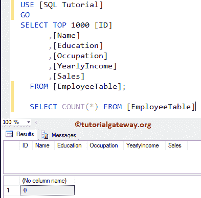
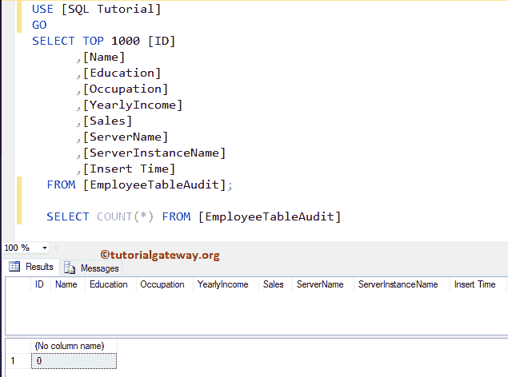
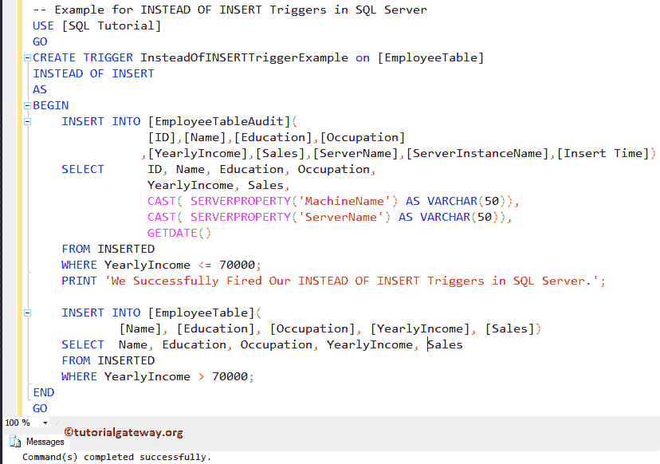
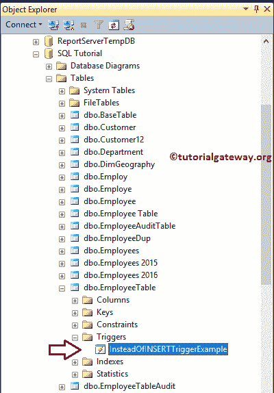
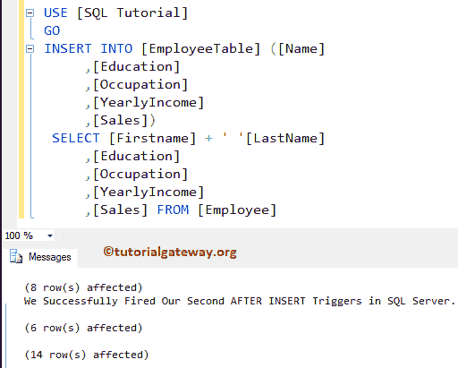
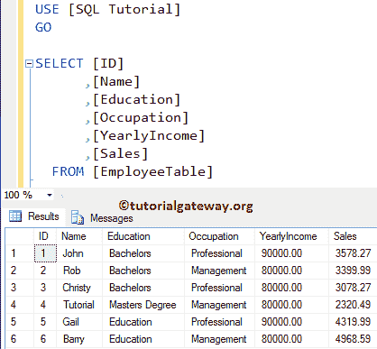
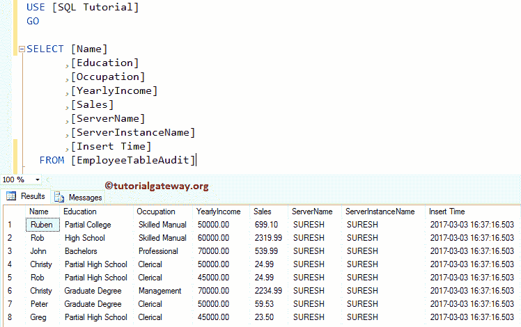

# SQLServer中的`INSTEAD Of INSERT`触发器

> 原文：<https://www.tutorialgateway.org/instead-of-insert-triggers-in-sql-server/>

在表的插入操作开始之前，将触发 SQL Server `INSTEAD Of INSERT`触发器。可以在表和视图中创建 SQL `INSTEAD Of INSERT`触发器。通常，我们在视图中使用它们。在这个 SQL Server 代替插入触发器的演示中，我们使用了下面显示的表格。

这里，我们的任务是在这个雇员表上创建 SQL 而不是 INSERT TRIGGER。通过使用这个代替插入触发器，我们想要限制插入到雇员表中的记录。还将记录插入到审核表中，以及审核信息



我们的员工表审核也是空的



## 代替 SQL Server 示例中的插入触发器

接下来，我们将使用 CREATE TRIGGER 语句在雇员表上创建而不是在 SQL Server 中插入触发器。

请记住，此[触发器](https://www.tutorialgateway.org/triggers-in-sql-server/)将在员工表上的插入操作开始之前触发。一旦完成插入员工审计表，它将开始插入员工表。如果由于某种原因失败，它不会插入到 Employee 表中。

提示:您可以参考 [SQL Server](https://www.tutorialgateway.org/sql/) 中的[视图](https://www.tutorialgateway.org/views-in-sql-server/)、[触发器](https://www.tutorialgateway.org/triggers-in-sql-server/)、[代替删除触发器](https://www.tutorialgateway.org/instead-of-delete-triggers-in-sql-server/)和[代替更新触发器](https://www.tutorialgateway.org/instead-of-update-triggers-in-sql-server/)文章。

从下面的代码片段中，您可以看到我们正在使用 [INSERT INTO`SELECT`语句](https://www.tutorialgateway.org/sql-insert-into-select-statement/)来选择正在插入到 Employee 表中的所有记录，然后

*   我们正在将年收入小于或等于 70000 的记录插入审计表，并且。
*   员工表中年收入大于 70000 的员工

```
-- Example for INSTEAD OF INSERT Triggers in SQL Server

CREATE TRIGGER InsteadOfINSERTTriggerExample on [EmployeeTable]
INSTEAD OF INSERT 
AS
BEGIN 
INSERT INTO [EmployeeTableAudit](
	[ID],
	[Name],
	[Education],
	[Occupation],
	[YearlyIncome],
	[Sales],
        [ServerName],
	[ServerInstanceName],
	[Insert Time])
SELECT  ID,	
        Name, 
	Education, 
	Occupation, 
	YearlyIncome,	
	Sales,
	CAST( SERVERPROPERTY('MachineName') AS VARCHAR(50)),
	CAST( SERVERPROPERTY('ServerName') AS VARCHAR(50)),
	GETDATE()
FROM INSERTED
WHERE YearlyIncome <= 70000;
PRINT 'We Successfully Fired Our INSTEAD OF INSERT Triggers in SQL Server.';

INSERT INTO [EmployeeTable]( 
	[Name],
	[Education],
	[Occupation],
	[YearlyIncome],
	[Sales])
SELECT  Name,
	Education,
	Occupation,
	YearlyIncome,
	Sales
FROM INSERTED
WHERE YearlyIncome > 70000;
END
GO
```



这里，我们使用`INSERT`语句将选定的值插入到雇员表中。下面的语句将返回机器名和服务器名。这些信息可能对审计有帮助

```
SERVERPROPERTY('MachineName'), 
SERVERPROPERTY('ServerName')
```

让我通过打开对象资源管理器向您展示在 SQL Server 中新创建的替代插入触发器。接下来，转到 SQL 教程数据库，展开员工表，然后展开触发器文件夹



对于 SQL Server 替代插入触发器演示，我们将在 Employee 表中插入 14 条记录，以检查替代插入触发器是否被触发。

```
-- Example for Instead of INSERT Triggers in SQL Server

INSERT INTO [EmployeeTable] ([Name]
      ,[Education]
      ,[Occupation]
      ,[YearlyIncome]
      ,[Sales])
  SELECT [Firstname] + ' '[LastName]
      ,[Education]
      ,[Occupation]
      ,[YearlyIncome]
      ,[Sales] 
  FROM [Employee]
```



从上面的截图中，你可以看到我们的 SQL Server 代替 INSERT 触发器触发了。并且，它没有将 14 条记录插入到雇员表中，而是将 8 条记录插入到审计表中，并将 6 条记录插入到雇员表中。请使用以下 SQL 查询来检查员工表中插入的记录

```
-- Example for SQL Instead of INSERT Triggers

SELECT [ID]
      ,[Name]
      ,[Education]
      ,[Occupation]
      ,[YearlyIncome]
      ,[Sales]
  FROM [EmployeeTable]

```



接下来，使用以下查询检查员工表审计中的记录。

```
-- Example for SQL Instead of INSERT Triggers

SELECT [Name]
      ,[Education]
      ,[Occupation]
      ,[YearlyIncome]
      ,[Sales]
      ,[ServerName]
      ,[ServerInstanceName]
      ,[Insert Time]
  FROM [EmployeeTableAudit]
```



您也可以尝试这些条件，例如:将记录插入年收入大于 7000 的员工表中。否则，抛出错误(或消息)等。