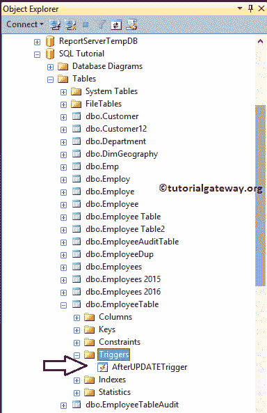
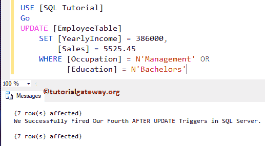

# SQL Server 中的更新后触发器

> 原文：<https://www.tutorialgateway.org/after-update-triggers-in-sql-server/>

在表的更新操作完成后，将触发更新后的 SQL Server 触发器。视图不支持更新后的 SQL 触发器。对于这个更新后的 SQL Server 触发器演示，我们使用下面显示的表格。

这里，我们的任务是在 SQL Server 中的雇员表中创建 AFTER UPDATE 触发器。通过使用这个 SQL Server After Update 触发器，我们希望根据在员工表


上发生的更新操作来更新/插入员工可审核表中的记录

我们的员工表审计也包含了同样的 14 条记录，以及更新时间和执行空列的操作。


## SQL Server 示例中的更新后触发器

在本例中，我们将使用 CREATE TRIGGER 语句在 SQL Server 的 Employee 表中创建一个更新后触发器。

请记住，此更新后的 SQL Server 触发器将在对员工表执行[更新](https://www.tutorialgateway.org/sql-update-statement/)操作后触发。一旦它完成雇员表的更新，它将开始插入/更新雇员审计表。如果[触发器](https://www.tutorialgateway.org/triggers-in-sql-server/)未能更新员工表，则不会插入审核表。

提示:您可以参考 [SQL Server](https://www.tutorialgateway.org/sql/) 中的[触发器](https://www.tutorialgateway.org/triggers-in-sql-server/)、[插入触发器](https://www.tutorialgateway.org/after-insert-triggers-in-sql-server/)后和[删除触发器](https://www.tutorialgateway.org/after-delete-triggers-in-sql-server/)后的文章。

```
-- Example for After UPDATE Triggers in SQL Server

CREATE TRIGGER AfterUPDATETrigger on [EmployeeTable]
FOR UPDATE 
AS DECLARE @EmpID INT,
           @EmpName VARCHAR(50),
	   @EmpEducation VARCHAR(50),
	   @EmpOccupation VARCHAR(50),
	   @EmpYearlyIncome DECIMAL (10, 2), 
	   @EmpSales DECIMAL (10, 2), 
	   @ActionPeformed VARCHAR(50);

SELECT @EmpID = ins.ID FROM INSERTED ins;
SELECT @EmpName = ins.Name FROM INSERTED ins;
SELECT @EmpEducation = ins.Education FROM INSERTED ins;
SELECT @EmpOccupation = ins.Occupation FROM INSERTED ins;
SELECT @EmpYearlyIncome = ins.YearlyIncome FROM INSERTED ins;
SELECT @EmpSales = ins.Sales FROM INSERTED ins;

IF UPDATE(YearlyIncome)
BEGIN
     SET @ActionPeformed = 'Updated Yearly Income'
END

IF UPDATE(Sales)
BEGIN
      SET @ActionPeformed = 'Updated Sales'
END
INSERT INTO [EmployeeTableAudit]( 
       ID
      ,[Name]
      ,[Education]
      ,[Occupation]
      ,[YearlyIncome]
      ,[Sales]
      ,[Update Time]
      ,[ActionPerformed])
VALUES (@EmpID,
        @EmpName,
	@EmpEducation,
	@EmpOccupation,
	@EmpYearlyIncome,
	@EmpSales,
	GETDATE(),
	@ActionPeformed);
PRINT 'We Successfully Fired the AFTER UPDATE Triggers in SQL Server.'
GO
```


首先，我们使用 DECLARE 语句来声明所需的变量

```
AS DECLARE @EmpID INT,
           @EmpName VARCHAR(50),
	   @EmpEducation VARCHAR(50),
	   @EmpOccupation VARCHAR(50),
	   @EmpYearlyIncome DECIMAL (10, 2), 
	   @EmpSales DECIMAL (10, 2), 
	   @ActionPeformed VARCHAR(50);
```

接下来，我们使用 [`SELECT`语句](https://www.tutorialgateway.org/sql-select-statement/)选择插入/更新的记录。以下语句将从插入的值中选择一条记录。

```
SELECT @EmpID = ins.ID FROM INSERTED ins;
SELECT @EmpName = ins.Name FROM INSERTED ins;
SELECT @EmpEducation = ins.Education FROM INSERTED ins;
SELECT @EmpOccupation = ins.Occupation FROM INSERTED ins;
SELECT @EmpYearlyIncome = ins.YearlyIncome FROM INSERTED ins;
SELECT @EmpSales = ins.Sales FROM INSERTED ins;
```

接下来，我们使用`if`语句来检查我们是在更新年度收入还是销售额。根据该操作，我们希望更新@ActionPerformed 列数据，如下所示。这些信息可能对审计有帮助

```
IF UPDATE(YearlyIncome)
BEGIN
     SET @ActionPeformed = 'Updated Yearly Income'
END

IF UPDATE(Sales)
BEGIN
      SET @ActionPeformed = 'Updated Sales'
END
```

让我通过打开对象资源管理器->转到 SQL 教程数据库->查找并展开雇员表->然后展开触发器文件夹，向您展示新创建的触发器



对于 SQL Server 更新后触发器演示，我们正在更新单个列的年收入，其名称为“教程网关”，以检查更新后触发器是否被触发。

```
UPDATE [EmployeeTable]
	SET [YearlyIncome] = 1252565
	WHERE NAME = N'Tutorial Gateway'
```


从上面可以看到，我们的更新后触发器被触发，并且还在审计表中插入了一条记录。请使用此查询检查员工表中的更新记录

```
SELECT [ID]
      ,[Name]
      ,[Education]
      ,[Occupation]
      ,[YearlyIncome]
      ,[Sales]
  FROM [EmployeeTable]

```


接下来，使用以下查询检查员工表审计中的记录。

```
SELECT [ID]
      ,[Name]
      ,[Education]
      ,[Occupation]
      ,[YearlyIncome]
      ,[Sales]
      ,[ServerName]
      ,[ServerInstanceName]
      ,[Insert Time]
      , [Update Time] 
      ,[ActionPerformed]
  FROM [EmployeeTableAudit]
ORDER BY ID
```


从上面的截图中，可以看到触发器又插入了一条 ID 为 7 的记录，并且更新了信息。

## SQL Server 示例 2 中的更新触发器后

如何更新审核表(触发表)中的现有行，而不是使用 SQL Server 中的更新后触发器插入新记录。在这里，我们将修改我们在前面的示例中创建的触发器。

```
-- Example for After UPDATE Triggers in SQL Server

CREATE TRIGGER AfterUPDATETrigger on [EmployeeTable]
FOR UPDATE 
AS DECLARE @EmpID INT, 
           @EmpName VARCHAR(50),
           @EmpEducation VARCHAR(50),
	   @EmpOccupation VARCHAR(50),
	   @EmpYearlyIncome DECIMAL (10, 2), 
	   @EmpSales DECIMAL (10, 2), 
	   @ActionPeformed VARCHAR(50);

SELECT @EmpID = ins.ID FROM INSERTED ins;
SELECT @EmpName = ins.Name FROM INSERTED ins;
SELECT @EmpEducation = ins.Education FROM INSERTED ins;
SELECT @EmpOccupation = ins.Occupation FROM INSERTED ins;
SELECT @EmpYearlyIncome = ins.YearlyIncome FROM INSERTED ins;
SELECT @EmpSales = ins.Sales FROM INSERTED ins;
IF UPDATE(YearlyIncome)
BEGIN
     SET @ActionPeformed = 'Updated Yearly Income'
END
IF UPDATE(Sales)
BEGIN
      SET @ActionPeformed = 'Updated Sales'
END
UPDATE [EmployeeTableAudit]
     SET [Name] = @EmpName, 
         [Education] = @EmpEducation, 
	 [Occupation] = @EmpOccupation,
	 [YearlyIncome] = @EmpYearlyIncome, 
	 [Sales] = @EmpSales, 
	 [Update Time] = GETDATE(), 
	 [ActionPerformed] = @ActionPeformed
WHERE ID = @EmpID;
PRINT 'We Successfully Fired the Second AFTER UPDATE Triggers in SQL Server.'
GO
```

从上面的代码片段中，您可以看到我们正在使用 [UPDATE 语句](https://www.tutorialgateway.org/sql-update-statement/)来更新 Audit 表中的现有记录。

接下来，让我更新员工表中多个记录的年收入

```
UPDATE [EmployeeTable]
	SET [YearlyIncome] = 1252565,
	    [Sales] = 699
	WHERE [Occupation] = N'Management' OR
	      [Education] = N'Partial High School'
```


从上面的截图中，您可以看到我们在 Sql Server 中的更新后触发器已经触发。但是，它更新的是一条记录，而不是全部 7 条记录。让我们看看雇员表


接下来，查看员工审计表。


从上面的截图可以看到，触发器更新了一条也是唯一一条记录。

## SQL Server 示例 3 中的更新触发器后

在本例中，我们将向您展示如何使用 SQL Server 中的更新后触发器将所有记录更新到审核表(触发表)中。在这里，我们将修改上面的触发器。

```
-- Example for After UPDATE Triggers in SQL Server

CREATE TRIGGER AfterUPDATETrigger on [EmployeeTable]
FOR UPDATE 
AS DECLARE @ActionPeformed VARCHAR(50)

IF UPDATE(YearlyIncome)
BEGIN
     SET @ActionPeformed = 'Updated Yearly Income'
END
IF UPDATE(Sales)
BEGIN
      SET @ActionPeformed = 'Updated Sales'
END

INSERT INTO [EmployeeTableAudit]( 
       [ID]
      ,[Name]
      ,[Education]
      ,[Occupation]
      ,[YearlyIncome]
      ,[Sales]
      ,[Update Time]
     ,[ActionPerformed])
SELECT  ID,
	Name,
	Education,
	Occupation,
	YearlyIncome,
	Sales,
	GETDATE(),
	@ActionPeformed
FROM INSERTED;
PRINT 'We Successfully Fired Our Third AFTER UPDATE Triggers in SQL Server.'
GO
```

从上面的代码中，您可以看到我们正在使用 [INSERT INTO`SELECT`语句](https://www.tutorialgateway.org/sql-insert-into-select-statement/)来挑选插入到 Employee 表中的所有记录。然后，我们将这些记录插入到审计表中。

接下来，让我更新员工表中多个记录的年收入

```
UPDATE [EmployeeTable]
	SET [YearlyIncome] = 150000,
	    [Sales] = 888
	WHERE [Occupation] = N'Management'
```


可以看到，我们的 SQL 在更新后触发了触发器，并且还将所有的记录都插入到了审核表中。让我们看看雇员表


接下来，查看员工审计表。


从上面的截图可以看到，触发器已经插入了 4 条 ID 相同的新记录(2、7、10 和 12)，ID 相同的记录 7，信息更新。这可能不是您所要求的情况，让我们看看下一个例子。

## SQL Server 示例 4 中的更新触发器后

使用更新后触发器更新审核表(触发表)中的所有记录。为此，我们使用 [MERGE 语句](https://www.tutorialgateway.org/sql-merge-statement/)。

```
-- Example for After UPDATE Triggers in SQL Server

CREATE TRIGGER AfterUPDATETrigger on [EmployeeTable]
FOR UPDATE 
AS DECLARE @ActionPeformed VARCHAR(50)

MERGE [EmployeeTableAudit] AS AuditTab
USING (SELECT * FROM INSERTED) AS Emp
ON AuditTab.ID = emp.ID
WHEN MATCHED THEN
UPDATE SET AuditTab.[Name] = Emp.Name, 
         AuditTab.[Education] = Emp.Education, 
	 AuditTab.[Occupation] = Emp.Occupation,
	 AuditTab.[YearlyIncome] = Emp.YearlyIncome, 
	 AuditTab.[Sales] = Emp.Sales, 
	 AuditTab.[Update Time] = GETDATE(), 
	 AuditTab.[ActionPerformed] = 'Updated Successfully';

PRINT 'We Successfully Fired Our Fourth AFTER UPDATE Triggers in SQL Server.'
GO
```


接下来，让我对员工表执行更新

```
UPDATE [EmployeeTable]
	SET [YearlyIncome] = 386000,
	    [Sales] = 5525.45
	WHERE [Occupation] = N'Management' OR
	      [Education] = N'Bachelors'
```



如您所见，我们的更新触发器已经触发，并且还更新了审核表中的所有记录。让我们看看员工表


接下来，查看员工审计表。


如您所见，触发器已经更新了所有记录。